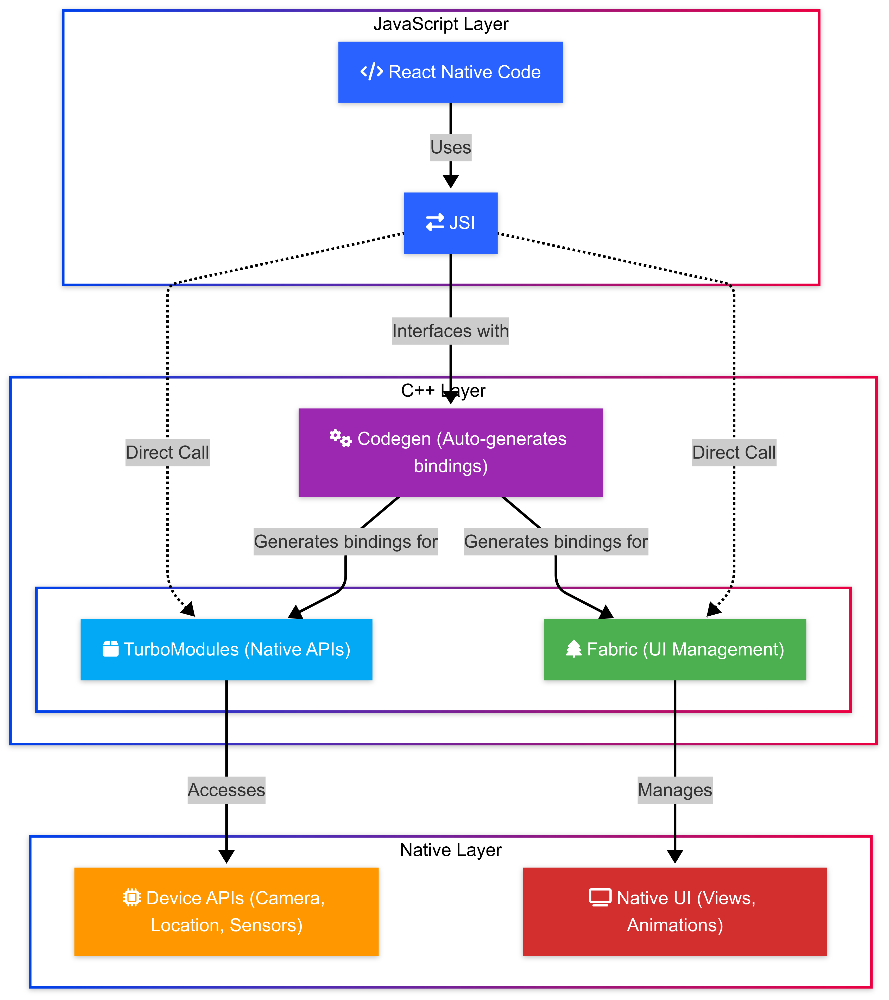

# **React Native Fundamentals**
**Core Concepts & Modern Architecture**


## **Goal:** 
Equip learners with a foundational understanding of React Native, its advantages, core components, and the essential modern architecture (New Architecture) they will be using, particularly with Expo.

> ⌚️ **Estimated Time:** 3-4 hours (flexible based on depth and exercise time)

## **Target Audience:** 

Developers proficient in native Android/iOS or web development (React/Angular).


## **Learning Paths:** 

This module serves as an optional overview and is recommended for all learning paths:

* 📝 **Instructor-Led:** Active participation in discussions is encouraged. Use the demonstrations as an opportunity to follow along and ask clarifying questions about React Native concepts and component implementations.
* 🧗 **Self-Led:** Proceed through the concepts sequentially. Utilize the provided links to official documentation for deeper understanding of React Native fundamentals and architecture.
* 🔄 **Asynchronous:** This module provides essential knowledge about React Native's core concepts and architecture. Understanding these fundamentals will help you build more effective cross-platform applications regardless of which specific features you implement later.

> ⚠️ Callouts will guide learners based on path and background.

## **1. Introduction to React Native**

Welcome to the world of React Native! This initial section sets the stage, exploring the challenges of mobile development that led to the creation of frameworks like React Native and highlighting why it has become such a popular choice for building cross-platform applications.

> 📚 [Learn the Basics - React Native](https://reactnative.dev/docs/tutorial)

### **1.1. The Mobile Challenge & Cross-Platform Evolution**

Building mobile applications presents unique challenges, especially when aiming to reach users on both major platforms: iOS and Android.


> 📚 [Cross-platform and native app development: How do you choose?](https://www.jetbrains.com/help/kotlin-multiplatform-dev/native-and-cross-platform.html)

#### **The Native Dilemma**

Traditionally, reaching both iOS and Android required **native development**: building two separate applications using platform-specific languages and tools (Swift/Objective-C for iOS, Kotlin/Java for Android). While this approach offers the best possible performance and deepest access to platform features, it comes with some drawbacks:

> 📚 [Cross-platform vs native app development: Final Comparison](https://themobilereality.com/blog/cross-platform-vs-native-app-development)

##### **Increased Cost and Time:**
Developing and maintaining two distinct codebases requires more time, resources, and often separate development teams, significantly increasing costs.

##### **Maintenance Complexity:**
Rolling out updates, fixing bugs, and ensuring feature parity across both platforms becomes more complex and time-consuming. 

##### **Skill Specialization:**
Requires developers proficient in each platform's specific languages and development environments. 

##### **Logic Divergence:**
The risk of implementing slightly different business logic in each native app can lead to inconsistencies and platform-specific bugs. 

> 📲 These challenges created a strong demand for solutions that could streamline development across platforms.

#### **Early Cross-Platform Attempts (WebViews)**

* Early attempts to solve the cross-platform dilemma often involved using **WebViews**. Frameworks like Apache Cordova (originally PhoneGap) emerged, allowing developers to build mobile apps using standard web technologies (HTML, CSS, JavaScript). ([PhoneGap vs Cordova Mobile Development Architecture Guide](https://moldstud.com/articles/p-phonegap-vs-cordova-mobile-development-architecture-guide))
* The core idea was simple: package a web application inside a native container and display it using the platform's built-in WebView component (a chromeless browser view). ([Cross-Platform Mobile App Development: Popular Frameworks](https://codewave.com/insights/android-ios-cross-platform-app-development-frameworks/)) 
* Plugins were often used to bridge the gap and provide JavaScript access to certain native device features. 


> 📖 **Historical Note:** PhoneGap was created by Nitobi Software in 2008. Adobe acquired Nitobi in 2011, rebranded the commercial product, and later contributed the open-source core to the Apache Software Foundation, where it became Apache Cordova. ([Apache Cordova - Wikipedia](https://en.wikipedia.org/wiki/Apache_Cordova))

#### **WebView Limitations**

While innovative, WebView-based approaches had inherent limitations that often prevented them from delivering a truly native experience:

##### **Performance Bottlenecks:**
The additional layer of abstraction and the performance characteristics of WebViews could lead to sluggishness, especially for complex UIs, animations, or computationally intensive tasks.  Graphics-heavy applications were particularly challenging.

##### **Non-Native Look and Feel:**
Achieving a UI that perfectly matched the platform's design guidelines and native component behavior could be difficult, often resulting in apps that felt "web-like" rather than truly native. 

##### **Limited Native API Access:**
While plugins provided some access, WebView-based apps often couldn't leverage the full spectrum of native device APIs and features as seamlessly as native apps. 

##### **User Experience Compromises:**
The combination of performance issues and a non-native feel could lead to a suboptimal user experience.  Facebook famously pivoted away from an HTML5-based mobile strategy in 2012, citing it as a major mistake due to performance and UI limitations. 

> 📲 These limitations highlighted the need for a cross-platform solution that could offer better performance and a more authentic native user experience.

#### **React Native as a Solution**

* React Native emerged from this context, developed initially by Facebook as a way to overcome the challenges they faced. 
* It aimed to provide the efficiency of cross-platform development without sacrificing the performance and user experience of native applications.  
* Its goal was ambitious: achieve 60 frames per second animations and provide a truly native look and feel by rendering actual native UI components, not web views. 

> 📚 [What Is React Native? Complex Guide for 2024](https://www.netguru.com/glossary/react-native) 

######
The following table summarizes the key trade-offs, illustrating where React Native fits in:
<style scoped>
table {
  font-size: 16px;
}
</style>
| Feature               | Native Development (iOS/Android) | WebView Approach (e.g., Cordova)       | React Native                              |
| :-------------------- | :------------------------------- | :------------------------------------- | :---------------------------------------- |
| Development Cost/Time | High (Separate Codebases)        | Lower (Shared Web Code)                | Medium (High Code Sharing)                |
| Performance           | Optimal (Direct Platform Access) | Often Sub-optimal (WebView Bottleneck) | Near-Native (Native Components, New Arch) |
| UI/UX (Native Feel)   | Excellent (Platform Standard)    | Challenging (Web Rendering)            | Excellent (Renders Native Components)     |
| Native API Access     | Full                             | Limited (Via Plugins)                  | Extensive (Native Modules, New Arch)      |
| Code Sharing          | None                             | High (HTML, CSS, JS)                   | Very High (JavaScript/React Logic & UI)   |
| Maintenance           | Complex (Two Codebases)          | Simpler (Single Web Codebase)          | Simpler (Mostly Single Codebase)          |

> 🔑 Understanding this evolution is key. The shortcomings of purely native development (cost, time) and early cross-platform attempts (performance, UX) created the specific need that React Native was designed to fill: efficient development *with* a high-quality, native user experience.


### **1.2. Why Choose React Native?**

React Native offers several compelling advantages that have contributed to its widespread adoption:

#### **Code Sharing & Efficiency**
* The most significant benefit is the ability to write the majority of your application code once in JavaScript and deploy it on both iOS and Android. ([Native Development Vs Cross-Platform Development - Which is better?](https://selleo.com/blog/native-development-vs-cross-platform)) 
* This drastically reduces development time and cost compared to building two separate native apps. ([Your Next Mobile App Platform in 2025: A Comprehensive Guide to Native and Cross-Platform Development](https://bugsee.com/blog/your-next-mobile-app-platform-in-2025-a-comprehensive-guide-to-native-and-cross-platform-development/)) 

#### Shopify Success Story

Companies like Shopify have successfully migrated their mobile apps to React Native, leveraging shared foundations to increase development speed and deliver value faster. ([Five years of React Native at Shopify (2025)](https://shopify.engineering/five-years-of-react-native-at-shopify))

> 📝 It's important to note that aiming for 100% code sharing is often unrealistic and potentially detrimental; embracing native code for specific modules or performance-critical sections remains crucial for building high-quality applications.

#### **Developer Experience (DX)**
React Native offers a developer experience that significantly enhances productivity and satisfaction compared to traditional native and hybrid development.

##### **Leverage React Knowledge**
Developers already familiar with React for web development can transition to React Native relatively easily, utilizing the same core concepts like components, props, state, and hooks. This significantly shortens the learning curve for many teams.

##### **Fast Refresh**
React Native offers Fast Refresh (an evolution of "Hot Reloading"), which provides near-instant feedback during development. When you save changes to a component, Fast Refresh intelligently updates the running app *without* losing the component's state, drastically speeding up UI iteration and debugging. ([React Native App Development Guide: Challenges and Best Practices](https://mobidev.biz/blog/react-native-app-development-guide)) This rapid feedback loop is a major productivity booster.

##### **JavaScript Ecosystem**
Developers gain access to the vast ecosystem of JavaScript libraries and tools available via npm , although compatibility needs to be considered.

> 🗂️ [React Native Directory](https://reactnative.directory)

#### **Native Capabilities**
Unlike WebView-based frameworks, React Native renders *actual native UI components*.  When you use a `<View>` or `<Text>` component in your JavaScript code, React Native creates the corresponding UIView or TextView (or their platform equivalents) behind the scenes. This ensures your app not only looks and feels native but also performs like a native app because it's using the same fundamental building blocks.  React Native also provides mechanisms (Native Modules) to access platform-specific APIs and device features. 

> 📚 [React Native · Learn once, write anywhere](https://reactnative.dev/)

#### **Performance Context**
* React Native was designed with the goal of achieving excellent performance, aiming for smooth animations at 60 frames per second.
* While early versions faced some performance challenges compared to pure native code, the introduction of the *New Architecture* (discussed in detail in Section 2) with components like JSI, Fabric, and TurboModules has significantly improved performance and addressed many previous limitations. 
* While direct performance comparisons with other frameworks like Flutter can be complex and context-dependent , modern React Native is highly performant for a vast range of applications.

> 📚  [Performance Overview - React Native](https://reactnative.dev/docs/performance)

#### **Strong Community and Backing**
React Native was open-sourced by Meta (Facebook) in 2015 and continues to be actively maintained by them, along with significant contributions from companies like Microsoft, Shopify, Callstack, Software Mansion, and Expo, as well as a large global community of individual developers.  This strong backing ensures ongoing development, a rich ecosystem of libraries, and ample resources for learning and support.

> 💫 [React Native Showcase](https://reactnative.dev/showcase)

### **1.3. Core Idea: JavaScript Controlling Native**

The fundamental concept behind React Native is surprisingly elegant: *developers use JavaScript and React to control native UI elements.*

#### **Declarative UI with React**
You define your application's user interface using React components, JSX syntax, props, and state – the same declarative paradigm used in React for web development. You describe *what* the UI should look like for a given state, not *how* to manipulate the UI step-by-step.

> 📚 [React Fundamentals - React Native](https://reactnative.dev/docs/intro-react)

#### **The "Translation" Layer**
React Native acts as an intermediary or abstraction layer. It takes your JavaScript code and the UI description defined with React components and translates these into instructions for the underlying native platform (iOS or Android).

> 📺 Think of your JavaScript code as the "remote control" and the native UI elements as the "television" – React Native is the system that makes the remote control work with the TV.

#### **Core Components as Bridges**
React Native provides a set of built-in *Core Components* like `<View>`, `<Text>`, `<Image>`, `<Button>`, and `<StyleSheet>`. 
> 📚 [Core Components and APIs - React Native](https://reactnative.dev/docs/components-and-apis)

###### 
These aren't just abstract concepts; they are JavaScript components specifically designed to map directly to corresponding native UI elements. 
* `<View>` maps to `UIView` on iOS and `android.view.ViewGroup` on Android – it's the basic container. 
* `<Text>` maps to `UITextView` on iOS and `android.widget.TextView` on Android – used for displaying text. 
* `<Image>` maps to `UIImageView` on iOS and `android.widget.ImageView` on Android. 

#### **Setting the Stage**
The mechanism by which this "translation" or communication between JavaScript and native happens is crucial to React Native's performance and capabilities. Historically, this relied on an asynchronous "Bridge," but modern React Native uses a new, more efficient system built around the JavaScript Interface (JSI). We'll explore this evolution in detail in the next section.

#### **Callout for Web Developers (React/Angular)**


##### **What's Familiar?**
You'll recognize the core React concepts: components, props, state, hooks, and JSX.  The JavaScript language and access to the npm ecosystem remain largely the same.  Styling uses JavaScript objects with camelCased CSS-like properties, which might feel somewhat familiar. 

> 🤷‍♂️ [React vs. React Native: What are the differences? - Hygraph](https://hygraph.com/blog/react-vs-react-native)

##### **What's Different?**
* **Target:** You're not manipulating the browser's DOM. Instead, your React components render native iOS and Android UI elements. `<View>` is not `<div>`, `<Text>` is not `<p>`.
* **Styling:** There are no CSS files. Styling is done via JavaScript objects using `StyleSheet.create()`. Key differences include: Flexbox is the *only* layout model (no Grid), there's no style inheritance cascade between arbitrary elements (only within nested `<Text>`), and property names/values might differ slightly. ([Styles - 30 Days of React Native | newline](https://www.newline.co/30-days-of-react-native/day-04-styles))
* **Navigation:** Browser routing (like React Router) doesn't apply. Mobile app navigation typically uses stack, tab, or drawer patterns, managed by libraries like React Navigation. 
* **Platform APIs:** You have more direct access to device hardware (camera, GPS, etc.) through Native Modules compared to browser APIs. 

#### **Callout for Native Developers (Android/iOS)**


##### **What's Familiar?**
React Native ultimately uses the native UI components you already know (`UIView`, `android.view.View`, `UITextView`, `TextView`, etc.).  The goal is to achieve a native look, feel, and performance.  You can still write native code (Native Modules) when needed.

##### **What's Different?**
* **Language & Paradigm:** UI logic and structure are primarily defined in JavaScript using React's declarative component model. 
* **Layout:** Layout is controlled using Flexbox properties applied via JavaScript styles, not XML layouts (Android) or Auto Layout/SwiftUI (iOS). 
* **Lifecycle:** You'll work with React component lifecycles (e.g., `useEffect` hook) rather than Activity/Fragment lifecycles (Android) or ViewController lifecycles (iOS). ([An Android Developer's Guide to React Native - DEV Community](https://dev.to/amazonappdev/an-android-developers-guide-to-react-native-j66))
* **Navigation:** Navigation is typically handled by JavaScript libraries like React Navigation, rather than Intents/Activities (Android) or Segues/NavigationControllers (iOS).
* **Styling:** Styles are defined in JavaScript objects using `StyleSheet.create()`, not XML attributes or platform-specific styling mechanisms. ([Styles - 30 Days of React Native | newline](https://www.newline.co/30-days-of-react-native/day-04-styles))

## **2. How React Native Works: From Bridge to JSI**

Understanding how React Native facilitates communication between your JavaScript code and the native platform is key to grasping its performance characteristics and capabilities. This section explores the evolution from the original "Bridge" architecture to the modern "New Architecture."

### **2.1. The Old Way: The Legacy Bridge (Conceptual Overview)**

The original architecture of React Native relied heavily on a component called the **Bridge**.

#### **Architecture Components**
In the legacy architecture, the application typically operated across a few key threads:
* **JavaScript (JS) Thread:** This is where your application's JavaScript code executed, including React rendering logic, business logic, API calls, and touch event processing. 
* **Native/UI Thread:** This is the main thread of the native platform (iOS or Android). It's responsible for handling the native UI rendering, processing user gestures, and executing native module code. 
* **Native Modules Thread (Optional):** Some native modules might operate on their own dedicated threads to avoid blocking the main UI thread.
* **Shadow Thread:** A background thread responsible for layout calculations using the Yoga layout engine.
  
> 🌉 The **Bridge** acted as the central communication channel connecting the JS Thread and the Native/UI Thread. ([The New Architecture of React Native: All you need to know - DEV ...](https://dev.to/rushi-patel/decoding-the-new-architecture-of-react-native-4hd5))

#### **Communication Flow**
Communication across the Bridge was fundamentally **asynchronous**.  Here's how it worked:
* **JS to Native:** When your JavaScript code needed to interact with the native side (e.g., update a UI element, call a native API), the instructions were collected and **batched**. 
* **Serialization:** These batched instructions were then **serialized** into a JSON string. 
* **Transmission:** The JSON string was passed asynchronously across the Bridge to the native side.
* **Deserialization & Execution:** The native side received the JSON string, **deserialized** it, and executed the corresponding native UI updates or API calls on the appropriate thread (usually the Native/UI thread).
* **Native to JS (Callbacks):** If the native code needed to send data back to JavaScript (e.g., the result of an API call, a device event), the process was reversed: data was serialized to JSON, sent asynchronously across the Bridge, and deserialized by the JS thread, typically invoking a JavaScript callback function.

#### **Diagram: Legacy Bridge Architecture Flow**
This diagram illustrates the indirect, asynchronous, and serialized communication path:


#### **Limitations of the Bridge**
While functional, the Bridge architecture had several inherent limitations that impacted performance and developer capabilities, ultimately driving the need for the New Architecture:

> 📚 [React Native New Architecture - DEV Community](https://dev.to/hellonehha/react-native-new-architecture-1hao)

##### **Asynchronous Nature:** 
The forced asynchronous communication made certain operations inefficient or impossible. For example, if JavaScript needed the size or position of a native UI element *before* rendering, it couldn't get that information synchronously, potentially leading to layout jumps or requiring complex workarounds. UI updates originating from different threads could also lead to temporary inconsistencies.
##### **Serialization Overhead:** 
The constant need to serialize data to JSON on one side and deserialize it on the other consumed significant CPU time and memory resources. This overhead became a major performance bottleneck, especially for frequent communication or when transferring large amounts of data (e.g., touch events, device sensor data).
##### **JS Thread Bottlenecks:** 
Since all JavaScript code ran on a single thread, complex computations or heavy rendering logic could block this thread. A blocked JS thread couldn't send messages across the Bridge promptly, leading to unresponsive UI, dropped frames during animations, and delayed touch responses (jank). Running in development mode (`dev=true`) significantly exacerbated this due to extra runtime checks.
##### **Eager Loading of Native Modules:** 
Typically, all Native Modules required by the app had to be initialized when the app started, regardless of whether they were needed immediately. This increased the application's startup time and initial memory footprint.
##### **Concurrency Limitations:** 
The single-threaded nature of the JS execution and the asynchronous bridge made it difficult to fully leverage modern multi-core processors and implement advanced concurrent features available in later versions of React.

> 🚧 These limitations were not just theoretical; they represented real barriers to building highly polished, complex, and performant applications with React Native.

### **2.2. The New Way: The New Architecture**

Recognizing the limitations of the Bridge, the React Native team embarked on a multi-year effort (starting around 2018) to redesign the framework's core internals. The result is the **New Architecture**, a modern foundation designed for better performance, improved capabilities, and closer alignment with modern React features.

> 📚 [The New Architecture is Here - React Native Blog](https://reactnative.dev/blog/2024/10/23/the-new-architecture-is-here)

#### **Key Components**
The New Architecture introduces several key components that replace or augment parts of the old system:
* **JSI (JavaScript Interface):** A new communication layer replacing the Bridge.
* **Fabric:** The new rendering system.
* **TurboModules:** The new Native Module system.
* **CodeGen:** A build-time tool that facilitates type-safe communication between JS and Native.

> 📚 [Architecture Overview - React Native](https://reactnative.dev/architecture/overview)

#### **Diagram: The New Architecture**



#### **Default Status**
The New Architecture has matured significantly and is now **enabled by default** in new React Native projects created with versions 0.76 and later. Crucially for this course, **Expo SDK 52 and later also enable the New Architecture by default** when initializing new projects. Therefore, the concepts discussed here are directly relevant to the environment you'll be working in.

> 📚 [About The New Architecture - React Native](https://reactnative.dev/architecture/landing-page)
### **2.3. JSI (JavaScript Interface): Direct Communication**

At the heart of the New Architecture lies the **JavaScript Interface (JSI)**. It fundamentally changes how JavaScript and native code interact.

#### **Core Concept**
JSI is a lightweight, general-purpose **C++ API** that acts as an interface **directly** to the JavaScript engine (like Hermes or V8). It completely replaces the asynchronous, JSON-based Bridge.

> 📫 Think of the Bridge as sending letters (JSON messages) back and forth via postal mail – there's inherent delay and overhead in packaging and transport. JSI is like having a direct phone line – you can talk (invoke methods) directly and instantly when needed.


#### **Direct Method Calls and Host Objects**
Instead of sending serialized messages, JSI allows the JavaScript and native worlds to **hold direct references to objects in the other realm**.
* JavaScript can obtain a reference to a C++ object (often referred to as a **Host Object**) exposed by the native side.
* JavaScript can then directly invoke methods on this C++ object reference as if it were a local JavaScript object.
* Similarly, native C++ code can hold references to JavaScript functions or objects and invoke them directly.
This direct interaction happens at the C++ level, bypassing the need for the Bridge entirely.

#### **Benefits of JSI**
This direct communication mechanism yields significant advantages:

> 📚 [Cross Platform Implementation - React Native](https://reactnative.dev/architecture/xplat-implementation)

##### **Eliminates Serialization Overhead:** 
Because JSI allows direct memory access and method invocation, the costly process of serializing data to JSON and deserializing it is completely eliminated. This results in much faster communication, particularly noticeable when dealing with frequent calls or large data payloads. For example, the popular `react-native-vision-camera` library uses JSI to process camera frames in real-time, handling data rates up to 1 GB/second – something infeasible with the old Bridge. Benchmarks have shown significant latency reductions.
##### **Enables Synchronous Communication:** 
Since calls can be made directly, JSI enables **synchronous** communication between JavaScript and native code when needed. This is crucial for scenarios like synchronously reading native UI element dimensions for layout calculations, preventing the layout jumps sometimes seen with the asynchronous Bridge.
##### **JS Engine Agnostic:** 
JSI is designed as an abstraction layer over the JavaScript engine itself. This decouples React Native from a specific engine like JavaScriptCore (JSC), allowing it to work with other engines such as Hermes (the default and recommended engine), V8, or potentially others in the future.

#### **Diagram: Bridge vs. JSI Communication Flow**


###### 
The diagram clearly shows the removal of the Bridge queue and the serialization/deserialization steps in the JSI model, replaced by direct interaction via the C++ JSI layer.

> 📝 **Note:** While JSI enables synchronous calls, it's important to use them judiciously. A long-running synchronous native call invoked from JavaScript *can still block the JS thread*. The key advantage is having the *option* for efficient synchronous execution when necessary, overcoming a major limitation of the purely asynchronous Bridge.

### **2.4. Fabric: The Modern Renderer**

**Fabric** is the name of React Native's new rendering system, built from the ground up to leverage JSI and integrate more deeply with modern React.

> 📚 [Fabric - React Native](https://reactnative.dev/architecture/fabric-renderer)

#### **Mechanism and Goals**
Fabric replaces the legacy UI manager. Its core principles include:
* **Shared C++ Core:** More rendering logic (like layout calculation via Yoga, view flattening) is implemented in a shared C++ core. This improves cross-platform consistency and performance, as optimizations benefit all platforms.
* **JSI Integration:** Fabric uses JSI for communication between JavaScript and the native rendering system, enabling more efficient updates and synchronous operations.
* **Improved Interoperability:** Designed for better integration with native platform UI systems.

> 📚 [View Flattening - React Native](https://reactnative.dev/architecture/view-flattening)
#### **Benefits of Fabric**
Fabric represents a complete rewrite of the React Native rendering system, offering improved performance, better native integration, and enhanced developer experience through a more consistent and reliable UI rendering pipeline.

> 📚 [Render, Commit, and Mount - React Native](https://reactnative.dev/architecture/render-pipeline)


##### **Performance and Responsiveness:** 
Fabric enables more efficient UI updates. Its ability to perform synchronous layout measurements and rendering prevents the visual "jumps" sometimes seen when embedding React Native views in native layouts. This contributes to smoother animations and interactions.
##### **React 18+ Concurrent Features:** 
Fabric unlocks the ability to use modern React concurrent features within React Native. This includes:
    * Concurrent Rendering: Allows React to work on multiple UI updates simultaneously without blocking the main thread, improving responsiveness.
    * Transitions (`useTransition`): Lets developers mark certain state updates as lower priority, preventing them from blocking more critical updates (like user input).
    * Suspense for Data Fetching: Provides a more integrated way to handle loading states when fetching data for components.
##### **Lazy Initialization of Host Components:** 
Native views corresponding to core components like `<View>` and `<Text>` (called Host Components in this context) are initialized lazily, only when needed, contributing to faster application startup times.

### **2.5. TurboModules: Efficient Native Modules**

Alongside Fabric, the New Architecture introduces **TurboModules**, a new system for creating and interacting with Native Modules.

> 📚 [Native Modules - React Native](https://reactnative.dev/docs/next/turbo-native-modules-introduction)

#### **Role and Mechanism**
TurboModules replace the legacy Native Module system. Like Fabric, they are built on top of **JSI**. This allows JavaScript code to get a direct reference (via JSI) to a native module instance and call its methods directly, synchronously or asynchronously, without the Bridge overhead.

> 📚 [Cross Platform Native Modules - React Native](https://reactnative.dev/docs/the-new-architecture/pure-cxx-modules)

#### **Key Benefit: Lazy Loading**
The most significant advantage of TurboModules is **lazy loading**.
* **Old Way (Eager):** In the legacy architecture, all native modules used by the app were typically instantiated and loaded during application startup.
* **New Way (Lazy):** With TurboModules, a native module is only loaded into memory and initialized the *first time* it is actually accessed by your JavaScript code. This "on-demand" loading dramatically improves application startup time and reduces the initial memory footprint, as the app doesn't waste resources initializing modules that the user might not even use in a particular session.

#### **CodeGen's Role in Type Safety**
Interacting between dynamically typed JavaScript and statically typed native languages (Java/Kotlin/Objective-C/Swift/C++) can lead to runtime errors if types don't match. **CodeGen** addresses this.

> 📚 [What is Codegen - React Native](https://reactnative.dev/docs/the-new-architecture/what-is-codegen)

##### **Specification:** 
You define the interface for your TurboModule (its methods, parameters, and return types) in a JavaScript file using static typing, typically TypeScript or Flow. This file acts as the single source of truth.
##### **Generation:** 
During the build process, Codegen reads this specification file.

> 📚 [Using Codegen - React Native](https://reactnative.dev/docs/the-new-architecture/using-codegen)

##### **Scaffolding:** 
It automatically generates the necessary C++ JSI interface code and native boilerplate code (e.g., Java/Kotlin interfaces for Android, Objective-C++ headers for iOS) that ensures type-safe communication between JavaScript and your native implementation.
By automating the creation of this communication layer, Codegen reduces boilerplate, enforces type safety across the JS/Native boundary, and makes native module development more robust and efficient.

### **2.6. Bridgeless Mode: The Final Step**

While JSI, Fabric, and TurboModules remove the *need* for the Bridge for core rendering and module communication, the Bridge object itself might still be initialized in the background for backward compatibility or handling other runtime aspects (like timers, global event emitters, error handling).

#### **Bridgeless mode**
* Introduced experimentally around React Native 0.73, represents the final stage of the New Architecture rollout. When enabled (via native configuration flags), it **completely disables the initialization of the legacy Bridge**. This removes the last remnants and overhead associated with the old architecture.

* To ensure older, non-migrated native modules can still function, React Native introduced a **Native Module Interop Layer** that allows TurboModules system to interact with legacy modules even when the Bridge is disabled. Similarly, a Renderer Interop Layer helps Fabric work with legacy UI components.

> 📝 While Bridgeless mode is the ultimate goal and offers potential further startup improvements, full ecosystem adoption of TurboModules and Fabric components is an ongoing process. For this course, understanding JSI, Fabric, and TurboModules is the primary focus, as they form the core of the New Architecture you are using by default.

######

> 🤿 **Deep Dive: C++ Host Objects & JSI References** 
At its core, JSI provides a C++ API that lets JavaScript interact with C++ objects. When a TurboModule or Fabric component is needed, the native side creates a C++ object representing it. JSI allows the JavaScript environment to obtain a **pointer** or **reference** to this C++ object in memory. This reference is exposed to JavaScript, often looking like a regular JS object. When your JavaScript code calls a method on this reference (e.g., MyNativeModule.doSomething()), JSI intercepts this call. Instead of serializing anything, it directly invokes the corresponding C++ method on the C++ object that the reference points to. The C++ class that native modules often inherit from to be exposed via JSI is `facebook::jsi::HostObject`. This mechanism eliminates the serialization bottleneck of the Bridge. For more technical details, explore the React Native architecture documentation or technical blog posts diving into JSI internals.

#### **Architecture Comparison: Legacy Bridge vs. New Architecture**
This table explicitly connects the problems of the old architecture to the solutions provided by the new components:
######
<style scoped>
table {
  font-size: 20px;
}
</style>
| Limitation                   | Description                                                                  | Primary Solution(s) | How it Solves the Limitation                                                                                                 |
| :--------------------------- | :--------------------------------------------------------------------------- | :------------------ | :--------------------------------------------------------------------------------------------------------------------------- |
| Serialization Overhead       | Converting data (often to JSON) between JS and Native was slow and costly.   | JSI                 | Enables direct C++ method calls and memory access, eliminating the need for serialization/deserialization.                   |
| Asynchronous-Only Calls      | Bridge communication was inherently async, preventing efficient sync ops.    | JSI                 | Allows for direct synchronous method invocations between JS and Native when required.                                        |
| Eager Module Loading         | All Native Modules loaded at app startup, increasing load time/memory.       | TurboModules        | Implements lazy loading; modules are loaded only when first accessed by JS code.                                             |
| JS Thread Blocking / UI Jank | Heavy JS work could block the thread, delaying Bridge messages & UI updates. | Fabric & JSI        | Fabric enables concurrent rendering (React 18), offloading work. JSI allows faster/sync native calls, reducing JS wait time. |
| Concurrency Limitations      | Single-threaded JS & async Bridge hindered modern React features.            | Fabric              | Specifically designed to support React 18's concurrent rendering features (Transitions, Suspense).                           |

######

> 🏛️ The move to the New Architecture wasn't just about incremental speed improvements; it was a fundamental redesign to remove architectural bottlenecks. This shift enables not only better performance but also unlocks capabilities previously difficult or impossible to achieve with the Bridge, such as real-time native interactions or seamless integration with React's latest concurrent features. It represents an evolution, built over several years, with mechanisms like interoperability layers facilitating a gradual transition for the vast React Native ecosystem.

<!-- ### **Exercise: Architecture Matching Quiz**
Let's test your understanding of which New Architecture component addresses specific limitations of the old Bridge.
**Instructions:** Match the Legacy Bridge Limitation in Column A with the primary New Architecture Component(s) in Column B that solves it.
**(Use Microsoft Forms for interactive quiz)**

**Column A: Legacy Bridge Limitation**
1.  Sending large amounts of data between JS and Native was slow due to JSON conversion.
2.  App startup was slower because all native code modules loaded immediately.
3.  JavaScript couldn't directly get the result of a native function call without waiting for an asynchronous callback.
4.  Complex UI updates on the JS thread could cause animations controlled by JS to freeze or stutter.

**Column B: New Architecture Solution**
a) Fabric
b) JSI (JavaScript Interface)
c) TurboModules

**(Answers: 1-b, 2-c, 3-b, 4-a/b)**

**Themed Framing (SpeedyMeds):**
Imagine these limitations plagued the first version of SpeedyMeds:
* Looking up detailed prescription interactions (large data) was sluggish (Serialization Overhead).
* The app took a long time to open because features like Barcode Scanning, GPS Location for pharmacy finding, and Biometric Login all loaded at once (Eager Loading).
* Checking real-time medication stock required waiting for the server *and* the async bridge callback (Async-only Calls).
* Scrolling through a long list of past orders sometimes stuttered while profile data was being processed (JS Thread Blocking).

Which "SpeedyMeds v2 System Upgrade" (JSI, Fabric, TurboModules) primarily fixed each bottleneck? -->

## **3. Working with the Modern Architecture**

Now that you understand the components of the New Architecture (JSI, Fabric, TurboModules), let's discuss the practical implications for you as a developer using modern React Native with Expo.

### **3.1. Why This Matters for You (Recap & Practical Implications)**

Understanding this architecture isn't just theoretical knowledge; it directly impacts how you build and reason about your React Native applications.

#### **You're Already Using It!**
With React Native 0.76+ and Expo SDK 52+ being the standard for new projects, the New Architecture is the default environment you're working in. The performance characteristics and capabilities described are relevant *now*.

#### **Performance Awareness**
Knowing *why* things are faster helps you build better apps:
* **Smoother Lists & Animations:** When you build a long list of medications in SpeedyMeds using `FlatList`, the smoother scrolling experience you observe compared to older RN versions can be attributed partly to Fabric's more efficient rendering pipeline and concurrent capabilities.
* **Faster App Startup:** The quicker launch time of your app benefits from TurboModules only loading native features (like camera access or location services) when they are actually needed, instead of all at once.
* **Quicker Native Interactions:** If SpeedyMeds needs to frequently interact with a native feature (e.g., using the camera for scanning a prescription barcode, accessing biometric authentication), JSI's direct communication path makes these interactions significantly faster and more efficient than they would have been over the old Bridge.

#### **Debugging Context**
While specific debugging tools will be covered later, having a mental model of the New Architecture helps. If you encounter unexpected UI behavior, knowing that Fabric enables concurrent rendering or that JSI allows synchronous calls might provide clues for troubleshooting.

#### **Leveraging Modern React**
The New Architecture, particularly Fabric, is what enables React Native to fully support React 18+ features like `useTransition` (for prioritizing UI updates) and Suspense for data fetching. Understanding the architecture helps you utilize these features effectively to build more responsive and modern UIs.

#### **Ecosystem Compatibility**
When choosing third-party libraries, you'll often see notes about New Architecture compatibility. Understanding what this means (i.e., whether the library uses TurboModules/Fabric or still relies on the Bridge/legacy components) is crucial for ensuring your project works correctly. Tools like React Native Directory become important resources.

### **3.2. Performance Considerations (Conceptual)**

The New Architecture offers several conceptual performance advantages over the legacy Bridge system:

#### **Startup Time (TurboModules):** 
As emphasized before, the shift from eager loading of all Native Modules to lazy loading with TurboModules is a major win for initial app load time. The application starts faster because it does less work upfront.
#### **UI Responsiveness (Fabric):** 
Fabric's concurrent rendering capabilities mean that React can work on rendering updates (especially complex ones) without completely blocking the main thread. This leads to a UI that feels more responsive, especially during animations, transitions, or when handling large amounts of data. Contrast this with the old architecture, where a busy JS thread could directly lead to frozen UI. Animations and transitions generally feel smoother.
#### **Native Call Efficiency (JSI):** 
For features that require frequent communication between JavaScript and native code, JSI's direct C++ interface significantly reduces the overhead compared to the Bridge's serialization process. This means less CPU time spent on communication and potentially faster responses from native APIs.

> 📝 It's worth noting that while the architecture provides the *foundation* for better performance, actual results depend on how the application is built. Poorly optimized JavaScript code can still cause performance issues. However, the New Architecture removes many of the *inherent* bottlenecks of the old system.

### **3.3. Debugging in the New Era (Conceptual)**

Debugging practices and tools are evolving alongside the architecture:

#### **Improved Tooling:** 

The ecosystem is adapting. Hermes, the default JavaScript engine, has seen significant debugging improvements. There's also a new experimental JavaScript Debugger (accessible via the Dev Menu) being developed to provide a streamlined Chrome DevTools experience specifically for React Native, intended to eventually replace Flipper for JS debugging. Basic tools like `console.log` have also been improved to capture logs earlier in the app lifecycle.
#### **Conceptual Relevance for Diagnosis:**

Understanding the potential for synchronous JSI calls or the effects of Fabric's concurrent rendering can be helpful when diagnosing certain types of bugs. For example, an unexpected delay might be traced to a synchronous native call blocking the JS thread, or a visual glitch might relate to how concurrent rendering prioritizes updates. While you won't typically debug C++ JSI code directly, knowing the underlying mechanics provides valuable context.

**(Specific debugging tools and techniques will be covered in later modules)**.

### **3.4. Expo & The New Architecture**

Expo plays a significant role in making the New Architecture accessible and manageable for developers.

> 📚 [React Native's New Architecture - Expo Documentation](https://docs.expo.dev/guides/new-architecture/)

#### **Enabled by Default**
As mentioned, if you create a new project using `npx create-expo-app` with SDK 52 or later, the New Architecture is **enabled by default**. This is configured in your `app.json` or `app.config.js` file:

##### **Enabled by Default: Code Example**
```json
// app.json / app.config.js
{
  "expo": {
    "name": "my-speedy-meds-app",
    "slug": "my-speedy-meds-app",
    //... other config
    "android": {
      //...
    },
    "ios": {
      //...
    },
    "newArchEnabled": true // This enables the New Architecture
  }
}
```

#### **Opting Out (Temporary Measure)**
If you encounter a critical third-party library that is *not yet* compatible with the New Architecture and is blocking your development, you can temporarily disable it by setting `newArchEnabled` to `false` in your app config and creating a new development build. However, this should be seen as a short-term workaround, as the ecosystem is rapidly moving towards New Architecture compatibility.

#### **Checking Compatibility (expo-doctor)**
Expo provides a vital tool called `expo-doctor` for diagnosing project issues. You can run it using `npx expo-doctor` in your project directory. One of its key functions is to **validate your project's dependencies against the React Native Directory** to check for known compatibility issues with the New Architecture. This helps you identify potentially problematic libraries early on. You can configure `expo-doctor`'s behavior (e.g., excluding certain packages) in your `package.json`.

> 📚 [Tools for development - Expo Documentation](https://docs.expo.dev/develop/tools/)

#### **Expo Modules Compatibility**
Native modules created using the modern `expo-modules-core` API (the standard way to build modules within the Expo ecosystem) are designed to be compatible with the New Architecture out of the box.

> 📚 [React Native Update - Expo 52 is Here | WaveMaker Docs](https://www.wavemaker.com/learn/blog/2024/12/16/expo-52-react-native-update)

###### 
Expo effectively acts as a helpful layer, managing the transition to the New Architecture by setting sensible defaults, providing compatibility checking tools (`expo-doctor`), and ensuring its own libraries and module APIs work seamlessly with the new system. This significantly simplifies the adoption process for developers using the Expo ecosystem.

> 🎯 **Tip for All Learners:** While the underlying C++ and native platform details of JSI, Fabric, and TurboModules are complex, you don't need to master them to be productive. Focus on understanding the *benefits* they provide (smoother UI, faster startup, ability to use modern React features) and the practical *implications* (like the importance of checking library compatibility using tools like `expo-doctor` ). React Native's goal is often to abstract these complexities away, letting you focus on building your app's features.
> 
<!-- 
### **Exercise: Performance Scenario Analysis**
**Instructions:** Consider the following scenarios related to the **SpeedyMeds** capstone project. For each scenario, explain how specific components of the New Architecture (JSI, Fabric, TurboModules) would likely lead to better performance or a more responsive user experience compared to the legacy Bridge architecture. Focus on the *why*.
**(Use Microsoft Whiteboard or a shared document for collaboration/submission)**

**Scenarios:**
1.  **Infinite Prescription List:** The "Prescriptions" screen displays a potentially very long list of a user's past and present medications, loaded dynamically as the user scrolls. How might **Fabric** contribute to a smoother scrolling experience, especially while new data is being loaded and rendered? (Hint: Think about concurrent rendering ([Fabric · React Native](https://reactnative.dev/architecture/fabric-renderer)) and how it handles updates without blocking)
2.  **Real-time Inventory Check:** Imagine a feature where tapping a "Check Nearby Stock" button for a medication triggers a call to a custom Native Module that communicates directly with a pharmacy's local inventory system (perhaps via a native SDK). How do **TurboModules**  and **JSI**  make this interaction potentially faster and more efficient compared to the old Bridge and legacy Native Modules? (Hint: Consider lazy loading  and the communication overhead ([Native Modules: Introduction · React Native](https://reactnative.dev/docs/turbo-native-modules-introduction)))
3.  **Complex Order Animation:** When navigating from the "Orders" list screen to the "Order Detail" screen, there's a complex shared element transition animation. Simultaneously, the app might be syncing order status updates in the background. How does **Fabric** help ensure the animation remains smooth even with background activity? (Hint: Think about concurrent rendering and update prioritization ([Fabric · React Native](https://reactnative.dev/architecture/fabric-renderer)))

## **4. Core Components & Documentation**

With a grasp of React Native's purpose and underlying architecture, let's introduce the fundamental building blocks you'll use to construct your user interfaces: **Core Components**. We'll also emphasize the crucial skill of navigating the official documentation and leveraging community resources. -->

### **4.1. Essential Building Blocks (Preview)**

React Native provides a set of essential, pre-built components that work across both iOS and Android. These **Core Components** are the basic tools in your UI toolkit, each mapping to corresponding native UI elements for optimal performance and look-and-feel.

> 📚 [Native Capabilities](https://reactnative.dev/docs/performance)

Here's a brief preview of some of the most fundamental ones:

#### **`<View>`**
* **Role:** The most basic container component. Use it to group other components and control layout. Think of it as a fundamental building block like `UIView` on iOS or `ViewGroup` on Android.
* **Layout:** Supports layout using the Flexbox algorithm  (covered in detail later).

##### **Example:**
```tsx
    /**
     * @fileoverview Basic View example for medication info container.
     */
    import React from 'react';
    import { View, Text, StyleSheet } from 'react-native';

    /**
     * A simple component demonstrating a View container.
     * @returns {React.ReactElement} A View containing Text.
     */
    const MedicationInfoContainer = () => {
      return (
        // This View acts as a styled container for the medication text.
        // accessibilityRole="text" helps group the text content semantically.
        <View style={styles.container} accessibilityRole="text">
          <Text style={styles.label}>Medication:</Text>
          <Text style={styles.value}>Amoxicillin 500mg</Text>
        </View>
      );
    };

    const styles = StyleSheet.create({
      container: {
        padding: 10,
        backgroundColor: '#e0f7fa', // Light cyan background
        borderRadius: 8,
        marginBottom: 10,
      },
      label: {
        fontSize: 14,
        color: '#00796b', // Teal color for label
        marginBottom: 2,
      },
      value: {
        fontSize: 16,
        fontWeight: 'bold',
        color: '#004d40', // Darker teal for value
      },
    });

    export default MedicationInfoContainer;
```
* **Explanation:** This example uses a `<View>` component, styled via `StyleSheet`, to create a visually distinct container for displaying medication information. The padding, backgroundColor, and borderRadius styles define its appearance. It groups two `<Text>` components, demonstrating its role as a fundamental layout element. The `accessibilityRole="text"` prop is added to provide semantic information for assistive technologies, indicating that the content within this view primarily constitutes text, improving the experience for screen reader users. This component could be part of a larger screen in the SpeedyMeds app, perhaps showing details on the Prescriptions screen. It directly maps to a native `UIView` or `ViewGroup` on the respective platforms.
* **Docs:** [View Component Documentation](https://reactnative.dev/docs/view)

#### **`<Text>`**
* **Role:** Used for displaying all text content. Crucially, any text string in your JSX must be wrapped within a `<Text>` component ; you cannot have text directly inside a `<View>`.
* **Features:** Supports nesting `<Text>` components for applying different styles to parts of the text and handles touch events. Uses text layout rules, not Flexbox, for its children.

##### **Example:**
```tsx
    /**
     * @fileoverview Basic Text example showing nesting and styling.
     */
    import React from 'react';
    import { Text, StyleSheet } from 'react-native';

    /**
     * Demonstrates basic Text usage with styling and nesting.
     * @returns {React.ReactElement} A Text component.
     */
    const DosageInstruction = () => {
      return (
        // Base Text component setting default style.
        // accessibilityLabel provides a concise description for screen readers.
        <Text
          style={styles.base}
          accessibilityLabel="Dosage: Take 1 tablet twice daily"
        >
          Dosage: Take{' '}
          {/* Nested Text component applies bold style */}
          <Text style={styles.emphasis}>1 tablet</Text> twice daily.
        </Text>
      );
    };

    const styles = StyleSheet.create({
      base: {
        fontSize: 16,
        color: '#333', // Dark gray color
        lineHeight: 24, // Improve readability
      },
      emphasis: {
        fontWeight: 'bold',
        color: '#d32f2f', // Red color for emphasis
      },
    });

    export default DosageInstruction;
```
* **Explanation:** This component uses `<Text>` to display dosage instructions, a common requirement in a pharmacy app like SpeedyMeds. The outer `<Text>` sets the base font size and color. A nested `<Text>` component is used to apply a bold font weight and a different color to the "1 tablet" part, showcasing how nesting allows for inline styling variations. This adheres to the rule that all text must be within `<Text>` tags. The `lineHeight` style improves readability, and the `accessibilityLabel` provides a clear, concise summary for screen readers, enhancing accessibility. This demonstrates the component's primary role in rendering styled text content.
* **Docs:** [Text Component Documentation](https://reactnative.dev/docs/text)

#### **`<Image>`**
* **Role:** Displays images from various sources: network URLs, static project resources, or local device storage.
* **Requirement:** Must specify `width` and `height` styles for network images. Optional but recommended for static images.

> 📚 [Image · React Native](https://reactnative.dev/docs/image)

##### **Example:**
```tsx
    /**
     * @fileoverview Basic Image example showing network and static images.
     */
    import React from 'react';
    import { View, Image, StyleSheet, Text } from 'react-native';

    // Assume 'pill_placeholder.png' exists in an 'assets' folder relative to this file
    // For Expo Snack, you might need to use an online URI or embed assets differently.
    // const staticImageSource = require('./assets/pill_placeholder.png');
    // Using an online placeholder for Snack compatibility
    const staticImageSource = { uri: '[https://via.placeholder.com/100](https://via.placeholder.com/100)' };

    /**
     * Demonstrates displaying network and static images.
     * @returns {React.ReactElement} A View containing Image components.
     */
    const MedicationImages = () => {
      return (
        <View style={styles.container}>
          <Text style={styles.label}>Medication Image (Network):</Text>
          {/* Network image requires width and height */}
          <Image
            style={styles.networkImage}
            source={{ uri: '[https://reactnative.dev/img/tiny_logo.png](https://reactnative.dev/img/tiny_logo.png)' }}
            accessibilityLabel="React Native Logo" // Describe the image
          />
          <Text style={styles.label}>Medication Image (Static):</Text>
          {/* Static image - dimensions inferred or specified */}
          <Image
            style={styles.staticImage}
            source={staticImageSource}
            // Default accessibilityRole="image" is usually sufficient
            accessibilityLabel="Placeholder Pill Image" // Describe the image
          />
        </View>
      );
    };

    const styles = StyleSheet.create({
      container: {
        alignItems: 'center', // Center images horizontally
        padding: 10,
      },
      label: {
        fontSize: 14,
        color: '#555',
        marginBottom: 5,
      },
      networkImage: {
        width: 100, // Mandatory for network image
        height: 100, // Mandatory for network image
        marginBottom: 20,
        borderWidth: 1,
        borderColor: '#ccc',
      },
      staticImage: {
        width: 100, // Dimensions specified for consistency
        height: 100,
        borderWidth: 1,
        borderColor: '#ccc',
      },
    });

    export default MedicationImages;
```
* **Explanation:** This example demonstrates displaying two types of images within a `<View>` container. The first `<Image>` fetches its content from a network URL specified in the `source` prop's `uri` field. As required for network images , explicit `width` and `height` are set in the `networkImage` style. The second `<Image>` loads a static resource using `require()` (or a placeholder URI for Snack). While dimensions can sometimes be inferred for static images, they are explicitly set here via `staticImage` style for predictable layout. Both images include an `accessibilityLabel` prop, which is crucial for screen readers to describe the image content to visually impaired users. This component could be used in SpeedyMeds to show pictures of medications.
* **Docs:** [Image Component Documentation](https://reactnative.dev/docs/image)

#### **`<StyleSheet>`**
* **Role:** An API used to define reusable style objects in JavaScript.
* **Benefits:** Improves code organization by separating styles from rendering logic and offers potential performance optimizations compared to inline styles ([Styles - 30 Days of React Native | newline - Fullstack.io](https://www.newline.co/30-days-of-react-native/day-04-styles)). Provides static analysis and autocompletion in many IDEs.

> 📚  [StyleSheet · React Native](https://reactnative.dev/docs/stylesheet)

##### **Example:** (See examples above – `StyleSheet.create` is used in all of them)
```tsx
    /**
     * @fileoverview Example demonstrating StyleSheet.create usage.
     */
    import React from 'react';
    import { View, Text, StyleSheet } from 'react-native';

    // Define styles using StyleSheet.create for organization and potential optimization
    const styles = StyleSheet.create({
      // Style for the main container View
      cardContainer: {
        backgroundColor: 'white',
        borderRadius: 10,
        padding: 15,
        marginVertical: 8,
        marginHorizontal: 16,
        shadowColor: '#000', // iOS shadow property
        shadowOffset: { width: 0, height: 2 }, // iOS shadow property
        shadowOpacity: 0.1, // iOS shadow property
        shadowRadius: 4, // iOS shadow property
        elevation: 3, // Android shadow property
      },
      // Style for the title Text
      titleText: {
        fontSize: 18,
        fontWeight: '600', // Semibold
        color: '#263238', // Dark blue-gray
        marginBottom: 5,
      },
      // Style for descriptive Text
      descriptionText: {
        fontSize: 14,
        color: '#546e7a', // Lighter blue-gray
        lineHeight: 20,
      },
    });

    /**
     * A card component using styles defined via StyleSheet.
     * @param {object} props - Component props.
     * @param {string} props.title - The title for the card.
     * @param {string} props.description - The description for the card.
     * @returns {React.ReactElement} A styled card View.
     */
    const InfoCard = ({ title, description }) => {
      return (
        // Apply the container style
        <View style={styles.cardContainer} accessibilityRole="summary">
          {/* Apply the title text style */}
          <Text style={styles.titleText} accessibilityRole="header">
            {title}
          </Text>
          {/* Apply the description text style */}
          <Text style={styles.descriptionText}>{description}</Text>
        </View>
      );
    };

    /**
     * Main App component demonstrating InfoCard usage.
     * @returns {React.ReactElement} The App component.
     */
    const App = () => (
      <View style={{ flex: 1, justifyContent: 'center' }}>
        <InfoCard
          title="Refill Reminder"
          description="Your prescription for Lisinopril is ready for refill."
        />
        <InfoCard
          title="Order Shipped"
          description="Your recent order #12345 has shipped."
        />
      </View>
    );

    export default App;
```
* **Explanation:** This example explicitly demonstrates the use of `StyleSheet.create` to define styles for a reusable `InfoCard` component, suitable for displaying alerts or summaries in the SpeedyMeds app. Styles like `cardContainer`, `titleText`, and `descriptionText` are defined once in the `styles` object. This separation makes the `InfoCard` component's JSX cleaner and focuses on structure rather than inline style definitions. Using `StyleSheet` is the standard and recommended approach in React Native for better organization, reusability, and potential performance gains over defining style objects inline within the JSX. The styles include basic layout (padding, margin), appearance (backgroundColor, borderRadius, color, fontSize, fontWeight), and platform-idiomatic shadows (shadow* props for iOS, elevation for Android). Accessibility roles are added for better semantics.
* **Docs:** [StyleSheet API Documentation](https://reactnative.dev/docs/stylesheet)

#### **`<Button>`**
* **Role:** A simple, cross-platform button component.
* **Props:** Requires `title` (string) and `onPress` (function) props. Optional `color` and `accessibilityLabel` props are common.
* **Customization:** Offers minimal customization. For more control over appearance and behavior, use `<Pressable>` or build custom touchable components ([Handling Touches - React Native](https://reactnative.dev/docs/handling-touches)).

> 📚 [Button · React Native](https://reactnative.dev/docs/button)

##### **Example:**
```tsx
    /**
     * @fileoverview Basic Button example.
     */
    import React from 'react';
    import { View, Button, StyleSheet, Alert } from 'react-native';

    /**
     * Handles the button press event.
     */
    const handleRefillPress = () => {
      Alert.alert(
        'Refill Requested',
        'Your request to refill has been submitted.',
        [{ text: 'OK' }]
      );
    };

    /**
     * Demonstrates the basic Button component.
     * @returns {React.ReactElement} A View containing a Button.
     */
    const RefillButton = () => {
      return (
        <View style={styles.container}>
          <Button
            title="Request Refill" // Required: Text displayed on the button
            onPress={handleRefillPress} // Required: Function called on tap
            color="#007bff" // Optional: Sets text color (iOS) or background (Android)
            accessibilityLabel="Request a refill for this medication" // Important for accessibility
            // disabled={true} // Optional: Uncomment to disable the button
          />
        </View>
      );
    };

    const styles = StyleSheet.create({
      container: {
        margin: 10,
        alignItems: 'center', // Center button in the view
      },
    });

    export default RefillButton;
```
* **Explanation:** This component showcases the basic `<Button>`. It includes the mandatory `title` prop to set the button's text ("Request Refill") and the `onPress` prop, which links to the `handleRefillPress` function that displays an `Alert` when the button is tapped. The optional `color` prop is used to suggest a standard blue, though its exact effect varies by platform. The `accessibilityLabel` provides essential context for screen reader users. While simple to use, the `<Button>` component's styling is very limited by design. For custom styling or more complex interactions (like press-in/press-out effects), developers typically use the more flexible `<Pressable>` component or other touchable wrappers ([Handling Touches - React Native](https://reactnative.dev/docs/handling-touches)). This example fits the SpeedyMeds theme by providing a "Request Refill" action.
* **Docs:** [Button Component Documentation](https://reactnative.dev/docs/button)

#### **Component Mapping Reference**
This table helps visualize how common React Native Core Components relate to their native counterparts and web equivalents:
######
<style scoped>
table {
  font-size: 20px;
}
</style>
| React Native Component | Android Native View         | iOS Native View | Web Analog              | Description                                                                   |
| :--------------------- | :-------------------------- | :-------------- | :---------------------- | :---------------------------------------------------------------------------- |
| `<View>`               | `android.view.ViewGroup`    | `UIView`        | `<div>`                 | Fundamental container supporting Flexbox layout, styling, and touch handling. |
| `<Text>`               | `android.widget.TextView`   | `UITextView`    | `<p>`, `<span>`         | Displays styled text; must wrap all text nodes.                               |
| `<Image>`              | `android.widget.ImageView`  | `UIImageView`   | ``                 | Displays network or static images.                                            |
| `<TextInput>`          | `android.widget.EditText`   | `UITextField`   | `<input type="text">`   | Allows user text input via keyboard.                                          |
| `<ScrollView>`         | `android.widget.ScrollView` | `UIScrollView`  | `<div>` (with overflow) | Generic scrolling container for heterogeneous content.                        |
| `<Button>`             | `android.widget.Button`     | `UIButton`      | `<button>`              | Basic, minimally customizable button.                                         |
| `<StyleSheet>` (API)   | N/A                         | N/A             | CSS                     | JavaScript API for defining optimized style objects.                          |

(Note: This mapping is conceptual; the underlying implementation involves complex bridging and rendering logic.)

#### **Positioning This Section**
This is just a brief introduction to whet your appetite! We've only scratched the surface of these components. Subsequent modules will delve much deeper into each Core Component, exploring their full range of props, advanced usage patterns, styling, layout with Flexbox, and how to handle user interactions effectively. We'll also introduce other essential components like `<FlatList>` for performant lists, `<TextInput>` for user input, and `<ScrollView>` for scrollable content.

> **Callout for Async Learners:** Feel free to jump ahead to specific component documentation using the links provided if you need information on a particular component right away. However, the upcoming modules will provide more structured learning and practical examples.

### **4.2. Mastering the Documentation**

Becoming proficient in React Native requires becoming proficient in navigating and utilizing the official documentation. It is the ultimate source of truth for APIs, components, and concepts.

#### **Critical Importance**
The official documentation is constantly updated by the core teams and community contributors. Relying solely on tutorials or blog posts (which can become outdated) is insufficient for production development. Make the official docs your first stop when you have a question about a component's props, an API's behavior, or a core concept.

#### **Key Documentation Sites**
Bookmark these essential resources:
* **React Native Official Documentation:** [https://reactnative.dev/](https://reactnative.dev/)
    * The primary resource for React Native core concepts, components, APIs, architecture, and guides .
* **Expo Documentation:** [https://docs.expo.dev/](https://docs.expo.dev/)
    * Essential for anyone using the Expo ecosystem. Covers Expo SDK APIs, Expo CLI, EAS (Expo Application Services), configuration (app.json), development workflows, and guides specific to Expo ([React Native Update - Expo 52 is Here | WaveMaker Docs](https://www.wavemaker.com/learn/blog/2024/12/16/expo-52-react-native-update)).
* **React Navigation Documentation:** [https://reactnavigation.org/](https://reactnavigation.org/)
    * The official documentation for React Navigation, the most popular library for handling navigation (screens, tabs, drawers) in React Native apps. (Navigation will be covered in detail later in the course).

#### **Navigation Strategy: Finding What You Need**
Learn to navigate these sites effectively:
* **Getting Started / Tutorials:** Look here for initial setup guides, basic concepts, and introductory walkthroughs ([https://reactnative.dev/docs/tutorial](https://reactnative.dev/docs/tutorial)).
* **Components & APIs (Core Reference):** This is where you'll spend a lot of time. Find detailed information on each Core Component (View, Text, Image, etc.) and built-in APIs (StyleSheet, Alert, Animated, etc.)([https://reactnative.dev/docs/components-and-apis](https://reactnative.dev/docs/components-and-apis)). Pay attention to:
    * Props: The definitive list of available props for each component, their types, and descriptions.
    * Examples: Practical code snippets demonstrating usage.
    * Platform Specificity: Notes indicating if a component or prop is only available on iOS or Android.
######
* **Guides:** Explore these for in-depth explanations of broader topics like Layout with Flexbox, Handling Touches, Networking, Performance Optimization, Platform-Specific Code, Accessibility, and Security ([https://reactnative.dev/docs/getting-started](https://reactnative.dev/docs/getting-started)).
* **Architecture:** For those interested in the internals, this section of the React Native docs covers JSI, Fabric, TurboModules, and the rendering process ([About the New Architecture · React Native](https://reactnative.dev/architecture/landing-page)).
* **Expo Docs Structure:** Familiarize yourself with Expo's sections: Guides (workflows like debugging, prebuilding), Reference (details on specific Expo SDK modules/versions), EAS (build/submit services), Expo CLI commands ([Tools for development - Expo Documentation](https://docs.expo.dev/develop/tools/)).
* **Version Selector:** Always ensure the documentation version you are viewing matches the React Native or Expo SDK version you are using in your project. Documentation sites usually have a version selector dropdown ([Text - React Native (0.70)](https://reactnative.dev/docs/0.70/text)).

### **4.3. Finding Help & Community Resources**

While the official documentation is paramount, the vibrant React Native and Expo communities offer invaluable support and resources.

#### **Official Channels**
* **React Native GitHub:** [https://github.com/facebook/react-native](https://github.com/facebook/react-native)
    * Issues: Report reproducible bugs in the core framework ([react-native/.github/SUPPORT.md at main · facebook/react-native · GitHub](https://github.com/facebook/react-native/blob/master/.github/SUPPORT.md)). Search existing issues first!
    * Discussions & Proposals: For broader discussions about the future of React Native, feature proposals, and deeper technical topics ([React Native Community - GitHub](https://github.com/react-native-community)).
* **Expo GitHub:** [https://github.com/expo/expo](https://github.com/expo/expo)
    * For reporting issues specifically related to the Expo SDK, Expo CLI, or other Expo tools.

#### **Community Forums & Chat**
* **Stack Overflow:** A primary resource for asking and answering specific coding questions. Use the tags `react-native` and `expo`. Search thoroughly before asking. ([https://stackoverflow.com/questions](https://stackoverflow.com/questions))
* **Reactiflux Discord:** A large, very active Discord server for React and React Native developers. The `#react-native` channel is great for quick questions and real-time discussion ([https://discord.gg/reactiflux](https://discord.gg/reactiflux))
######
* **Expo Discord:** Official Discord server for Expo-specific help and community interaction. ([https://chat.expo.dev](https://chat.expo.dev))
* **Reddit:**
    * r/reactnative: Discussions, news, project showcases, questions.
    * r/expo: Expo-focused discussions.

#### **Helpful Tools & Sites**
* **React Native Community GitHub Org:** [https://github.com/react-native-community](https://github.com/react-native-community)
    * Hosts many essential third-party libraries (e.g., AsyncStorage, NetInfo, Slider) that were previously part of the core but are now maintained by the community.
* **React Native Directory:** [https://reactnative.directory/](https://reactnative.directory/)
    * A searchable database of React Native libraries. Crucially, it often includes information about New Architecture compatibility, helping you choose libraries that work with modern RN/Expo setups.
######
* **Expo Snack:** [https://snack.expo.dev/](https://snack.expo.dev/)
    * An online editor for quickly trying out React Native code (using Expo) and sharing runnable examples without needing a local setup. Excellent for bug reproductions and simple experiments. (Required tool for this course's RN exercises).
* **React Native Upgrade Helper:** [https://react-native-community.github.io/upgrade-helper/](https://react-native-community.github.io/upgrade-helper/)
    * A web tool that shows the code differences between React Native versions, aiding in the upgrade process.

> 🌴 The React Native ecosystem thrives because of its community. Learning where to find documentation, ask for help, and discover community-built solutions is just as important as learning the code itself. Many common problems have already been solved, and leveraging community libraries and support is a key part of being an effective React Native developer.
<!--
> **Instructor Note:** Emphasize the importance of effective searching before asking questions on platforms like Stack Overflow or Discord. Encourage learners to bookmark the official documentation sites and the React Native Directory.

### **Exercise: Documentation Scavenger Hunt**
**Instructions:** Use the official React Native and Expo documentation sites linked above to find the answers to the following questions. This will help you practice navigating these crucial resources.
**(Use Microsoft Forms for interactive quiz)**

1.  **React Native Docs:** Find the `<Image>` component documentation. What prop is used to control how the image should be resized to fit its container (e.g., cover, contain, stretch)? (Hint: Look under Image props) 
2.  **React Native Docs:** Find the guide on "Layout with Flexbox". What are the four possible values for the `flexDirection` style property? (Hint: Look in the Guides section or search for Flexbox)
3.  **Expo Docs:** Search the Expo documentation. What is the Expo CLI command used to diagnose potential issues and check dependency compatibility in your project? (Hint: Look under Expo CLI tools or search for "check project health") 
4.  **React Native Docs:** Navigate to the Architecture section. What is the name of the C++ API that enables direct communication between JavaScript and native code in the New Architecture? (Hint: Look for the core communication component) ([About the New Architecture · React Native](https://reactnative.dev/architecture/landing-page))
 5.  **React Native Docs:** Find the `<Button>` component documentation. Besides `title`, what other prop is explicitly listed as **Required**? (Hint: Check the Props list for Button)

**(Answers: 1: `resizeMode`, 2: `row`, `column`, `row-reverse`, `column-reverse`, 3: `npx expo-doctor`, 4: JSI (JavaScript Interface), 5: `onPress`)**

## **5. Module Challenge (Optional / End-of-Module)**

**Goal:** Apply your understanding of React Native fundamentals (components, architecture concepts) to a practical scenario related to the SpeedyMeds capstone project.
**Task:** Analyze a hypothetical simple **Medication Reminder** feature for the SpeedyMeds app.
**Tools:** Microsoft Whiteboard (for diagramming) or a collaborative document.
**Time:** 30-60 minutes

**Scenario:** Imagine adding a screen to SpeedyMeds that allows users to see upcoming medication reminders. Each reminder needs to show the medication name, dosage, time, an image of the pill, and a button to mark it as "Taken".

**Steps:**

1.  **Component Structure Proposal (Diagram):**
    * On Microsoft Whiteboard (or draw in a shared doc), sketch out a basic component structure for this feature using the Core Components we've introduced (`<View>`, `<Text>`, `<Image>`, `<Button>`).
    * *Example Idea:* You might have a main `ReminderListScreen` component. Inside, it could render a `<FlatList>` (though we haven't covered it yet, imagine it conceptually as a scrolling list container). Each item in the list could be a `ReminderItem` component.
    * What Core Components would make up the `ReminderItem`? Sketch how `<Image>`, `<Text>` (for name, dosage, time), and `<Button>` ("Mark as Taken") might be arranged within a containing `<View>`.

2.  **Feature Identification:** Identify 1-2 specific technical aspects of this feature that might benefit from or interact with the concepts discussed in this module (especially the New Architecture):
    * **Feature 1:** Efficiently displaying potentially many medication images (loaded from a network or local cache) within the scrolling ReminderList.
    * **Feature 2:** Scheduling a reliable *native* platform notification (the kind that appears on the device's lock screen or notification tray at the scheduled time) for each reminder.

3.  **Architecture Connection (Conceptual Explanation):**
    * For **Feature 1 (Images in List):** How might **Fabric** (the new renderer) potentially contribute to a smoother scrolling experience in the `ReminderList` compared to the legacy rendering system, especially if there are many images loading asynchronously? (Think about concurrent rendering ([Fabric · React Native](https://reactnative.dev/architecture/fabric-renderer))).
    * For **Feature 2 (Native Notifications):**
        * To interact with the native iOS/Android notification scheduling APIs, what kind of New Architecture component would you likely need to use or create? (Hint: Think about accessing native platform features ([Native Modules: Introduction · React Native](https://reactnative.dev/docs/turbo-native-modules-introduction))).
        * How does **JSI** make the communication between your JavaScript code (e.g., calling `scheduleNotification(details)`) and that native component potentially more efficient or allow for different interaction patterns (like synchronous confirmation) compared to the old asynchronous Bridge? (Think about direct calls vs. serialization ).

**Focus:** The goal here is not to write the actual code but to connect the *concepts* learned in this module (Core Components, Fabric, TurboModules, JSI) to a practical application scenario and reason about their potential impact. -->

---


This concludes the Fundamentals module. You now have a foundational understanding of what React Native is, why it exists, how its modern architecture works under the hood, the basic UI building blocks, and where to find more information. The next modules will build upon this foundation, diving deeper into components, styling, layout, navigation, and state management.