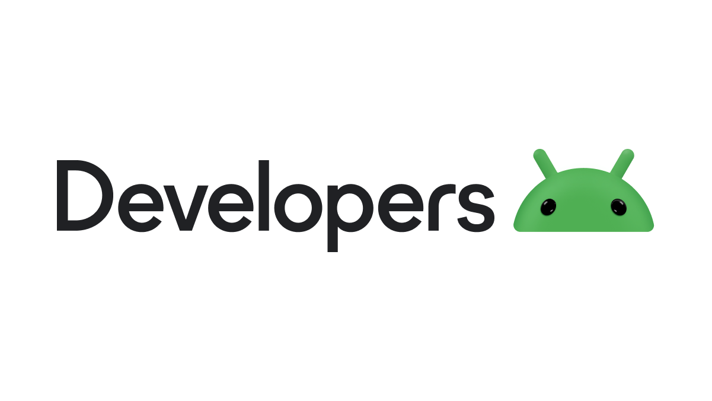
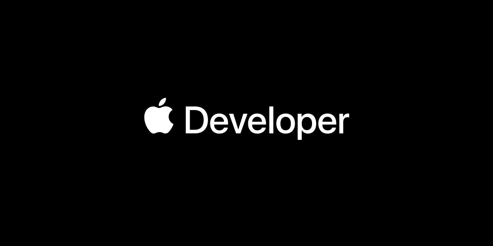

# **Environment Setup & The Expo Ecosystem**

######

Welcome to the first step in your journey to becoming a proficient React Native developer! This foundational module focuses on establishing your local development environment using the Expo framework and ecosystem. Setting up the environment correctly is crucial for a smooth development experience.

## **Module Goal**

The primary goal of this module is to guide participants through the process of successfully setting up a local development environment tailored for React Native development using Expo. By the end of this module, participants will understand the core tools and workflows within the Expo ecosystem and be able to run their first React Native application on an iOS simulator.

 <!-- Assuming a generic simulator screenshot exists -->

## **Learning Objectives**

Upon successful completion of this module, participants will be able to:

*   Install and configure all necessary prerequisite software (Node.js, Watchman, Xcode, iOS Simulator) on a macOS system.
*   Articulate the role of the Expo Command Line Interface (CLI) and explain its advantages compared to the standard React Native CLI.
*   Initialize a new React Native project using the Expo CLI command `npx create-expo-app@latest`.

######

*   Describe the purpose and contents of key files and directories within a standard Expo project structure.
*   Start the Expo development server using `npx expo start` and successfully launch the application on an iOS Simulator.
*   Clearly differentiate between the various Expo development environments – Expo Go, Development Builds, and Production Builds – understanding their specific use cases, capabilities, and limitations.
*   Identify common setup and runtime issues and apply appropriate troubleshooting steps to resolve them.
*   Effectively utilize Expo Snack, the web-based playground, for completing course exercises and performing basic code experimentation.

## **Target Audience & Adaptation**

Developers proficient in native Android/iOS or web development (React/Angular).

### **Learning Paths**

This module serves as a critical foundation for all learning paths:

*   📝 **Instructor-Led:** Active participation in setup sessions is encouraged. Use the live coding demonstrations as an opportunity to follow along and ask clarifying questions regarding environment configuration or Expo concepts.
*   🧗 **Self-Led:** Proceed through the steps sequentially. Utilize the provided links to official documentation for deeper understanding. Do not hesitate to request instructor support via Webex chat or huddles if installation or configuration issues arise.
*   🔄 **Asynchronous:** This module is fundamental, regardless of the specific topics targeted later. Ensure the development environment is correctly set up by carefully following these instructions. If specific setup errors are encountered later, the Troubleshooting section can be referenced directly.

> ⚠️ Callouts will guide learners based on path and background.

### **Note for Learners from Native Backgrounds (Android/iOS)**

Concepts like JavaScript runtimes (Node.js), package managers (npm), and bundlers (Metro) might be new. This module will relate Expo's abstractions (like the Expo CLI managing native builds) back to familiar tools like Android Studio or Xcode, highlighting the similarities and differences in workflow. ([From Jetpack Compose to React Native: An Android Developer's Perspective - Atomic Robot](https://atomicrobot.com/blog/compose-to-react-native/))

> 💡 Think of Expo CLI as adding a simplifying layer on top of the familiar Xcode/Android Studio build processes for many common tasks.

### **Note for Learners from Web Backgrounds (React/Angular)**

While JavaScript tooling will feel familiar, concepts related to native mobile development, simulators/emulators (Xcode), and the specifics of React Native's component system and styling (vs. HTML/CSS) will be emphasized. Expo's tooling aims to make this transition smoother. ([React Native: Thoughts from a web developer - Mantel | Make things ...](https://mantelgroup.com.au/react-native-thoughts-from-a-web-developer/))

> 🔑 **Key Shift:** You're moving from targeting the browser DOM to controlling native iOS/Android UI elements via JavaScript.

## **2. Prerequisites: Setting Up Your Local Development Environment (macOS & iOS Simulator Focus)**

Before diving into React Native code, it's essential to prepare the local development machine. This involves installing several core software components. This course focuses on macOS and development for the iOS Simulator, as it provides a consistent target environment for exercises and the capstone project.

 <!-- Assuming generic terminal image -->

### **Essential Tools Overview**

The following tools are required to build and run React Native applications using Expo on macOS for iOS development:

##### **Node.js (LTS Version):**
Node.js is a JavaScript runtime environment that executes JavaScript code outside of a web browser. It is fundamental to the React Native ecosystem, powering the Expo CLI, the Metro bundler (which packages the JavaScript code), and Node Package Manager (npm) or Yarn, which are used to manage project dependencies. Using the LTS (Long-Term Support) version is strongly recommended for stability and compatibility.

> 💡 **Why LTS?** Long-Term Support versions receive critical bug fixes and security updates for an extended period, ensuring a stable foundation for your projects.

##### **Watchman:**
Developed by Meta (Facebook), Watchman is a service that watches files and records when they change. It's used by the Metro bundler to efficiently detect changes in the project's source code. This enables features like Fast Refresh, significantly speeding up the development cycle by quickly updating the app with code changes without a full rebuild. While technically optional, Watchman is **highly recommended** for optimal performance.

> 🕵️‍♂️ **Benefit:** Watchman helps make the 'Fast Refresh' feature incredibly fast, improving developer productivity.

##### **Xcode:**
Xcode is Apple's integrated development environment (IDE) for developing macOS, iOS, iPadOS, watchOS, and tvOS applications. For React Native development targeting iOS, Xcode provides the necessary iOS SDKs, compilers, build tools, and, crucially, the **iOS Simulator**. While this course may not involve extensive direct coding in Swift or Objective-C within the Xcode IDE itself, installing Xcode is **mandatory** to build and run the native iOS portion of the React Native application on a simulator. Xcode also includes the Xcode Command Line Tools, which provide essential utilities like `git` and compilers accessible from the terminal.

> 💡 **Key Role:** Xcode provides the essential iOS platform tools and the simulator environment needed to run and test your app.