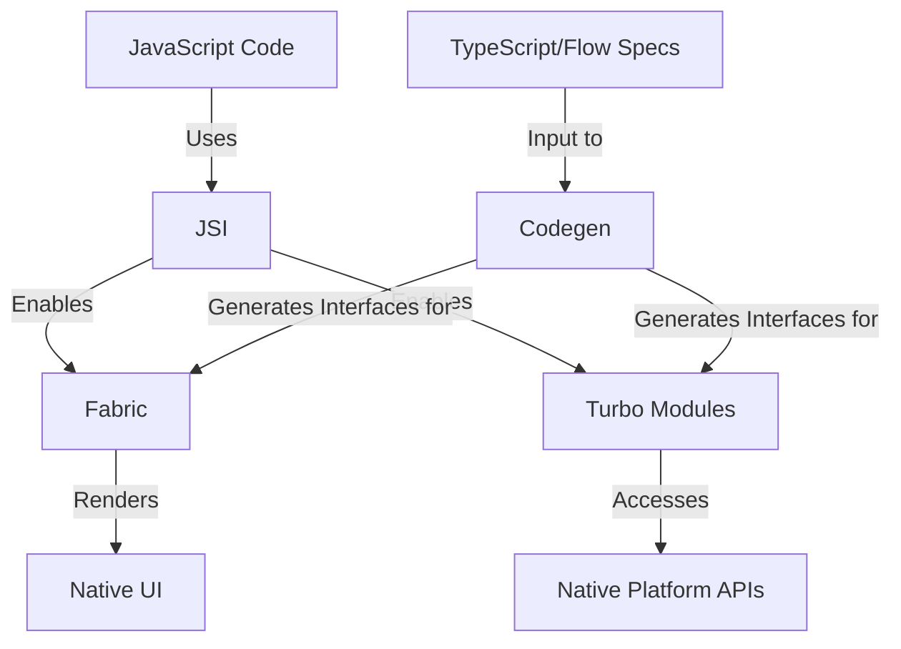

# Deconstructing Modern React Native: JSI, Fabric, and Turbo Modules

## Introduction

The performance and capability improvements of React Native's New Architecture are enabled by a set of interconnected core components that replace the legacy bridge system. Understanding these components conceptually is key to appreciating how modern React Native works and why it delivers better performance than previous versions.

This section explores the technical underpinnings of React Native's New Architecture: JavaScript Interface (JSI), Fabric, Turbo Modules, and Codegen.

## JavaScript Interface (JSI)

JSI stands as the foundational element of the New Architecture, completely replacing the old asynchronous bridge.

### Role

JSI is fundamentally a C++ API that acts as an interface layer, allowing JavaScript code to obtain and hold direct references to C++ objects hosted in the native environment, and conversely, allowing native code to hold references to JavaScript objects.

```cpp
// Simplified conceptual example of JSI (not actual implementation)
// C++ side
class NativeModule : public jsi::HostObject {
public:
  jsi::Value get(jsi::Runtime& runtime, const jsi::PropNameID& name) override {
    // Expose native methods to JavaScript
    if (name.utf8(runtime) == "processData") {
      return jsi::Function::createFromHostFunction(
        runtime, name, 1,
        [](jsi::Runtime& runtime, const jsi::Value& thisValue, const jsi::Value* args, size_t count) {
          // Direct access to JavaScript arguments without serialization
          std::string data = args[0].getString(runtime).utf8(runtime);
          // Process data...
          return jsi::Value(runtime, "result");
        });
    }
    return jsi::Value::undefined();
  }
};

// JavaScript can then directly call:
// const result = NativeModule.processData("data");
```

### Key Advantage

The most significant advantage of JSI is its ability to enable direct, synchronous method invocation between the JavaScript and native realms. Because JavaScript can directly call methods on the C++ objects it holds references to (and vice-versa), the need to serialize and deserialize data across an asynchronous boundary is eliminated. This removes the major performance bottleneck of the old bridge.


### Impact

This direct, synchronous communication pathway is transformative. It unlocks significant performance gains for operations requiring frequent or low-latency interaction between JavaScript and native code. Examples include:

- Real-time processing of large data streams (like camera frames handled by libraries such as VisionCamera)
- Smoother animations and gesture handling
- The ability to perform synchronous layout measurements directly from JavaScript

JSI also facilitates the creation of native modules written in C++, allowing for easier code sharing across platforms (iOS, Android, potentially others).

## Fabric (New Renderer)

Fabric is React Native's modern rendering system, built upon the capabilities provided by JSI.

### Role

Fabric reimagines how the UI is managed and rendered on the native platform. It unifies more of the rendering logic in C++, leveraging JSI for communication, making interactions between JavaScript and the native UI layer more efficient. It manages the view hierarchy using an immutable tree structure.

```javascript
// With Fabric, React components can now efficiently update
// without the performance penalties of the bridge
function MyComponent() {
  const [count, setCount] = useState(0);
  
  // UI updates are more efficient with Fabric
  return (
    <View>
      <Text>Count: {count}</Text>
      <Button 
        title="Increment" 
        onPress={() => setCount(count + 1)} 
      />
    </View>
  );
}
```

### Benefits

Fabric significantly enhances UI performance and responsiveness. It enables synchronous rendering operations when needed, allowing JavaScript to read layout information (e.g., component size and position) in the same render cycle using hooks like `useLayoutEffect`, preventing the visual "jumps" sometimes seen with the asynchronous bridge.

Furthermore, Fabric integrates seamlessly with React 18's concurrent features, including:

- **Suspense** for declarative loading states
- **Transitions** for prioritizing UI updates
- **Automatic batching** for more efficient state updates

This leads to smoother user experiences, especially in complex applications.

> **Note**: While this architecture enables powerful features, the complete in-memory representation of the UI might lead to higher memory consumption compared to the old architecture in some scenarios.

## Turbo Modules (New Native Module System)

Turbo Modules represent the next generation of native modules in React Native, replacing the legacy native module system.

### Role

Like Fabric, Turbo Modules are built on top of JSI. They provide a more efficient way for JavaScript code to interact with platform-specific APIs (like Bluetooth, GPS, device sensors, etc.).

```javascript
// JavaScript code using a Turbo Module (conceptual)
import { BluetoothModule } from 'react-native';

// Direct, efficient communication with native Bluetooth APIs
async function connectToDevice(deviceId) {
  try {
    // No serialization overhead, direct JSI call
    const device = await BluetoothModule.connectToDevice(deviceId);
    return device;
  } catch (error) {
    console.error('Failed to connect:', error);
  }
}
```

### Benefits

A key advantage of Turbo Modules is lazy loading. Unlike legacy modules, which often had to be initialized eagerly at app startup, Turbo Modules are loaded only when they are first required by the JavaScript code. This can significantly improve application startup time, especially in apps with many native modules.

Communication is also more efficient due to the direct invocation capabilities provided by JSI. Additionally, Turbo Modules work in conjunction with Codegen to enforce type safety between JavaScript and native code.

For backward compatibility and easier migration, the legacy native module system remains supported alongside Turbo Modules.

## Codegen

Codegen is an essential build-time tool within the New Architecture ecosystem.

### Role

Its purpose is to automate the generation of the necessary "glue" code that allows JavaScript (specifically, typed specifications written in TypeScript or Flow) to communicate seamlessly and type-safely with native code (C++, Java/Kotlin, Objective-C++) for both Fabric components and Turbo Modules.

```typescript
// TypeScript specification for a Turbo Module
import { TurboModule, TurboModuleRegistry } from 'react-native';

export interface Spec extends TurboModule {
  // Specify the interface for the native module
  multiply(a: number, b: number): number;
  getDeviceName(): string;
  saveData(data: string): Promise<boolean>;
}

// Codegen will generate the necessary native code from this spec
export default TurboModuleRegistry.getEnforcing<Spec>('MyModule');
```

### Benefit

By generating this interface code automatically based on the JavaScript specification, Codegen reduces the amount of boilerplate code developers need to write, minimizes the potential for manual errors in bridging code, and ensures type consistency across the JavaScript/native boundary.

## An Integrated System

These components are not independent silos but form an integrated system:



- **JSI** provides the fundamental communication layer, replacing the bridge
- **Fabric** utilizes JSI to enhance rendering performance and enable modern React features on the UI side
- **Turbo Modules** leverage JSI to provide efficient, lazily-loaded access to native platform APIs
- **Codegen** supports both Fabric and Turbo Modules by automatically generating the type-safe JSI-compatible interface code based on JavaScript specifications

This cohesive system is what delivers the performance and developer experience improvements of the New Architecture.

## Key Resources for Understanding React Native Architecture

- [About the New Architecture - React Native](https://reactnative.dev/architecture/landing-page)
- [New Architecture is here - React Native](https://reactnative.dev/blog/2024/10/23/the-new-architecture-is-here)
- [React Native --- Ultimate Guide on New Architecture in depth](https://github.com/anisurrahman072/React-Native-Advanced-Guide/blob/master/New-Architecture/New-Architecture-in-depth.md)
- [Leveraging React Native JSI to enhance speed and performance](https://blog.logrocket.com/leveraging-react-native-jsi-enhance-speed-performance/)
- [Native Modules: Introduction - React Native](https://reactnative.dev/docs/turbo-native-modules-introduction)

## Summary

The New Architecture of React Native represents a fundamental shift in how JavaScript and native code interact in cross-platform applications. By replacing the asynchronous bridge with direct, synchronous communication through JSI, and building specialized systems like Fabric and Turbo Modules on top of this foundation, React Native has addressed many of the performance limitations of its earlier versions.

Understanding these architectural components provides insight into why modern React Native can deliver near-native performance while maintaining the developer experience benefits of a cross-platform framework.

In the next section, we'll explore the essential resources for mastering React Native development, focusing on official documentation.