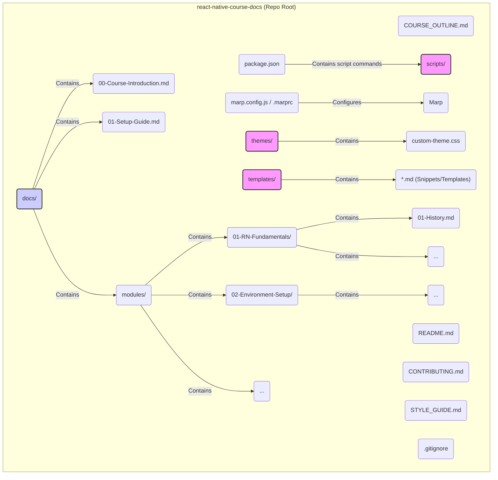

# React Native Training Course - Project Plan

This document outlines the plan for creating the GitHub repository containing Markdown documentation for the React Native training course.

**Phase 1: Foundation & Planning (Complete)**

1.  **Information Gathering & Analysis:** Reviewed course requirements, Marp documentation, and clarified key decisions (distribution, Mermaid, capstone location, scripting).
2.  **Plan Creation:** Developed this detailed plan outlining the structure, tools, templates, and content organization.

**Phase 2: Implementation (Requires Mode Switch)**

1.  **Repository Setup:**
    *   Initialize a new GitHub repository (user action).
    *   Create the core directory structure (detailed below).
    *   Add basic configuration files (`.gitignore`, `README.md`).
2.  **Marp Configuration & Theming:**
    *   Configure Marp using a `.marprc` or `marp.config.js` file to set defaults.
    *   Define a base custom theme CSS (`themes/custom-theme.css`).
3.  **Template & Snippet Creation:**
    *   Create reusable Markdown templates/snippets in a `/templates` directory for various content types (lessons, exercises, code blocks, callouts, Mermaid diagrams).
4.  **Supplementary Documentation:**
    *   Create initial versions of essential documents in the `/docs` directory (`00-Course-Introduction.md`, `01-Setup-Guide.md`, `CONTRIBUTING.md`, `STYLE_GUIDE.md`).
5.  **Course Outline Document:**
    *   Create `COURSE_OUTLINE.md` at the root, detailing the modules and planned lessons.
6.  **Boilerplate Script:**
    *   Develop a simple script (`scripts/create-lesson.js`) to generate boilerplate lesson files.

**Proposed Repository Structure:**

**Detailed Course Outline (Initial Draft - To be placed in `COURSE_OUTLINE.md`)**

*   **Module 00: Course Introduction** (Supplementary Doc)
*   **Module 01: React Native Fundamentals**
    *   Lesson 01: The Evolution of Mobile Development
    *   Lesson 02: What is React Native & Why Use It?
    *   Lesson 03: How React Native Works Under the Hood (Bridge, JSI)
    *   Lesson 04: Navigating the Official React Native Documentation
*   **Module 02: React Native Environment Setup**
    *   Lesson 01: Installing Prerequisites (Node, Watchman, Xcode)
    *   Lesson 02: Creating Your First Expo App (`create-expo-app`)
    *   Lesson 03: Running on the iOS Simulator
    *   Lesson 04: Understanding `npx expo install` vs `npm install`
    *   Lesson 05: Exploring the Default Expo Project Structure
    *   Lesson 06: Common Troubleshooting Steps (`legacy-peer-deps`, `node_modules`)
*   **Module 03: Web Development Essentials (for Native Devs)**
    *   Lesson 01: Core HTML Concepts (Elements, Attributes, Structure)
    *   Lesson 02: Core CSS Concepts (Selectors, Properties, Box Model, Flexbox Basics)
*   **Module 04: JavaScript Essentials**
    *   Lesson 01: Variables, Data Types, and Operators (using TypeScript)
    *   Lesson 02: Control Flow (Conditionals, Loops)
    *   Lesson 03: Functions & Scope
    *   Lesson 04: Objects & Arrays
    *   Lesson 05: ES6+ Features (Arrow Functions, Destructuring, Spread/Rest, Modules)
    *   Lesson 06: Asynchronous JavaScript (Promises, async/await)
*   **Module 05: React Essentials (for Non-React Devs)**
    *   Lesson 01: Introduction to React & JSX
    *   Lesson 02: Components (Functional) & Props
    *   Lesson 03: State & Lifecycle (using Hooks)
    *   Lesson 04: Handling Events
    *   Lesson 05: Conditional Rendering
    *   Lesson 06: Lists & Keys
    *   Lesson 07: Composition vs Inheritance
*   **Module 06: TypeScript Essentials**
    *   Lesson 01: Why TypeScript? Static Typing Benefits
    *   Lesson 02: Basic Types & Type Inference
    *   Lesson 03: Interfaces & Type Aliases
    *   Lesson 04: Generics
    *   Lesson 05: Working with React & TypeScript (Typing Props, State, Events)
*   **Module 07: React Native Components**
    *   Lesson 01: Core Components Overview (`View`, `Text`, `Image`, `TextInput`, `ScrollView`, `Button`, `Pressable`)
    *   Lesson 02: Working with Platform-Specific Code
    *   Lesson 03: Creating Custom, Reusable Components
    *   Lesson 04: Accessibility (`accessibilityLabel`, `accessibilityRole`, etc.)
*   **Module 08: React Native Hooks**
    *   Lesson 01: Review of Core React Hooks (`useState`, `useEffect`, `useContext`)
    *   Lesson 02: React Native Specific Hooks (`useWindowDimensions`, `useColorScheme`, etc.)
    *   Lesson 03: Building Custom Hooks
*   **Module 09: React Native UI and Styling**
    *   Lesson 01: Styling Basics (`StyleSheet.create`)
    *   Lesson 02: Layout with Flexbox
    *   Lesson 03: Using Styled Components
    *   Lesson 04: Introduction to UI Libraries (React Native Paper)
    *   Lesson 05: Theming (Light/Dark Mode)
*   **Module 10: Performance and Debugging**
    *   Lesson 01: Debugging Tools (React DevTools, Flipper/Expo Dev Tools)
    *   Lesson 02: Common Performance Bottlenecks
    *   Lesson 03: Optimizing Performance (`React.memo`, `useCallback`, `useMemo`, FlatList optimization)
    *   Lesson 04: Profiling Your Application
*   **Module 11: Navigation and Routing**
    *   Lesson 01: Introduction to React Navigation
    *   Lesson 02: Stack Navigator
    *   Lesson 03: Tab Navigator
    *   Lesson 04: Drawer Navigator (Optional/Brief)
    *   Lesson 05: Passing Parameters Between Screens
    *   Lesson 06: Introduction to Expo Router (File-based Routing)
    *   Lesson 07: Comparing React Navigation and Expo Router
*   **Module 12: React Native User Input and Forms**
    *   Lesson 01: Handling Text Input (`TextInput`)
    *   Lesson 02: Other Input Types (Switches, Sliders, Pickers - using Expo/Community libs)
    *   Lesson 03: Form Libraries (e.g., React Hook Form - optional, or manual handling)
    *   Lesson 04: Form Validation
*   **Module 13: State Management**
    *   Lesson 01: Recap: Component State (`useState`) vs Global State
    *   Lesson 02: React Context API for Global State
    *   Lesson 03: Introduction to Zustand (Simple Global State)
    *   Lesson 04: Introduction to TanStack Query / React Query (Server State Management)
    *   Lesson 05: Fetching, Caching, and Mutating Data with React Query
*   **Module 14: Native Modules**
    *   Lesson 01: What are Native Modules? When are they needed?
    *   Lesson 02: Using Existing Native Modules (from Expo SDK & Community)
    *   Lesson 03: Introduction to Creating Native Modules (Conceptual Overview - Swift/Kotlin/Java) - *Keep high-level as per course focus*
*   **Module 15: EAS and Publishing**
    *   Lesson 01: Introduction to Expo Application Services (EAS)
    *   Lesson 02: EAS Build: Creating Development and Production Builds
    *   Lesson 03: EAS Submit: Submitting to App Stores
    *   Lesson 04: EAS Update: Over-the-Air (OTA) Updates
    *   Lesson 05: Managing Credentials and Profiles
*   **Module 16: Advanced Features**
    *   Lesson 01: Animations API (Animated)
    *   Lesson 02: Layout Animation
    *   Lesson 03: Gesture Handling (React Native Gesture Handler)
    *   Lesson 04: Working with Device Features (Camera, Location - via Expo APIs)
    *   Lesson 05: (Other topics as identified - e.g., Push Notifications)
*   **Module 17: Capstone Project - SpeedyMeds**
    *   Lesson 01: Project Kick-off & Setup (Forking Repo, Understanding Scaffolding)
    *   Lesson 02: Agile Workflow Simulation (Tickets/Issues, Branching, PRs)
    *   Lesson 03: Feature Development Block 1 (e.g., Implementing Order Detail Screen UI)
    *   Lesson 04: Feature Development Block 2 (e.g., Adding State Logic)
    *   Lesson 05: Testing & Code Review
    *   Lesson 06: Final Integration & Demo Prep

**Content Creation Workflow:**

1.  Identify the next lesson/module to create based on the `COURSE_OUTLINE.md`.
2.  Run the `scripts/create-lesson.js` (or similar) script to generate the boilerplate Markdown file in the correct location.
3.  Write the content, utilizing snippets from `/templates` for consistency (code blocks, callouts, Mermaid diagrams).
4.  Use the Marp VS Code extension's preview feature extensively during writing.
5.  Commit changes to a feature branch.
6.  (Optional) Create a Pull Request for review (if collaborating).
7.  Merge into the main branch.