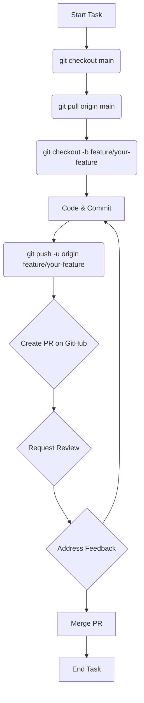

# Contributing to The SpeedyMeds Project

Welcome, team! This guide offers some suggestions on how you might contribute to the SpeedyMeds application, whether working individually or in a group.

Following these steps can help keep things organized and make development smoother as you learn React Native development practices.

## Getting Started

1.  **Clone The Repository:** Clone this repository to your local machine.
    ```bash
    git clone <this_repository_url>
    cd <SpeedyMeds_directory>
    ```
2.  **Ensure You're on `main`:** The `main` branch contains the starting code with the core architecture complete and placeholder screens ready for implementation. Make sure you start from this branch.
    ```bash
    git checkout main
    git pull origin main # Ensure you have the latest starting code
    ```
3.  **Complete Environment Setup:** Before writing code, make sure you've followed the setup steps in `SETUP.md`. A correct setup prevents many common issues.
4.  **Understand the Workflow:** Get familiar with the suggested branching and Pull Request process described below.
5.  **Check for Tasks:** Coordinate with the instructor and teammates to assign tasks or features.

## Branching Strategy


1.  **Sync `main` Branch:** Before starting new work, make sure your local `main` branch is up-to-date with the `main` branch on GitHub.
    ```bash
    # Switch to your local main branch
    git checkout main

    # Pull the latest changes from the repository's main branch
    git pull origin main
    ```
2.  **Create a Feature Branch:** Create a new branch from the up-to-date `main` branch for your specific task. Using descriptive names helps!
    - Examples:
      - `feature/implement-prescription-list-ui`
      - `fix/order-detail-date-format`
      - `chore/update-react-navigation`
      - `docs/improve-readme-setup`
      - `test/add-account-screen-tests`
    ```bash
    # Create and switch to your new branch
    git checkout -b feature/your-feature-name
    ```
3.  **Commit Changes Frequently:** Make your code changes on your feature branch. Committing often with clear messages makes it easier to track progress and revert if needed. Following [**Conventional Commits**](https://www.conventionalcommits.org/en/v1.0.0/) is a good practice.
    - **Format:** `<type>[optional scope]: <description>`
    - **Common Types:** `feat`, `fix`, `chore`, `docs`, `style`, `refactor`, `test`, `perf`.
    - **Example:** `feat: implement basic layout for AccountScreen`
    ```bash
    # Stage your changes
    git add .

    # Commit with a conventional commit message
    git commit -m "feat: implement basic layout for AccountScreen"
    ```
4.  **Push Your Branch:** Push your local feature branch to the repository on GitHub.
    ```bash
    # Push the branch (the -u flag sets the upstream for the first push)
    git push -u origin feature/your-feature-name
    ```

### Workflow Visualization



## Pull Requests (PRs)

Once your feature or fix is ready:

1.  **Self-Review & Test:**
    - Look over your changes. Does it work? Is the code clear?
    - **Run Linters & Formatters:** Keep the code style consistent!
      ```bash
      # Check for linting issues
      npm run lint
      # Automatically format code
      npm run format
      ```
    - **Run Tests:** Make sure existing tests pass and add new ones for your changes.
      ```bash
      # Run tests (likely in watch mode, press 'a' to run all)
      npm run test
      # Or run once for a quick check
      npm run test:ci
      ```
2.  **Create Pull Request on GitHub:**
    - Go to the repository page on GitHub.
    - GitHub usually prompts you to create a PR from your new branch. Click it!
    - Ensure the base branch is `main` and the compare branch is your feature branch.
3.  **Use the PR Template:**
    - Fill out the Pull Request template (`.github/PULL_REQUEST_TEMPLATE.md`).
    - **Describe your changes:** What did you do? Why? How can someone test it? Screenshots/GIFs for UI changes are super helpful!
4.  **Link Related Issues:** If using GitHub Issues, link them (e.g., `Closes #123`).
5.  **Request Review:** Ask the instructor and teammates to review your PR using GitHub's reviewer feature.

## Recommended Code Standards & Best Practices

- **Language:** Use **TypeScript**. Try to avoid `any` when possible – it helps catch errors!
- **Styling:** Use **React Native Paper** and **Styled Components**. Use the theme (`useTheme`) for colors/spacing.
- **Linting/Formatting:** Run `npm run lint` and `npm run format` often (or set up format-on-save).
- **Components:** Build small, reusable functional components in `src/components/`.
- **Custom Hooks:** Put reusable stateful logic in custom hooks (in `src/hooks/`, named `use...`).
- **Testing:** Write tests for your components and logic using **Jest** and **RNTL**. Think about how a user would interact with your component.
- **State Management:** Use **Zustand** (`useAppDataStore`) for state needed across many screens. Use React Hooks (`useState`) for state local to one component.
- **Data Fetching:** Use **TanStack Query (React Query)** (like `useQuery`) for fetching data.
- **Navigation:** Use **React Navigation** and the types defined in `src/navigation/types.ts`.
- **Code Documentation:** Add **JSDoc** comments to explain components and functions. Use inline comments (`//`) only for tricky bits.
- **Accessibility (A11y):** Add labels and roles (`accessibilityLabel`, etc.) to make the app usable for everyone.

## Code Reviews

Reviews are a great way to learn and improve code quality.

- **Reviewers (Instructor/team):**
  - Offer feedback kindly and clearly.
  - Check if the code works, is easy to understand, follows standards, and has tests.
- **Authors:**
  - Be open to suggestions!
  - Discuss feedback and make updates to your branch.
  - Address comments before merging.

## Asking for Help

Stuck? Don't hesitate to ask!

- **Try First:** Check the docs (`README`, `USAGE`, etc.), search online, use the debugger.
- **Be Specific:** Explain the problem clearly. What did you expect? What happened? Show relevant code/errors/screenshots.
- **Use Course Channels:** Ask questions in the WebEx channel. Use PR comments for code-specific feedback. Use GitHub Issues for specific bugs/tasks.

---

Let's build something great! Happy coding!
