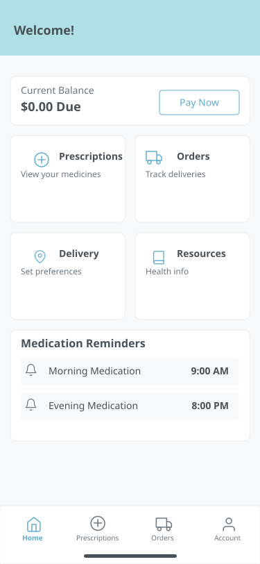
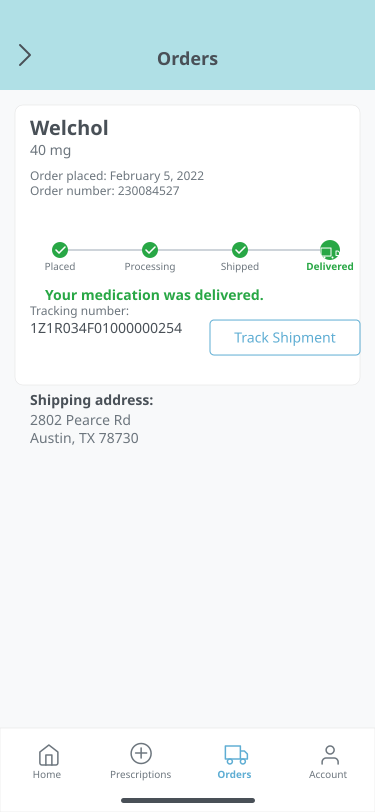
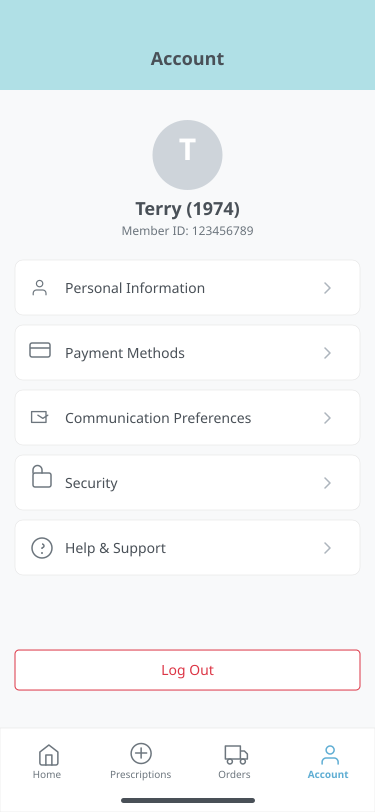

# SpeedyMeds - React Native Training Capstone Project 

[](https://reactnative.dev/)
[](https://docs.expo.dev/get-started/create-a-new-app/)
[](https://www.typescriptlang.org/)

---

## 🚀 Overview

Welcome to the SpeedyMeds! Think of this as your launchpad for the React Native training capstone project. We've set up a solid foundation with the core architecture in place so you can dive right into the fun part: applying React Native concepts to build a functional mobile pharmacy app.

**Course Structure:** This repository is your starting code. You can work individually or as part of a group. Check out [CONTRIBUTING.md](./CONTRIBUTING.md) for tips.

This starting point comes pre-loaded with helpful tools and patterns:

- **Modern Frameworks:** Built with React Native and Expo for a smooth development experience.
- **Strong Typing:** Uses TypeScript to help catch errors early and keep code understandable.
- **Component Ready:** A structure ready for you to build your own reusable UI components.
- **State Management:** Client-side (Zustand) and server-side (TanStack Query) state management are already configured, including a global store and data fetching examples.
- **Navigation:** App navigation using React Navigation (Stack & Tabs) is set up with types ready to go.
- **Styling & Theming:** Includes React Native Paper (Material Design 3) and Styled Components, plus a complete light/dark mode theme system (`ThemeContext`) you can use and customize.
- **Code Quality:** Comes with ESLint and Prettier to help keep your code neat and consistent.
- **Testing:** Jest and React Native Testing Library are set up for writing tests, including a handy custom render function.

We aimed to provide a **robust starting point**, letting you focus on building features and seeing how common tools fit together in React Native. This `main` branch has everything you need to get started!

---

## 🎨 Target UI Mockups

Here are some mockups to give you an idea of the target look and feel for the app's core screens. The goal is to implement UIs similar to these using the provided placeholders.

**Dashboard:**


**Prescriptions:**


**Order Detail:**


**Account:**


---

## ✨ Key Features & Starting State

Here's a snapshot of what's already configured and the state of the screens when you start:

- ✅ **Core Architecture:** Navigation, Theming, State Management (Zustand & TanStack Query), Mock API, and Tooling (TypeScript, ESLint, Prettier, Jest) are all set up and ready.
- 🟡 **Screens (`src/screens/`):** The main screen files exist but have **minimal placeholder content**. Your main task will be bringing these screens to life!
  - `OrderDetailScreen` placeholder shows the `orderId` passed via navigation.
  - `OrdersScreen` placeholder has a button to test navigating to the detail screen.
  - `AccountScreen` placeholder includes the `ThemeSelector` to play with themes.
- ✅ **Reusable Components (`src/components/`):** Some helpful generic components (`LoadingIndicator`, `ErrorDisplay`, `ScreenContainer`, `ThemeSelector`) are included.
- ✅ **Testing Setup:** Jest & RNTL are configured with a custom `renderWithProviders` function. Basic placeholder tests exist.
- ✅ **Environment Configuration (`.env`):** A pre-configured `.env` file helps with bundler connections and potential network issues in development. **No need to modify this file** unless you encounter specific local network problems.

---

## 🛠️ Technology Stack & Key Concepts

This project uses several key technologies. Feel free to explore their docs!

- **React Native:** ([Docs](https://reactnative.dev/docs/getting-started))
- **Expo:** ([Docs](https://docs.expo.dev/))
- **TypeScript:** ([Docs](https://www.typescriptlang.org/docs/))
- **React Navigation (v6):** ([Docs](https://reactnavigation.org/))
- **React Native Paper (v5 - MD3):** ([Docs](https://callstack.github.io/react-native-paper/))
- **Styled Components:** ([Docs](https://styled-components.com/))
- **TanStack Query (React Query v5):** ([Docs](https://tanstack.com/query/v5/docs/react/overview))
- **Zustand:** ([Docs](https://docs.pmnd.rs/zustand/getting-started/introduction))
- **ESLint & Prettier**
- **Faker.js**
- **Jest & React Native Testing Library (RNTL)**
- **@react-native-community/netinfo:** ([GitHub](https://github.com/react-native-netinfo/react-native-netinfo))

---

## 🚀 Getting Started

Ready to jump in? Follow these steps to get the project running locally.

### Prerequisites

Make sure you have the basic tools installed, as covered in the course prerequisites:

- **Node.js** (LTS version recommended)
- **npm** (comes with Node.js)
- **Git**
- A **Code Editor** (VS Code is great!)
- **Mobile Development Environment** (Xcode for iOS Simulators / Android Studio for Emulators)
- (Optional) **Expo Go App** on your phone

➡️ **Need a refresher?** The **[SETUP.md](./SETUP.md)** guide has detailed steps for environment setup.

### Installation

1.  **Clone the Repository:** Grab the code for this project (or your assigned group fork).
    ```bash
    # Example:
    git clone <THIS_REPOSITORY_URL>
    cd <SpeedyMeds_DIRECTORY_NAME>
    ```
2.  **Install Dependencies:** This command installs all the needed libraries. The `--legacy-peer-deps` flag helps work around potential version conflicts common in RN projects.
    ```bash
    npm install --legacy-peer-deps
    ```
    - **Adding New Packages Later?** Use `npx expo install [package-name]` for libraries with native code, and `npm install [package-name]` for pure JS ones.

### Running the App

1.  **Start Your Simulator/Emulator:** Get your preferred virtual device running first.
2.  **Start the Bundler:** Open your terminal in the project directory and run:
    ```bash
    npx expo start
    ```
    (No `--localhost` needed thanks to the `.env` file!)
3.  **Open the App:** In the terminal where `expo start` is running:
    - Press `i` → Open on iOS Simulator.
    - Press `a` → Open on Android Emulator.
    - Or scan the QR code with the Expo Go app on your phone.

### Debugging

- **Expo Dev Menu:** Access useful tools like Reload, Element Inspector, etc. (Cmd+D on iOS sim, Cmd+M/Ctrl+M on Android emu, Shake device).
- **Expo DevTools:** Press `j` in the Metro terminal to open the browser debugger. Great for logs, network requests, and React DevTools.

### Running Tests

```bash
# Run tests and watch for changes
npm test

# Run tests once
npm run test:ci
```

---

## 📂 Project Structure

```
SpeedyMeds/
├── .github/              # GitHub specific files (PR/Issue templates, workflows)
├── .vscode/              # VS Code specific settings (recommended extensions, format on save)
├── __tests__/            # Config/setup for tests (top-level tests if any)
├── assets/               # Static assets (images, fonts)
│   └── ...               # Icons/splash screen images
├── docs/                 # Project documentation (guides, architecture decisions)
│   └── setup/            # Detailed setup guides
├── src/                  # Application source code
│   ├── api/              # Data fetching simulation (mockData.ts, index.ts), query keys
│   ├── components/       # Reusable UI components (Loading, Error, Container, ThemeSelector)
│   │   └── __tests__/    # Unit/component tests for components
│   ├── context/          # React Context providers (ThemeContext)
│   │   └── __tests__/    # Tests for context logic
│   ├── hooks/            # Custom React hooks (useInitializeAppData)
│   │   └── __tests__/    # Tests for custom hooks
│   ├── navigation/       # Navigation setup (AppNavigator, MainTabNavigator, OrdersStack, types)
│   ├── screens/          # Screen components (PLACEHOLDERS: Home, Account, Orders, Detail, Prescriptions)
│   │   └── __tests__/    # Tests for screen components (verify placeholders render)
│   ├── stores/           # Global state management stores (Zustand: appDataStore)
│   │   └── __tests__/    # Tests for store actions and logic
│   ├── test-utils/       # Testing utilities (custom renderWithProviders function)
│   ├── theme/            # Theming definitions (colors, spacing, typography, shape, theme assembly)
│   └── types/            # Shared TypeScript interfaces and type definitions
├── .env                  # **IMPORTANT:** Pre-configured env file (DO NOT COMMIT IF MODIFIED)
├── .env.example          # Example environment variables (copy to .env if needed)
├── .eslintrc.js          # ESLint configuration (code quality rules)
├── .gitignore            # Files/folders ignored by Git
├── .prettierignore       # Files/ignored by Prettier
├── App.tsx               # Root React component, sets up providers (Navigation, Theme, QueryClient)
├── app.json              # Expo configuration file (app metadata, build settings)
├── index.ts              # App entry point (managed by Expo)
├── jest.config.js        # Jest configuration (test runner settings)
├── jest.setup.js         # Jest setup file (global mocks, RNTL setup)
├── package.json          # Project dependencies and scripts
├── prettierrc.js         # Prettier configuration (code formatting rules)
├── tsconfig.json         # TypeScript configuration
├── CHANGELOG.md          # Record of significant project changes (minimal for starting point)
├── CONTRIBUTING.md       # Guidelines for contributing to the project (essential for group work)
├── README.md             # This file: Project overview and entry point
├── ROADMAP.md            # Describes the starting state and next steps/goals for implementation
├── SETUP.md              # Detailed environment setup guide
└── USAGE.md              # Application usage guide (how to interact with the starting state)
```

---

## 🤝 How to Contribute

Development happens right here!

Check out **[CONTRIBUTING.md](./CONTRIBUTING.md)** for tips and guidelines on:

- Branching and Committing
- Pull Requests
- Code Reviews
- Coding Standards

---

## 📚 Documentation Index

- **Environment Setup:** [SETUP.md](./SETUP.md)
- **Contribution Guide:** [CONTRIBUTING.md](./CONTRIBUTING.md)
- **Using the Starter App:** [USAGE.md](./USAGE.md)
- **Project Goals/Checklist:** [ROADMAP.md](./ROADMAP.md)
- **Version History:** [CHANGELOG.md](./CHANGELOG.md)
- **Detailed Tooling Setup Guides (`docs/setup/`):** See these for deeper dives into the pre-configured tools.

---

## 📞 Contact & Support

Questions about the course or the project? Use the React Native Training WebEx channel.

Find a technical issue with this *starting* code? Let your instructor know!

---

Happy Coding! 🎉
