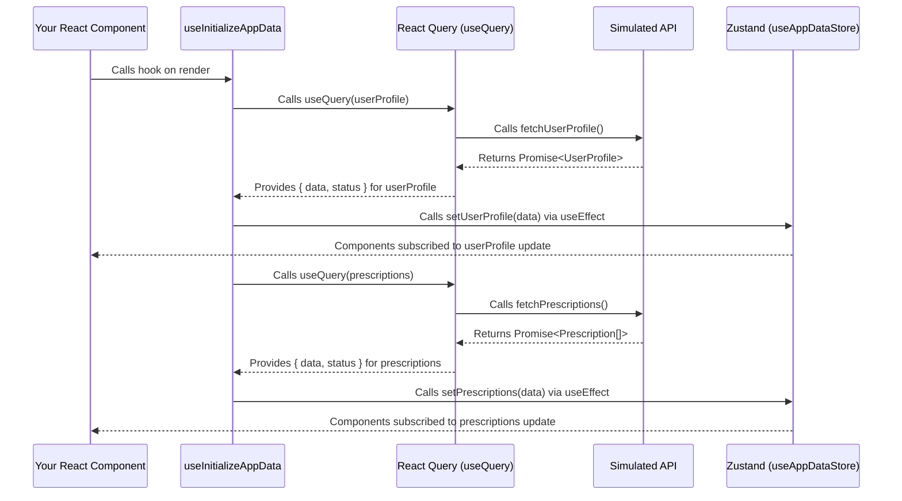

# How Data Fetching Works (TanStack Query / React Query)

## Overview

How does the app get data like prescriptions or orders? This project uses a powerful library called [TanStack Query (v5)](https://tanstack.com/query/v5/docs/react/overview) (you might also hear it called React Query) to handle talking to our simulated API.

Dealing with data fetching, caching (saving data temporarily so you don't have to ask for it again immediately), and keeping things in sync can be tricky. TanStack Query makes this much easier and helps build responsive apps.

## Setup (Already Done!)

Good news! The necessary packages are already installed:

- `@tanstack/react-query`: The core library.
- `@react-native-community/netinfo`: Helps React Query know if the phone is online or offline.

## How It's Configured

Here's a peek at how React Query is wired up in this project:

### 1. QueryClientProvider (`App.tsx`)

The whole app is wrapped with `QueryClientProvider`. This makes a central `QueryClient` (which manages the data cache) available everywhere.

```typescript
// App.tsx (Simplified)
import { QueryClient, QueryClientProvider } from '@tanstack/react-query';

// Create one client instance for the whole app
const queryClient = new QueryClient();

export default function App() {
  return (
    <QueryClientProvider client={queryClient}>
      {/* ... other providers and the rest of the app ... */}
    </QueryClientProvider>
  );
}
```

### 2. React Native Smarts (`App.tsx`)

We added some extra configuration in `App.tsx` so React Query works great on mobile:

- **Online Status:** It uses `@react-native-community/netinfo` to detect when the phone connects or disconnects from the internet. This lets React Query automatically retry fetches when you come back online.

  ```typescript
  // App.tsx (Online Manager Setup)
  import NetInfo from "@react-native-community/netinfo";
  import { onlineManager } from "@tanstack/react-query";

  onlineManager.setEventListener((setOnline) => {
    return NetInfo.addEventListener((state) => {
      setOnline(!!state.isConnected);
    });
  });
  ```

- **App Focus Refetching:** It uses React Native's `AppState` to tell React Query when the app comes back into the foreground. This helps keep data fresh by automatically refetching when the user switches back to the app.

  ```typescript
  // App.tsx (Focus Manager Setup)
  import { AppState, Platform } from "react-native";
  import { focusManager } from "@tanstack/react-query";
  // ... inside App component or AppContent useEffect ...
  useEffect(() => {
    const subscription = AppState.addEventListener("change", (status) => {
      if (Platform.OS !== "web") {
        focusManager.setFocused(status === "active");
      }
    });
    return () => subscription.remove();
  }, []);
  ```

## How We Use It

### 1. Query Keys (`src/api/queryKeys.ts`)

We define simple names (keys) for each type of data we fetch (like `userProfile`, `prescriptions`). Think of these like labels for the cached data. Using consistent keys helps React Query manage everything correctly.

```typescript
// src/api/queryKeys.ts
export const queryKeys = {
  userProfile: ["userProfile"] as const,
  prescriptions: ["prescriptions"] as const,
  // ... other keys ...
};
```

### 2. API Functions (`src/api/index.ts`)

These are the functions (like `fetchUserProfile`, `fetchPrescriptions`) that actually perform the data fetching (currently, they just return mock data after a short delay).

### 3. Fetching Hook (`src/hooks/useInitializeAppData.ts`)

This custom hook is the central place where we trigger the initial data fetches when the app starts. It uses the `useQuery` hook from React Query for each piece of data:

```typescript
// src/hooks/useInitializeAppData.ts (Simplified)
import { useQuery } from "@tanstack/react-query";
import { queryKeys } from "../api/queryKeys";
import { fetchUserProfile, fetchPrescriptions } from "../api";
import useAppDataStore from "../stores/appDataStore"; // To update our global state

export const useInitializeAppData = () => {
  const { setUserProfile, setPrescriptions, /* ... other setters ... */ } =
    useAppDataStore();

  // Fetch User Profile
  const { data: userProfile, /* ... status fields ... */ } = useQuery({
    queryKey: queryKeys.userProfile,
    queryFn: fetchUserProfile,
    staleTime: Infinity, // Profile data is considered fresh forever
  });

  // Fetch Prescriptions
  const { data: prescriptions, /* ... status fields ... */ } = useQuery({
    queryKey: queryKeys.prescriptions,
    queryFn: () => fetchPrescriptions(5),
    staleTime: 1000 * 60 * 10, // Prescriptions fresh for 10 mins
  });

  // ... queries for other data ...

  // This hook also uses useEffect to push the fetched data into the Zustand store
  useEffect(() => {
    if (userProfile) setUserProfile(userProfile);
  }, [userProfile, setUserProfile]);

  useEffect(() => {
    if (prescriptions) setPrescriptions(prescriptions);
  }, [prescriptions, setPrescriptions]);

  // ... other effects ...
};
```

- **`queryKey`:** Uses our predefined labels.
- **`queryFn`:** Points to the function that fetches the data.
- **`staleTime`:** Tells React Query how long to consider the cached data "fresh" before checking for updates in the background.
- **Data Synchronization:** This hook takes the data successfully fetched by React Query and puts it into our global Zustand store (`useAppDataStore`), making it easy for components to access.

### 4. Using the Data in Components

Your UI components usually **won't** need to call `useQuery` directly for this core app data. Instead, they just grab the latest data from the Zustand store (`useAppDataStore`). React Query and the `useInitializeAppData` hook handle keeping that store up-to-date in the background.

```typescript
// Example in a screen component (e.g., AccountScreen.tsx)
import useAppDataStore from '../stores/appDataStore';
import { Text, ActivityIndicator } from 'react-native-paper';

const AccountScreen = () => {
  // Get data directly from the Zustand store
  const userProfile = useAppDataStore((state) => state.userProfile);
  const isLoading = useAppDataStore((state) => state.isLoading); // Global loading state

  if (isLoading && !userProfile) return <ActivityIndicator />;
  // ... handle error and no data states ...

  return <Text>Welcome, {userProfile.firstName}</Text>;
};
```

## Key Ideas

- **Declarative Fetching:** You tell `useQuery` *how* to fetch, React Query handles *when*.
- **Caching:** Saves data locally to avoid unnecessary re-fetching.
- **Automatic Updates:** Refreshes data when you re-focus the app or reconnect.
- **Separation:** Data fetching logic is kept separate from your UI components.
- **Teamwork (React Query + Zustand):** React Query manages fetching/caching server data; Zustand provides easy access to that data for your components.

## Data Flow Diagram

Here's a simple view of how data flows in this setup:

