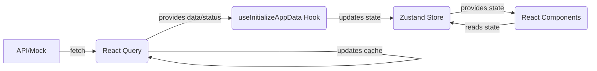

# Data Fetching & Caching (TanStack Query / React Query)

## Overview

This project uses [TanStack Query (v5)](https://tanstack.com/query/v5/docs/react/overview) (formerly React Query) to manage asynchronous operations, primarily data fetching from our simulated API. Efficiently handling data fetching, caching, and synchronization with server state is crucial for building responsive and robust applications, and TanStack Query provides powerful tools for these tasks.

## Installation

```bash
# Using npm (with legacy peer deps flag)
npm install @tanstack/react-query --save --legacy-peer-deps

# Required for online status management in React Native
npx expo install @react-native-community/netinfo -- --legacy-peer-deps
```

**Note:** The `--legacy-peer-deps` flag was necessary during setup to resolve potential version conflicts between dependencies in the project. While generally avoided, it can sometimes be required to proceed with installation in complex dependency trees. See `SETUP.md` for details.

## Configuration

### 1. QueryClientProvider (`App.tsx`)

The root of the application is wrapped with `QueryClientProvider`, making the `QueryClient` instance available throughout the component tree.

```typescript
// App.tsx
import { QueryClient, QueryClientProvider } from '@tanstack/react-query';

// Create a client instance
const queryClient = new QueryClient();

export default function App() {
  return (
    <QueryClientProvider client={queryClient}>
      {/* Rest of the app */}
    </QueryClientProvider>
  );
}
```

### 2. React Native Specific Setup (`App.tsx`)

To optimize React Query for the React Native environment, configurations for online status and app focus management are added in `App.tsx`:

- **Online Status:** Uses `@react-native-community/netinfo` to inform React Query whether the device is online or offline, enabling automatic refetching on reconnect.

  ```typescript
  // App.tsx
  import NetInfo from "@react-native-community/netinfo";
  import { onlineManager } from "@tanstack/react-query";

  onlineManager.setEventListener((setOnline) => {
    return NetInfo.addEventListener((state) => {
      setOnline(!!state.isConnected);
    });
  });
  ```

- **App Focus Refetching:** Uses the React Native `AppState` module to refetch queries when the app comes back into focus.

  ```typescript
  // App.tsx
  import { AppState, Platform } from "react-native";
  import type { AppStateStatus } from "react-native";
  import { focusManager } from "@tanstack/react-query";
  import { useEffect } from "react";

  function onAppStateChange(status: AppStateStatus) {
    if (Platform.OS !== "web") {
      focusManager.setFocused(status === "active");
    }
  }

  // Inside the main App component or a top-level component
  useEffect(() => {
    const subscription = AppState.addEventListener("change", onAppStateChange);
    return () => subscription.remove();
  }, []);
  ```

## Usage

### 1. Query Keys (`src/api/queryKeys.ts`)

Constants are defined for query keys to ensure consistency and prevent typos when referencing cached data.

```typescript
// src/api/queryKeys.ts
export const queryKeys = {
  userProfile: ["userProfile"] as const,
  prescriptions: ["prescriptions"] as const,
  // ... other keys
};
```

### 2. API Functions (`src/api/index.ts`)

Asynchronous functions (e.g., `fetchUserProfile`, `fetchPrescriptions`) are defined to handle the actual data fetching logic (currently simulating calls to the mock data generators).

### 3. Fetching Hook (`src/hooks/useInitializeAppData.ts`)

A custom hook centralizes the initial data fetching logic. It uses the `useQuery` hook from React Query for each data type:

```typescript
// src/hooks/useInitializeAppData.ts
import { useQuery } from "@tanstack/react-query";
import { queryKeys } from "../api/queryKeys";
import { fetchUserProfile, fetchPrescriptions } from "../api";
import useAppDataStore from "../stores/appDataStore";

export const useInitializeAppData = () => {
  const { setUserProfile, setPrescriptions, setError, setLoading } =
    useAppDataStore();

  const {
    data: userProfile,
    isFetching: isFetchingProfile,
    error: errorProfile,
  } = useQuery({
    queryKey: queryKeys.userProfile,
    queryFn: fetchUserProfile,
    staleTime: Infinity, // Example: Keep profile data fresh indefinitely
  });

  const {
    data: prescriptions,
    isFetching: isFetchingPrescriptions,
    error: errorPrescriptions,
  } = useQuery({
    queryKey: queryKeys.prescriptions,
    queryFn: () => fetchPrescriptions(5),
    staleTime: 1000 * 60 * 10, // Example: Refetch every 10 minutes
  });

  // ... queries for other data types ...

  // Effect hooks to update Zustand store with fetched data/errors
  useEffect(
    () => {
      // ... update Zustand store ...
    },
    [
      /* dependencies */
    ],
  );
};
```

- **`queryKey`:** Uses the constants defined earlier.
- **`queryFn`:** References the corresponding API function.
- **`staleTime`:** Configured to control how long cached data is considered fresh before requiring a background refetch.
- **Data Synchronization:** `useEffect` hooks within `useInitializeAppData` observe the results from `useQuery` and update the global Zustand store (`useAppDataStore`) accordingly.

### 4. Usage in Components

Components typically **do not** directly call `useQuery` themselves for this global application data. Instead, they consume the data from the Zustand store (`useAppDataStore`). This approach centralizes data access, decouples components from the fetching logic, and ensures components react to the latest available state managed globally, which is kept up-to-date by the `useInitializeAppData` hook.

```typescript
// Example in a screen component (e.g., AccountScreen.tsx)
import useAppDataStore from '../stores/appDataStore';
import { ActivityIndicator, Text } from 'react-native-paper';

const AccountScreen = () => {
  // Select only the needed state slices from Zustand
  const userProfile = useAppDataStore((state) => state.userProfile);
  const isLoading = useAppDataStore((state) => state.isLoading);
  const error = useAppDataStore((state) => state.error);

  if (isLoading && !userProfile) return <ActivityIndicator />; // Show loading only if no data yet
  if (error) return <Text>Error loading profile: {error.message}</Text>;
  if (!userProfile) return <Text>No profile data available.</Text>;

  return <Text>Welcome, {userProfile.firstName}</Text>;
};
```

## Key Concepts

- **Declarative Fetching:** Define _how_ to fetch data with `useQuery`, letting React Query handle _when_ (initial load, focus, reconnect, etc.).
- **Caching:** Reduces redundant network requests by serving stale data while refetching in the background.
- **Automatic Refetching:** Keeps data fresh based on window focus, network reconnection, and `staleTime`.
- **Separation of Concerns:** Data fetching logic is separated from UI components.
- **Integration with Zustand:** React Query handles the complexities of fetching and caching server state. Zustand then serves as the readily accessible, centralized client-side store for this data, providing components with a simple hook (`useAppDataStore`) to consume the latest state.

## Data Flow Visualization

The following diagram illustrates how data flows from the API through React Query and Zustand to the UI components in this architecture:


