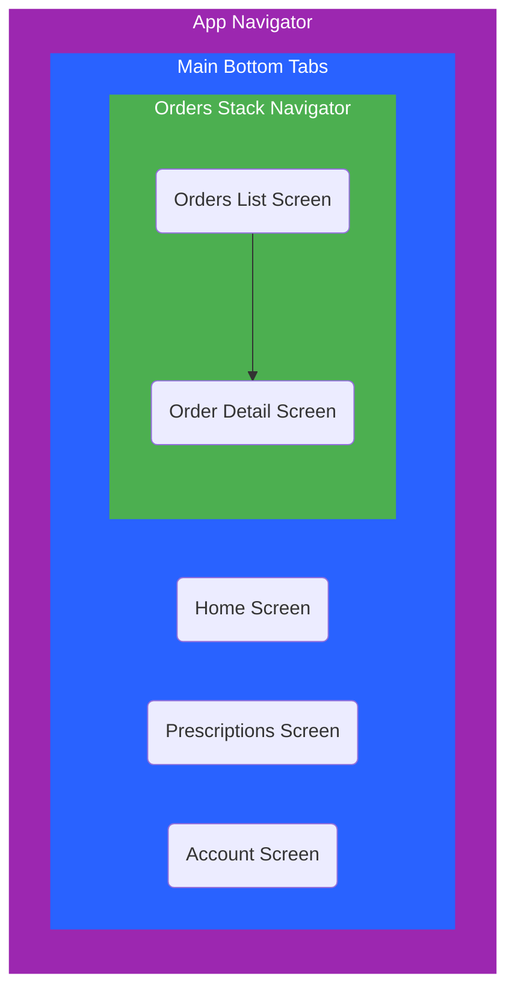

# How Navigation is Set Up (React Navigation)

This document explains how navigation (moving between screens) is set up in the SpeedyMeds project using the [React Navigation](https://reactnavigation.org/) library. This is the standard way to handle screen transitions in most React Native apps.

## The Approach

We've set up a common navigation pattern you'll see in many mobile apps:

1.  **Bottom Tabs:** The main sections (Home, Prescriptions, Orders, Account) are accessible via tabs at the bottom.
2.  **Nested Stack (Orders):** Inside the 'Orders' tab, we use a "Stack" navigator. This allows you to go from the list of orders to a specific order's detail screen and have a back button appear automatically.
3.  **Theming:** The look of the headers and tab bar matches the app's light/dark theme.

## How It Was Implemented (Already Done!)

Here's a quick overview of the key pieces already in place:

1.  **Dependencies:** All the necessary `@react-navigation/...` packages are installed.

2.  **Code Organization (`src/navigation/`):**
    - `types.ts`: Defines the expected screens and any data (parameters) they need.
    - `OrdersStackNavigator.tsx`: Sets up the stack navigator for the Orders section (List -> Detail).
    - `MainTabNavigator.tsx`: Sets up the bottom tabs and includes the Orders stack.
    - `AppNavigator.tsx`: The main container that holds everything together.

3.  **Connecting Screens & Theme:**
    - Screens live in `src/screens/` (currently placeholders).
    - The main `App.tsx` wraps everything in the necessary Theme providers and the `NavigationContainer`.
    - Navigators (`MainTabNavigator`, `OrdersStackNavigator`) use the `useTheme` hook to style headers according to the active theme.
    - Tab icons are configured in `MainTabNavigator.tsx`.

4.  **Type Safety:** Using the types defined in `src/navigation/types.ts` helps prevent errors when navigating or passing data between screens.

## Using Navigation

- The navigation structure is already working! You can tap the bottom tabs to switch between the placeholder screens.
- On the "Orders" tab, the button will navigate you to the "Order Detail" placeholder, demonstrating the nested stack.
- When you build your screens, you'll use the `navigation` prop provided by React Navigation to move between screens (e.g., `navigation.navigate('ScreenName', { someData: 'value' })`).

## Navigation Structure Visualized

This diagram shows how the navigators are nested:

**In simple terms:** The main app has bottom tabs. Clicking the "Orders" tab shows the Orders List screen, which is part of its own mini-navigation stack allowing you to push the Order Detail screen on top of it.
