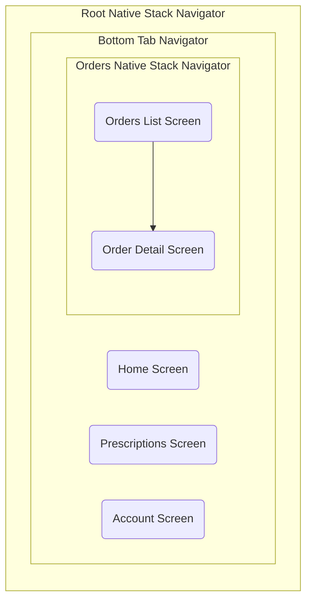

# Navigation Setup

This document details the setup of navigation using [React Navigation](https://reactnavigation.org/) for the SpeedyMeds project, including integration with the application theme. React Navigation is the standard library for routing and navigation in React Native applications.

## Approach

We are implementing a common mobile navigation pattern combining:

1.  **[Bottom Tab Navigator](https://reactnavigation.org/docs/bottom-tab-navigator):** For the primary sections (Home, Prescriptions, Orders, Account), now including icons.
2.  **[Native Stack Navigator](https://reactnavigation.org/docs/native-stack-navigator):** Used as the root navigator and also nested within the 'Orders' tab to handle navigation between the orders list and order details. This provides native platform navigation animations and headers within each section.
3.  **Theming:** The appearance of the navigators (headers, tab bar, background) is controlled by the application's theme.

## Implementation Details

1.  **Dependencies:** The following packages were installed using `npx expo install`:

    - `@react-navigation/native`
    - `@react-navigation/native-stack`
    - `@react-navigation/bottom-tabs`
    - `react-native-screens`
    - `react-native-safe-area-context`
    - `@expo/vector-icons` (implicitly included with Expo, used for tab icons)

2.  **Directory Structure:**

    - Navigation logic is organized within `src/navigation/`:
      - `types.ts`: Contains all `ParamList` type definitions.
      - `OrdersStackNavigator.tsx`: Defines the nested stack for the Orders section.
      - `MainTabNavigator.tsx`: Defines the main bottom tab navigator.
      - `AppNavigator.tsx`: Defines the root stack navigator and wraps everything in `NavigationContainer`.
    - Screen components reside in `src/screens/`.

3.  **Core Files & Theming Integration:**

    - **`src/theme/theme.ts`**: Defines `CombinedNavLightTheme` and `CombinedNavDarkTheme` by merging base React Navigation themes with our custom Paper themes using `adaptNavigationTheme`.
    - **`src/context/ThemeContext.tsx`**: Manages the overall application theme (light/dark/system) and provides the active theme object and an `isDark` boolean.
    - **`App.tsx`**: Wraps the entire application in our custom `ThemeProvider`. An inner `AppContent` component:
      - Gets the active theme and `isDark` flag from `useThemeContext`.
      - Selects the appropriate navigation theme (`CombinedNavLightTheme` or `CombinedNavDarkTheme`) based on `isDark`.
      - Renders the `AppNavigator`, passing the selected `navigationTheme` as a prop.
    - **`src/navigation/types.ts`**: Exports `RootStackParamList`, `BottomTabParamList`, and `OrdersStackParamList`.
    - **`src/navigation/OrdersStackNavigator.tsx`**: Defines and exports the `OrdersStackNavigator` component using `createNativeStackNavigator`.
    - **`src/navigation/MainTabNavigator.tsx`**: Defines and exports the `MainTabNavigator` component using `createBottomTabNavigator`. It imports `OrdersStackNavigator` for the 'Orders' tab and configures `tabBarIcon` options.
    - **`src/navigation/AppNavigator.tsx`**:
      - Imports `MainTabNavigator`.
      - Defines and exports the root `AppNavigator` component using `createNativeStackNavigator`.
      - Renders the `NavigationContainer` with the provided `navigationTheme`.
      - The root stack contains the `MainTabNavigator` as its primary screen.
    - **`src/screens/*.tsx`**: Placeholder screens (HomeScreen, PrescriptionsScreen, OrdersScreen, AccountScreen, OrderDetailScreen).

4.  **Type Safety:**
    - `RootStackParamList` defines routes/params for the root stack (primarily just the `MainTabs`).
    - `BottomTabParamList` defines routes for the bottom tabs (Home, Prescriptions, Orders, Account).
    - `OrdersStackParamList` defines routes/params for the nested stack within the Orders tab (`OrdersList`, `OrderDetail`).
    - Used with `createNativeStackNavigator` and `createBottomTabNavigator`.
    - Screen components use appropriate props types: `BottomTabScreenProps` for screens directly within the tab navigator (Home, Prescriptions, Account), and `NativeStackScreenProps` for screens within the nested `OrdersStackNavigator` (`OrdersScreen` as `OrdersList`, `OrderDetailScreen`).

## Usage

- The `AppNavigator` is rendered within the theme providers in `App.tsx`.
- The `NavigationContainer` and its navigators automatically adopt the light or dark theme based on the selection made via the `ThemeContext` (e.g., using the switcher in `HomeScreen`).
- Navigation between screens remains the same (`navigation.navigate('ScreenName', {params})`).

## Navigation Structure Visualization

The following diagram shows the updated navigation structure with the nested Orders stack:

**Key Changes:**

- The `Orders` tab now renders the `OrdersStackNav`.
- `OrdersListScreen` (formerly `OrdersScreen`) and `OrderDetailScreen` are now part of the `OrdersStackNav`.
- Icons are displayed for each tab in the `TabNav`.
