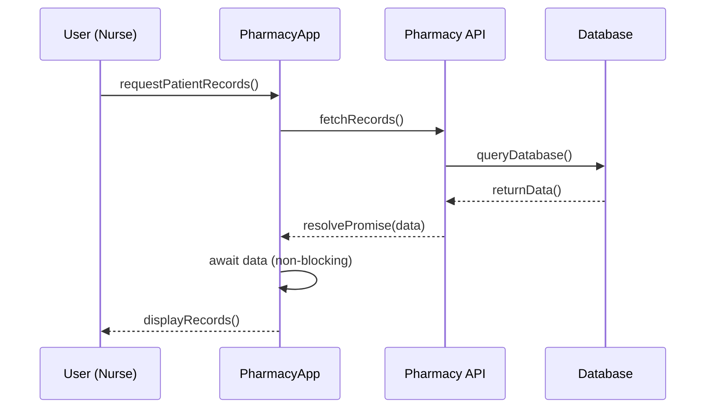

Great. I’ll create the full markdown documentation for **Module 5: JavaScript Essentials for React Native**, including all required explanations, diagrams, exercises, and the challenge. I’ll use placeholder URLs for the CodeSandbox activities, apply plain JavaScript throughout this module, and defer TypeScript until Module 6.

I’ll ensure the content follows the blueprint precisely, with detailed instructional scaffolding, learner adaptation elements, accurate examples, and consistent terminology. I’ll notify you when it’s ready for review.


# Module 5: JavaScript Essentials for React Native

This module covers the core JavaScript concepts needed for React Native development, using pharmacy-themed examples relevant to **SpeedyMeds**. We revisit variables, data types, operators, control flow, functions, objects/arrays, asynchronous programming, and ES6 modules. These JavaScript basics are *essential* whether you come from a React or Angular web background (where JS/TypeScript is common) or native iOS/Android (Swift/Java) backgrounds. JavaScript’s dynamic syntax may seem new to native developers, but it maps closely to familiar programming patterns (loops, functions, modules). As you learn, think about how React Native’s components will use this JavaScript under the hood.

> **💡 Bridge (React/Angular):** If you’ve built web UIs in React or Angular, many of these JS essentials will feel familiar (just recall React Native uses `View`/`Text` instead of `<div>`/`<span>`). If you come from native iOS/Android, imagine JS functions like Swift/Kotlin functions and JS loops like Java loops—concepts carry over.

## Learning Objectives

By the end of this module, you will:

* Understand how to declare and use **variables** and the main JavaScript **data types** (string, number, boolean, array, object, etc.) in code.
* Use **operators** (arithmetic, assignment, comparison, logical) to compute values (e.g. calculating inventory totals in a pharmacy).
* Implement **control flow** with `if`/`else` conditionals and loops (`for`, `while`) to make decisions and repeat tasks (for example, iterating through a list of medications).
* Write **functions**, including modern arrow functions, and understand **scope** and **closures** (e.g. functions for calculating a patient’s dose or generating prescription numbers).
* Create and manipulate **objects** and **arrays** of pharmacy data (such as medication records), including using methods, destructuring assignment, and spread/rest syntax for convenience.
* Work with **asynchronous JavaScript**: use callbacks, Promises, and `async/await` to handle operations like fetching prescription data from a server.
* Use **ES6 modules** (`import`/`export`) to organize code into separate files (e.g. one module for handling patient data, another for inventory logic).

**Prerequisites:** Ensure you have completed [Module 4](#) (JavaScript/React Fundamentals) before starting this module. Module 4 introduced React components, JSX, and basic JavaScript usage in React. These concepts build on that foundation.

---

## Variables, Data Types, and Operators

In JavaScript, variables are **containers** for storing values (numbers, text, objects, etc.). Use `let` or `const` to declare variables in React Native code. For example:

```js
const pharmacyName = "SpeedyMeds Pharmacy";  
let totalPrescriptions = 120;  
const isOpen = true;  
```

Here, `pharmacyName` is a string, `totalPrescriptions` is a number, and `isOpen` is a boolean. JavaScript has several data types. MDN Web Docs lists 8 types: seven *primitives* (Boolean, Null, Undefined, Number, BigInt, String, Symbol) plus Object. In React Native code, you’ll often work with strings (for names, addresses), numbers (prices, quantities), booleans (flags), arrays (lists of prescriptions), and objects (structured records). Operators let you manipulate these. For example:

```js
// Arithmetic and assignment
totalPrescriptions += 10; // add 10 more prescriptions
const averagePerDay = totalPrescriptions / 7; 

// Comparison operators
const hasLowInventory = totalPrescriptions < 50; 

// Logical operators
const needsRestock = (totalPrescriptions < 20) && isOpen; 
```

These operators compute new values or make decisions (e.g. check if prescriptions are below a threshold). Also use string concatenation and template literals to build text:

```js
const message = `Pharmacy: ${pharmacyName} | Total Rx: ${totalPrescriptions}`;
```

> **Tip:** Give variables meaningful names. In a pharmacy app, names like `patientList`, `drugPrice`, or `isPrescriptionReady` clarify intent.

> **Official Documentation:** A *variable* is “a container for a value”. JavaScript variables are declared with `let`, `const`, or `var`, and can hold any data type. See MDN’s [JavaScript guide on variables and types](https://developer.mozilla.org/docs/Web/JavaScript/Guide/Grammar_and_types#Data_types) for details.

---

## Control Flow (Conditionals, Loops)

Control flow statements let your code make decisions and repeat tasks. **Conditionals** (`if`/`else`) execute code only when certain conditions are met. For example, check prescription status:

```js
if (totalPrescriptions > 100) {
  console.log("High workload!");  
} else {
  console.log("Workload normal.");
}
```

If `totalPrescriptions > 100`, one branch runs; otherwise, the `else` branch runs. You can chain `else if` for multiple cases or use the ternary operator `? :` for simple decisions.

**Loops** repeat a block of code. Use `for` loops or `while` loops to process arrays of data. Example: iterate through an inventory array to print each drug:

```js
const inventory = ["Aspirin", "Tylenol", "Ibuprofen"];
for (let i = 0; i < inventory.length; i++) {
  console.log("Stock item:", inventory[i]);
}
```

Or use a `while` loop for a condition-based repeat:

```js
let stock = 5;
while (stock > 0) {
  console.log("Dispensing medication, remaining stock:", stock);
  stock--;
}
```

Modern JavaScript also supports `for...of` to iterate arrays directly:

```js
for (const drug of inventory) {
  console.log(`Stocking ${drug}...`);
}
```

Loops and conditionals combined allow powerful logic: for example, check each patient’s prescription and flag low quantity:

```js
const patients = [
  { name: "Alice", prescriptions: 2 },
  { name: "Bob", prescriptions: 7 },
];
for (const patient of patients) {
  if (patient.prescriptions < 3) {
    console.log(`${patient.name} has few prescriptions.`);
  }
}
```

> **Official Documentation:** The `if...else` statement “executes a statement if a specified condition is truthy”. The `for` statement “creates a loop that consists of three optional expressions”, and the `while` statement “creates a loop that executes a specified statement as long as the test condition is true”. See MDN [Control flow](https://developer.mozilla.org/docs/Web/JavaScript/Guide/Control_flow_and_error_handling) for more examples.

---

## Functions (Arrow Functions, Scope, Closures)

Functions let you encapsulate reusable logic. In our pharmacy context, you might write a function to calculate a prescription total or format a patient’s medication list. There are traditional function declarations and modern **arrow functions**. Example of a function declaration:

```js
function calculateTotalCost(prices) {
  let total = 0;
  for (let price of prices) {
    total += price;
  }
  return total;
}
```

And the same logic with an arrow function:

```js
const calculateTotalCost = prices => {
  let total = 0;
  for (let price of prices) {
    total += price;
  }
  return total;
};
```

Arrow functions are concise, especially for simple expressions. For example:

```js
const multiply = (a, b) => a * b;
```

JS **scope** determines which code can see which variables. Functions create a new scope: variables declared inside a function (or with `let`/`const` inside any `{}` block) are not visible outside. Example:

```js
function updateStock(item) {
  let updated = true;  // `updated` exists only inside this function
  console.log(`${item} updated.`);
}
console.log(updated); // Error: updated is not defined
```

A **closure** is when a function “closes over” variables from its outer scope. For instance, you could create a function that remembers a pharmacy discount rate:

```js
function makeDiscount(discountRate) {
  return function(price) {
    return price * (1 - discountRate);
  };
}
const applySeniorDiscount = makeDiscount(0.1);
console.log(applySeniorDiscount(100)); // 90
```

Here, the inner function retains access to `discountRate` even after `makeDiscount` finishes.

> **Background (TypeScript/Angular):** In TypeScript (often used with Angular), functions and scope work the same as in JS. The only difference is TypeScript lets you add type annotations. In React Native, you’ll write plain JS (no explicit types) but the underlying logic is identical.

> **Official Documentation:** “Functions are one of the fundamental building blocks in JavaScript. A function in JavaScript is similar to a procedure—a set of statements that performs a task or calculates a value”. Functions can accept input (parameters) and return output. See MDN’s [Functions](https://developer.mozilla.org/docs/Web/JavaScript/Guide/Functions) guide for details on declarations, expressions, and arrow functions.

### Exercise 5.1: Function Practice (CodeSandbox – [placeholder URL](https://codesandbox.io))

Write a function that takes an array of medication objects (each with a `price` and `quantity`) and returns the total inventory value. Use a loop or array methods inside your function. Example object: `{ name: "Amoxicillin", price: 5.00, quantity: 20 }`.

---

## Objects and Arrays (Methods, Destructuring, Spread/Rest)

JavaScript **objects** and **arrays** let you model complex data. In a pharmacy app, you might represent a prescription as an object:

```js
const prescription = {
  id: 101,
  drug: "Lisinopril",
  dose: "20mg",
  refillsLeft: 2
};
```

Objects hold named properties and values. Arrays hold ordered lists, e.g. a list of patients or medications:

```js
const medications = [
  { name: "Aspirin", price: 0.10 },
  { name: "Metformin", price: 0.20 },
];
```

You can use object **methods** and array methods. For example, `medications.push({name: "Ibuprofen", price: 0.15});` adds to the array. Or use `map` to compute a new array:

```js
const names = medications.map(med => med.name); // ["Aspirin", "Metformin"]
```

**Destructuring** lets you unpack values from objects or arrays into variables:

```js
const { drug, dose } = prescription;
// drug = "Lisinopril", dose = "20mg"

const [firstMed, secondMed] = medications;
// firstMed = {name: "Aspirin"...}, secondMed = {name: "Metformin"...}
```

**Spread syntax (`...`)** expands elements. For example, to merge arrays:

```js
const moreMeds = [{ name: "Ibuprofen", price: 0.15 }];
const allMeds = [...medications, ...moreMeds];
// allMeds is now a combined array
```

And spread an object to make a shallow copy or add properties:

```js
const updatedPrescription = { ...prescription, refillsLeft: prescription.refillsLeft - 1 };
```

This creates a new object with the same properties as `prescription`, except `refillsLeft` is decremented.

> **Official Documentation:** An object “is a collection of properties, and a property is an association between a name (or key) and a value”. The `Array` object “enables storing a collection of multiple items under a single variable name”. Destructuring “makes it possible to unpack values from arrays, or properties from objects, into distinct variables”, and the spread (`...`) syntax “allows an iterable…to be expanded in places where zero or more arguments or elements are expected”. See MDN for [Working with objects](https://developer.mozilla.org/docs/Web/JavaScript/Guide/Working_with_objects) and [Array](https://developer.mozilla.org/docs/Web/JavaScript/Reference/Global_Objects/Array) details.

### Exercise 5.2: Data Manipulation (CodeSandbox – [placeholder URL](https://codesandbox.io))

Given an array of patient objects (e.g. `{name, age, prescriptionIds}`) and another array of prescription objects, use array methods and destructuring to produce a new array of patient summaries. Each summary should include the patient’s name and the number of active prescriptions they have.

---

## Asynchronous JavaScript (Callbacks, Promises, async/await)

Many operations in React Native are asynchronous, such as network requests or reading from a database. JavaScript handles this with **callbacks**, **Promises**, and the modern `async/await` syntax.

* A **callback** is a function passed to another function to be executed later. For example, simulating a delay:

  ```js
  function fetchInventory(callback) {
    setTimeout(() => {
      const data = ["Aspirin", "Ibuprofen", "Amoxicillin"];
      callback(data);
    }, 1000);
  }

  fetchInventory(items => {
    console.log("Received inventory:", items);
  });
  ```

  Here, `fetchInventory` uses `setTimeout` to mimic fetching, and then calls `callback` with the data.

* A **Promise** represents a future value. You can create one using `new Promise` or use APIs that return promises (like `fetch`). Example:

  ```js
  function fetchInventory() {
    return new Promise((resolve, reject) => {
      setTimeout(() => {
        const data = ["Aspirin", "Ibuprofen", "Amoxicillin"];
        resolve(data);
      }, 1000);
    });
  }

  fetchInventory()
    .then(items => {
      console.log("Got inventory via Promise:", items);
    })
    .catch(error => {
      console.error("Error fetching inventory:", error);
    });
  ```

* The **async/await** syntax makes promise-based code look synchronous. Prefix a function with `async`, and use `await` before a promise to get its result. Example:

  ```js
  async function showInventory() {
    try {
      const items = await fetchInventory(); // wait for promise
      console.log("Inventory inside async function:", items);
    } catch (error) {
      console.error(error);
    }
  }
  showInventory();
  ```

  Internally, while waiting at `await`, other code can run (non-blocking).



The above sequence illustrates an `async` function call (`fetchRecords`). The **User** initiates a request, the **App** sends a call to an API, which queries the **Database**. The Database returns data to the API, which resolves a Promise. Back in the async function, the `await` pauses execution until the data arrives. Once the data is available, the function continues and updates the UI. Importantly, while awaiting, the app is non-blocking and can handle other events. This flow shows how `async/await` simplifies chaining of asynchronous operations into a readable sequence.

> **Official Documentation:** JavaScript’s `async` functions return Promises and allow `await` to pause execution “until the `Promise` fulfills, then return its result”. The MDN [Using Promises](https://developer.mozilla.org/docs/Web/JavaScript/Guide/Using_promises) guide explains callback vs. promise patterns. For `async/await`, see MDN [Async functions](https://developer.mozilla.org/docs/Web/JavaScript/Reference/Statements/async_function) reference.

### Exercise 5.3: Async Function Implementation (CodeSandbox – [placeholder URL](https://codesandbox.io))

Convert the following callback-based function to use Promises and `async/await`. The function fetches a list of upcoming orders and then filters them by status:

```js
function getPendingOrders(callback) {
  fetchOrders(orderList => {
    const pending = orderList.filter(o => o.status === "pending");
    callback(pending);
  });
}
```

Rewrite it so you have an `async` function `getPendingOrders()` that returns a Promise of the pending orders.

---

## ES6 Modules (Import/Export)

Organize your code by splitting it into modules. Each file can **export** variables or functions, and other files can **import** them. For example, in a file `inventory.js`:

```js
// inventory.js
export const drugs = ["Aspirin", "Ibuprofen"];
export function addDrug(name) {
  drugs.push(name);
}
```

Then in another file, say `main.js`, import and use them:

```js
// main.js
import { drugs, addDrug } from './inventory';
console.log(drugs); // ["Aspirin", "Ibuprofen"]
addDrug("Metformin");
```

You can also use `export default` for a single main export. Modules help keep pharmacy app code organized (e.g. one module for API calls, one for utility functions, one for UI logic).

> **Official Documentation:** ES6 modules allow `export` and `import` syntax to share code between files. See MDN’s [import](https://developer.mozilla.org/docs/Web/JavaScript/Reference/Statements/import) and [export](https://developer.mozilla.org/docs/Web/JavaScript/Reference/Statements/export) references. This modular approach keeps code maintainable in large apps.

---

## Challenge 5: Mini Pharmacy Data Processor (CodeSandbox – [placeholder URL](https://codesandbox.io))

**Challenge:** Build a small JavaScript module that processes pharmacy data. For example, given an array of prescription objects (each with fields like `patientName`, `drug`, `quantity`, `status`), write functions to filter and summarize this data (e.g. find all active prescriptions, count total quantity, etc.). Use what you’ve learned: variables, loops, functions, objects/arrays, async (simulate an API call), and modules to separate logic. Test your code in CodeSandbox.

---

## Module Summary and Next Steps

In this module, we covered the JavaScript essentials you need for React Native: variables, types, operators, control flow, functions (including arrow functions and closures), objects/arrays, asynchronous patterns, and modules. All code examples tied back to pharmacy scenarios (like medications, prescriptions, inventory) to reinforce context.

> **Learning Path:** With solid JS fundamentals in place, you’re ready for more React Native topics. Next up, Module 6 will delve into React Native components and state management. Continue practicing by modifying the pharmacy examples—try adding new features or error handling, and refer to the official docs for deeper learning.

**Further Resources:** MDN Web Docs is an excellent reference for each topic (see the *Official Documentation* links above). For additional practice, explore JavaScript tutorials on arrays or async code. You can also consult the [React Native documentation](https://reactnative.dev/docs/getting-started) for how these JS concepts apply in the mobile app context.
