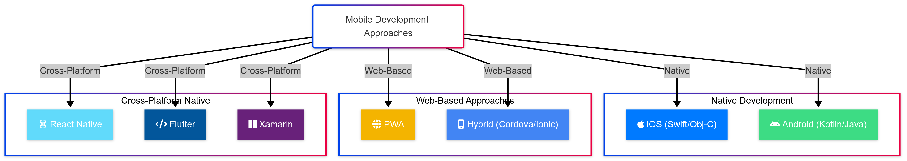

# Section 1: The Mobile Development Landscape

## Learning Objectives
After completing this section, you will be able to:
- Compare and contrast native, hybrid, and cross-platform development approaches
- Identify key challenges in mobile development across platforms
- Understand the evolution of cross-platform solutions
- Recognize where React Native fits in the mobile development ecosystem

**Prerequisite Knowledge**: None
**Estimated Time**: 30-45 minutes

## Mobile Development Challenges

Building mobile applications presents unique challenges across both technical and business dimensions:

### Technical Challenges
- Platform fragmentation
- Different programming languages
- Varying UI paradigms
- Device constraints (memory, battery)
- Offline capabilities

### Business Challenges
- Development costs for multiple platforms
- Maintenance overhead
- Time-to-market pressure
- Finding specialized talent
- Balancing quality and speed

> 💡 **The Multi-Platform Dilemma**: Organizations often need to support both iOS and Android to reach their entire user base, but maintaining separate codebases is expensive and time-consuming.

## The Evolution of Mobile Development

### Native Development: The Beginning

When smartphones first emerged in the late 2000s, developers had only one option: build native applications specifically for each platform. This meant:

- iOS apps written in Objective-C (later Swift)
- Android apps written in Java (later Kotlin)
- Windows Phone apps written in C# and XAML

This approach offered the best performance and access to all platform features but required:
- Separate codebases for each platform
- Different skill sets for each platform
- Duplicate development efforts
- Higher maintenance costs

> 🔍 **For iOS Developers**: You're already familiar with UIKit or SwiftUI, Xcode, and the iOS development ecosystem. React Native provides a bridge to leverage this knowledge while writing cross-platform code.

> 🔍 **For Android Developers**: Your experience with Android Studio, XML layouts, and the Android SDK will help you understand how React Native interfaces with the underlying platform.

### The Cross-Platform Dream

As mobile became increasingly important, businesses sought ways to reduce the cost and complexity of supporting multiple platforms. This led to the first wave of cross-platform solutions:

#### Web-Based Approaches (2009-2012)

**PhoneGap/Cordova (2009)**
- Wrapped web applications in a native WebView
- Used HTML, CSS, and JavaScript
- Accessed native features through plugins
- Performance issues with complex UIs
- Often felt non-native to users

**Sencha Touch (2010)**
- JavaScript framework for building mobile web apps
- Component-based architecture
- Limited access to native features
- Performance challenges with complex applications

> 💡 **Deep Dive**: These early solutions essentially ran a web browser inside a native app shell. The JavaScript code executed in the WebView, with bridge APIs to access native functionality. This approach suffered from performance issues because all rendering occurred within the WebView, which wasn't optimized for complex applications.

#### Hybrid Frameworks (2013-2015)

**Xamarin (2013)**
- C# codebase that compiled to native code
- Native UI components
- Better performance than WebView solutions
- Required C# knowledge
- Microsoft acquisition in 2016

**Ionic (2013)**
- Built on Angular and Cordova
- Improved WebView approach with better UI components
- Still faced performance limitations
- Popular for enterprise applications

**NativeScript (2014)**
- Direct access to native APIs through JavaScript
- No WebView
- Angular and Vue.js support
- Steeper learning curve

> 🔄 **Platform Specific**: For Android developers, Xamarin's approach is somewhat similar to using the Android NDK, where code written in C/C++ is compiled to native code. For iOS developers, it's comparable to using C/C++ with Objective-C/Swift bridging.

### The React Native Revolution (2015)

Facebook faced significant challenges with its mobile strategy. Initially betting on HTML5, they encountered performance issues that led CEO Mark Zuckerberg to admit this was "one of the biggest mistakes if not the biggest strategic mistake that we made."

This led to a rethinking of their approach, resulting in an internal hackathon project that would eventually become React Native.

Key innovations that React Native introduced:

1. **JavaScript Core Execution**: Running JavaScript in a separate thread, not in a WebView
2. **Native Component Rendering**: Using actual native UI components, not web components
3. **Declarative UI Paradigm**: Bringing React's component model to mobile
4. **Hot Reloading**: Dramatically improving developer experience
5. **Bridge Architecture**: Enabling JavaScript to communicate with native modules

> 💡 **Deep Dive**: React Native fundamentally changed the cross-platform paradigm by not trying to achieve "write once, run anywhere" but instead focusing on "learn once, write anywhere." It acknowledged platform differences while providing a unified development experience. Its recent architectural improvements with the Bridgeless Architecture have significantly enhanced performance by eliminating the JavaScript bridge.

### The Modern Landscape (2015-Present)

Since React Native's introduction, the cross-platform landscape has continued to evolve:

**Flutter (2017)**
- Google's UI toolkit using Dart language
- Custom rendering engine (Impeller, previously Skia)
- Not using native components
- Strong performance characteristics
- Growing ecosystem

**React Native (Continuous Evolution)**
- New architecture (Fabric, TurboModules, JSI, Bridgeless Architecture)
- Improved performance through elimination of JavaScript bridge
- Better native integration
- Expanded ecosystem
- Used by major companies like Facebook, Instagram, Shopify, and Microsoft

> 📚 **Resource**: For a detailed comparison, see [Flutter vs. React Native](https://www.nomtek.com/blog/flutter-vs-react-native) by Nomtek. A fundamental difference is their programming languages: Flutter uses Dart, while React Native uses JavaScript. Dart is praised for its type safety and purpose-built nature for UI development. However, JavaScript's massive popularity gives React Native a significant advantage in ecosystem and talent availability. Web developers familiar with React can transition to React Native with minimal friction, creating a larger talent pool compared to Flutter, where Dart expertise is less common in the job market.

**Progressive Web Apps (PWAs)**
- Web technologies that behave more like native apps
- Improved capabilities through modern web APIs
- No app store required
- Limited access to native features

**KMM (Kotlin Multiplatform Mobile)**
- Sharing business logic between Android and iOS
- Native UIs for each platform
- Leveraging Kotlin's multiplatform capabilities

## Approach Comparison Matrix

When comparing different mobile development approaches, several key factors need to be considered:

| Criteria | Native | Hybrid/PWA | React Native | Flutter |
|----------|--------|------------|--------------|---------|
| Performance | ★★★★★ | ★★☆☆☆ | ★★★★☆ | ★★★★☆ |
| Native API Access | ★★★★★ | ★★☆☆☆ | ★★★★☆ | ★★★★☆ |
| Code Sharing | ★☆☆☆☆ | ★★★★★ | ★★★★☆ | ★★★★★ |
| Development Speed | ★★☆☆☆ | ★★★★★ | ★★★★☆ | ★★★★☆ |
| Native Look & Feel | ★★★★★ | ★★☆☆☆ | ★★★★☆ | ★★★☆☆ |
| Learning Curve | ★★★★★ | ★★☆☆☆ | ★★★☆☆ | ★★★☆☆ |

> 💡 **Rating Scale**: ★★★★★ = Excellent, ★★★★☆ = Very Good, ★★★☆☆ = Good, ★★☆☆☆ = Fair, ★☆☆☆☆ = Poor

> 💡 **Recent Improvements**: Both React Native and Flutter have recently improved their performance - React Native with its Bridgeless Architecture and Flutter with its Impeller rendering engine.

## Decision Factors

When choosing a mobile development approach, consider these key factors:

### Project Factors
- Performance requirements
- Platform-specific feature needs
- Timeline constraints
- Budget limitations
- Long-term maintenance plans

### Team Factors
- Existing skill sets
- Team size and structure
- Learning capacity
- Development preferences
- Future hiring considerations

> 💡 **Decision Framework**: There's no one-size-fits-all solution. The best approach depends on your specific project requirements, team capabilities, and business constraints.

## The Fragmentation Challenge

Throughout this evolution, one challenge has remained constant: the mobile ecosystem is fragmented. Developers must consider:

- Multiple operating systems (iOS, Android)
- Various device sizes and form factors
- Different hardware capabilities
- Platform-specific design guidelines
- Varying user expectations

This fragmentation is what continues to drive innovation in cross-platform development tools, with React Native standing as one of the most successful solutions to date.

## Industry Trends

The mobile development landscape continues to evolve with several notable trends:

### Current Trends
- Growing adoption of cross-platform frameworks
- Increased focus on performance optimization
- Declarative UI paradigms (SwiftUI, Jetpack Compose)
- Serverless and edge computing integration
- AI/ML capabilities in mobile apps

### Future Directions
- Improved cross-platform native performance
- Better integration with wearables and IoT
- Enhanced AR/VR capabilities
- More sophisticated offline-first architectures
- Convergence of mobile and desktop development

> 💡 **React Native's Position**: React Native continues to evolve with its new architecture (Fabric, TurboModules, JSI, and Bridgeless Architecture), addressing performance concerns and improving the developer experience, maintaining its position as a leading cross-platform solution.

## Exercise: Platform Selection

In this exercise, you will analyze different mobile development approaches for specific pharmacy app features to determine the most appropriate platform for each use case.

### Objective
Evaluate the strengths and limitations of native, hybrid, and cross-platform development approaches for different pharmacy app features to make informed architectural decisions.

### Steps
1. For each of the following pharmacy app features, analyze which development approach (native, hybrid, or cross-platform) would be most appropriate:
   - **Medication barcode scanner**: Consider native device access requirements and performance needs
   - **Medication reminder notifications**: Evaluate reliability and background processing capabilities
   - **Pharmacy locator with maps**: Assess integration with mapping services and location APIs
   - **Medication information database**: Consider data storage, offline access, and synchronization

2. For each feature, document your recommendation and explain your reasoning based on:
   - Performance requirements
   - Platform API access needs
   - Development efficiency
   - Maintenance considerations

3. Consider how each approach would impact:
   - Patient experience with medication management
   - Healthcare provider integration
   - Regulatory compliance requirements
   - Development team resources

### Application
This exercise simulates real-world decisions you would make when planning a pharmacy application architecture. The ability to select the right development approach for specific features is critical for creating effective healthcare applications that balance performance, development efficiency, and maintenance requirements.

#### Exercise Resources
Complete this exercise using the [Platform Selection Analysis Microsoft Form](https://forms.office.com/r/platformSelectionAnalysis) to document your analysis.

## Summary

The mobile development landscape has evolved from strictly native development to various cross-platform approaches, each with their own tradeoffs. React Native emerged from Facebook's need to improve their mobile development process and has since become one of the leading solutions for building cross-platform mobile applications. Understanding this history helps contextualize why React Native works the way it does and the problems it aims to solve.

Key takeaways:
- Mobile development approaches include native, web-based, and cross-platform native solutions
- Native development offers the best performance and platform integration but at higher cost
- Web-based approaches provide maximum code sharing but with performance and capability limitations
- Cross-platform native frameworks like React Native balance code sharing with near-native performance
- The best approach depends on project requirements, team skills, and business constraints
- React Native is well-positioned for many types of applications, especially those needing a balance of efficiency and native capabilities

In the next section, we'll explore the specific advantages that React Native offers and why it might be the right choice for your projects.
