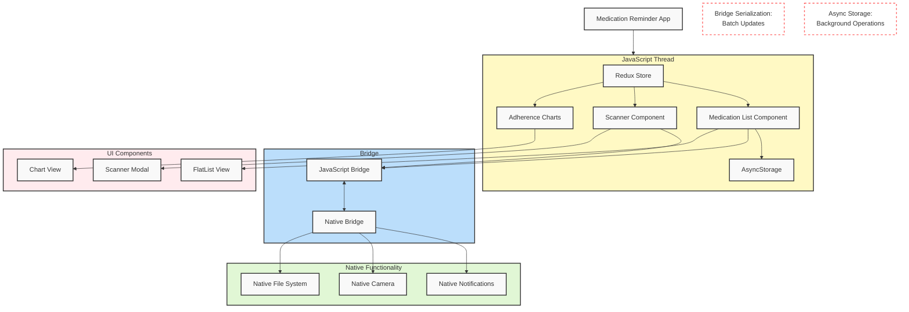
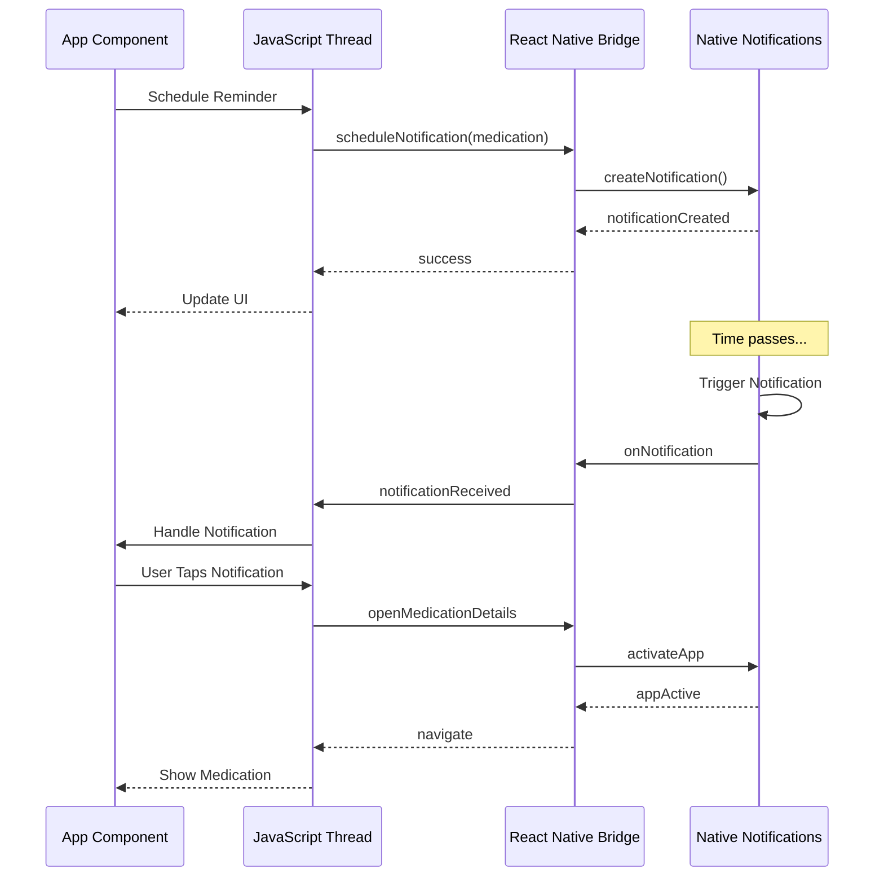
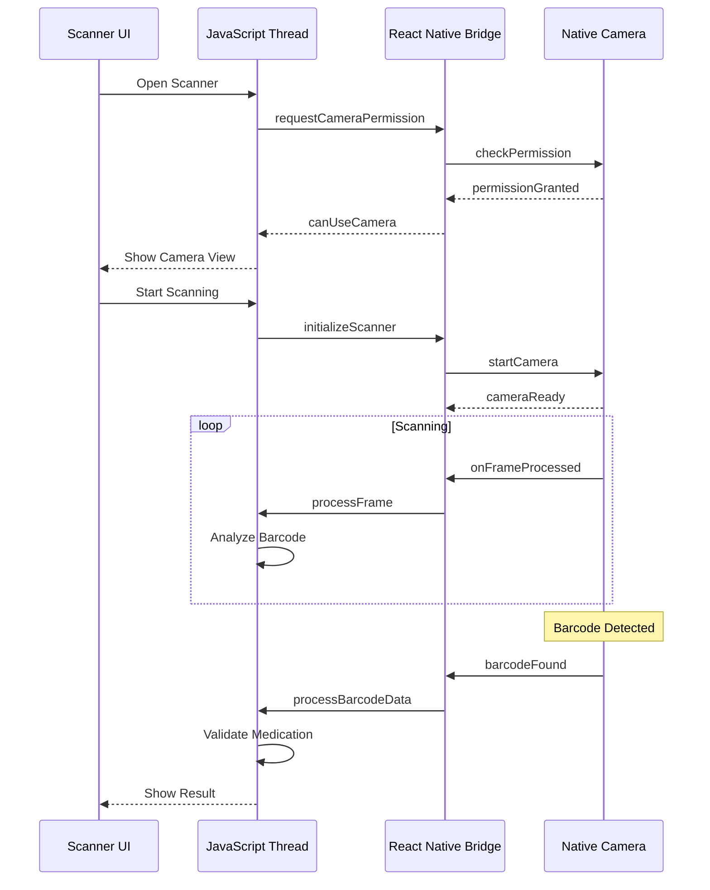

# Module 1 Challenge: React Native Fundamentals Analysis - Complete

## 1. Approach Comparison Table

```markdown
| Aspect                    | Native iOS | Native Android | React Native | PWA |
|--------------------------|------------|----------------|--------------|-----|
| Development Time         | High (separate codebase) | High (separate codebase) | Medium (shared codebase) | Low (single codebase) |
| Team Resources Required  | iOS developers, UIKit expertise | Android developers, Jetpack expertise | JavaScript developers, React expertise | Web developers |
| Performance             | Excellent (direct native) | Excellent (direct native) | Good (bridge overhead) | Limited (browser-based) |
| User Experience         | Excellent (native UI) | Excellent (native UI) | Very Good (native components) | Good (web-based) |
| Platform Feature Access | Complete | Complete | Very Good (via bridge) | Limited (web APIs) |
| Maintenance Complexity  | High (two codebases) | High (two codebases) | Medium (shared logic) | Low (single codebase) |
| Learning Curve         | Steep (platform-specific) | Steep (platform-specific) | Moderate (React + native) | Low (web technologies) |
| Code Reusability       | None between platforms | None between platforms | High (85%+ shared) | Complete (single codebase) |
```

## 2. React Native Architecture Diagram



## 3. Bridge Communication Flow

### 3.1 Notification Flow



### 3.2 Barcode Scanning Flow



## 4. Documentation Reference Guide

| Feature | Documentation Section | Key APIs/Components | Notes |
|---------|---------------------|-------------------|-------|
| Medication List UI | [Lists Documentation](https://reactnative.dev/docs/flatlist) | `FlatList`, `VirtualizedList` | Use `windowSize` and `maxToRenderPerBatch` for performance |
| Notifications | [Push Notifications Guide](https://reactnative.dev/docs/pushnotificationios) | `PushNotificationIOS`, Expo Notifications | Consider using Expo for cross-platform support |
| Barcode Scanning | [Camera Documentation](https://reactnative.dev/docs/camera) | React Native Vision Camera | Implement ML Kit for barcode detection |
| Adherence Charts | [Community Charts](https://github.com/JesperLekland/react-native-svg-charts) | `react-native-svg-charts` | Use `react-native-reanimated` for animations |
| Local Storage | [AsyncStorage Guide](https://reactnative.dev/docs/asyncstorage) | `AsyncStorage`, SQLite | Consider SQLite for large datasets |

## Performance Optimization Strategies

1. **Bridge Communication**
   - Batch updates when possible
   - Minimize bridge crossing
   - Use native modules for intensive tasks

2. **UI Performance**
   - Implement list virtualization
   - Use `memo` for pure components
   - Optimize image loading

3. **State Management**
   - Implement efficient Redux selectors
   - Use local state for UI-only data
   - Optimize re-renders

4. **Data Storage**
   - Cache frequently accessed data
   - Use background tasks for sync
   - Implement proper error handling

## Implementation Considerations

### 1. Native Module Integration
- Use Expo modules when available
- Create custom native modules when needed
- Handle platform differences gracefully

### 2. Error Handling
- Implement proper error boundaries
- Handle offline scenarios
- Provide user feedback

### 3. Testing Strategy
- Unit tests for business logic
- Integration tests for native features
- End-to-end testing for critical flows

### 4. Security Considerations
- Secure local storage
- Handle permissions properly
- Validate barcode data

## Additional Notes

### Platform-Specific Features
- iOS: HealthKit integration
- Android: Background services
- Shared: Core functionality

### Development Workflow
1. Implement core features
2. Add native functionality
3. Optimize performance
4. Add platform-specific features 