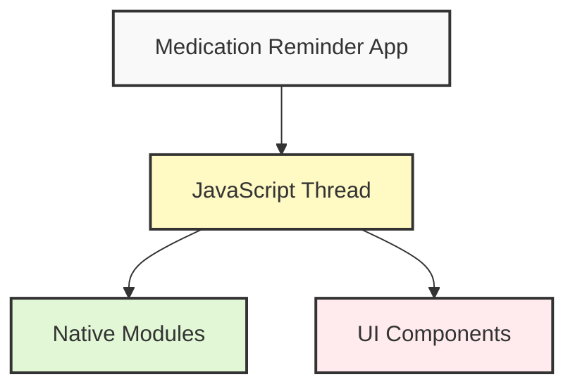
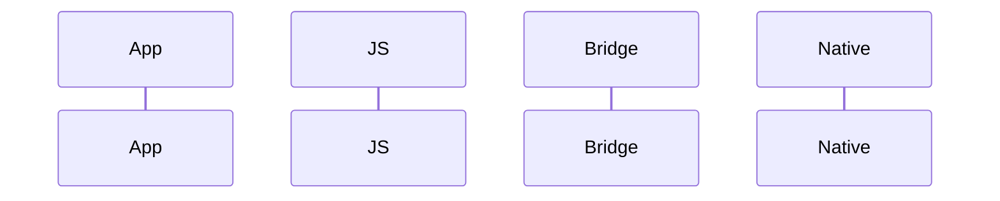
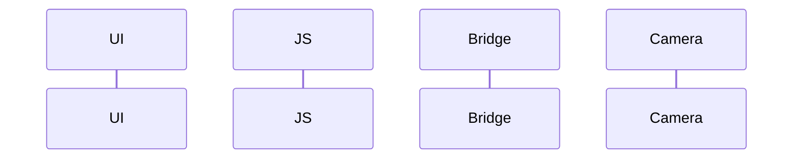

# Module 1 Challenge: React Native Fundamentals Analysis - Starter

## 1. Approach Comparison Table

Complete the following table comparing different approaches to building the medication reminder app:

```markdown
| Aspect                    | Native iOS | Native Android | React Native | PWA |
|--------------------------|------------|----------------|--------------|-----|
| Development Time         |            |                |              |     |
| Team Resources Required  |            |                |              |     |
| Performance             |            |                |              |     |
| User Experience         |            |                |              |     |
| Platform Feature Access |            |                |              |     |
| Maintenance Complexity  |            |                |              |     |
| Learning Curve         |            |                |              |     |
| Code Reusability       |            |                |              |     |
```

## 2. React Native Architecture Diagram

Use this starter Mermaid diagram to illustrate the architecture:



### Key Components to Include:
1. Medication List Component
2. Notification System
3. Barcode Scanner
4. Local Storage
5. Bridge Communication
6. Performance Optimizations

## 3. Bridge Communication Flow

Complete these sequence diagrams for key features:

### 3.1 Notification Flow



### 3.2 Barcode Scanning Flow



## 4. Documentation Reference Guide

Complete this table with specific documentation references:

| Feature | Documentation Section | Key APIs/Components | Notes |
|---------|---------------------|-------------------|-------|
| Medication List UI |  |  |  |
| Notifications |  |  |  |
| Barcode Scanning |  |  |  |
| Adherence Charts |  |  |  |
| Local Storage |  |  |  |

## Tips for Completion

### Architecture Diagram
- Start with core components
- Show data flow directions
- Identify potential bottlenecks
- Include performance considerations

### Bridge Communication
- Include all relevant threads
- Show asynchronous operations
- Note potential failure points
- Include error handling

### Documentation References
- Use official React Native docs
- Include specific API names
- Note platform differences
- Consider version compatibility

## Evaluation Checklist

- [ ] Approach comparison includes concrete examples
- [ ] Architecture diagram shows clear component relationships
- [ ] Bridge communication flows are complete and accurate
- [ ] Documentation references are specific and relevant
- [ ] Performance considerations are addressed
- [ ] Platform-specific details are noted
- [ ] Error handling is considered
- [ ] Implementation suggestions are practical 