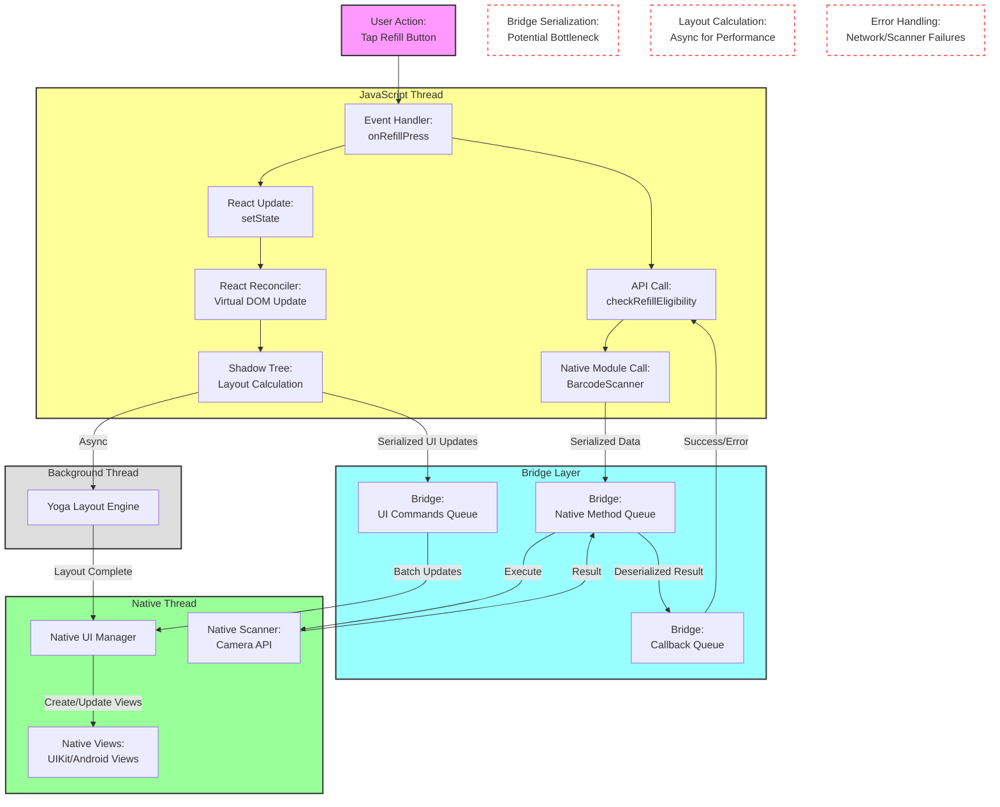

# React Native Architecture Diagram Exercise - Complete

## Completed Diagram

## Key Components Explained

### 1. Event Flow
- User taps "Refill" button
- Event handler triggered in JavaScript thread
- React state update initiated
- Virtual DOM reconciliation process begins

### 2. Bridge Communication
- UI updates serialized and queued
- Native module calls serialized
- Batch processing for efficiency
- Bidirectional communication

### 3. Native Operations
- UI Manager processes batched updates
- Native views created/updated
- Native APIs accessed through modules
- Results passed back through bridge

### 4. Background Processing
- Layout calculations run asynchronously
- Yoga engine handles flexbox layout
- Results feed back to UI updates

### 5. Performance Considerations
- Bridge serialization overhead
- Batch processing for efficiency
- Async operations where possible
- Error handling across layers

## Architecture Highlights

1. **Threading Model**
   - JavaScript runs in its own thread
   - UI updates on native main thread
   - Background operations for heavy computing
   - Bridge coordinates communication

2. **Performance Optimizations**
   - Batch updates reduce bridge traffic
   - Async layout calculations
   - Native modules for intensive tasks
   - Event debouncing and throttling

3. **Error Handling**
   - Network request failures
   - Scanner hardware issues
   - Bridge communication errors
   - UI update failures

4. **Data Flow**
   - Unidirectional data flow in React
   - Bidirectional bridge communication
   - Event propagation patterns
   - State management implications 