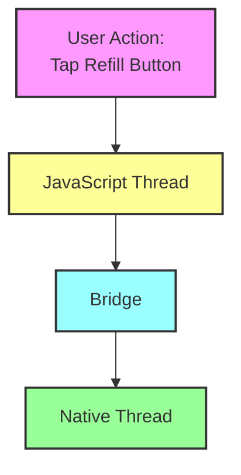

# React Native Architecture Diagram Exercise - Starter

## Instructions
Using this starter diagram, complete the React Native architecture flow for a pharmacy app's "Refill Prescription" feature. Add the missing components, connections, and annotations to show the complete data flow from user interaction to UI updates.

## Starter Diagram

## Requirements

1. Add the following components:
   - Event handlers in JavaScript
   - Data processing steps
   - Native module interactions
   - UI update process
   - Background operations

2. Show the following flows:
   - Event propagation
   - Data serialization/deserialization
   - Native API calls
   - UI render updates

3. Identify and mark:
   - Potential performance bottlenecks
   - Asynchronous operations
   - Thread interactions
   - Bridge communication points

4. Add annotations for:
   - Performance considerations
   - Threading implications
   - Batch update handling
   - Error scenarios

## Tips
- Use different shapes for different types of operations
- Use colors to distinguish between threads
- Add labels to explain key processes
- Show timing and sequencing with appropriate arrows
- Mark synchronous vs. asynchronous operations 