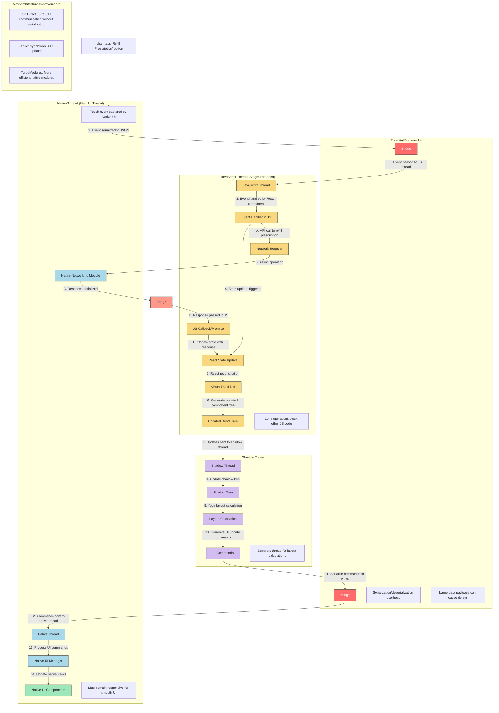

# Example React Native Architecture Flow Diagram

Below is an example mermaid diagram illustrating the flow of data in a React Native application when a user taps a button to refill a prescription. This diagram shows the key components of the React Native architecture and how data flows through the system.

## Key Components Explained

### User Interaction Flow
1. User taps a button on the screen
2. Native UI captures the touch event
3. Event is serialized and sent across the bridge to JavaScript
4. JavaScript event handler processes the event
5. State update triggers React reconciliation
6. Updated component tree is generated
7. Updates are sent to the shadow thread
8. Shadow tree is updated
9. Layout is calculated using Yoga
10. UI update commands are generated
11. Commands are serialized and sent across the bridge
12. Native thread receives and processes the commands
13. Native UI components are updated

### Asynchronous Operations
- API calls are initiated in JavaScript
- Native modules handle network requests
- Responses are serialized and sent back to JavaScript
- JavaScript callbacks/promises are resolved
- UI is updated with the response data

### Potential Bottlenecks
- **Bridge Serialization**: Converting complex objects to JSON and back
- **Large Data Payloads**: Sending large amounts of data across the bridge
- **JavaScript Thread Blocking**: Long-running operations can block the UI
- **Frequent Bridge Crossings**: Operations requiring many bridge communications

### New Architecture Improvements
- **JSI (JavaScript Interface)**: Direct communication between JavaScript and C++ without serialization
- **Fabric**: New rendering system with synchronous operations
- **TurboModules**: More efficient native modules
- **CodeGen**: Automatic generation of native code from JavaScript specifications

## Notes for Instructors

This diagram illustrates:
1. The complete flow of data from user interaction to UI update
2. The role of each thread in the React Native architecture
3. How asynchronous operations work alongside the main UI flow
4. Where potential performance bottlenecks exist
5. How the new architecture addresses these bottlenecks

When reviewing student diagrams, look for:
- Clear representation of the different threads
- Accurate depiction of the bridge and its serialization process
- Understanding of how layout calculations work
- Identification of potential performance bottlenecks
- Annotations explaining key processes
