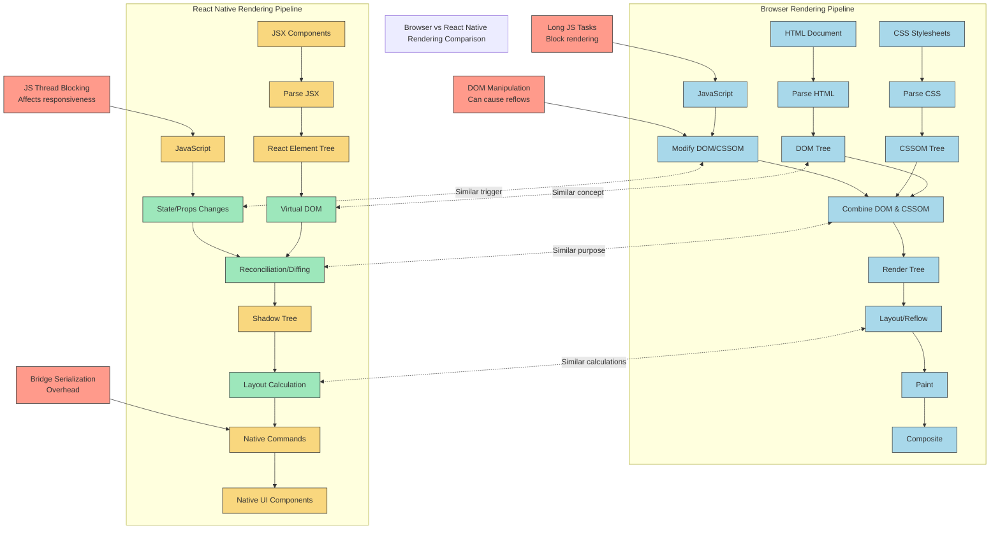

# Example Browser and React Native Rendering Comparison Diagram

Below is an example mermaid diagram illustrating the comparison between browser rendering and React Native rendering processes. This diagram shows the key steps in each pipeline and highlights the similarities and differences between them.

## Key Components Explained

### Browser Rendering Pipeline

1. **HTML Document → Parse HTML → DOM Tree**
   - Browser receives HTML and parses it into a tree structure
   - DOM (Document Object Model) represents the page structure
   - Performance impact: Large/complex DOMs slow down processing

2. **CSS Stylesheets → Parse CSS → CSSOM Tree**
   - Browser parses CSS into the CSS Object Model
   - CSSOM represents all styling information
   - Performance impact: Complex selectors increase parse time

3. **Combine DOM & CSSOM → Render Tree**
   - Browser combines DOM and CSSOM to create the Render Tree
   - Only includes visible elements with their styles
   - Performance impact: Style recalculation can be expensive

4. **Layout/Reflow → Paint → Composite**
   - Layout: Calculate size and position of each element
   - Paint: Fill in pixels for each element
   - Composite: Combine layers for final display
   - Performance impact: Layout is particularly expensive

5. **JavaScript → Modify DOM/CSSOM**
   - JavaScript can modify the DOM and styles
   - Changes trigger parts of the rendering pipeline again
   - Performance impact: Frequent modifications cause performance issues

### React Native Rendering Pipeline

1. **JSX Components → Parse JSX → React Element Tree**
   - JSX is transformed into React elements
   - Creates a tree of React elements
   - Performance impact: Complex component trees take longer to process

2. **React Element Tree → Virtual DOM → Reconciliation/Diffing**
   - Virtual DOM is a lightweight representation of the UI
   - Reconciliation compares previous and new Virtual DOM
   - Performance impact: Efficient diffing minimizes updates

3. **Reconciliation → Shadow Tree → Layout Calculation**
   - Shadow Tree is a C++ implementation of the UI hierarchy
   - Yoga engine calculates layout using Flexbox
   - Performance impact: Complex layouts require more calculation

4. **Layout → Native Commands → Native UI Components**
   - Generate commands to create/update native views
   - Commands cross the bridge to the native thread
   - Native components are updated
   - Performance impact: Bridge serialization adds overhead

5. **JavaScript → State/Props Changes**
   - JavaScript runs in a separate thread
   - State/props changes trigger reconciliation
   - Performance impact: JavaScript thread blocking affects responsiveness

## Similarities and Differences

### Key Similarities
- Both use a tree structure to represent UI (DOM vs Virtual DOM)
- Both perform layout calculations (Reflow vs Yoga)
- Both have a reconciliation process to determine what to update
- Both are affected by JavaScript performance

### Key Differences
- Browser renders to the DOM, React Native to native UI components
- Browser combines DOM and CSSOM, React Native uses props for styling
- Browser rendering happens in one thread, React Native uses multiple threads
- React Native has a bridge serialization overhead that browsers don't have

## Performance Considerations

### Browser Performance Bottlenecks
- DOM manipulation triggering reflows
- Blocking JavaScript execution
- Complex CSS selectors
- Large DOM trees

### React Native Performance Bottlenecks
- Bridge serialization overhead
- JavaScript thread blocking
- Complex component hierarchies
- Frequent re-renders

## Notes for Instructors

When reviewing student diagrams, look for:
- Clear representation of both pipelines
- Identification of key similarities and differences
- Understanding of performance implications
- Proper sequencing of steps in each pipeline
- Recognition of the multi-threaded nature of React Native
