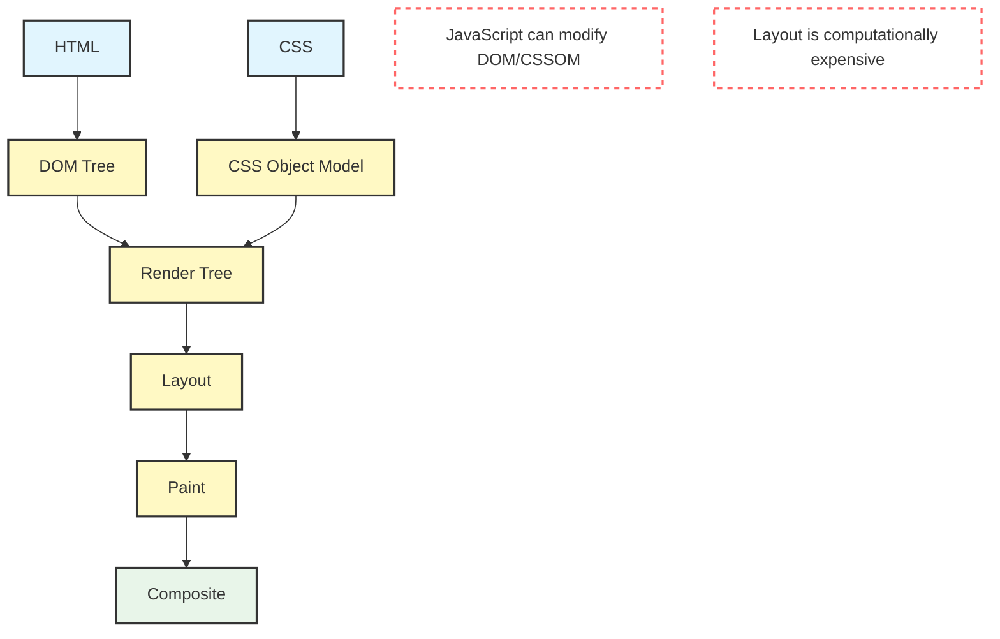
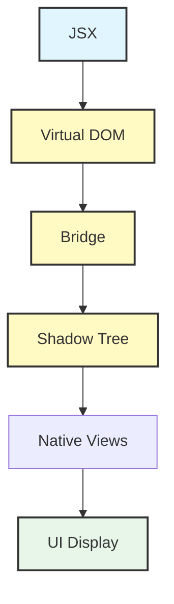
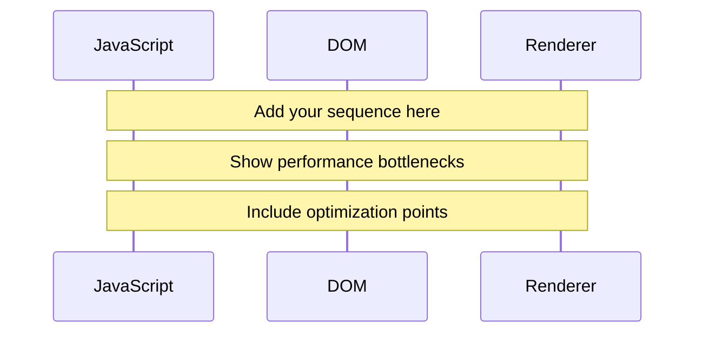
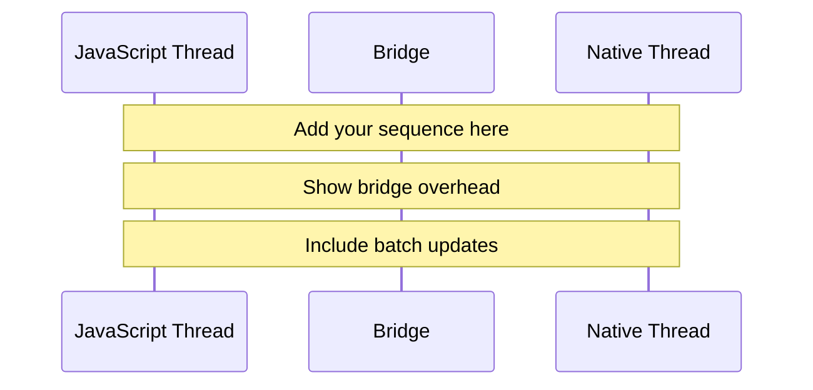

# Browser vs React Native Rendering Comparison Exercise

## Instructions for Instructors
This file contains the instructions and evaluation criteria for comparing browser rendering with React Native rendering. Use this content to create a Microsoft Whiteboard exercise that students will complete.

## Exercise Overview

### Scenario
You are a React Native developer explaining to your team how browser rendering concepts parallel React Native's rendering approach. Your task is to create comparative diagrams showing both rendering pipelines and analyze their similarities and differences.

### Time Allocation
- Total time: 45 minutes
- Diagram creation: 30 minutes
- Analysis: 15 minutes

## Part 1: Browser Rendering Pipeline

Create a Mermaid diagram showing the browser rendering pipeline:

### Required Components:
1. Input Processing (HTML/CSS)
2. Tree Construction (DOM/CSSOM)
3. Layout Calculation
4. Rendering Steps
5. Performance Considerations

## Part 2: React Native Rendering Pipeline

Create a parallel diagram showing React Native's rendering process:

### Required Components:
1. JSX Processing
2. Virtual DOM
3. Bridge Communication
4. Native Rendering
5. Performance Optimizations

## Part 3: Comparative Analysis

Create a table comparing key aspects:

| Aspect | Browser | React Native | Key Differences |
|--------|---------|--------------|----------------|
| Input Processing |  |  |  |
| Tree Construction |  |  |  |
| Layout Engine |  |  |  |
| Rendering Process |  |  |  |
| Performance Optimization |  |  |  |
| Threading Model |  |  |  |

## Part 4: Performance Implications

Analyze performance considerations for both approaches:

### Browser Performance

### React Native Performance

## Evaluation Criteria

### Technical Accuracy (40%)
- Correct rendering steps
- Accurate process flow
- Proper terminology
- Valid optimizations

### Diagram Clarity (30%)
- Clear visual organization
- Proper use of symbols
- Logical flow
- Effective annotations

### Analysis Quality (30%)
- Insightful comparisons
- Performance understanding
- Practical implications
- Technical depth

### Strong submissions should:
- Show clear understanding of both pipelines
- Identify key similarities and differences
- Include relevant performance considerations
- Demonstrate practical implications

### Weak submissions typically:
- Miss key rendering steps
- Oversimplify processes
- Ignore performance aspects
- Lack technical detail

## Additional Notes for Instructors

When creating the Microsoft Whiteboard:
- Provide template shapes for diagrams
- Include example performance annotations
- Add reference images of both pipelines
- Create dedicated areas for each part
- Include a legend for diagram symbols

## Submission Requirements
- Complete pipeline diagrams for both platforms
- Detailed comparative analysis
- Performance consideration notes
- Practical optimization suggestions
- Clear annotations and explanations