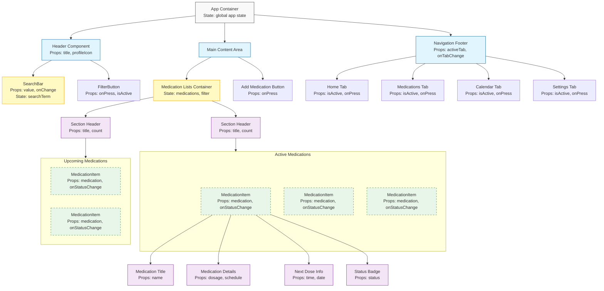

# Component Breakdown Exercise - Complete

## Completed Diagram

## Component Breakdown Analysis

### 1. Container Components (Manage State)
- **App Container**: Top-level component containing global state and main structure
- **Medication Lists Container**: Manages medications data and filtered views
- **SearchBar**: Manages input state and performs filtering

### 2. Reusable Components
- **MedicationItem**: Used multiple times to display each medication
- **StatusBadge**: Used to display various statuses (TAKEN, PENDING, SKIPPED)
- **SectionHeader**: Used for both Active and Upcoming sections
- **TabItem**: Used in navigation footer for each tab option

### 3. Presentational Components (Props Only)
- **Medication Title/Details/NextDose**: Display medication information
- **FilterButton**: Displays and triggers filters
- **AddButton**: Triggers add medication action

### 4. Prop Flow Analysis

#### Key Props
- **medication**: Object containing all medication data (passed to MedicationItem)
- **status**: String representing medication status (passed to StatusBadge)
- **onStatusChange**: Function to update medication status
- **onTabChange**: Function to navigate between app sections
- **onFilter**: Function to filter medications by category

#### State Management
- App-level state should include:
  - List of all medications
  - Active filter/search terms
  - Current tab selection
- Component-level state includes:
  - Search input value
  - Local UI states (expanded/collapsed sections)

### 5. Custom Hooks Opportunities
- **useMedicationFilter**: Manage filtering logic for medications
- **useMedicationStatus**: Handle status changes and updates
- **useSearchAndFilter**: Combine search and filter functionality

### 6. Performance Considerations
- MedicationItems should be memoized to prevent unnecessary rerenders
- Lists should implement virtualization for large datasets
- Status changes should update only the affected item

### 7. Proposed Component Structure
- Separate stateful container components from presentational components
- Use composition for complex components like MedicationItem
- Extract common UI patterns into reusable components
- Implement context for deeply nested components needing access to global state 