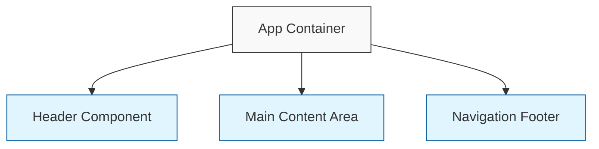

# Component Breakdown Exercise - Starter

## Instructions
Using this starter diagram, complete the component hierarchy for the medication tracking interface shown in the exercise. Add the missing components, relationships, and props to create a comprehensive component breakdown.

## Starter Diagram

## Requirements

1. Add the following components:
   - Search and filtering components
   - Medication list containers
   - Individual medication item components
   - Status indicators
   - Action buttons
   - List section headers

2. Show the following relationships:
   - Parent-child component hierarchy
   - Reusable components that appear multiple times
   - Component groupings that make logical sense

3. Identify and annotate:
   - Components that would need state
   - Components that would be purely presentational
   - Components that would need props passed down
   - Potential custom hooks

4. Add comments for:
   - Key props that would be passed to components
   - Where state would be managed
   - Reusability considerations
   - Performance considerations

## Tips
- Use different shapes or colors for different types of components
- Group related components together
- Focus on logical structure rather than visual layout
- Consider which components could be reused across the app
- Think about which components might need to maintain state

## Example Component Considerations
- The app has sections for active and upcoming medications
- Each medication has similar display information
- The search and filter controls appear at the top
- Status badges (TAKEN, PENDING, SKIPPED) have different appearances
- There appears to be an "ADD MEDICATION" button
- The interface includes a navigation footer

Don't forget to consider both presentational components (those that just display data) and container components (those that may manage state or fetch data).   