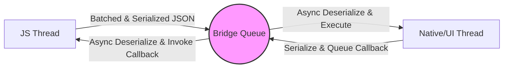

# **React Native Fundamentals**
## Core Concepts & Modern Architecture

**SpeedyMeds Training**

<!--
Presenter Notes:
*   **Overall Goal:** Equip learners with a foundational understanding of React Native, its advantages, core components, and the essential modern architecture (New Architecture) they will be using, particularly with Expo.
*   **Estimated Time:** 3-4 hours (flexible based on depth and exercise time)
*   **Target Audience:** Developers proficient in native Android/iOS or web development (React/Angular).
*   **Learning Paths:** Content designed for Instructor-Led, Self-Led, and Asynchronous paths. Callouts will guide learners based on path and background.
*   Welcome slide. Introduce the module and its objectives.
-->

---

## **1. Introduction to React Native**

*   Why was React Native created?
*   What problems does it solve?
*   Why is it a popular choice?

<!--
Presenter Notes:
Set the stage. Discuss the inherent challenges in mobile development that paved the way for cross-platform solutions like React Native.
-->

---

### **1.1. The Mobile Challenge & Cross-Platform Evolution**

#### **The Native Dilemma**

*   **Separate Codebases:** Swift/Obj-C (iOS) vs. Kotlin/Java (Android).
*   **Increased Cost & Time:** More resources, separate teams.
*   **Maintenance Complexity:** Updates, bug fixes, feature parity.
*   **Skill Specialization:** Need for platform-specific expertise.
*   **Logic Divergence:** Risk of inconsistencies.

<!--
Presenter Notes:
*   Explain the traditional native development approach.
*   Highlight the significant drawbacks (cost, time, complexity).
*   Reference [1], [[2](https://www.jetbrains.com/help/kotlin-multiplatform-dev/native-and-cross-platform.html)], [[3](https://themobilereality.com/blog/cross-platform-vs-native-app-development)] for details on native development challenges.
*   This sets up the motivation for cross-platform solutions.
-->

---

### **1.1. The Mobile Challenge & Cross-Platform Evolution**

#### **Early Cross-Platform Attempts (WebViews)**

*   **Concept:** Package web apps (HTML, CSS, JS) in a native container.
*   **Technology:** Displayed via platform's WebView component.
*   **Frameworks:** Apache Cordova (PhoneGap).
*   **Native Access:** Plugins bridged JS to native features.

<!--
Presenter Notes:
*   Introduce WebViews as an early solution.
*   Explain the core idea: web tech in a native shell.
*   Mention Cordova/PhoneGap as key examples [[6](https://moldstud.com/articles/p-phonegap-vs-cordova-mobile-development-architecture-guide)], [[7](https://codewave.com/insights/android-ios-cross-platform-app-development-frameworks/)].
*   **Historical Note:** PhoneGap (Nitobi, 2008) -> Acquired by Adobe (2011) -> Open-sourced core became Apache Cordova [[8](https://en.wikipedia.org/wiki/Apache_Cordova)].
-->

---

### **1.1. The Mobile Challenge & Cross-Platform Evolution**

#### **WebView Limitations**

*   **Performance:** Sluggishness, especially for complex UIs/animations [1].
*   **Look & Feel:** Often felt "web-like," not truly native [1].
*   **Native API Access:** Limited compared to native apps [[3](https://themobilereality.com/blog/cross-platform-vs-native-app-development)].
*   **User Experience:** Suboptimal due to performance/feel [[3](https://themobilereality.com/blog/cross-platform-vs-native-app-development)]. (e.g., Facebook's 2012 pivot away from HTML5 [[11](https://www.netguru.com/glossary/react-native)]).

<!--
Presenter Notes:
*   Discuss the shortcomings of WebView approaches.
*   Emphasize the performance bottlenecks and non-native feel.
*   Mention the limited access to the full spectrum of native APIs.
*   Use the Facebook example as a prominent case study [[11](https://www.netguru.com/glossary/react-native)].
*   These limitations created the need for a better solution.
-->

---

### **1.1. The Mobile Challenge & Cross-Platform Evolution**

#### **React Native as a Solution**

*   **Goal:** Efficiency of cross-platform *without* sacrificing native performance/UX [[12](https://reactnative.dev/docs/performance)].
*   **Approach:** Render *actual* native UI components, not WebViews [[12](https://reactnative.dev/docs/performance)].
*   **Target:** 60 FPS animations, native look & feel [[12](https://reactnative.dev/docs/performance)].

<!--
Presenter Notes:
*   Introduce React Native as Facebook's solution to these challenges [[11](https://www.netguru.com/glossary/react-native)].
*   Clearly state its core value proposition: combining cross-platform efficiency with native quality.
*   Emphasize the key difference: rendering native components.
-->

---

### **1.1. The Mobile Challenge & Cross-Platform Evolution**

#### **Trade-offs Comparison**

| Feature                 | Native (iOS/Android)             | WebView (e.g., Cordova)        | React Native                     |
| :---------------------- | :------------------------------- | :----------------------------- | :------------------------------- |
| **Dev Cost/Time**       | High (Separate Codebases) [1]    | Lower (Shared Web Code) [[5](https://selleo.com/blog/native-development-vs-cross-platform)]    | Medium (High Code Sharing) [[5](https://selleo.com/blog/native-development-vs-cross-platform)]   |
| **Performance**         | Optimal (Direct Access) [[3](https://themobilereality.com/blog/cross-platform-vs-native-app-development)]      | Often Sub-optimal [[3](https://themobilereality.com/blog/cross-platform-vs-native-app-development)]          | Near-Native (New Arch) [1]       |
| **UI/UX (Native Feel)** | Excellent (Platform Standard) [[3](https://themobilereality.com/blog/cross-platform-vs-native-app-development)] | Challenging (Web Render) [[3](https://themobilereality.com/blog/cross-platform-vs-native-app-development)]   | Excellent (Native Components) [[12](https://reactnative.dev/docs/performance)] |
| **Native API Access**   | Full [[2](https://www.jetbrains.com/help/kotlin-multiplatform-dev/native-and-cross-platform.html)]                         | Limited (Plugins) [[3](https://themobilereality.com/blog/cross-platform-vs-native-app-development)]          | Extensive (New Arch) [[13](https://reactnative.dev/)]       |
| **Code Sharing**        | None                             | High (HTML, CSS, JS)           | Very High (JS/React Logic) [[14](https://mobidev.biz/blog/react-native-app-development-guide)]  |
| **Maintenance**         | Complex (Two Codebases) [1]      | Simpler (Single Web Code) [[5](https://selleo.com/blog/native-development-vs-cross-platform)]  | Simpler (Mostly Single) [[14](https://mobidev.biz/blog/react-native-app-development-guide)]     |

<!--
Presenter Notes:
*   Use this table to visually summarize the comparison.
*   Walk through each row, highlighting where React Native fits.
*   Emphasize that React Native aims for the "best of both worlds" regarding performance, UX, and development efficiency.
*   Understanding this evolution is key to appreciating RN's design goals.
-->

---

### **1.2. Why Choose React Native?**

*   **Code Sharing & Efficiency:** Write once (mostly), deploy on iOS & Android [[5](https://selleo.com/blog/native-development-vs-cross-platform)], [1]. (Note: 100% sharing often unrealistic/undesirable [[16](https://shopify.engineering/five-years-of-react-native-at-shopify)]).
*   **Developer Experience (DX):**
    *   Leverage React knowledge [[11](https://www.netguru.com/glossary/react-native)].
    *   Fast Refresh for rapid iteration [[14](https://mobidev.biz/blog/react-native-app-development-guide)].
    *   Access to JS ecosystem (npm) [[12](https://reactnative.dev/docs/performance)].
*   **Native Capabilities:** Renders *actual* native UI components (\<View\> -> UIView/ViewGroup) [[12](https://reactnative.dev/docs/performance)]. Access platform APIs via Native Modules [[13](https://reactnative.dev/)].
*   **Performance:** Designed for 60 FPS [[12](https://reactnative.dev/docs/performance)]. New Architecture significantly improves performance [[13](https://reactnative.dev/)].
*   **Community & Backing:** Meta, Microsoft, Shopify, Expo, large global community [[13](https://reactnative.dev/)].

<!--
Presenter Notes:
*   Summarize the key benefits.
*   **Code Sharing:** Mention Shopify's success story [[16](https://shopify.engineering/five-years-of-react-native-at-shopify)] but also temper expectations about 100% sharing.
*   **DX:** Explain Fast Refresh (evolution of Hot Reloading) and its impact on productivity.
*   **Native Capabilities:** Reiterate the core difference from WebViews – rendering real native elements.
*   **Performance:** Acknowledge historical context but emphasize improvements with the New Architecture. Avoid definitive comparisons with Flutter as it's complex [1].
*   **Community:** Highlight the strong backing and ecosystem.
-->

---

### **1.3. Core Idea: JavaScript Controlling Native**

*   **Declarative UI:** Use React components, JSX, props, state [[17](https://reactnative.dev/docs/tutorial)]. Describe *what* the UI should look like.
*   **"Translation" Layer:** React Native translates JS/React descriptions into native instructions [[17](https://reactnative.dev/docs/tutorial)]. (JS = Remote Control, Native UI = TV).
*   **Core Components as Bridges:** Built-in components (\<View\>, \<Text\>, \<Image\>) map directly to native UI elements (UIView, TextView, etc.) [[18](https://micheal.dev/blog/learning-react-native-basics/)], [[36](https://reactnative.dev/docs/components-and-apis)].
*   **Communication Mechanism:** How JS talks to Native (Legacy: Bridge, Modern: JSI) - *Crucial concept explored next!*

<!--
Presenter Notes:
*   Explain the fundamental paradigm: using familiar React concepts to drive native UI.
*   Use the "remote control" analogy.
*   Introduce Core Components as the tangible link between JS and Native. Provide examples:
    *   `<View>` -> `UIView` / `android.view.ViewGroup` [[18](https://micheal.dev/blog/learning-react-native-basics/)]
    *   `<Text>` -> `UITextView` / `android.widget.TextView` [[18](https://micheal.dev/blog/learning-react-native-basics/)]
    *   `<Image>` -> `UIImageView` / `android.widget.ImageView` [[18](https://micheal.dev/blog/learning-react-native-basics/)]
*   Set the stage for the next section on the communication architecture (Bridge vs. JSI).
-->

---

### **Callouts: Bridging Backgrounds**

**For Web Developers (React/Angular):**

*   **Familiar:** React concepts (Components, Props, State, Hooks, JSX), JS, npm [[17](https://reactnative.dev/docs/tutorial)], [[12](https://reactnative.dev/docs/performance)]. Styling via JS objects (somewhat familiar) [[39](https://www.newline.co/30-days-of-react-native/day-04-styles)].
*   **Different:**
    *   Target: Native UI elements, not DOM [[11](https://www.netguru.com/glossary/react-native)]. (\<View\> != \<div\>)
    *   Styling: `StyleSheet.create()`, Flexbox *only*, no cascade (except nested `<Text>`), different properties [[39](https://www.newline.co/30-days-of-react-native/day-04-styles)].
    *   Navigation: Stack/Tab/Drawer (React Navigation), not browser routing [[23](https://hygraph.com/blog/react-vs-react-native)].
    *   Platform APIs: More direct hardware access (Camera, GPS) [[23](https://hygraph.com/blog/react-vs-react-native)].

**For Native Developers (Android/iOS):**

*   **Familiar:** Renders native UI components (UIView, TextView), aims for native look/feel/performance [[18](https://micheal.dev/blog/learning-react-native-basics/)], [[12](https://reactnative.dev/docs/performance)]. Can write native modules.
*   **Different:**
    *   Language/Paradigm: JS, React's declarative model [[17](https://reactnative.dev/docs/tutorial)].
    *   Layout: Flexbox via JS styles, not XML/Auto Layout/SwiftUI [[24](https://reactnative.dev/docs/intro-react)].
    *   Lifecycle: React component lifecycle (`useEffect`), not Activity/ViewController lifecycle [[44](https://dev.to/amazonappdev/an-android-developers-guide-to-react-native-j66)].
    *   Navigation: JS libraries (React Navigation), not Intents/Segues [[42](https://reactnative.dev/docs/navigation)].
    *   Styling: `StyleSheet.create()`, not XML attributes/platform styles [[39](https://www.newline.co/30-days-of-react-native/day-04-styles)].

<!--
Presenter Notes:
*   Use these callouts to specifically address learners based on their background.
*   **Instructor-Led:** Pause here to discuss these differences and answer questions based on the audience's experience.
*   **Self-Led/Async:** Encourage learners to reflect on how their existing knowledge maps and where the key differences lie.
-->

---

## **2. How React Native Works: From Bridge to JSI**

Understanding the communication layer between JavaScript and Native is key to performance and capabilities.

*   **The Old Way:** Legacy Bridge
*   **The New Way:** New Architecture (JSI, Fabric, TurboModules)

<!--
Presenter Notes:
*   Introduce the core topic of this section: the evolution of RN's internal architecture.
*   Frame it as a transition from the "Old Way" (Bridge) to the "New Way" (New Architecture).
-->

---

### **2.1. The Old Way: The Legacy Bridge (Conceptual)**

*   **Central Communication Channel:** Connected JS Thread and Native/UI Thread [[25](https://dev.to/rushi-patel/decoding-the-new-architecture-of-react-native-4hd5)].
*   **Key Threads:**
    1.  **JS Thread:** JS execution, React logic, business logic [[12](https://reactnative.dev/docs/performance)].
    2.  **Native/UI Thread:** Native UI rendering, gestures, native module code [[12](https://reactnative.dev/docs/performance)].
    3.  **Native Modules Thread (Optional):** For specific modules.
    4.  **Shadow Thread:** Background layout calculations (Yoga) [[46](https://dev.to/hellonehha/react-native-new-architecture-1hao)].

<!--
Presenter Notes:
*   Explain the role of the Bridge in the original architecture.
*   Briefly describe the main threads involved. Emphasize the separation between the JS world and the Native world.
-->

---

### **2.1. The Old Way: The Legacy Bridge (Conceptual)**

#### **Communication Flow (Asynchronous & Serialized)**

1.  **JS -> Native:** Instructions batched [[12](https://reactnative.dev/docs/performance)].
2.  **Serialization:** Batch serialized to JSON string [[12](https://reactnative.dev/docs/performance)].
3.  **Transmission:** JSON sent *asynchronously* across Bridge.
4.  **Native Execution:** Native side deserializes JSON, executes updates (UI thread) [[12](https://reactnative.dev/docs/performance)].
5.  **Native -> JS:** Data serialized to JSON, sent *asynchronously* back, invokes JS callback.

<!--
Presenter Notes:
*   Detail the steps involved in communication across the Bridge.
*   **Crucially emphasize:** Asynchronous nature and JSON serialization/deserialization [[12](https://reactnative.dev/docs/performance)], [[25](https://dev.to/rushi-patel/decoding-the-new-architecture-of-react-native-4hd5)].
-->

---

### **2.1. The Old Way: The Legacy Bridge (Conceptual)**

#### **Diagram: Legacy Bridge Architecture Flow**



<!--
Presenter Notes:
*   Use the diagram to visually represent the indirect, asynchronous, and serialized communication path.
*   Point out the Bridge Queue as the intermediary and the serialization/deserialization steps.
-->

---

### **2.1. The Old Way: The Legacy Bridge (Conceptual)**

#### **Limitations of the Bridge**

*   **Asynchronicity:** Inefficient/impossible sync operations (e.g., getting layout before render) [[25](https://dev.to/rushi-patel/decoding-the-new-architecture-of-react-native-4hd5)]. Potential UI inconsistencies [[53](https://reactnative.dev/docs/communication-ios)].
*   **Serialization Overhead:** JSON conversion consumed CPU/memory, bottleneck for frequent/large data [[12](https://reactnative.dev/docs/performance)].
*   **JS Thread Bottlenecks:** Heavy JS logic blocked the *single* JS thread, leading to unresponsive UI, jank, delayed touches [[12](https://reactnative.dev/docs/performance)]. (Worse in dev mode).
*   **Eager Native Module Loading:** All modules loaded at startup -> slower start time, higher memory use [[25](https://dev.to/rushi-patel/decoding-the-new-architecture-of-react-native-4hd5)].
*   **Concurrency Limitations:** Hindered leveraging multi-core CPUs and modern React concurrent features [[25](https://dev.to/rushi-patel/decoding-the-new-architecture-of-react-native-4hd5)].

<!--
Presenter Notes:
*   Clearly list the major drawbacks of the Bridge architecture.
*   Explain *why* each limitation was problematic (e.g., serialization overhead impacting performance, JS thread blocking causing UI jank).
*   These limitations were the driving force behind the New Architecture.
-->

---

### **2.2. The New Way: The New Architecture**

*   **Goal:** Redesign core internals for better performance, capabilities, and alignment with modern React [[25](https://dev.to/rushi-patel/decoding-the-new-architecture-of-react-native-4hd5)]. (Multi-year effort started ~2018).
*   **Status:** **Enabled by default** in RN 0.76+ and **Expo SDK 52+** [[25](https://dev.to/rushi-patel/decoding-the-new-architecture-of-react-native-4hd5)], [[54](https://www.reddit.com/r/expo/comments/1is2e6q/downgrade_52_to_51/)]. *(You are using it!)*

#### **Key Components:**

1.  **JSI (JavaScript Interface):** Replaces the Bridge.
2.  **Fabric:** New rendering system.
3.  **TurboModules:** New Native Module system.
4.  **CodeGen:** Build-time tool for type safety.

<!--
Presenter Notes:
*   Introduce the New Architecture as the solution to the Bridge's limitations.
*   Emphasize that it's the **default** in modern RN/Expo projects, making this knowledge directly relevant.
*   List the four key components that will be discussed.
-->

---

### **2.3. JSI (JavaScript Interface): Direct Communication**

*   **Core Concept:** Lightweight C++ API providing a *direct* interface to the JS engine (Hermes, V8) [[25](https://dev.to/rushi-patel/decoding-the-new-architecture-of-react-native-4hd5)]. Replaces the async, JSON-based Bridge.
*   **Mechanism:** Allows JS and Native to hold **direct references** to objects in the other realm [[26](https://reactnative.dev/architecture/landing-page)].
    *   JS gets reference to C++ "Host Object" [[57](https://www.sharepointeurope.com/deep-dive-into-react-natives-new-architecture-jsi-turbomodules-fabric-yoga/)].
    *   JS invokes methods *directly* on the C++ reference.
    *   Native can hold references to JS functions/objects and invoke them directly.
*   **Bypasses the Bridge entirely.**

<!--
Presenter Notes:
*   Explain JSI as the cornerstone of the New Architecture.
*   Focus on the **direct reference** concept – this is the key difference from the Bridge's message passing.
*   Mention "Host Objects" as the term for C++ objects exposed to JS [[57](https://www.sharepointeurope.com/deep-dive-into-react-natives-new-architecture-jsi-turbomodules-fabric-yoga/)].
-->

---

### **2.3. JSI (JavaScript Interface): Direct Communication**

#### **Benefits of JSI**

*   **Eliminates Serialization Overhead:** Direct memory access/method invocation -> much faster communication [[25](https://dev.to/rushi-patel/decoding-the-new-architecture-of-react-native-4hd5)]. (e.g., `react-native-vision-camera` handling 1GB/s [[26](https://reactnative.dev/architecture/landing-page)]). Significant latency reduction [[28](https://dev.to/joaoalissonsilva/the-new-react-native-architecture-1jn9)].
*   **Enables Synchronous Communication:** Crucial for tasks like getting native layout dimensions *before* rendering [[25](https://dev.to/rushi-patel/decoding-the-new-architecture-of-react-native-4hd5)]. Prevents layout jumps.
*   **JS Engine Agnostic:** Abstraction layer allows RN to work with Hermes (default), V8, etc. [[51](https://github.com/anisurrahman072/React-Native-Advanced-Guide/blob/master/New-Architecture/New-Architecture-in-depth.md)].

#### **Analogy:**

*   **Bridge:** Sending letters via postal mail (delay, overhead).
*   **JSI:** Direct phone line (instant calls/method invocation).

<!--
Presenter Notes:
*   Highlight the major advantages stemming from JSI's direct communication model.
*   Emphasize the elimination of serialization overhead and the ability to perform synchronous calls.
*   Use the analogy to make the concept more intuitive.
*   **Instructor Note:** While JSI enables sync calls, caution against overuse. Long-running sync native calls *can still block the JS thread*. The benefit is having the *option* for efficiency when needed.
-->

---

### **2.3. JSI (JavaScript Interface): Direct Communication**

#### **Diagram: Bridge vs. JSI Communication Flow**

```mermaid
graph TD
    subgraph Legacy Bridge Communication
        direction LR
        JS1[JS Thread] -- 1. Serialize Data --> B1((Bridge Queue));
        B1 -- 2. Async Transfer --> B2((Bridge Queue));
        B2 -- 3. Deserialize Data --> N1[Native Thread];
        N1 -- 4. Process & Serialize Result --> B2;
        B2 -- 5. Async Transfer --> B1;
        B1 -- 6. Deserialize Result --> JS1;
        style B1 fill:#f9f,stroke:#333,stroke-width:2px
        style B2 fill:#f9f,stroke:#333,stroke-width:2px
    end
    subgraph New Architecture (JSI) Communication
        direction LR
        JS2[JS Thread] <-.-> |1. Direct C++ Method Invocation (Sync/Async)| JSI[JSI (C++ Layer)];
        JSI <-.-> |2. Direct Native Method Execution| N2[Native Thread];
        style JSI fill:#ccf,stroke:#333,stroke-width:2px
    end
```

<!--
Presenter Notes:
*   Visually contrast the two models using the diagram.
*   Point out the removal of the Bridge queue and serialization steps in the JSI model.
*   Emphasize the direct interaction via the C++ JSI layer.
-->

---

### **2.4. Fabric: The Modern Renderer**

*   **What:** React Native's new rendering system [[25](https://dev.to/rushi-patel/decoding-the-new-architecture-of-react-native-4hd5)].
*   **Built On:** Leverages JSI for communication [[31](https://reactnative.dev/architecture/fabric-renderer)].
*   **Core Principles:**
    *   **Shared C++ Core:** More rendering logic (layout, view flattening) in C++ -> cross-platform consistency & performance [[25](https://dev.to/rushi-patel/decoding-the-new-architecture-of-react-native-4hd5)].
    *   **JSI Integration:** Efficient updates, synchronous operations [[31](https://reactnative.dev/architecture/fabric-renderer)].
    *   **Improved Interoperability:** Better integration with native UI systems.

<!--
Presenter Notes:
*   Introduce Fabric as the replacement for the legacy UI manager.
*   Explain its key design principles, emphasizing the shared C++ core and tight JSI integration.
-->

---

### **2.4. Fabric: The Modern Renderer**

#### **Benefits of Fabric**

*   **Performance & Responsiveness:** More efficient UI updates, synchronous layout/rendering prevents visual "jumps" [[31](https://reactnative.dev/architecture/fabric-renderer)]. Smoother animations/interactions [[28](https://dev.to/joaoalissonsilva/the-new-react-native-architecture-1jn9)].
*   **React 18+ Concurrent Features:** Unlocks modern React capabilities in RN [[25](https://dev.to/rushi-patel/decoding-the-new-architecture-of-react-native-4hd5)]:
    *   Concurrent Rendering (work on multiple updates simultaneously).
    *   Transitions (`useTransition` for prioritizing updates).
    *   Suspense for Data Fetching (better loading state handling).
*   **Lazy Initialization of Host Components:** Native views (\<View\>, \<Text\>) initialized only when needed -> faster app startup [[31](https://reactnative.dev/architecture/fabric-renderer)].

<!--
Presenter Notes:
*   Detail the advantages of Fabric.
*   Focus on performance improvements (smoother UI, fewer visual glitches).
*   Highlight the crucial role Fabric plays in enabling React 18+ concurrent features within React Native.
*   Mention lazy initialization as a contributor to faster startup.
-->

---

### **2.5. TurboModules: Efficient Native Modules**

*   **What:** New system for creating and interacting with Native Modules [[25](https://dev.to/rushi-patel/decoding-the-new-architecture-of-react-native-4hd5)].
*   **Built On:** Leverages **JSI** [[32](https://reactnative.dev/docs/turbo-native-modules-introduction)].
*   **Mechanism:** JS gets a direct JSI reference to the native module instance -> call methods directly (sync/async) without Bridge overhead [[32](https://reactnative.dev/docs/turbo-native-modules-introduction)].

#### **Key Benefit: Lazy Loading**

*   **Old Way (Eager):** All modules loaded at app startup.
*   **New Way (Lazy):** Module loaded/initialized only on *first access* from JS [[25](https://dev.to/rushi-patel/decoding-the-new-architecture-of-react-native-4hd5)].
*   **Result:** Dramatically improved app startup time & reduced initial memory footprint [[25](https://dev.to/rushi-patel/decoding-the-new-architecture-of-react-native-4hd5)].

<!--
Presenter Notes:
*   Introduce TurboModules as the replacement for the legacy Native Module system.
*   Explain that they also rely on JSI for direct communication.
*   Emphasize **lazy loading** as the most significant benefit and explain how it improves startup performance compared to the old eager loading approach.
-->

---

### **2.5. TurboModules: Efficient Native Modules**

#### **CodeGen's Role in Type Safety**

*   **Problem:** Dynamically typed JS vs. statically typed Native (Java/Kotlin/ObjC/Swift/C++) can cause runtime type errors.
*   **Solution: CodeGen** [[25](https://dev.to/rushi-patel/decoding-the-new-architecture-of-react-native-4hd5)]
    1.  **Specification:** Define module interface (methods, params, types) in JS (TypeScript/Flow) [[32](https://reactnative.dev/docs/turbo-native-modules-introduction)]. *Single source of truth.*
    2.  **Generation:** Build tool reads the spec.
    3.  **Scaffolding:** Auto-generates C++ JSI interface & native boilerplate (Java/ObjC++) ensuring type-safe communication [[32](https://reactnative.dev/docs/turbo-native-modules-introduction)].
*   **Benefits:** Reduces boilerplate, enforces type safety, more robust/efficient native module development [[32](https://reactnative.dev/docs/turbo-native-modules-introduction)].

<!--
Presenter Notes:
*   Explain the challenge of type safety across the JS/Native boundary.
*   Introduce CodeGen as the tool that addresses this.
*   Describe the workflow: define spec in TS/Flow -> CodeGen generates bridging code.
*   Highlight the benefits: less manual work, fewer type errors.
-->

---

### **2.6. Bridgeless Mode: The Final Step**

*   **Context:** JSI/Fabric/TurboModules remove the *need* for the Bridge, but it might still initialize for backward compatibility (timers, events, errors) [[49](https://github.com/reactwg/react-native-new-architecture/discussions/154)].
*   **Bridgeless Mode:** Experimental feature (RN ~0.73+) that **completely disables legacy Bridge initialization** [[48](https://www.spritle.com/blog/react-native-0-76-unleashed-bridgeless-architecture-redefines-app-speed/)], [[49](https://github.com/reactwg/react-native-new-architecture/discussions/154)].
*   **Interop Layers:** Allow TurboModules/Fabric to work with legacy modules/components even without the Bridge [[49](https://github.com/reactwg/react-native-new-architecture/discussions/154)], [[58](https://reactnative.dev/blog/2023/12/06/0.73-debugging-improvements-stable-symlinks)].
*   **Goal:** Remove final remnants/overhead of the old architecture, potential further startup improvements [[50](https://www.callstack.com/blog/experiment-with-new-architecture-of-react-native)].
*   **Status:** Ecosystem adoption ongoing [[60](https://www.youtube.com/watch?v=K5HBIKAjZ4U)]. Focus for now is understanding JSI/Fabric/TurboModules (the core you're using).

<!--
Presenter Notes:
*   Explain what Bridgeless mode is – the final step in removing the legacy Bridge entirely.
*   Mention the Interop Layers that facilitate this transition.
*   Clarify that while it's the ultimate goal, full ecosystem adoption is still in progress.
*   Reiterate that understanding JSI, Fabric, and TurboModules is the main takeaway for now.
*   **Optional Deep Dive Callout:** Explain how JSI uses C++ Host Objects (`facebook::jsi::HostObject`) and pointers/references to allow direct method calls, bypassing serialization. Link to official docs [[51](https://github.com/anisurrahman072/React-Native-Advanced-Guide/blob/master/New-Architecture/New-Architecture-in-depth.md)], [[52](https://reactnative.dev/architecture/overview)]. ([https://reactnative.dev/docs/architecture-overview](https://reactnative.dev/docs/architecture-overview))
-->

---

### **Architecture Comparison: Legacy vs. New**

| Limitation                  | Description                               | Primary Solution(s) | How it Solves                                                                 |
| :-------------------------- | :---------------------------------------- | :------------------ | :---------------------------------------------------------------------------- |
| **Serialization Overhead**  | Slow JSON conversion between JS/Native [[25](https://dev.to/rushi-patel/decoding-the-new-architecture-of-react-native-4hd5)] | **JSI**             | Direct C++ calls/memory access, no serialization needed [[25](https://dev.to/rushi-patel/decoding-the-new-architecture-of-react-native-4hd5)].                 |
| **Asynchronous-Only Calls** | Bridge was inherently async [[25](https://dev.to/rushi-patel/decoding-the-new-architecture-of-react-native-4hd5)]          | **JSI**             | Allows direct *synchronous* calls when needed [[25](https://dev.to/rushi-patel/decoding-the-new-architecture-of-react-native-4hd5)].                           |
| **Eager Module Loading**    | All modules loaded at startup [[25](https://dev.to/rushi-patel/decoding-the-new-architecture-of-react-native-4hd5)]        | **TurboModules**    | Lazy loading: modules load only on first access [[25](https://dev.to/rushi-patel/decoding-the-new-architecture-of-react-native-4hd5)].                         |
| **JS Thread Blocking/Jank** | Heavy JS blocked thread & UI updates [[25](https://dev.to/rushi-patel/decoding-the-new-architecture-of-react-native-4hd5)] | **Fabric** & **JSI**  | Fabric enables concurrent rendering; JSI allows faster/sync calls [[25](https://dev.to/rushi-patel/decoding-the-new-architecture-of-react-native-4hd5)].        |
| **Concurrency Limitations** | Hindered modern React features [[25](https://dev.to/rushi-patel/decoding-the-new-architecture-of-react-native-4hd5)]       | **Fabric**          | Designed to support React 18 concurrent features (Transitions, Suspense) [[26](https://reactnative.dev/architecture/landing-page)]. |

<!--
Presenter Notes:
*   Use this table to explicitly connect the problems of the old architecture to the solutions provided by the new components.
*   Reinforce that the New Architecture is a fundamental redesign, not just incremental improvements.
*   Mention the Interop Layers [[49](https://github.com/reactwg/react-native-new-architecture/discussions/154)] facilitating gradual ecosystem transition [[25](https://dev.to/rushi-patel/decoding-the-new-architecture-of-react-native-4hd5)], [[26](https://reactnative.dev/architecture/landing-page)].
-->

---

### **Exercise: Architecture Matching Quiz**

**Instructions:** Match the Legacy Limitation (Column A) with the New Architecture Solution (Column B).

**(Use Microsoft Forms for interactive quiz)**

**Column A: Legacy Limitation**
1.  Slow data transfer (JSON conversion).
2.  Slow startup (all modules loaded).
3.  Couldn't get native result synchronously.
4.  JS work froze UI animations.

**Column B: New Architecture Solution**
a) Fabric
b) JSI
c) TurboModules

<!--
Presenter Notes:
*   **Answers:** 1-b, 2-c, 3-b, 4-a/b
*   **Themed Framing (SpeedyMeds):**
    1.  Looking up interactions (large data) was sluggish (Serialization Overhead) -> **JSI**
    2.  App slow to open (Barcode, GPS, Biometrics loaded at once) (Eager Loading) -> **TurboModules**
    3.  Checking real-time stock required async wait (Async-only Calls) -> **JSI**
    4.  Scrolling past orders stuttered during profile processing (JS Thread Blocking) -> **Fabric/JSI**
*   Run this as an interactive quiz using MS Forms or similar. Use the SpeedyMeds framing to make it more engaging.
-->

---

## **3. Working with the Modern Architecture**

Practical implications for developers using modern React Native with Expo.

*   Why does this matter?
*   Performance Considerations
*   Debugging Implications
*   Expo's Role

<!--
Presenter Notes:
Transition from the "how it works" to "why you should care" as a developer.
-->

---

### **3.1. Why This Matters For You**

*   **You're Already Using It!** (RN 0.76+, Expo SDK 52+) [[25](https://dev.to/rushi-patel/decoding-the-new-architecture-of-react-native-4hd5)], [[54](https://www.reddit.com/r/expo/comments/1is2e6q/downgrade_52_to_51/)].
*   **Performance Awareness:** Understand *why* things are faster:
    *   Smoother Lists/Animations (`FlatList` in SpeedyMeds) -> Fabric's efficiency [[28](https://dev.to/joaoalissonsilva/the-new-react-native-architecture-1jn9)].
    *   Faster App Startup -> TurboModules lazy loading [[25](https://dev.to/rushi-patel/decoding-the-new-architecture-of-react-native-4hd5)].
    *   Quicker Native Interactions (Camera Scan, Biometrics) -> JSI's direct path [[25](https://dev.to/rushi-patel/decoding-the-new-architecture-of-react-native-4hd5)].
*   **Debugging Context:** Mental model helps diagnose issues (e.g., sync JSI call blocking? Concurrent rendering glitch?) [[26](https://reactnative.dev/architecture/landing-page)].
*   **Leveraging Modern React:** Enables React 18+ features (`useTransition`, Suspense) via Fabric [[25](https://dev.to/rushi-patel/decoding-the-new-architecture-of-react-native-4hd5)].
*   **Ecosystem Compatibility:** Check library compatibility (TurboModules/Fabric vs. Bridge) using tools like React Native Directory [[55](https://docs.expo.dev/guides/new-architecture/)].

<!--
Presenter Notes:
*   Connect the architectural concepts directly to developer experience and app outcomes.
*   Use SpeedyMeds examples to make the benefits tangible.
*   Emphasize the importance of checking library compatibility in the New Architecture era.
-->

---

### **3.2. Performance Considerations (Conceptual)**

*   **Startup Time (TurboModules):** Lazy loading = major win [[25](https://dev.to/rushi-patel/decoding-the-new-architecture-of-react-native-4hd5)].
*   **UI Responsiveness (Fabric):** Concurrent rendering -> less blocking, smoother UI/animations, especially with complex updates or large data [[25](https://dev.to/rushi-patel/decoding-the-new-architecture-of-react-native-4hd5)], [[28](https://dev.to/joaoalissonsilva/the-new-react-native-architecture-1jn9)]. (Contrast with old JS thread freezing UI [[12](https://reactnative.dev/docs/performance)]).
*   **Native Call Efficiency (JSI):** Reduced overhead for frequent JS <-> Native communication -> less CPU usage, faster responses [[25](https://dev.to/rushi-patel/decoding-the-new-architecture-of-react-native-4hd5)].

*(Note: Actual performance still depends on app code quality, but New Architecture removes inherent bottlenecks [[30](https://dev.to/anishamalde/how-does-react-natives-new-architecture-affect-performance-1ioe)].)*

<!--
Presenter Notes:
*   Summarize the key performance advantages conceptually.
*   Reiterate the specific contribution of each component (TurboModules -> Startup, Fabric -> UI Responsiveness, JSI -> Call Efficiency).
*   Add the caveat that good code practices are still essential.
-->

---

### **3.3. Debugging in the New Era (Conceptual)**

*   **Improved Tooling:**
    *   Hermes engine debugging improvements.
    *   New experimental JS Debugger (via Dev Menu) aiming to replace Flipper for JS [[58](https://reactnative.dev/blog/2023/12/06/0.73-debugging-improvements-stable-symlinks)].
    *   Better `console.log` capture early in lifecycle [[58](https://reactnative.dev/blog/2023/12/06/0.73-debugging-improvements-stable-symlinks)].
*   **Conceptual Relevance:** Understanding sync JSI calls or concurrent rendering helps diagnose certain bugs (e.g., unexpected delays, visual glitches) [[26](https://reactnative.dev/architecture/landing-page)]. *(Specific tools covered later).*

<!--
Presenter Notes:
*   Briefly touch upon how debugging is evolving.
*   Mention the new experimental debugger.
*   Explain how architectural knowledge provides context for troubleshooting, even if not debugging C++ directly.
-->

---

### **3.4. Expo & The New Architecture**

Expo simplifies using the New Architecture:

*   **Enabled by Default:** `npx create-expo-app` (SDK 52+) sets it up automatically [[54](https://www.reddit.com/r/expo/comments/1is2e6q/downgrade_52_to_51/)]. (`"newArchEnabled": true` in `app.json`/`app.config.js`).
*   **Opting Out:** Possible (`newArchEnabled: false` + new dev build) for incompatible libraries, but use as temporary workaround [[54](https://www.reddit.com/r/expo/comments/1is2e6q/downgrade_52_to_51/)].
*   **Compatibility Check (`expo-doctor`):** `npx expo-doctor` validates dependencies against React Native Directory for New Arch issues [[55](https://docs.expo.dev/guides/new-architecture/)], [[63](https://docs.expo.dev/develop/tools/)]. (Configurable in `package.json`).
*   **Expo Modules Compatibility:** Modules built with `expo-modules-core` are compatible out-of-the-box [[55](https://docs.expo.dev/guides/new-architecture/)].

<!--
Presenter Notes:
*   Highlight Expo's role in managing the transition.
*   Show the `app.json` configuration key.
```json
// app.json / app.config.js
{
  "expo": {
    "name": "my-speedy-meds-app",
    "slug": "my-speedy-meds-app",
    //... other config
    "android": { /*...*/ },
    "ios": { /*...*/ },
    "newArchEnabled": true // This enables the New Architecture
  }
}
```
*   Explain how `expo-doctor` is a crucial tool for checking compatibility.
*   Mention that Expo's own module system is designed for the New Architecture.
*   **Tip for All Learners:** Focus on understanding the *benefits* (smoother UI, faster startup, modern React features) and *implications* (checking library compatibility) rather than mastering the C++ internals.
-->

---

### **Exercise: Performance Scenario Analysis**

**Instructions:** Explain how New Architecture components improve performance in these SpeedyMeds scenarios. Focus on the *why*.

**(Use Microsoft Whiteboard or shared doc)**

1.  **Infinite Prescription List:** Smoother scrolling with dynamic loading? (Hint: Fabric & concurrent rendering).
2.  **Real-time Inventory Check (Native Module):** Faster interaction? (Hint: TurboModules lazy loading & JSI direct calls vs. Bridge overhead).
3.  **Complex Order Animation:** Smooth transition during background sync? (Hint: Fabric & concurrent rendering/prioritization).

<!--
Presenter Notes:
*   This exercise encourages applying architectural knowledge to practical scenarios.
*   Guide discussion towards:
    1.  **Fabric:** Concurrent rendering allows UI updates (new list items) without blocking the main thread responsible for smooth scrolling gestures.
    2.  **TurboModules:** Inventory module only loads when needed (faster startup if not used immediately). **JSI:** Direct, low-overhead calls to the native SDK are much faster than Bridge serialization, especially if called frequently or returning data quickly.
    3.  **Fabric:** Concurrent rendering and features like transitions can prioritize the animation updates over less critical background sync updates, keeping the animation smooth.
*   Use MS Whiteboard for collaborative diagramming/discussion in Instructor-Led sessions. Self-Led/Async can submit written explanations.
-->

---

## **4. Core Components & Documentation**

Fundamental UI building blocks and how to learn more.

*   Essential Building Blocks (Preview)
*   Mastering the Documentation
*   Finding Help & Community Resources

<!--
Presenter Notes:
Transition to the practical building blocks developers use daily. Emphasize the importance of documentation alongside the component introduction.
-->

---

### **4.1. Essential Building Blocks (Preview)**

React Native provides **Core Components** - pre-built, cross-platform UI elements mapping to native views [[22](https://reactnative.dev/docs/intro-react-native-components)].

*   `<View>`: Basic container, layout (Flexbox) [[36](https://reactnative.dev/docs/components-and-apis)], [[18](https://micheal.dev/blog/learning-react-native-basics/)].
*   `<Text>`: Display text (all text *must* be inside `<Text>`) [[36](https://reactnative.dev/docs/components-and-apis)], [[38](https://reactnative.dev/docs/text)].
*   `<Image>`: Display network/static images [[36](https://reactnative.dev/docs/components-and-apis)].
*   `<StyleSheet>`: API for defining optimized styles [[36](https://reactnative.dev/docs/components-and-apis)].
*   `<Button>`: Simple, basic button [[36](https://reactnative.dev/docs/components-and-apis)].

*(More details & components in later modules!)*

<!--
Presenter Notes:
*   Introduce the concept of Core Components.
*   Briefly list the most fundamental ones that will be previewed.
*   Manage expectations: this is just a preview; deeper dives are coming.
*   **Callout for Async Learners:** Encourage using doc links if needed immediately, but recommend following the structured modules.
-->

---

### **Core Component: `<View>`**

*   **Role:** Fundamental container for layout and grouping [[36](https://reactnative.dev/docs/components-and-apis)].
*   **Maps to:** `UIView` (iOS), `android.view.ViewGroup` (Android) [[18](https://micheal.dev/blog/learning-react-native-basics/)].
*   **Layout:** Uses Flexbox [[24](https://reactnative.dev/docs/intro-react)].

```typescript
/**
 * @fileoverview Basic View example for medication info container.
 */
import React from 'react';
import { View, Text, StyleSheet } from 'react-native';

/**
 * A simple component demonstrating a View container.
 * @returns {React.ReactElement} A View containing Text.
 */
const MedicationInfoContainer = () => {
  return (
    // View acts as a styled container
    // accessibilityRole="text" groups content semantically
    <View style={styles.container} accessibilityRole="text">
      <Text style={styles.label}>Medication:</Text>
      <Text style={styles.value}>Amoxicillin 500mg</Text>
    </View>
  );
};

const styles = StyleSheet.create({ /* Styles... */ });
export default MedicationInfoContainer;
```

**Docs:** [reactnative.dev/docs/view](https://reactnative.dev/docs/view)

<!--
Presenter Notes:
*   Explain the View's role as the primary layout container.
*   Show the simple SpeedyMeds-themed example.
*   **Code Explanation:** This example uses a `<View>` styled via StyleSheet to create a container for medication info. Styles define padding, background, border radius. It groups two `<Text>` components. `accessibilityRole="text"` improves semantics for screen readers. Maps to native `UIView`/`ViewGroup` [[18](https://micheal.dev/blog/learning-react-native-basics/)].
*   Point out the documentation link.
*   Full styles from original doc:
```typescript
const styles = StyleSheet.create({
  container: {
    padding: 10,
    backgroundColor: '#e0f7fa', // Light cyan background
    borderRadius: 8,
    marginBottom: 10,
  },
  label: {
    fontSize: 14,
    color: '#00796b', // Teal color for label
    marginBottom: 2,
  },
  value: {
    fontSize: 16,
    fontWeight: 'bold',
    color: '#004d40', // Darker teal for value
  },
});
```
-->

---

### **Core Component: `<Text>`**

*   **Role:** Display all text content [[36](https://reactnative.dev/docs/components-and-apis)].
*   **Rule:** All text strings *must* be wrapped in `<Text>` [[38](https://reactnative.dev/docs/text)].
*   **Features:** Nesting for inline styling, touch handling, text layout rules (not Flexbox for children) [[38](https://reactnative.dev/docs/text)].

```typescript
/**
 * @fileoverview Basic Text example showing nesting and styling.
 */
import React from 'react';
import { Text, StyleSheet } from 'react-native';

/**
 * Demonstrates basic Text usage with styling and nesting.
 * @returns {React.ReactElement} A Text component.
 */
const DosageInstruction = () => {
  return (
    // accessibilityLabel provides concise description
    <Text
      style={styles.base}
      accessibilityLabel="Dosage: Take 1 tablet twice daily"
    >
      Dosage: Take{' '}
      {/* Nested Text applies bold style */}
      <Text style={styles.emphasis}>1 tablet</Text> twice daily.
    </Text>
  );
};

const styles = StyleSheet.create({ /* Styles... */ });
export default DosageInstruction;
```

**Docs:** [reactnative.dev/docs/text](https://reactnative.dev/docs/text)

<!--
Presenter Notes:
*   Explain the Text component's role and the crucial rule about wrapping all text.
*   Mention nesting for inline styles.
*   Show the SpeedyMeds dosage example.
*   **Code Explanation:** Displays dosage instructions. Outer `<Text>` sets base style. Nested `<Text>` applies bold/color to "1 tablet", showing inline styling. Adheres to "all text in `<Text>`" rule [[38](https://reactnative.dev/docs/text)]. `lineHeight` improves readability. `accessibilityLabel` provides summary for screen readers. Demonstrates rendering styled text [[38](https://reactnative.dev/docs/text)].
*   Point out the documentation link.
*   Full styles from original doc:
```typescript
const styles = StyleSheet.create({
  base: {
    fontSize: 16,
    color: '#333', // Dark gray color
    lineHeight: 24, // Improve readability
  },
  emphasis: {
    fontWeight: 'bold',
    color: '#d32f2f', // Red color for emphasis
  },
});
```
-->

---

### **Core Component: `<Image>`**

*   **Role:** Display images (network, static resources, local) [[36](https://reactnative.dev/docs/components-and-apis)].
*   **Requirement:** **Must** specify `width` & `height` styles for network images [[65](https://reactnative.dev/docs/image)]. Recommended for static.

```typescript
/**
 * @fileoverview Basic Image example showing network and static images.
 */
import React from 'react';
import { View, Image, StyleSheet, Text } from 'react-native';

// Using online placeholder for Snack compatibility
const staticImageSource = { uri: 'https://via.placeholder.com/100' };

/**
 * Demonstrates displaying network and static images.
 * @returns {React.ReactElement} A View containing Image components.
 */
const MedicationImages = () => {
  return (
    <View style={styles.container}>
      <Text style={styles.label}>Medication Image (Network):</Text>
      {/* Network image requires width and height */}
      <Image
        style={styles.networkImage}
        source={{ uri: 'https://reactnative.dev/img/tiny_logo.png' }}
        accessibilityLabel="React Native Logo" // Describe the image
      />

      <Text style={styles.label}>Medication Image (Static):</Text>
      {/* Static image */}
      <Image
        style={styles.staticImage}
        source={staticImageSource}
        accessibilityLabel="Placeholder Pill Image" // Describe the image
      />
    </View>
  );
};
const styles = StyleSheet.create({ /* Styles... */ });
export default MedicationImages;
```

**Docs:** [reactnative.dev/docs/image](https://reactnative.dev/docs/image)

<!--
Presenter Notes:
*   Explain the Image component's purpose.
*   Emphasize the width/height requirement for network images [[65](https://reactnative.dev/docs/image)].
*   Show the example with both network and static (placeholder) images.
*   **Code Explanation:** Shows network and static images. Network `<Image>` uses `uri` in `source` prop and requires `width`/`height` styles [[65](https://reactnative.dev/docs/image)]. Static `<Image>` uses `require()` (or placeholder URI) - dimensions often inferred but set explicitly here for consistency. Both include crucial `accessibilityLabel` for screen readers. Could show medication pictures in SpeedyMeds.
*   Point out the documentation link.
*   Full styles from original doc:
```typescript
const styles = StyleSheet.create({
  container: {
    alignItems: 'center', // Center images horizontally
    padding: 10,
  },
  label: {
    fontSize: 14,
    color: '#555',
    marginBottom: 5,
  },
  networkImage: {
    width: 100, // Mandatory for network image
    height: 100, // Mandatory for network image
    marginBottom: 20,
    borderWidth: 1,
    borderColor: '#ccc',
  },
  staticImage: {
    width: 100, // Dimensions specified for consistency
    height: 100,
    borderWidth: 1,
    borderColor: '#ccc',
  },
});
```
-->

---

### **Core API: `StyleSheet`**

*   **Role:** API (`StyleSheet.create`) to define reusable style objects [[36](https://reactnative.dev/docs/components-and-apis)].
*   **Benefits:** Code organization (styles separate from render logic), potential performance optimizations, static analysis/autocomplete [[39](https://www.newline.co/30-days-of-react-native/day-04-styles)], [[66](https://reactnative.dev/docs/stylesheet)].

```typescript
/**
 * @fileoverview Example demonstrating StyleSheet.create usage.
 */
import React from 'react';
import { View, Text, StyleSheet } from 'react-native';

// Define styles using StyleSheet.create
const styles = StyleSheet.create({
  cardContainer: { /* Styles... */ },
  titleText: { /* Styles... */ },
  descriptionText: { /* Styles... */ },
});

/**
 * A card component using styles defined via StyleSheet.
 * @param {{ title: string, description: string }} props
 * @returns {React.ReactElement} A styled card View.
 */
const InfoCard = ({ title, description }) => {
  return (
    <View style={styles.cardContainer} accessibilityRole="summary">
      <Text style={styles.titleText} accessibilityRole="header">
        {title}
      </Text>
      <Text style={styles.descriptionText}>{description}</Text>
    </View>
  );
};

// Example Usage (App Component)
// const App = () => ( /* Renders InfoCards... */ );
// export default App;
```

**Docs:** [reactnative.dev/docs/stylesheet](https://reactnative.dev/docs/stylesheet)

<!--
Presenter Notes:
*   Explain StyleSheet not as a component, but an API for defining styles.
*   Highlight the benefits over inline styles.
*   Show the InfoCard example demonstrating its usage.
*   **Code Explanation:** Shows `StyleSheet.create` for a reusable `InfoCard` (e.g., for SpeedyMeds alerts). Styles (`cardContainer`, `titleText`, etc.) defined once. Keeps JSX clean [[66](https://reactnative.dev/docs/stylesheet)]. Standard RN approach for organization, reuse, potential performance gains [[39](https://www.newline.co/30-days-of-react-native/day-04-styles)]. Includes layout, appearance, platform shadows (shadow*/elevation). Accessibility roles added.
*   Point out the documentation link.
*   Full styles and App component from original doc:
```typescript
const styles = StyleSheet.create({
  cardContainer: {
    backgroundColor: 'white',
    borderRadius: 10,
    padding: 15,
    marginVertical: 8,
    marginHorizontal: 16,
    shadowColor: '#000', // iOS shadow property
    shadowOffset: { width: 0, height: 2 }, // iOS shadow property
    shadowOpacity: 0.1, // iOS shadow property
    shadowRadius: 4, // iOS shadow property
    elevation: 3, // Android shadow property
  },
  titleText: {
    fontSize: 18,
    fontWeight: '600', // Semibold
    color: '#263238', // Dark blue-gray
    marginBottom: 5,
  },
  descriptionText: {
    fontSize: 14,
    color: '#546e7a', // Lighter blue-gray
    lineHeight: 20,
  },
});

/**
 * Main App component demonstrating InfoCard usage.
 * @returns {React.ReactElement} The App component.
 */
const App = () => (
  <View style={{ flex: 1, justifyContent: 'center' }}>
    <InfoCard
      title="Refill Reminder"
      description="Your prescription for Lisinopril is ready for refill."
    />
    <InfoCard
      title="Order Shipped"
      description="Your recent order #12345 has shipped."
    />
  </View>
);

export default App;
```
-->

---

### **Core Component: `<Button>`**

*   **Role:** Simple, cross-platform button [[36](https://reactnative.dev/docs/components-and-apis)].
*   **Props:** Requires `title` (string) and `onPress` (function) [[67](https://reactnative.dev/docs/button)]. Optional: `color`, `accessibilityLabel`, `disabled` [[67](https://reactnative.dev/docs/button)].
*   **Customization:** Minimal. Use `<Pressable>` for more control [[67](https://reactnative.dev/docs/button)].

```typescript
/**
 * @fileoverview Basic Button example.
 */
import React from 'react';
import { View, Button, StyleSheet, Alert } from 'react-native';

/** Handles the button press event. */
const handleRefillPress = () => {
  Alert.alert('Refill Requested', 'Your request has been submitted.');
};

/** Demonstrates the basic Button component. */
const RefillButton = () => {
  return (
    <View style={styles.container}>
      <Button
        title="Request Refill" // Required
        onPress={handleRefillPress} // Required
        color="#007bff" // Optional
        accessibilityLabel="Request a refill for this medication" // Important!
        // disabled={true} // Optional
      />
    </View>
  );
};
const styles = StyleSheet.create({ /* Styles... */ });
export default RefillButton;
```

**Docs:** [reactnative.dev/docs/button](https://reactnative.dev/docs/button)

<!--
Presenter Notes:
*   Introduce the basic Button component.
*   Highlight required props (`title`, `onPress`) [[67](https://reactnative.dev/docs/button)].
*   Mention its limited customization and point towards `<Pressable>` for more complex needs [[67](https://reactnative.dev/docs/button)], [[68](https://reactnative.dev/docs/handling-touches)].
*   Show the SpeedyMeds "Request Refill" example.
*   **Code Explanation:** Basic `<Button>` example. Requires `title` and `onPress` props [[67](https://reactnative.dev/docs/button)]. `onPress` triggers an `Alert`. Optional `color` styling varies by platform [[67](https://reactnative.dev/docs/button)]. `accessibilityLabel` is crucial. Limited styling; use `<Pressable>` for custom buttons [[67](https://reactnative.dev/docs/button)]. Fits SpeedyMeds theme.
*   Point out the documentation link.
*   Full styles from original doc:
```typescript
const styles = StyleSheet.create({
  container: {
    margin: 10,
    alignItems: 'center', // Center button in the view
  },
});
```
-->

---

### **Component Mapping Reference (Conceptual)**

| React Native | Android Native      | iOS Native   | Web Analog            | Description                               |
| :----------- | :------------------ | :----------- | :-------------------- | :---------------------------------------- |
| `<View>`     | ViewGroup           | UIView       | `<div>`               | Container, Layout (Flexbox), Styling [[18](https://micheal.dev/blog/learning-react-native-basics/)] |
| `<Text>`     | TextView            | UITextView   | `<p>`, `<span>`       | Display styled text [[18](https://micheal.dev/blog/learning-react-native-basics/)]                  |
| `<Image>`    | ImageView           | UIImageView  | ``               | Display images [[18](https://micheal.dev/blog/learning-react-native-basics/)]                       |
| `<TextInput>`| EditText            | UITextField  | `<input type="text">` | User text input [[18](https://micheal.dev/blog/learning-react-native-basics/)]                      |
| `<ScrollView>`| ScrollView         | UIScrollView | `<div>` (overflow)    | Generic scrolling container [[18](https://micheal.dev/blog/learning-react-native-basics/)]          |
| `<Button>`   | Button              | UIButton     | `<button>`            | Basic button [[36](https://reactnative.dev/docs/components-and-apis)]                         |
| `StyleSheet` | N/A                 | N/A          | CSS                   | API for defining styles [[36](https://reactnative.dev/docs/components-and-apis)]              |

<!--
Presenter Notes:
*   Use this table to provide analogies for developers coming from native or web backgrounds.
*   Emphasize that this mapping is *conceptual* and the underlying implementation is complex.
*   Briefly mention other components like TextInput and ScrollView that will be covered later.
-->

---

### **4.2. Mastering the Documentation**

*   **Critical Importance:** Official docs are the ultimate, up-to-date source of truth. Relying only on tutorials/blogs is insufficient.
*   **Make it your first stop!**

#### **Key Documentation Sites:**

1.  **React Native:** [reactnative.dev](https://reactnative.dev/) (Core concepts, components, APIs) [[12](https://reactnative.dev/docs/performance)]
2.  **Expo:** [docs.expo.dev](https://docs.expo.dev/) (Expo SDK, CLI, EAS, workflows) [[55](https://docs.expo.dev/guides/new-architecture/)]
3.  **React Navigation:** [reactnavigation.org](https://reactnavigation.org/) (Navigation library) [[43](https://reactnavigation.org/docs/getting-started/)]

<!--
Presenter Notes:
*   Stress the absolute necessity of using the official documentation.
*   Provide the key URLs and briefly describe the scope of each site.
*   Encourage bookmarking these resources.
-->

---

### **4.2. Mastering the Documentation**

#### **Navigation Strategy:**

*   **Getting Started/Tutorials:** Initial setup, basic concepts [[17](https://reactnative.dev/docs/tutorial)].
*   **Components & APIs (Reference):** Detailed info on components/APIs.
    *   Look for: **Props** (list, types, descriptions) [[37](https://reactnative.dev/docs/view)], Examples, Platform Specificity notes.
*   **Guides:** In-depth topics (Flexbox, Touches, Networking, Performance, Accessibility) [[12](https://reactnative.dev/docs/performance)].
*   **Architecture (RN Docs):** Internals (JSI, Fabric, TurboModules) [[26](https://reactnative.dev/architecture/landing-page)].
*   **Expo Docs Structure:** Guides, Reference (SDK modules), EAS, CLI [[63](https://docs.expo.dev/develop/tools/)].
*   **Version Selector:** **ALWAYS** match doc version to your project's RN/Expo SDK version [[64](https://reactnative.dev/docs/0.70/text)].

<!--
Presenter Notes:
*   Provide practical tips for finding information within the documentation sites.
*   Highlight key sections like Props lists and Guides.
*   Emphasize checking the documentation version selector.
-->

---

### **4.3. Finding Help & Community Resources**

Beyond official docs:

#### **Official Channels:**

*   **React Native GitHub:** [github.com/facebook/react-native](https://github.com/facebook/react-native) (Issues [[73](https://github.com/facebook/react-native/blob/master/.github/SUPPORT.md)], Discussions/Proposals [[62](https://github.com/react-native-community)])
*   **Expo GitHub:** [github.com/expo/expo](https://github.com/expo/expo) (Expo-specific issues)

#### **Community Forums & Chat:**

*   **Stack Overflow:** (`react-native`, `expo` tags) [[73](https://github.com/facebook/react-native/blob/master/.github/SUPPORT.md)]
*   **Reactiflux Discord:** (`#react-native` channel) [[73](https://github.com/facebook/react-native/blob/master/.github/SUPPORT.md)] ([discord.gg/reactiflux](https://discord.gg/reactiflux))
*   **Expo Discord:** [chat.expo.dev](https://chat.expo.dev) [[71](https://docs.expo.dev/)]
*   **Reddit:** r/reactnative [[33](https://www.reddit.com/r/reactnative/comments/1aoz3kv/did_the_new_react_native_architecture_make_it/)], r/expo [[54](https://www.reddit.com/r/expo/comments/1is2e6q/downgrade_52_to_51/)]

<!--
Presenter Notes:
*   Introduce official GitHub repos for bug reporting and discussions.
*   List major community forums and chat platforms.
*   Emphasize searching before asking.
-->

---

### **4.3. Finding Help & Community Resources**

#### **Helpful Tools & Sites:**

*   **React Native Community Org:** [github.com/react-native-community](https://github.com/react-native-community) (Hosts essential 3rd-party libraries) [[62](https://github.com/react-native-community)]
*   **React Native Directory:** [reactnative.directory](https://reactnative.directory/) (Searchable library database, **New Architecture compatibility info**) [[55](https://docs.expo.dev/guides/new-architecture/)]
*   **Expo Snack:** [snack.expo.dev](https://snack.expo.dev/) (Online RN editor, great for sharing examples/bugs)
*   **React Native Upgrade Helper:** [react-native-community.github.io/upgrade-helper/](https://react-native-community.github.io/upgrade-helper/) (Code diffs between RN versions) [[59](https://dev.to/ajmal_hasan/a-step-by-step-guide-to-upgrading-your-react-native-project-to-the-new-architecture-3o20)]

<!--
Presenter Notes:
*   Highlight key community resources and tools.
*   **Crucially emphasize** React Native Directory for checking library compatibility.
*   Mention Expo Snack as a required tool for course exercises.
*   Reinforce that leveraging the community is key [[13](https://reactnative.dev/)].
*   **Instructor Note:** Emphasize effective searching and bookmarking key sites.
-->

---

### **Exercise: Documentation Scavenger Hunt**

**Instructions:** Use the official RN & Expo docs to find these answers.

**(Use Microsoft Forms for interactive quiz)**

1.  **RN Docs (`<Image>`):** Prop to control image resizing (`cover`, `contain`, etc.)?
2.  **RN Docs (Flexbox Guide):** Four possible values for `flexDirection`?
3.  **Expo Docs:** Expo CLI command to diagnose issues & check compatibility?
4.  **RN Docs (Architecture):** Name of the C++ API for direct JS <-> Native communication?
5.  **RN Docs (`<Button>`):** Besides `title`, what other prop is **Required**?

<!--
Presenter Notes:
*   Run this as an interactive quiz (MS Forms) to encourage documentation exploration.
*   **Answers:**
    1.  `resizeMode` [[65](https://reactnative.dev/docs/image)]
    2.  `row`, `column`, `row-reverse`, `column-reverse` [From Flexbox Guide]
    3.  `npx expo-doctor` [[63](https://docs.expo.dev/develop/tools/)]
    4.  JSI (JavaScript Interface) [[26](https://reactnative.dev/architecture/landing-page)]
    5.  `onPress` [[67](https://reactnative.dev/docs/button)]
-->

---

## **5. Module Challenge (Optional)**

**Goal:** Apply fundamental concepts to a practical SpeedyMeds scenario.
**Task:** Analyze a hypothetical **Medication Reminder** feature.
**Tools:** MS Whiteboard or collaborative document.
**Time:** 30-60 minutes.

**Scenario:** Screen showing upcoming reminders (Med Name, Dosage, Time, Pill Image, "Taken" Button).

<!--
Presenter Notes:
Introduce the optional end-of-module challenge. Frame it as applying the learned concepts.
-->

---

### **5. Module Challenge (Optional)**

**Steps:**

1.  **Component Structure Proposal (Diagram):**
    *   Sketch basic component structure using Core Components (`<View>`, `<Text>`, `<Image>`, `<Button>`).
    *   *Idea:* `ReminderListScreen` -> `FlatList` -> `ReminderItem`.
    *   How would `ReminderItem` arrange `<Image>`, `<Text>`, `<Button>` within a `<View>`?
2.  **Feature Identification:** Identify 1-2 technical aspects interacting with module concepts:
    *   **Feature 1:** Efficiently display many medication images (network/cache) in a list.
    *   **Feature 2:** Schedule reliable *native* platform notifications.
3.  **Architecture Connection (Conceptual Explanation):**
    *   **Feature 1:** How might **Fabric** help smooth scrolling with many images? (Hint: Concurrent rendering [[31](https://reactnative.dev/architecture/fabric-renderer)]).
    *   **Feature 2:** What New Arch component needed for native notifications? (Hint: Accessing native features [[32](https://reactnative.dev/docs/turbo-native-modules-introduction)]). How does **JSI** make JS -> Native calls more efficient/flexible than the Bridge? (Hint: Direct calls vs. serialization [[25](https://dev.to/rushi-patel/decoding-the-new-architecture-of-react-native-4hd5)]).

<!--
Presenter Notes:
*   Walk through the challenge steps.
*   Focus is on *connecting concepts*, not writing code.
*   **Guidance for Discussion/Answers:**
    *   **Structure:** Encourage simple nesting: `View` (container) -> `Image` (left), `View` (text details) -> `Text` (name), `Text` (dosage/time), `Button` (right/bottom).
    *   **Feature 1 (Images):** Fabric's concurrent rendering can prevent image loading/rendering from blocking the main thread, keeping scrolling smooth even as images pop in [[31](https://reactnative.dev/architecture/fabric-renderer)].
    *   **Feature 2 (Notifications):** Need a **TurboModule** to wrap native notification APIs [[32](https://reactnative.dev/docs/turbo-native-modules-introduction)]. **JSI** allows direct, faster calls to `scheduleNotification` without Bridge serialization overhead. Could potentially allow synchronous confirmation if the native API supports it [[25](https://dev.to/rushi-patel/decoding-the-new-architecture-of-react-native-4hd5)].
*   Facilitate discussion or review submissions based on the learning path.
-->

---

## **Module Complete: Fundamentals**

**You now understand:**

*   What React Native is and why it exists.
*   How the Modern Architecture (JSI, Fabric, TurboModules) works.
*   Basic UI building blocks (Core Components).
*   Where to find documentation and community help.

**Next Up:** Deeper dives into Components, Styling, Layout, Navigation, State Management!

<!--
Presenter Notes:
*   Summarize the key takeaways from the module.
*   Briefly preview the topics coming in subsequent modules.
*   Congratulate learners on completing the fundamentals.
-->