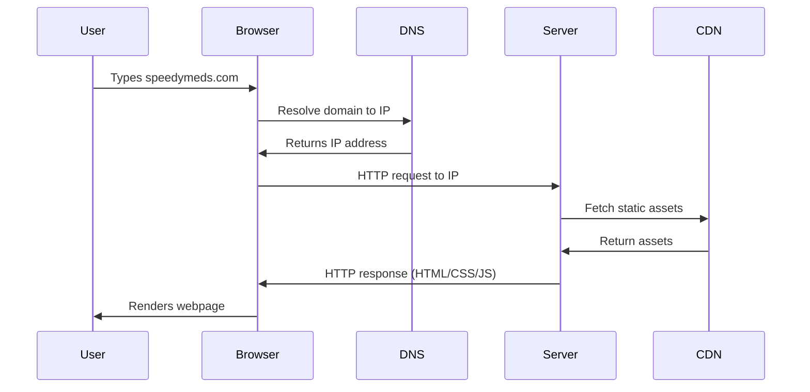
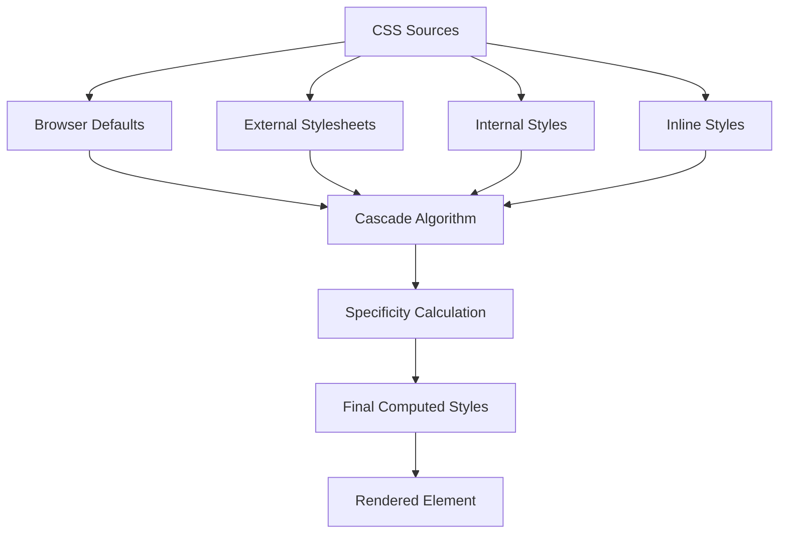
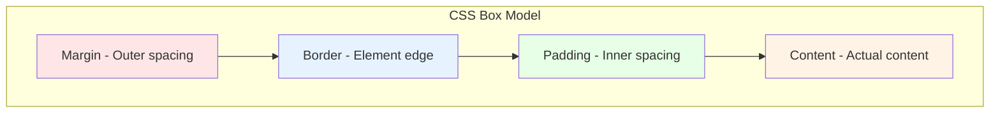
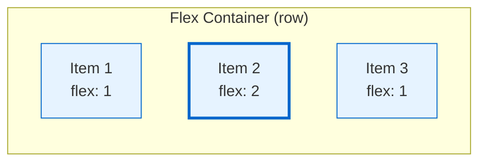
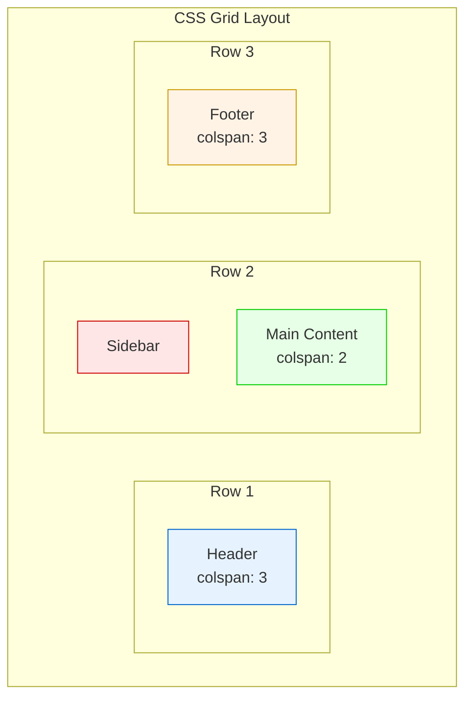
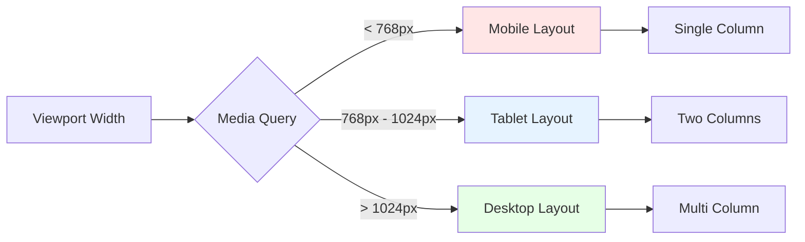

# Module 4: Web Development Essentials

## Introduction

Web development forms the foundation upon which React Native builds its cross-platform capabilities. This module introduces the core technologies of the web platform—HTML, CSS, and fundamental web concepts—that you'll need to understand before diving into React Native development. By mastering these essentials, you'll gain the knowledge necessary to create well-structured, styled, and responsive user interfaces that translate seamlessly to mobile applications.

## Target Audience Adaptation

This module is designed to accommodate learners from various backgrounds. Native mobile developers will discover how web layout systems compare to their familiar constraint-based approaches. Web developers can use this as a refresher while focusing on mobile-relevant aspects. All learners will benefit from understanding how these web technologies underpin React Native's rendering system.

## Learning Objectives

- Understand how the web platform works, including browsers, DNS, and client-server communication
- Create well-structured HTML documents using semantic elements
- Apply CSS styling to control visual presentation
- Implement layouts using modern CSS techniques including Flexbox and Grid
- Build responsive designs that adapt to different screen sizes
- Utilize modern CSS features for enhanced user experiences
- Debug and troubleshoot common web development issues

## Prerequisites

- Basic computer literacy and file management skills
- A text editor installed (VS Code recommended)
- Completion of [Module 3: Setting Up Your React Native Environment with Expo](./module-3.md)

## Module Sections

### Section 1: Understanding the Web Platform

#### Section Introduction

Before writing any code, it's crucial to understand how the web platform operates beneath the surface.

#### Core Content

##### Conceptual Content

The web platform is a complex ecosystem of technologies working together to deliver content and applications to users worldwide. When you type a URL into a browser, a sophisticated chain of events occurs.



This diagram illustrates the journey from URL to rendered webpage. First, the browser contacts a DNS (Domain Name System) server to translate the human-readable domain name into an IP address. The browser then sends an HTTP request to that IP address. The server processes the request, potentially fetching assets from a CDN (Content Delivery Network), and returns HTML, CSS, and JavaScript files. Finally, the browser parses these files and renders the visual webpage.

> 📲 **(Native Developers):**
>
> **Comparison:** Unlike native apps that ship with bundled resources, web applications fetch resources over the network each time. Where iOS uses Storyboards or SwiftUI and Android uses XML layouts or Jetpack Compose, the web uses HTML for structure and CSS for styling.
>
> **Key Takeaway:** Web development involves more network considerations but offers instant updates without app store submissions.
>
> **Source:** [MDN Web Docs: How the Web works](https://developer.mozilla.org/en-US/docs/Learn/Getting_started_with_the_web/How_the_Web_works)

The browser acts as the runtime environment for web applications, similar to how the iOS or Android OS provides the runtime for native apps. However, browsers add an additional abstraction layer, interpreting HTML, CSS, and JavaScript to create the user interface.

##### Referential Content

**Key Web Technologies:**

| Technology | Purpose                        | React Native Relevance              |
| ---------- | ------------------------------ | ----------------------------------- |
| HTML       | Document structure and content | JSX syntax is based on HTML         |
| CSS        | Visual styling and layout      | React Native StyleSheet mirrors CSS |
| JavaScript | Interactivity and logic        | Core language for React Native      |
| HTTP/HTTPS | Data transfer protocol         | Used for API communication          |
| DNS        | Domain name resolution         | Affects app networking              |

> 📚 **Official Documentation:**
>
> - [MDN Web Docs: Web technology for developers](https://developer.mozilla.org/en-US/docs/Web)
> - [MDN Web Docs: How the Web works](https://developer.mozilla.org/en-US/docs/Learn/Getting_started_with_the_web/How_the_Web_works)
> - [MDN Web Docs: HTTP overview](https://developer.mozilla.org/en-US/docs/Web/HTTP/Overview)

##### Troubleshooting Content

Common issues when understanding web platform concepts:

- **CORS errors**: When developing locally, you might encounter Cross-Origin Resource Sharing errors. These occur because browsers enforce security policies preventing scripts from one domain accessing resources from another.
- **Mixed content warnings**: Occur when loading HTTP resources from an HTTPS page. Always use HTTPS in production.
- **DNS propagation delays**: After deploying a new site, DNS changes can take up to 48 hours to propagate globally.

### Section 2: HTML Fundamentals

#### Section Introduction

HTML (HyperText Markup Language) provides the structural foundation for all web content, defining the meaning and organization of information.

#### Core Content

##### Conceptual Content

HTML uses a tag-based syntax to create elements that browsers interpret and render. Every HTML document follows a hierarchical structure, similar to how native mobile apps use view hierarchies.

```html
<!DOCTYPE html>
<html lang="en">
  <head>
    <meta charset="UTF-8" />
    <meta name="viewport" content="width=device-width, initial-scale=1.0" />
    <title>SpeedyMeds - Fast Pharmacy Delivery</title>
  </head>
  <body>
    <header>
      <h1>SpeedyMeds</h1>
      <nav>
        <ul>
          <li><a href="#prescriptions">Prescriptions</a></li>
          <li><a href="#otc">Over-the-Counter</a></li>
          <li><a href="#delivery">Delivery</a></li>
        </ul>
      </nav>
    </header>
    <main>
      <section id="hero">
        <h2>Your Medications, Delivered Fast</h2>
        <p>Get your prescriptions delivered within 2 hours.</p>
        <button type="button">Order Now</button>
      </section>
    </main>
    <footer>
      <p>&copy; 2024 SpeedyMeds. All rights reserved.</p>
    </footer>
  </body>
</html>
```

This example demonstrates semantic HTML5 structure for a SpeedyMeds landing page. The `<!DOCTYPE html>` declaration tells browsers to use HTML5 standards. The `<head>` contains metadata, while the `<body>` contains visible content. Semantic elements like `<header>`, `<nav>`, `<main>`, and `<footer>` provide meaning beyond mere visual structure.

> 🌐 **(Web Developers):**
>
> **Comparison:** If you're coming from React, you'll notice raw HTML lacks components and requires repetition. React Native's component model solves this, but understanding HTML helps you grasp JSX's foundation.
>
> **Key Takeaway:** JSX in React Native is essentially HTML-like syntax with some key differences (e.g., `className` becomes `style` prop).
>
> **Source:** [React Documentation: JSX In Depth](https://react.dev/learn/writing-markup-with-jsx)

##### Referential Content

**Essential HTML Elements for SpeedyMeds:**

| Element    | Purpose            | Example                  |
| ---------- | ------------------ | ------------------------ |
| `<form>`   | Collect user input | Prescription upload form |
| `<input>`  | Text/data entry    | Patient name, dosage     |
| `<select>` | Dropdown options   | Delivery time slots      |
| `<button>` | Trigger actions    | Submit prescription      |
| ``    | Display images     | Medication photos        |
| `<table>`  | Structured data    | Medication schedule      |
| `<a>`      | Links/navigation   | Navigate between screens |

> [!TIP]
> HTML5 introduced semantic elements that improve accessibility and SEO. Always prefer semantic tags (`<article>`, `<section>`, `<aside>`) over generic `<div>` elements when they accurately describe your content.

##### Procedural Content

To create your first SpeedyMeds HTML page:

1. Create a new file named `index.html`
2. Add the HTML5 document structure
3. Include semantic elements for page sections
4. Add a form for prescription requests:

```html
<form id="prescription-form">
  <fieldset>
    <legend>Request Prescription Refill</legend>
    <label for="patient-name">
      Patient Name:
      <input type="text" id="patient-name" name="patientName" required />
    </label>
    <label for="medication">
      Medication:
      <input type="text" id="medication" name="medication" required />
    </label>
    <label for="pharmacy">
      Preferred Pharmacy:
      <select id="pharmacy" name="pharmacy">
        <option value="">Select a pharmacy</option>
        <option value="main-st">Main Street Pharmacy</option>
        <option value="central">Central Medical Center</option>
      </select>
    </label>
    <button type="submit">Submit Request</button>
  </fieldset>
</form>
```

This form demonstrates proper HTML form structure with labels, input types, and semantic grouping using `<fieldset>`. The `required` attribute provides basic client-side validation, while the `for` attribute in labels improves accessibility by associating labels with their inputs.

> 📚 **Official Documentation:**
>
> - [MDN Web Docs: HTML elements reference](https://developer.mozilla.org/en-US/docs/Web/HTML/Element)
> - [MDN Web Docs: HTML forms](https://developer.mozilla.org/en-US/docs/Learn/Forms)
> - [MDN Web Docs: Semantic HTML](https://developer.mozilla.org/en-US/docs/Glossary/Semantics#semantics_in_html)

#### Section Exercise

**Exercise 4.1: Basic HTML Page** - Create a SpeedyMeds patient dashboard page with semantic HTML
**[Create in CodeSandbox](https://codesandbox.io/s/new)**

### Section 3: CSS Fundamentals

#### Section Introduction

CSS (Cascading Style Sheets) transforms plain HTML into visually appealing interfaces by controlling colors, layouts, typography, and more.

#### Core Content

##### Conceptual Content

CSS works by selecting HTML elements and applying style rules to them. The "cascading" nature means styles can come from multiple sources and override each other based on specificity and order.

```css
/* Element selector */
body {
  font-family: -apple-system, BlinkMacSystemFont, "Segoe UI", Roboto, sans-serif;
  margin: 0;
  padding: 0;
  background-color: #f5f5f5;
}

/* Class selector */
.medication-card {
  background: white;
  border-radius: 8px;
  padding: 16px;
  box-shadow: 0 2px 4px rgba(0, 0, 0, 0.1);
  margin-bottom: 12px;
}

/* ID selector */
#urgent-refills {
  border-left: 4px solid #ff4444;
}

/* Descendant selector */
.medication-card h3 {
  color: #333;
  margin-top: 0;
}

/* Pseudo-class */
.medication-card:hover {
  box-shadow: 0 4px 8px rgba(0, 0, 0, 0.15);
}
```

This CSS demonstrates various selector types styling a medication card component. Selectors determine which elements receive styles, while properties define the visual changes. The cascade determines which styles apply when multiple rules target the same element.

> 📲 **(Native Developers):**
>
> **Comparison:** CSS selectors work differently from native styling. iOS uses outlet connections or view tags, while Android uses resource IDs. CSS selectors are more flexible but can also be more complex.
>
> **Key Takeaway:** React Native's StyleSheet API simplifies this by using JavaScript objects instead of CSS selectors.
>
> **Source:** [React Native Docs: Style](https://reactnative.dev/docs/style)



This diagram shows how CSS rules from various sources flow through the cascade algorithm. Browser defaults provide base styles, which can be overridden by author stylesheets. The cascade considers source order, specificity, and importance to determine final styles.

##### Referential Content

**CSS Properties for SpeedyMeds UI:**

| Property           | Purpose            | Example Usage             |
| ------------------ | ------------------ | ------------------------- |
| `color`            | Text color         | Brand colors for headers  |
| `background-color` | Element background | Card backgrounds          |
| `padding`          | Internal spacing   | Card content spacing      |
| `margin`           | External spacing   | Space between cards       |
| `border-radius`    | Rounded corners    | Modern card design        |
| `box-shadow`       | Drop shadows       | Elevation effects         |
| `display`          | Layout mode        | Flexbox/Grid layouts      |
| `font-size`        | Text size          | Readable medication names |

##### Procedural Content

To style the SpeedyMeds interface:

1. Create a `styles.css` file
2. Link it to your HTML: `<link rel="stylesheet" href="styles.css">`
3. Add base styles:

```css
/* Reset default styles */
* {
  box-sizing: border-box;
}

/* Typography system */
:root {
  --primary-color: #0066cc;
  --success-color: #00aa00;
  --warning-color: #ff9900;
  --danger-color: #cc0000;
  --text-primary: #333333;
  --text-secondary: #666666;
  --background: #f8f9fa;
}

/* Component styles */
.prescription-card {
  background: white;
  border: 1px solid #e0e0e0;
  border-radius: 8px;
  padding: 20px;
  margin-bottom: 16px;
  transition: transform 0.2s ease;
}

.prescription-card:hover {
  transform: translateY(-2px);
  box-shadow: 0 4px 12px rgba(0, 0, 0, 0.1);
}

.prescription-status {
  display: inline-block;
  padding: 4px 12px;
  border-radius: 16px;
  font-size: 14px;
  font-weight: 500;
}

.prescription-status.ready {
  background-color: var(--success-color);
  color: white;
}

.prescription-status.pending {
  background-color: var(--warning-color);
  color: white;
}
```

This CSS establishes a design system using CSS custom properties (variables) for consistent colors. The prescription card styles create a modern, interactive component with hover effects. Status badges use modifier classes for different states.

> [!IMPORTANT]
> Always use CSS custom properties (CSS variables) for values that repeat throughout your stylesheet. This makes theme changes and maintenance much easier, similar to how React Native apps use theme objects.

> 📚 **Official Documentation:**
>
> - [MDN Web Docs: CSS reference](https://developer.mozilla.org/en-US/docs/Web/CSS/Reference)
> - [MDN Web Docs: CSS selectors](https://developer.mozilla.org/en-US/docs/Web/CSS/CSS_Selectors)
> - [MDN Web Docs: CSS custom properties](https://developer.mozilla.org/en-US/docs/Web/CSS/Using_CSS_custom_properties)

#### Section Exercise

**Exercise 4.2: Styling with CSS** - Style your SpeedyMeds dashboard with modern CSS
**[Create in CodeSandbox](https://codesandbox.io/s/new)**

### Section 4: The Box Model and Layout

#### Section Introduction

Understanding the CSS box model is crucial for controlling element sizing and spacing in web layouts.

#### Core Content

##### Conceptual Content

Every HTML element is essentially a rectangular box with four components: content, padding, border, and margin. The box model determines how these components interact to define an element's total size and spacing.



This diagram visualizes the box model layers. Margin creates space outside the border, separating elements from each other. Border defines the element's edge. Padding creates space inside the border, between border and content. Content holds the actual text, images, or other elements.

```css
.medication-details {
  /* Content width */
  width: 300px;

  /* Padding: top right bottom left */
  padding: 20px 15px 20px 15px;

  /* Border */
  border: 2px solid #0066cc;

  /* Margin */
  margin: 10px auto; /* vertical horizontal */

  /* Total width = 300 + (15*2) + (2*2) = 334px */
  /* With margin, total space = 334 + (auto*2) */
}

/* Modern box-sizing solution */
.medication-details-modern {
  box-sizing: border-box; /* Include padding and border in width */
  width: 300px; /* Total width is now exactly 300px */
  padding: 20px 15px;
  border: 2px solid #0066cc;
  margin: 10px auto;
}
```

The traditional box model adds padding and border to the specified width, often causing layout issues. The `box-sizing: border-box` property changes this behavior, making width include padding and border, which is more intuitive and matches how native mobile layouts typically work.

> 🤖 **(Android Developers):**
>
> **Comparison:** Android's padding works similarly, but margins in Android can collapse differently than CSS. Android's `layout_margin` is more predictable than CSS margin collapsing.
>
> **Key Takeaway:** Always use `box-sizing: border-box` in web development for more predictable sizing, similar to Android's approach.
>
> **Source:** [Android Developers: Layouts](https://developer.android.com/guide/topics/ui/declaring-layout)

##### Referential Content

**Box Model Properties:**

| Property     | Description     | Values                    | React Native Equivalent |
| ------------ | --------------- | ------------------------- | ----------------------- |
| `width`      | Content width   | px, %, vw                 | `width` style prop      |
| `height`     | Content height  | px, %, vh                 | `height` style prop     |
| `padding`    | Inner spacing   | Single or multiple values | `padding` props         |
| `margin`     | Outer spacing   | Single or multiple values | `margin` props          |
| `border`     | Element border  | width style color         | `border` props          |
| `box-sizing` | Sizing behavior | content-box, border-box   | Always border-box in RN |

> [!CAUTION]
> CSS margins can collapse vertically, meaning adjacent vertical margins merge into a single margin. This doesn't happen with padding or horizontal margins. React Native doesn't have margin collapsing, making spacing more predictable.

##### Procedural Content

To implement a prescription card layout:

1. Reset box-sizing globally:

```css
/* Apply border-box to all elements */
*,
*::before,
*::after {
  box-sizing: border-box;
}
```

2. Create a card container with proper spacing:

```css
.prescription-container {
  max-width: 800px;
  margin: 0 auto;
  padding: 20px;
}

.prescription-grid {
  display: flex;
  flex-wrap: wrap;
  gap: 20px; /* Modern gap property for spacing */
}

.prescription-item {
  flex: 1 1 300px; /* Flexible basis of 300px */
  background: white;
  border: 1px solid #e0e0e0;
  border-radius: 8px;
  padding: 20px;
  position: relative;
}

.prescription-header {
  padding-bottom: 15px;
  margin-bottom: 15px;
  border-bottom: 1px solid #f0f0f0;
}

.prescription-badge {
  position: absolute;
  top: 10px;
  right: 10px;
  padding: 4px 8px;
  background: #ff4444;
  color: white;
  border-radius: 4px;
  font-size: 12px;
}
```

This layout uses modern CSS features like `gap` for consistent spacing and flexbox for responsive behavior. The prescription items use flexible sizing to adapt to available space while maintaining a minimum width.

> 📚 **Official Documentation:**
>
> - [MDN Web Docs: The box model](https://developer.mozilla.org/en-US/docs/Learn/CSS/Building_blocks/The_box_model)
> - [MDN Web Docs: box-sizing](https://developer.mozilla.org/en-US/docs/Web/CSS/box-sizing)
> - [MDN Web Docs: CSS values and units](https://developer.mozilla.org/en-US/docs/Learn/CSS/Building_blocks/Values_and_units)

#### Section Exercise

**Exercise 4.3: Box Model Practice** - Build SpeedyMeds prescription cards with proper spacing
**[Create in CodeSandbox](https://codesandbox.io/s/new)**

### Section 5: Flexbox

#### Section Introduction

Flexbox provides a powerful one-dimensional layout system that excels at distributing space and aligning items, forming the foundation of React Native's layout system.

#### Core Content

##### Conceptual Content

Flexbox creates a flex container with flex items that can grow, shrink, and align dynamically. It works along a main axis (row or column) and a cross axis perpendicular to it.



This diagram shows a flex container with three items. Item 2 has `flex: 2`, making it take twice the available space as items 1 and 3. This proportional sizing is core to flexbox's power and is used extensively in React Native layouts.

```css
/* Flex container setup */
.medication-list {
  display: flex;
  flex-direction: column;
  gap: 12px;
}

.medication-row {
  display: flex;
  flex-direction: row;
  align-items: center;
  justify-content: space-between;
  padding: 16px;
  background: white;
  border-radius: 8px;
  box-shadow: 0 1px 3px rgba(0, 0, 0, 0.1);
}

.medication-info {
  display: flex;
  flex-direction: column;
  flex: 1;
}

.medication-name {
  font-size: 18px;
  font-weight: 600;
  color: #333;
  margin-bottom: 4px;
}

.medication-details {
  font-size: 14px;
  color: #666;
}

.medication-actions {
  display: flex;
  gap: 8px;
}

.action-button {
  padding: 8px 16px;
  border: none;
  border-radius: 4px;
  background: #0066cc;
  color: white;
  cursor: pointer;
  transition: background 0.2s;
}

.action-button:hover {
  background: #0052a3;
}
```

This medication list demonstrates common flexbox patterns. The outer container uses column direction for vertical stacking. Each row uses row direction with `space-between` to push actions to the right. The medication info uses `flex: 1` to take available space.

> 🍏 **(iOS Developers):**
>
> **Comparison:** Flexbox is similar to UIStackView in iOS. `flex-direction` is like `axis`, `justify-content` is like `distribution`, and `align-items` is like `alignment`.
>
> **Key Takeaway:** React Native uses Flexbox as its primary layout system, making this knowledge directly transferable.
>
> **Source:** [Apple Developer: UIStackView](https://developer.apple.com/documentation/uikit/uistackview)

##### Referential Content

**Flexbox Properties for SpeedyMeds Layouts:**

| Property          | Purpose               | Common Values         | Use Case                   |
| ----------------- | --------------------- | --------------------- | -------------------------- |
| `display: flex`   | Create flex container | flex                  | All layout containers      |
| `flex-direction`  | Main axis direction   | row, column           | List vs. toolbar layouts   |
| `justify-content` | Main axis alignment   | center, space-between | Centering, spreading items |
| `align-items`     | Cross axis alignment  | center, stretch       | Vertical centering         |
| `flex`            | Grow/shrink/basis     | 1, 0, auto            | Responsive sizing          |
| `gap`             | Spacing between items | 8px, 16px             | Consistent spacing         |
| `flex-wrap`       | Allow wrapping        | wrap, nowrap          | Responsive grids           |

##### Procedural Content

To create a responsive medication dashboard:

1. Build the main layout structure:

```css
.dashboard {
  display: flex;
  min-height: 100vh;
  background: #f5f5f5;
}

.sidebar {
  display: flex;
  flex-direction: column;
  width: 250px;
  background: white;
  box-shadow: 2px 0 4px rgba(0, 0, 0, 0.1);
}

.main-content {
  flex: 1;
  display: flex;
  flex-direction: column;
  padding: 24px;
}

.stats-row {
  display: flex;
  gap: 20px;
  margin-bottom: 24px;
}

.stat-card {
  flex: 1;
  display: flex;
  flex-direction: column;
  background: white;
  padding: 20px;
  border-radius: 8px;
  box-shadow: 0 2px 4px rgba(0, 0, 0, 0.1);
}

.stat-value {
  font-size: 32px;
  font-weight: bold;
  color: #0066cc;
  margin-bottom: 8px;
}

.stat-label {
  font-size: 14px;
  color: #666;
  text-transform: uppercase;
}
```

2. Add responsive behavior:

```css
@media (max-width: 768px) {
  .dashboard {
    flex-direction: column;
  }

  .sidebar {
    width: 100%;
    order: 2; /* Move below main content */
  }

  .stats-row {
    flex-direction: column;
  }

  .stat-card {
    margin-bottom: 12px;
  }
}
```

This responsive dashboard uses flexbox at multiple levels. The main dashboard flexes to fill the viewport. The sidebar has fixed width on desktop but becomes full-width on mobile. Stats cards distribute evenly but stack vertically on small screens.

> [!TIP]
> Flexbox is the default layout system in React Native. Every `<View>` component is a flex container with `flexDirection: 'column'` by default, different from web's row default.

> 📚 **Official Documentation:**
>
> - [MDN Web Docs: Flexbox](https://developer.mozilla.org/en-US/docs/Learn/CSS/CSS_layout/Flexbox)
> - [CSS-Tricks: A Complete Guide to Flexbox](https://css-tricks.com/snippets/css/a-guide-to-flexbox/)
> - [MDN Web Docs: Basic concepts of flexbox](https://developer.mozilla.org/en-US/docs/Web/CSS/CSS_Flexible_Box_Layout/Basic_Concepts_of_Flexbox)

#### Section Exercise

**Exercise 4.4: Flexbox Layout** - Create a flexible SpeedyMeds prescription management interface
**[Create in CodeSandbox](https://codesandbox.io/s/new)**

### Section 6: CSS Grid

#### Section Introduction

CSS Grid provides a two-dimensional layout system, perfect for creating complex layouts that flexbox alone cannot efficiently handle.

#### Core Content

##### Conceptual Content

Grid creates a layout with rows and columns, allowing items to span multiple cells and align precisely. Unlike flexbox's one-dimensional flow, grid gives you control over both dimensions simultaneously.



This diagram illustrates a typical grid layout where the header and footer span all columns, while the middle row splits between sidebar and main content. Grid makes such layouts straightforward compared to nested flexbox containers.

```css
.pharmacy-dashboard {
  display: grid;
  grid-template-columns: 250px 1fr 300px;
  grid-template-rows: auto 1fr auto;
  grid-template-areas:
    "header header header"
    "nav main aside"
    "footer footer footer";
  gap: 20px;
  min-height: 100vh;
}

.dashboard-header {
  grid-area: header;
  background: white;
  padding: 20px;
  box-shadow: 0 2px 4px rgba(0, 0, 0, 0.1);
}

.dashboard-nav {
  grid-area: nav;
  background: #f8f9fa;
  padding: 20px;
}

.dashboard-main {
  grid-area: main;
  background: white;
  padding: 24px;
}

.dashboard-aside {
  grid-area: aside;
  background: #f8f9fa;
  padding: 20px;
}

.dashboard-footer {
  grid-area: footer;
  background: #333;
  color: white;
  padding: 20px;
  text-align: center;
}

/* Prescription grid within main content */
.prescription-grid {
  display: grid;
  grid-template-columns: repeat(auto-fill, minmax(280px, 1fr));
  gap: 16px;
}

.prescription-card {
  background: white;
  border: 1px solid #e0e0e0;
  border-radius: 8px;
  padding: 16px;
  display: grid;
  grid-template-rows: auto 1fr auto;
  gap: 12px;
}
```

This pharmacy dashboard uses named grid areas for clarity. The main layout creates header, navigation, content, and aside sections. Within the main content, a nested grid creates responsive prescription cards that automatically adjust columns based on available space.

> 🌐 **(Web Developers):**
>
> **Comparison:** While flexbox is great for component layouts, grid excels at page layouts. React Native doesn't have built-in grid support, so you'll use flexbox with calculated dimensions for grid-like layouts.
>
> **Key Takeaway:** Understanding grid helps you appreciate React Native's flexbox limitations and workarounds.
>
> **Source:** [React Native Layout with Flexbox](https://reactnative.dev/docs/flexbox)

##### Referential Content

**CSS Grid Properties for Complex Layouts:**

| Property                | Purpose               | Example Value   | Use Case                 |
| ----------------------- | --------------------- | --------------- | ------------------------ |
| `display: grid`         | Create grid container | grid            | Dashboard layouts        |
| `grid-template-columns` | Define columns        | 1fr 2fr 1fr     | Column sizing            |
| `grid-template-rows`    | Define rows           | auto 1fr auto   | Header/content/footer    |
| `grid-template-areas`   | Named areas           | "header header" | Visual layout definition |
| `grid-area`             | Place item            | main            | Assign to named area     |
| `gap`                   | Grid spacing          | 20px            | Consistent gutters       |
| `grid-auto-flow`        | Auto-placement        | dense           | Fill gaps automatically  |

##### Procedural Content

To build a medication inventory grid:

1. Create the grid container:

```css
.inventory-dashboard {
  display: grid;
  grid-template-columns: 200px 1fr;
  grid-template-rows: 60px 1fr;
  height: 100vh;
  background: #f5f5f5;
}

.inventory-header {
  grid-column: 1 / -1; /* Span all columns */
  background: white;
  display: flex;
  align-items: center;
  padding: 0 24px;
  box-shadow: 0 1px 3px rgba(0, 0, 0, 0.1);
}

.category-sidebar {
  background: white;
  border-right: 1px solid #e0e0e0;
  padding: 20px;
}

.inventory-grid {
  padding: 24px;
  overflow-y: auto;
  display: grid;
  grid-template-columns: repeat(auto-fill, minmax(200px, 1fr));
  gap: 20px;
  align-content: start;
}

.medication-tile {
  background: white;
  border-radius: 8px;
  padding: 16px;
  box-shadow: 0 2px 4px rgba(0, 0, 0, 0.1);
  display: grid;
  grid-template-rows: 120px auto auto;
  gap: 12px;
  transition: transform 0.2s;
}

.medication-tile:hover {
  transform: translateY(-4px);
  box-shadow: 0 4px 12px rgba(0, 0, 0, 0.15);
}

.medication-image {
  background: #f0f0f0;
  border-radius: 4px;
  display: flex;
  align-items: center;
  justify-content: center;
  font-size: 48px;
  color: #ccc;
}

.medication-stock {
  display: grid;
  grid-template-columns: 1fr auto;
  align-items: center;
  padding-top: 8px;
  border-top: 1px solid #f0f0f0;
}

.stock-level {
  font-weight: bold;
}

.stock-level.low {
  color: #ff4444;
}

.stock-level.medium {
  color: #ff9900;
}

.stock-level.high {
  color: #00aa00;
}
```

2. Add responsive breakpoints:

```css
@media (max-width: 768px) {
  .inventory-dashboard {
    grid-template-columns: 1fr;
    grid-template-rows: 60px auto 1fr;
  }

  .category-sidebar {
    border-right: none;
    border-bottom: 1px solid #e0e0e0;
  }

  .inventory-grid {
    grid-template-columns: repeat(auto-fill, minmax(150px, 1fr));
    gap: 12px;
    padding: 16px;
  }
}
```

This inventory system uses grid at multiple levels. The main dashboard uses grid for the overall layout, while the inventory area uses auto-fill to create a responsive tile layout. Each medication tile also uses grid for consistent internal structure.

> [!IMPORTANT]
> CSS Grid is not available in React Native. However, understanding grid concepts helps you plan layouts that you'll implement using flexbox and calculated dimensions in React Native.

> 📚 **Official Documentation:**
>
> - [MDN Web Docs: CSS Grid Layout](https://developer.mozilla.org/en-US/docs/Web/CSS/CSS_Grid_Layout)
> - [CSS-Tricks: Complete Guide to Grid](https://css-tricks.com/snippets/css/complete-guide-grid/)
> - [MDN Web Docs: Basic concepts of grid layout](https://developer.mozilla.org/en-US/docs/Web/CSS/CSS_Grid_Layout/Basic_Concepts_of_Grid_Layout)

#### Section Exercise

**Exercise 4.5: Grid Layout** - Build a responsive SpeedyMeds inventory management grid
**[Create in CodeSandbox](https://codesandbox.io/s/new)**

### Section 7: Responsive Design

#### Section Introduction

Responsive design ensures your web applications adapt gracefully to different screen sizes, from mobile phones to desktop monitors.

#### Core Content

##### Conceptual Content

Responsive design combines flexible layouts, flexible images, and media queries to create interfaces that work across all devices. This approach is essential for modern web development and directly influences how React Native handles different screen sizes.



This diagram shows how media queries create breakpoints that trigger different layouts. Mobile devices get simplified single-column layouts, tablets use moderate complexity, and desktops can display full multi-column interfaces.

```css
/* Mobile-first approach */
.prescription-list {
  display: flex;
  flex-direction: column;
  padding: 16px;
}

.prescription-item {
  background: white;
  border-radius: 8px;
  padding: 16px;
  margin-bottom: 12px;
  box-shadow: 0 2px 4px rgba(0, 0, 0, 0.1);
}

/* Tablet styles */
@media (min-width: 768px) {
  .prescription-list {
    display: grid;
    grid-template-columns: repeat(2, 1fr);
    gap: 20px;
    padding: 24px;
  }

  .prescription-item {
    margin-bottom: 0;
  }
}

/* Desktop styles */
@media (min-width: 1024px) {
  .prescription-list {
    grid-template-columns: repeat(3, 1fr);
    max-width: 1200px;
    margin: 0 auto;
  }

  .prescription-item {
    transition: transform 0.2s;
  }

  .prescription-item:hover {
    transform: translateY(-4px);
    box-shadow: 0 4px 12px rgba(0, 0, 0, 0.15);
  }
}

/* High-resolution displays */
@media (min-width: 1440px) {
  .prescription-list {
    grid-template-columns: repeat(4, 1fr);
    max-width: 1400px;
  }
}
```

This mobile-first approach starts with the simplest layout and progressively enhances for larger screens. Each breakpoint adds complexity and features appropriate for the available space.

> 🤖 **(Android Developers):**
>
> **Comparison:** Media queries are similar to Android's resource qualifiers (e.g., `layout-sw600dp`). However, CSS media queries are more flexible and can test various conditions beyond just screen size.
>
> **Key Takeaway:** React Native uses a different approach with the Dimensions API and responsive units, but the concepts transfer directly.
>
> **Source:** [Android Developers: Supporting different screen sizes](https://developer.android.com/guide/topics/large-screens/support-different-screen-sizes)

##### Referential Content

**Responsive Design Techniques:**

| Technique       | Purpose              | Implementation    | React Native Equivalent |
| --------------- | -------------------- | ----------------- | ----------------------- |
| Fluid grids     | Flexible layouts     | % or fr units     | Flex with percentages   |
| Flexible images | Scale with container | max-width: 100%   | Image resizeMode        |
| Media queries   | Conditional styles   | @media rules      | Dimensions API          |
| Viewport meta   | Mobile optimization  | meta viewport tag | Handled by RN           |
| rem/em units    | Scalable sizing      | Relative units    | Scaled values           |
| CSS Variables   | Dynamic theming      | Custom properties | Theme context           |

> [!TIP]
> Always design mobile-first, then enhance for larger screens. This ensures your core functionality works on the most constrained devices and prevents desktop-only features from breaking mobile experiences.

##### Procedural Content

To create a responsive SpeedyMeds header:

1. Start with the viewport meta tag in HTML:

```html
<meta name="viewport" content="width=device-width, initial-scale=1.0" />
```

2. Build a responsive navigation:

```css
/* Mobile-first navigation */
.site-header {
  background: white;
  box-shadow: 0 2px 4px rgba(0, 0, 0, 0.1);
  position: sticky;
  top: 0;
  z-index: 100;
}

.nav-container {
  display: flex;
  justify-content: space-between;
  align-items: center;
  padding: 16px;
}

.logo {
  font-size: 24px;
  font-weight: bold;
  color: #0066cc;
}

.nav-menu {
  display: none;
  position: absolute;
  top: 100%;
  left: 0;
  width: 100%;
  background: white;
  box-shadow: 0 2px 4px rgba(0, 0, 0, 0.1);
}

.nav-menu.active {
  display: block;
}

.nav-link {
  display: block;
  padding: 16px;
  color: #333;
  text-decoration: none;
  border-bottom: 1px solid #f0f0f0;
}

.menu-toggle {
  background: none;
  border: none;
  font-size: 24px;
  cursor: pointer;
}

/* Tablet and desktop navigation */
@media (min-width: 768px) {
  .nav-menu {
    display: flex;
    position: static;
    width: auto;
    box-shadow: none;
  }

  .nav-link {
    padding: 8px 16px;
    border-bottom: none;
  }

  .nav-link:hover {
    color: #0066cc;
  }

  .menu-toggle {
    display: none;
  }
}

/* Desktop enhancements */
@media (min-width: 1024px) {
  .nav-container {
    max-width: 1200px;
    margin: 0 auto;
    padding: 20px 24px;
  }

  .nav-menu {
    gap: 24px;
  }

  .cta-button {
    background: #0066cc;
    color: white;
    padding: 10px 24px;
    border-radius: 4px;
    text-decoration: none;
    transition: background 0.2s;
  }

  .cta-button:hover {
    background: #0052a3;
  }
}
```

3. Add responsive typography:

```css
/* Fluid typography */
:root {
  --fluid-min-width: 320;
  --fluid-max-width: 1200;
  --fluid-min-size: 16;
  --fluid-max-size: 20;
  --fluid-min-ratio: 1.2;
  --fluid-max-ratio: 1.33;
}

body {
  font-size: clamp(
    var(--fluid-min-size) * 1px,
    (var(--fluid-min-size) * 1px) + (
        var(--fluid-max-size) - var(--fluid-min-size)
      ) *
      (
        (100vw - (var(--fluid-min-width) * 1px)) / (var(--fluid-max-width) - var(--fluid-min-width))
      ),
    var(--fluid-max-size) * 1px
  );
}

h1 {
  font-size: clamp(1.8rem, 4vw, 3rem);
}

h2 {
  font-size: clamp(1.4rem, 3vw, 2.2rem);
}
```

This responsive system uses modern CSS features like `clamp()` for fluid typography that scales smoothly between minimum and maximum sizes. The navigation transforms from a mobile hamburger menu to a desktop horizontal layout.

> 🧗‍♀️ **(Self-Led):** Practice responsive design by resizing your browser window while developing. Use browser developer tools to test specific device sizes and network conditions.

> 📚 **Official Documentation:**
>
> - [MDN Web Docs: Responsive design](https://developer.mozilla.org/en-US/docs/Learn/CSS/CSS_layout/Responsive_Design)
> - [MDN Web Docs: Using media queries](https://developer.mozilla.org/en-US/docs/Web/CSS/Media_Queries/Using_media_queries)
> - [MDN Web Docs: Viewport meta tag](https://developer.mozilla.org/en-US/docs/Web/HTML/Viewport_meta_tag)

#### Section Exercise

**Exercise 4.6: Media Queries** - Make your SpeedyMeds interface responsive across devices
**[Create in CodeSandbox](https://codesandbox.io/s/new)**

### Section 8: Modern CSS Features

#### Section Introduction

Modern CSS provides powerful features that enhance user experience and developer productivity, many of which influence React Native's animation and styling capabilities.

#### Core Content

##### Conceptual Content

CSS has evolved significantly, adding features like custom properties, transforms, transitions, animations, and filters. These features enable rich, interactive experiences without JavaScript.

```css
/* CSS Custom Properties (Variables) */
:root {
  --primary: #0066cc;
  --primary-dark: #0052a3;
  --success: #00aa00;
  --warning: #ff9900;
  --danger: #cc0000;
  --shadow-sm: 0 2px 4px rgba(0, 0, 0, 0.1);
  --shadow-md: 0 4px 8px rgba(0, 0, 0, 0.15);
  --shadow-lg: 0 8px 16px rgba(0, 0, 0, 0.2);
  --transition-fast: 0.2s ease;
  --transition-normal: 0.3s ease;
}

/* CSS Transforms and Transitions */
.medication-card {
  background: white;
  border-radius: 8px;
  padding: 20px;
  box-shadow: var(--shadow-sm);
  transition: transform var(--transition-fast), box-shadow var(--transition-fast);
  cursor: pointer;
}

.medication-card:hover {
  transform: translateY(-4px) scale(1.02);
  box-shadow: var(--shadow-md);
}

.medication-card:active {
  transform: translateY(-2px) scale(1.01);
}

/* CSS Animations */
@keyframes pulse {
  0% {
    transform: scale(1);
    opacity: 1;
  }
  50% {
    transform: scale(1.05);
    opacity: 0.8;
  }
  100% {
    transform: scale(1);
    opacity: 1;
  }
}

.urgent-badge {
  background: var(--danger);
  color: white;
  padding: 4px 8px;
  border-radius: 4px;
  animation: pulse 2s infinite;
}

/* CSS Filters */
.medication-image {
  filter: grayscale(0);
  transition: filter var(--transition-normal);
}

.out-of-stock .medication-image {
  filter: grayscale(100%) opacity(0.5);
}

/* Modern Pseudo-classes */
.form-input:focus-visible {
  outline: 2px solid var(--primary);
  outline-offset: 2px;
}

.medication-list > *:not(:last-child) {
  margin-bottom: 12px;
}

/* CSS Grid with Subgrid */
.prescription-details {
  display: grid;
  grid-template-columns: 1fr 2fr;
  gap: 16px;
}

.prescription-details > * {
  display: grid;
  grid-template-columns: subgrid;
  align-items: center;
}
```

These modern features create smooth, professional interactions. CSS variables enable consistent theming and easy customization. Transforms and transitions provide smooth state changes. Animations draw attention to important elements. Filters create visual states without additional images.

> ⚛️ **(React Developers):**
>
> **Comparison:** CSS animations are declarative like React's approach, but React Native uses the Animated API for similar effects. CSS variables are similar to theme contexts in React apps.
>
> **Key Takeaway:** Understanding CSS animations helps you grasp React Native's Animated API concepts more easily.
>
> **Source:** [React Native Docs: Animations](https://reactnative.dev/docs/animations)

##### Referential Content

**Modern CSS Features for Enhanced UX:**

| Feature           | Purpose             | Browser Support | React Native Equivalent |
| ----------------- | ------------------- | --------------- | ----------------------- |
| Custom Properties | Dynamic theming     | Excellent       | Theme context/constants |
| Transforms        | 2D/3D positioning   | Excellent       | Transform style props   |
| Transitions       | Smooth changes      | Excellent       | Animated API            |
| Animations        | Keyframe animations | Excellent       | Animated API            |
| Filters           | Visual effects      | Good            | Limited support         |
| Grid/Subgrid      | Complex layouts     | Good/Partial    | Flexbox only            |
| Clamp()           | Fluid sizing        | Good            | Calculated values       |
| :focus-visible    | Better focus styles | Good            | Focus event handling    |

##### Procedural Content

To implement modern interactions for SpeedyMeds:

1. Create an animated prescription notification:

```css
/* Notification system */
.notification-container {
  position: fixed;
  top: 20px;
  right: 20px;
  z-index: 1000;
}

.notification {
  background: white;
  border-radius: 8px;
  padding: 16px 20px;
  margin-bottom: 12px;
  box-shadow: var(--shadow-md);
  display: flex;
  align-items: center;
  gap: 12px;
  min-width: 300px;
  transform: translateX(400px);
  animation: slideIn 0.3s ease forwards;
}

@keyframes slideIn {
  to {
    transform: translateX(0);
  }
}

.notification.success {
  border-left: 4px solid var(--success);
}

.notification.error {
  border-left: 4px solid var(--danger);
}

.notification-icon {
  font-size: 24px;
}

.notification.success .notification-icon {
  color: var(--success);
}

.notification.error .notification-icon {
  color: var(--danger);
}

/* Loading states */
.loading-skeleton {
  background: linear-gradient(90deg, #f0f0f0 25%, #e0e0e0 50%, #f0f0f0 75%);
  background-size: 200% 100%;
  animation: loading 1.5s infinite;
}

@keyframes loading {
  0% {
    background-position: 200% 0;
  }
  100% {
    background-position: -200% 0;
  }
}

/* Smooth scrolling */
html {
  scroll-behavior: smooth;
}

/* Modern form styling */
.modern-input {
  --input-height: 48px;
  position: relative;
}

.modern-input input {
  width: 100%;
  height: var(--input-height);
  padding: 0 16px;
  border: 2px solid #e0e0e0;
  border-radius: 4px;
  font-size: 16px;
  transition: border-color var(--transition-fast);
}

.modern-input input:focus {
  outline: none;
  border-color: var(--primary);
}

.modern-input label {
  position: absolute;
  left: 16px;
  top: 50%;
  transform: translateY(-50%);
  background: white;
  padding: 0 4px;
  color: #666;
  transition: all var(--transition-fast);
  pointer-events: none;
}

.modern-input input:focus + label,
.modern-input input:not(:placeholder-shown) + label {
  top: 0;
  font-size: 12px;
  color: var(--primary);
}
```

2. Add performance-optimized animations:

```css
/* Use transform instead of position for better performance */
.slide-panel {
  position: fixed;
  top: 0;
  right: 0;
  height: 100vh;
  width: 320px;
  background: white;
  box-shadow: -2px 0 8px rgba(0, 0, 0, 0.1);
  transform: translateX(100%);
  transition: transform var(--transition-normal);
  will-change: transform; /* Hint to browser for optimization */
}

.slide-panel.open {
  transform: translateX(0);
}

/* Reduce motion for accessibility */
@media (prefers-reduced-motion: reduce) {
  * {
    animation-duration: 0.01ms !important;
    animation-iteration-count: 1 !important;
    transition-duration: 0.01ms !important;
  }
}
```

These modern CSS features create a polished, professional interface. The notification system uses animations for smooth entry. Loading skeletons provide better perceived performance than spinners. Form inputs use modern floating label patterns. Performance is optimized using transform instead of position changes.

> [!CAUTION]
> Always test modern CSS features across browsers. Use tools like caniuse.com to check support. Provide fallbacks for critical functionality, and respect user preferences like reduced motion settings.

> 📚 **Official Documentation:**
>
> - [MDN Web Docs: CSS Custom Properties](https://developer.mozilla.org/en-US/docs/Web/CSS/Using_CSS_custom_properties)
> - [MDN Web Docs: CSS Transforms](https://developer.mozilla.org/en-US/docs/Web/CSS/CSS_Transforms)
> - [MDN Web Docs: CSS Animations](https://developer.mozilla.org/en-US/docs/Web/CSS/CSS_Animations)
> - [MDN Web Docs: CSS Transitions](https://developer.mozilla.org/en-US/docs/Web/CSS/CSS_Transitions)

## Module Challenge

**Challenge 4: Build a Responsive Web Page** - Create a complete SpeedyMeds landing page with modern CSS features
**[Create in CodeSandbox](https://codesandbox.io/s/new)**

## Module Summary

This module has provided a comprehensive foundation in web development essentials. You've learned how the web platform operates, from DNS resolution to browser rendering. You've mastered HTML for structuring content semantically and CSS for creating beautiful, responsive layouts. Through flexbox and grid, you've gained powerful layout tools that directly translate to React Native development. Modern CSS features have shown you how to create polished, interactive interfaces.

Most importantly, you've seen how these web technologies form the foundation upon which React Native builds. The component model, styling approach, and layout systems in React Native all derive from these web standards. This knowledge will be invaluable as you progress through the course and begin building mobile applications.

## Additional Resources

- [MDN Learning Area](https://developer.mozilla.org/en-US/docs/Learn) - Comprehensive web development tutorials
- [CSS-Tricks](https://css-tricks.com/) - In-depth articles on CSS techniques and best practices
- [A Complete Guide to Flexbox](https://css-tricks.com/snippets/css/a-guide-to-flexbox/) - Visual flexbox reference
- [Grid by Example](https://gridbyexample.com/) - Practical CSS Grid examples and patterns
- [Can I Use](https://caniuse.com/) - Browser compatibility tables for web features
- [Web.dev](https://web.dev/) - Modern web development guidance from Google

