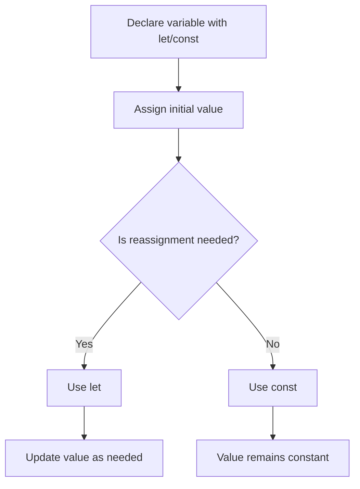

## Section 1: Variables, data types, and operators

Variables, data types, and operators are the foundation of all JavaScript code—including every React Native app. Mastering these basics is essential for building reliable, maintainable features in your SpeedyMeds project and for understanding how data flows and changes in your application.

> 
> **TIP:**
> 
> Experienced JavaScript developers may find many concepts in this section familiar. It's recommended to skim for review, focusing on React Native-specific nuances, the SpeedyMeds context, and any differences highlighted in Background Bridge Notes.

### What is a variable?

A variable is a named container for storing data that your program can use and modify. In JavaScript (and React Native), variables allow you to keep track of information such as a patient's name, a medication's dosage, or whether a prescription is active. Variables are declared using the `let` and `const` keywords (introduced in ES6), or the older `var` keyword (now discouraged).

#### Declaring variables: let, const, and var

| Keyword | Scope         | Reassignment | Redeclaration | Hoisting   | Best Practice                |
|---------|---------------|--------------|---------------|------------|------------------------------|
| let     | Block         | Yes          | No            | No         | Use for variables that change |
| const   | Block         | No           | No            | No         | Use for values that never change |
| var     | Function/Global| Yes         | Yes           | Yes        | Avoid in modern code         |

- **let**: Declares a block-scoped variable that can be reassigned.
- **const**: Declares a block-scoped variable that cannot be reassigned (the value is constant). However, for objects and arrays, the contents can still be changed.
- **var**: Declares a function-scoped variable. It is hoisted and can be redeclared, which often leads to bugs. Avoid using `var` in modern JavaScript.

> 
> **IMPORTANT:**
> 
> Always prefer `const` by default. Use `let` only when you know the variable's value will change. Avoid `var` entirely in new code.

> 
> **Background Bridge Note (Native Developers):**
> 
> **Comparison:** In Java, Kotlin, or Swift, variables are declared with explicit types (e.g., `String patientName = ...` or `val patientName: String = ...`). In JavaScript, variables are dynamically typed and do not require a type declaration. `const` in JavaScript is similar to `final` in Java or `val` in Kotlin/Swift, but with important differences: `const` prevents reassignment, but does not make objects or arrays immutable.
> 
> **Key Takeaway:** JavaScript variables are flexible and can change type at runtime, but using `const` and `let` helps prevent many common bugs.

### Data types in JavaScript

JavaScript supports several built-in data types. Understanding these is crucial for managing data in your React Native app.

| Type      | Example                | Description                                 |
|-----------|------------------------|---------------------------------------------|
| string    | 'Aspirin', "Rx123"     | Textual data                                |
| number    | 42, 3.14, -7           | Numeric values (integer and floating point) |
| boolean   | true, false            | Logical values                              |
| null      | null                   | Explicitly no value                         |
| undefined | undefined              | Variable declared but not assigned          |
| object    | { name: 'Ibuprofen' }  | Key-value pairs, complex data               |
| array     | [1, 2, 3], ['Rx']      | Ordered list of values                      |
| symbol    | Symbol('id')           | Unique, immutable identifier                |
| bigint    | 12345678901234567890n  | Arbitrarily large integers                  |

- **string**: Used for text, such as medication names or patient notes.
- **number**: Used for all numeric values, including dosages and prices.
- **boolean**: Represents true/false, such as whether a prescription is active.
- **null**: Represents an intentional absence of value.
- **undefined**: Indicates a variable has been declared but not assigned a value.
- **object**: Used for structured data, such as a medication record.
- **array**: Used for lists, such as a patient's list of prescriptions.
- **symbol**: Used for unique property keys (rare in React Native apps).
- **bigint**: Used for very large integers (rare in most mobile apps).

You can check a variable's type using the `typeof` operator:

```javascript
const medicationName = 'Aspirin';
console.log(typeof medicationName); // 'string'
```

> 
> **Background Bridge Note (Statically Typed Developers):**
> 
> **Comparison:** In statically typed languages (Java, Kotlin, Swift, TypeScript), you must declare a variable's type. JavaScript is dynamically typed: a variable can hold any type, and its type can change at runtime. This flexibility is powerful but can lead to bugs if not managed carefully.
> 
> **Key Takeaway:** Always be mindful of what type a variable holds, and use clear naming and structure to avoid confusion. TypeScript (introduced in Module 6) adds static typing to JavaScript for safer code.

### Operators in JavaScript

Operators are special symbols or keywords that perform operations on values. The most common types are:

| Operator Type   | Example         | Description                                 |
|-----------------|----------------|---------------------------------------------|
| Assignment      | =              | Assigns a value to a variable               |
| Arithmetic      | +, -, *, /, %  | Math operations (add, subtract, etc.)       |
| Comparison      | ==, ===, !=, !==, >, <, >=, <= | Compare values         |
| Logical         | &&, ||, !      | Logical AND, OR, NOT                        |
| typeof          | typeof x       | Returns the type of a variable              |

- **Assignment (`=`):** Sets a variable's value.
- **Arithmetic (`+`, `-`, `*`, `/`, `%`):** Perform math operations.
- **Comparison (`==`, `===`, `!=`, `!==`, `>`, `<`, `>=`, `<=`):** Compare values. Use `===` and `!==` for strict comparison (no type coercion).
- **Logical (`&&`, `||`, `!`):** Combine or invert boolean values.
- **typeof:** Returns a string indicating the type of a variable.

> 
> **CAUTION:**
> 
> The `==` operator performs type coercion, which can lead to unexpected results. Always use `===` (strict equality) unless you have a specific reason to allow type conversion.

> 
> **Background Bridge Note (Web Developers - React/Angular):**
> 
> **Comparison:** JavaScript's loose typing and operator behavior can differ from TypeScript or other strongly typed languages. In React Native, always use strict equality (`===`) and clear variable naming to avoid subtle bugs, especially when handling user input or API data.
> 
> **Key Takeaway:** Prefer strict operators and explicit checks for safer, more predictable code.

### Example: Managing medication data with variables and operators

The following example demonstrates how to declare variables for a medication, use different data types, and perform operations relevant to the SpeedyMeds pharmacy context.

```javascript
// Declare a constant for the medication name (string)
const medicationName = 'Amoxicillin';

// Declare a variable for the dosage (number)
let dosageMg = 500;

// Boolean to track if the prescription is active
let isActive = true;

// Array of refill dates (strings)
const refillDates = ['2024-06-01', '2024-07-01'];

// Object representing a prescription
const prescription = {
  patientName: 'Jane Doe',
  medication: medicationName,
  dosage: dosageMg,
  isActive: isActive,
  refills: refillDates,
};

// Increase dosage by 250mg (arithmetic operator)
dosageMg = dosageMg + 250;

// Check if prescription is active and dosage is above 500mg (logical and comparison operators)
if (prescription.isActive && prescription.dosage > 500) {
  console.log('High dosage active prescription for', prescription.patientName);
}

// Use typeof to check data types
console.log(typeof medicationName); // 'string'
console.log(typeof dosageMg);       // 'number'
console.log(typeof isActive);       // 'boolean'
console.log(typeof prescription);   // 'object'
```

This code snippet shows how to use `const` and `let` to declare variables for different types of data in a pharmacy app. The `medicationName` is a string and does not change, so it uses `const`. The `dosageMg` variable is declared with `let` because the dosage may change (for example, if a doctor updates the prescription). The `isActive` boolean tracks whether the prescription is currently valid. The `refillDates` array holds a list of dates as strings, and the `prescription` object groups all related data together.

Arithmetic operators are used to update the dosage, and logical/comparison operators check if the prescription is both active and above a certain dosage. The `typeof` operator is used to print out the type of each variable, which is helpful for debugging and understanding your data. This approach mirrors real-world scenarios in the SpeedyMeds app, where you need to manage and update patient and medication information safely and predictably.

### Diagram: Variable declaration and assignment flow



The diagram above illustrates the decision process for declaring variables in JavaScript. You start by deciding whether you need to reassign the variable's value later. If so, use `let`—this is common for values that change, such as a medication's dosage or a patient's current prescription status. If the value should never change (like a medication's name or a unique prescription ID), use `const`. This approach helps prevent accidental changes to important data and makes your code more predictable and easier to debug. In React Native and the SpeedyMeds app, following this pattern ensures that your state and logic remain clear and maintainable as your application grows.

> **Official Documentation:**
> * [MDN: let](https://developer.mozilla.org/en-US/docs/Web/JavaScript/Reference/Statements/let)
> * [MDN: const](https://developer.mozilla.org/en-US/docs/Web/JavaScript/Reference/Statements/const)
> * [MDN: var](https://developer.mozilla.org/en-US/docs/Web/JavaScript/Reference/Statements/var)
> * [MDN: Data types](https://developer.mozilla.org/en-US/docs/Web/JavaScript/Data_structures)
> * [MDN: Operators](https://developer.mozilla.org/en-US/docs/Web/JavaScript/Guide/Expressions_and_Operators)
> * [MDN: typeof](https://developer.mozilla.org/en-US/docs/Web/JavaScript/Reference/Operators/typeof)

**(https://codesandbox.io/s/js-variables-types-operators-speedymeds-exercise)**
