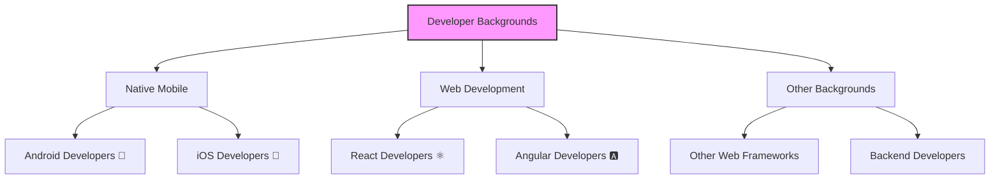

## Section 2: Target Audience and Prerequisites

This section clarifies who this course is designed for and what foundational knowledge will help you get the most out of it.

### Who This Course Is For

This course is designed for developers from various backgrounds who want to learn or improve their React Native skills. The course materials adapt to accommodate the following backgrounds:

This diagram illustrates the diverse **Developer Backgrounds** this course is designed to accommodate, ensuring a tailored learning experience. The central node, "Developer Backgrounds" (highlighted for focus), branches into three primary categories: **Native Mobile** developers, those from **Web Development**, and individuals with **Other Backgrounds**. Specifically, under Native Mobile, we cater to **Android Developers (🤖)** familiar with Java/Kotlin and **iOS Developers (🍏)** experienced with Swift/Objective-C. Within Web Development, we address **React Developers (⚛️)** who can leverage their existing framework knowledge, and **Angular Developers (🅰️)** bringing TypeScript and web principles. The "Other Backgrounds" category acknowledges developers from **Other Web Frameworks** (like Vue or Svelte) and **Backend Developers** transitioning to mobile. Throughout the course, specialized "Background Bridge Notes" will connect new React Native concepts to the existing knowledge paradigms of these distinct groups, facilitating a smoother learning curve for everyone.

#### Native Mobile Developers

- **Android Developers (🤖)**: If you have experience with Java or Kotlin for Android development, you'll find familiar concepts around native components, lifecycle management, and the Android build process. The course will help you bridge your existing knowledge to React Native's declarative, component-based architecture.

- **iOS Developers (🍏)**: If you're coming from Swift or Objective-C, you'll recognize concepts related to native UI components, view controllers, and iOS tooling. The course will guide you through the mental shift to React's component model and JavaScript-based development.

#### Web Developers

- **React Developers (⚛️)**: Your existing knowledge of React fundamentals gives you an advantage, as React Native shares the same component model, state management concepts, and lifecycle patterns. The course will help you apply your React knowledge to mobile development and understand the key differences in layout, navigation, and platform capabilities.

- **Angular Developers (🅰️)**: While React Native uses a different component model and state management approach than Angular, your understanding of TypeScript and general web development principles will transfer well. The course provides necessary background on React concepts while leveraging your existing programming skills.

#### Other Backgrounds

- **Other Web Frameworks**: If you're familiar with Vue, Svelte, or other modern JavaScript frameworks, you'll find many concepts transferable. The course provides sufficient React introduction.

- **Backend Developers**: Your programming foundations will serve you well, though you'll need to adopt front-end and mobile development patterns. The course starts with necessary web fundamentals.

> 📚 **Official Documentation:**
>
> - [React Native: Introduction](https://reactnative.dev/docs/getting-started)
> - [Expo: Introduction](https://docs.expo.dev/)
> - [React: Getting Started](https://react.dev/learn)

### Prerequisites

To successfully complete this course, you should have:

#### Essential Prerequisites

- **Programming fundamentals**: Variables, functions, conditionals, loops, and data structures
- **Basic JavaScript knowledge**: Function syntax, object manipulation, arrays, and asynchronous operations (we'll review these concepts in Module Five)
- **Command-line basics**: Navigating directories, running commands
- **Text editor or IDE experience**: VS Code is recommended and used throughout the examples

#### Helpful But Not Required

- **React experience**: We'll cover React essentials in Module Seven, but prior experience will accelerate your learning
- **TypeScript fundamentals**: Introduced in Module Six
- **Git basics**: Useful for version control but not essential for following the course
- **HTML/CSS knowledge**: Helpful for understanding web-to-mobile transitions (briefly covered in Module Four)

> [!IMPORTANT]
> This course assumes no prior knowledge of React Native or Expo. All concepts are built from the ground up. However, complete beginners to programming may find the pace challenging.

### Required Hardware and Software

To fully participate in this course, you'll need:

#### Hardware

- **Computer**: macOS, Windows, or Linux (macOS required for iOS development)
- **Mobile device**: Optional but helpful for testing (can use iOS Simulator or Android Emulator)

#### Software (We'll help you install these in Module Three)

- **Node.js** (LTS version)
- **npm** or **yarn** package manager
- **VS Code** or your preferred code editor
- **Expo CLI**
- **Xcode** (macOS only, for iOS development)
- **Android Studio** (optional, for Android development)

> 📲 **(Native Developers):**
>
> **Comparison:** Unlike traditional native development, React Native with Expo significantly reduces the complexity of setting up your development environment. You won't need to configure complex build systems or manage signing identities/keystores initially.
>
> **Key Takeaway:** Expo abstracts away much of the native toolchain configuration, though you'll still need Xcode or Android Studio installed for simulator/emulator access.
>
> **Source:** [Expo Installation Requirements](https://docs.expo.dev/get-started/installation/)

> 🌐 **(Web Developers):**
>
> **Comparison:** The React Native environment setup is more involved than web development's "browser-only" approach, requiring native toolchains and mobile simulators/emulators.
>
> **Key Takeaway:** While more complex than web development setup, React Native with Expo offers substantial simplification compared to traditional native app development.
>
> **Source:** [React Native Environment Setup](https://reactnative.dev/docs/environment-setup)

> 🧑‍🏫 **(Instructor-Led):** Your instructor may have already set up a development environment in the classroom or lab. Check with them about specific software versions and configurations used for the course.

> 🧗‍♀️ **(Self-Led):** Consider setting up your environment early, even before reaching Module Three. This gives you time to troubleshoot any issues that might arise, especially if you're on a less common operating system.

Now that you understand who this course is designed for and what prerequisites you need, let's explore how to effectively navigate the course materials.
