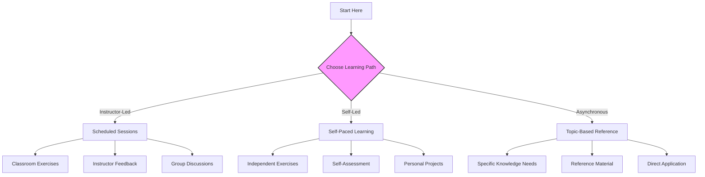

## Section 3: How to Use This Course

This section explains the different learning paths, course structure, and tools you'll encounter throughout your React Native learning journey.

### Learning Paths

This course supports three primary learning paths, each with a slightly different approach:

This diagram illustrates the three different approaches to navigating this course. You can select the path that best matches your learning situation and preferences.

#### Instructor-Led Path (🧑‍🏫)

If you're taking this course with an instructor:

- **Scheduled sessions**: Follow the module sequence as planned by your instructor
- **Real-time interaction**: Ask questions and participate in discussions
- **Guided exercises**: Receive immediate feedback on your work
- **Collaborative challenges**: Work through problems with peers
- **Personalized support**: Get help with specific issues during lab time

> 🧑‍🏫 **(Instructor-Led):** Prepare for each session by reviewing the module objectives and prerequisites. Take notes on questions that arise during pre-reading so you can ask your instructor.

#### Self-Led Path (🧗‍♀️)

If you're working through the course independently at your own pace:

- **Flexible timing**: Progress according to your own schedule
- **Self-assessment**: Use exercise solutions to verify your understanding
- **Focused learning**: Spend more time on areas that challenge you
- **Practical application**: Complete all exercises and challenges to reinforce learning
- **Community support**: Use forums or discussion channels if available

> 🧗‍♀️ **(Self-Led):** Set a consistent schedule for your learning. Try to work on this course regularly (e.g., 3-4 times per week) rather than in marathon sessions. Test your understanding by explaining concepts to yourself or others.

> [!IMPORTANT]
> If you're following the self-led path, it's especially crucial to complete all exercises and challenges. These practical activities solidify your understanding and build the muscle memory needed for React Native development.

#### Asynchronous Path (🔁)

If you're accessing specific modules or sections as reference material:

- **Targeted learning**: Focus on specific topics you need to understand
- **Quick reference**: Use module summaries and code examples
- **Independent modules**: Access content without strict prerequisites
- **Apply as needed**: Incorporate knowledge directly into your projects

> 🔁 **(Asynchronous):** While modules build upon each other, each section includes enough context to be valuable independently. Pay special attention to the "Prerequisites" listed for each module to ensure you have the necessary background.

### Course Structure and Navigation

#### Modules and Sections

The course is organized into twenty modules, each focusing on a specific aspect of React Native development:

- **Modules 0-1**: Introduction and mobile development context
- **Modules 2-7**: Foundations (architecture, environment setup, JS/TS/React essentials)
- **Modules 8-13**: Core React Native (components, APIs, styling, navigation, forms, state)
- **Modules 14-17**: Advanced topics (native modules, performance, EAS, animations)
- **Modules 18-19**: Capstone project and wrap-up

Each module contains multiple sections that break down the topic into manageable concepts.

> 📚 **Official Documentation:**
>
> - [React Native: Getting Started](https://reactnative.dev/docs/getting-started)
> - [Expo: Documentation](https://docs.expo.dev/)
> - [React Navigation: Fundamentals](https://reactnavigation.org/docs/getting-started/)

#### Special Content Elements

Throughout the course, you'll encounter several types of special content:

##### Callouts

Information boxes highlight important points:

> [!NOTE]
> Supplementary information you should be aware of.

> [!TIP]
> Optional advice for better practices or shortcuts.

> [!IMPORTANT]
> Essential information required for success.

> [!CAUTION]
> Guidance about potential issues that might occur.

> [!WARNING]
> Serious warnings about risky actions with significant consequences.

##### Background Bridge Notes

These notes help connect React Native concepts to your existing knowledge:

> 📲 **(Native Developers):**
>
> **Comparison:** Explains how a React Native concept relates to native development.
>
> **Key Takeaway:** The most important difference or similarity.
>
> **Source:** [Official Android Documentation on Activities](https://developer.android.com/guide/components/activities/intro-activities)

> 🌐 **(Web Developers):**
>
> **Comparison:** Explains how a React Native concept relates to web development.
>
> **Key Takeaway:** The most important difference or similarity.
>
> **Source:** [MDN Web Docs: Event Loop](https://developer.mozilla.org/en-US/docs/Web/JavaScript/EventLoop)

##### Learning Path Guidance

These notes provide specific advice for different learning approaches:

> 🧑‍🏫 **(Instructor-Led):** Guidance specific to classroom environments.

> 🧗‍♀️ **(Self-Led):** Tips for independent learners.

> 🔁 **(Asynchronous):** Advice for reference-based learning.

> 🛣️ **(All Learners):** Guidance applicable to everyone.

##### Official Documentation Links

Boxes highlighting essential external resources:

> 📚 **Official Documentation:**
>
> - [React Native Docs: Component](https://reactnative.dev/docs/components-and-apis)
> - [Expo Docs: Module](https://docs.expo.dev/)

### Exercises and Challenges

The course includes two types of practical activities:

#### Exercises (15-20 minutes)

Short, focused practice activities that reinforce specific concepts. You'll find these within sections. Exercises typically:

- Focus on a single concept or technique
- Provide clear step-by-step instructions
- Include starter code when needed
- Offer immediate feedback or solutions for verification

> [!TIP]
> Don't skip exercises! They're designed to reinforce the concepts immediately after learning them, which significantly improves retention and understanding.

#### Challenges (30-60 minutes)

More complex activities at the end of modules that integrate multiple concepts. Challenges typically:

- Require applying several concepts together
- Present a problem without step-by-step instructions
- Test deeper understanding and problem-solving
- Connect to the SpeedyMeds capstone project theme

### Tools and Platforms

Throughout the course, you'll use various tools:

#### Coding Environments

- **CodeSandbox**: Used for JavaScript, TypeScript, and React fundamentals in early modules
- **Expo Snack**: Browser-based React Native playground for React Native-specific exercises
- **Local Development**: Your own environment for deeper exploration and the capstone project

#### Assessment Tools

- **Microsoft Forms**: Used for quizzes and knowledge checks
- **Microsoft Whiteboard**: Used for diagramming exercises

#### Source Code Access

- **GitHub**: Contains starter code templates and solutions where applicable

> [!TIP]
> When using Expo Snack or CodeSandbox, save your work frequently by forking or creating an account. This prevents losing your progress.

### How to Approach Each Module

For the most effective learning experience:

1. **Preview**: Read the module introduction and learning objectives
2. **Engage**: Work through each section sequentially
3. **Practice**: Complete all exercises as you encounter them
4. **Apply**: Finish the module challenge to solidify understanding
5. **Review**: Revisit the module summary to reinforce key points
6. **Extend**: Explore the additional resources if you want to go deeper

Now that you understand how to navigate the course, let's explore the specific components and terminology you'll encounter.
