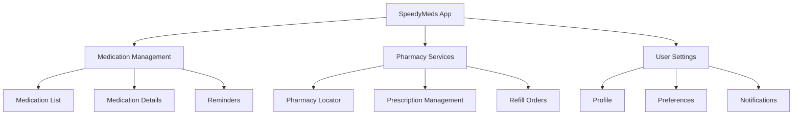

## Section 4: Course Components and Terminology

This section introduces the key terminology used throughout the course and explains important concepts you'll encounter as you learn React Native.

### React Native Ecosystem Terminology

To ensure clarity throughout the course, we'll consistently use these key terms:

| Term               | Definition                                                                                                                          |
| ------------------ | ----------------------------------------------------------------------------------------------------------------------------------- |
| **React Native**   | The framework that allows you to build native mobile applications using JavaScript and React.                                       |
| **Expo**           | A platform and set of tools built around React Native that simplifies development, building, and deployment.                        |
| **Component**      | Reusable UI building blocks. Divided into Core Components (provided by React Native) and Custom Components (created by developers). |
| **Props**          | (Properties) Data passed down from parent to child components.                                                                      |
| **State**          | Data managed within a component that can change over time.                                                                          |
| **Hook**           | Functions allowing functional components to use state and lifecycle features.                                                       |
| **Native Modules** | Platform-specific code (Swift/Objective-C for iOS, Kotlin/Java for Android) bridged for use in React Native.                        |
| **JSI**            | JavaScript Interface - The C++ layer enabling synchronous communication between JavaScript and native code in the New Architecture. |
| **Expo Go**        | The client app used for development and testing Expo projects without native builds.                                                |
| **Exercise**       | Short, focused practice activity (15-20 mins).                                                                                      |
| **Challenge**      | More complex application of concepts (30-60 mins).                                                                                  |

> 📚 **Official Documentation:**
>
> - [React Native: Core Components and APIs](https://reactnative.dev/docs/components-and-apis)
> - [Expo: SDK Documentation](https://docs.expo.dev/versions/latest/)
> - [React: Main Concepts](https://react.dev/learn)

### Core Technologies

- **React Native**: The framework that allows you to build native mobile applications using JavaScript and React.
- **Expo**: A platform and set of tools built around React Native that simplifies development, building, and deployment.
- **React**: The underlying JavaScript library for building user interfaces that React Native extends for mobile development.
- **JavaScript**: The primary programming language used in React Native development.
- **TypeScript**: A strongly-typed superset of JavaScript that provides additional safety and developer tooling.

### React Concepts

- **Component**: Reusable UI building blocks. We distinguish between:
  - **Core Components**: Provided by React Native (e.g., `<View>`, `<Text>`)
  - **Custom Components**: Created by developers
- **Props**: (Properties) Data passed down from parent to child components.
- **State**: Data managed within a component that can change over time.
- **Hook**: Functions allowing functional components to use state and lifecycle features.
  - **Core Hooks**: Provided by React (e.g., `useState`, `useEffect`)
  - **Custom Hooks**: Created by developers

### React Native Specific Terms

- **Native Modules**: Platform-specific code (Swift/Objective-C for iOS, Kotlin/Java for Android) bridged for use in React Native.
- **JSI (JavaScript Interface)**: The C++ layer enabling synchronous communication between JavaScript and native code in the New Architecture.
- **Fabric**: The New Architecture's rendering system.
- **Codegen**: The tool generating interface code between JS/TS and native modules in the New Architecture.
- **Expo Go**: The client app used for development and testing Expo projects without native builds.
- **Simulator (iOS) / Emulator (Android)**: Software for running mobile apps on a desktop.

> [!NOTE]
> The distinction between the Legacy Architecture (Bridge) and New Architecture (JSI, Fabric) is important. We'll cover these concepts in detail in Module 2.

### Development and Styling

- **StyleSheet**: React Native's API for creating styles.
- **Styled Components**: The specific CSS-in-JS library used for styling in this course.
- **React Native Paper**: The UI component library used in this course.

### State Management and Navigation

- **TanStack Query (useQuery)**: The library used for server state management.
- **Zustand**: The library used for client state management (alternative to Context API).
- **Context API**: React's built-in state management solution.
- **Expo Router**: File-based routing solution built on React Navigation.
- **React Navigation**: Library for handling navigation stacks, tabs, drawers.

### Course-Specific Terms

- **Exercise**: Short, focused practice activity (15-20 mins).
- **Challenge**: More complex application of concepts (30-60 mins).
- **Module**: A major topical unit of the course.
- **Section**: A subdivision within a module, focusing on a specific concept or API.

## Important Concepts and Conventions

### SpeedyMeds Capstone Project

Throughout the course, examples and exercises will be connected to the SpeedyMeds theme - a fictional medication management application. This consistent theme provides real-world context for applying React Native concepts. The app includes features like:

- Medication list and details
- Prescription management
- Refill reminders
- Medication tracking
- Pharmacy locator

This diagram shows the main feature areas of the SpeedyMeds app that we'll build throughout the course. This model helps provide consistent context for the examples and exercises.

### Code Conventions

All code examples follow these conventions:

- **TypeScript** is used for all examples from Module Six onwards
- **Functional components** are preferred over class components
- **Modern React patterns** (hooks, context) are emphasized
- **Expo** features and workflows are used throughout
- **Consistent styling** approaches within each example

### Visual Elements

The course includes various visual elements to enhance learning:

- **Diagrams**: Illustrate architectural concepts, data flows, and component relationships
- **Screenshots**: Show expected UI output and setup steps
- **Code snippets**: Demonstrate specific implementation techniques

## Course Technologies

This course teaches the following target technologies and versions:

- **React Native**: Latest stable (0.7x+)
- **Expo SDK**: Latest stable (52+)
- **React Navigation**: v6
- **React Native Paper**: v5
- **TanStack Query**: v5
- **Zustand**: v4+
- **TypeScript**: Latest stable

> [!NOTE]
> While the course targets specific versions, the concepts apply broadly. Changes to APIs or best practices in newer versions will be noted where significant.

> 📚 **Official Documentation:**
>
> - [React Navigation Documentation](https://reactnavigation.org/docs/getting-started)
> - [React Native Paper](https://callstack.github.io/react-native-paper/)
> - [TanStack Query (React Query)](https://tanstack.com/query/latest)
> - [Zustand State Management](https://github.com/pmndrs/zustand)
> - [TypeScript Handbook](https://www.typescriptlang.org/docs/handbook/intro.html)

Now that you're familiar with the key terminology and course components, let's prepare your development environment.
