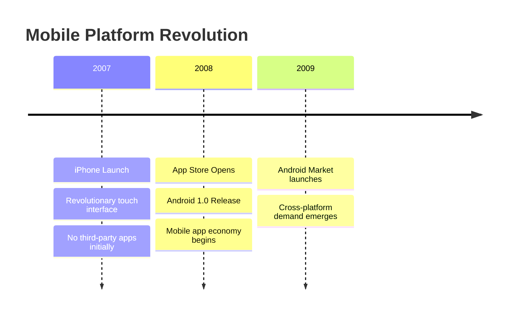

## History of mobile platforms

Understanding where we've been helps us appreciate where we are today. Let's take a journey through the evolution of mobile platforms, from the earliest PDAs to the powerful smartphones in our pockets.

### The early pioneers (1990s-2000s)

Remember when mobile devices were just for making calls? The journey to today's smartphones started with Personal Digital Assistants (PDAs) that could barely fit in your pocket. These early devices laid the groundwork for everything that followed.

#### The PDA era

The 1990s introduced devices like:

- **Apple Newton** (1993) - Revolutionary for its time with handwriting recognition
- **Palm Pilot** (1996) - Made PDAs mainstream with its simplicity
- **IBM Simon** (1994) - The first device we'd recognize as a "smartphone" today

> **📖 OFFICIAL DOCUMENTATION**  
> While these platforms are historical, understanding their constraints helps us appreciate modern mobile development. For a deeper dive into mobile OS evolution, check out the [Android Developers History](https://developer.android.com/about/versions) and [Apple's iOS History](https://developer.apple.com/ios/).

### The pre-smartphone operating systems

Before iOS and Android dominated, several platforms competed for market share:

#### Symbian OS (1998-2014)
- **Market leader**: Held 67% global market share in 2006
- **Development**: Used C++ with complex memory management
- **Challenges**: Fragmented UI platforms (S60, UIQ, MOAP) made development difficult

```typescript
// Symbian development was notoriously complex
// This is what a simple "Hello World" looked like:
class CHelloWorldAppUi : public CAknAppUi {
public:
    void ConstructL();
private:
    // Cleanup stack and descriptors made development challenging
    void HandleCommandL(TInt aCommand);
};
```

#### BlackBerry OS (1999-2013)
- **Focus**: Email and secure communication
- **Development**: Java ME (Micro Edition)
- **Innovation**: Push email and physical keyboards

#### Windows Mobile (2000-2010)
- **Approach**: Desktop Windows experience on mobile
- **Development**: .NET Compact Framework
- **Legacy**: Paved the way for cross-platform C# development

#### Palm OS (1996-2009)
- **Philosophy**: Simplicity and efficiency
- **Development**: C/C++ with limited resources
- **Impact**: Proved mobile apps could be powerful yet simple

### 🍏 iOS Developer Perspective

If you're coming from iOS development, you'll appreciate how the iPhone's 2007 launch revolutionized mobile UX. The introduction of:
- Multi-touch gestures
- The App Store (2008)
- Objective-C SDK

These innovations set the standard for modern mobile development.

### 🤖 Android Developer Perspective

Android developers will recognize how Google's 2008 entry democratized mobile development with:
- Open-source philosophy
- Java-based development
- Support for multiple screen sizes from day one

### The paradigm shift (2007-2008)

Two events changed mobile development forever:



### Why early platforms failed

The demise of early mobile platforms teaches us valuable lessons:

1. **Developer experience matters**: Symbian's complex C++ and expensive tools created high barriers
2. **Fragmentation kills ecosystems**: Multiple incompatible UI layers frustrated developers
3. **Distribution is crucial**: Lack of unified app stores limited growth
4. **User experience wins**: Touch interfaces made keyboards obsolete

> **💡 TIP**  
> Understanding these historical challenges helps explain why React Native's "learn once, write anywhere" philosophy resonated so strongly with developers.

### The modern duopoly emerges

By 2010, iOS and Android had effectively conquered the mobile market:

#### iOS: The walled garden
- **Philosophy**: Premium experience, curated ecosystem
- **Development**: Initially Objective-C, now Swift
- **Design**: Human Interface Guidelines ensure consistency

#### Android: The open ecosystem  
- **Philosophy**: Flexibility, hardware diversity
- **Development**: Initially Java, now Kotlin preferred
- **Design**: Material Design provides visual language

### What this means for you

Understanding this history reveals why cross-platform development became essential:

- **Market reality**: Two dominant platforms means double the work
- **Business need**: Companies want to reach all users
- **Developer desire**: Nobody wants to write the same app twice
- **Technical challenge**: How to share code while feeling native?

> **🎯 IMPORTANT**  
> This historical context explains why React Native's approach - using JavaScript to create truly native apps - was revolutionary. It wasn't just another hybrid solution; it was a new paradigm.

### SpeedyMeds perspective

Imagine if SpeedyMeds had to build their pharmacy app in 2005:
- Separate teams for Symbian, BlackBerry, Palm, and Windows Mobile
- Different codebases for each platform
- Inconsistent user experiences
- Massive development costs

Today, with React Native, SpeedyMeds can:
- Use one team for both iOS and Android
- Share 80-95% of their code
- Deliver consistent experiences
- Launch features simultaneously

### Looking ahead

The evolution from fragmented platforms to today's duopoly created the perfect environment for React Native. In the next section, we'll explore how developers started bridging the platform gap and why cross-platform development became not just desirable, but essential.

---

**Next up**: [The rise of cross-platform development →](section-02-rise-of-cross-platform.md)