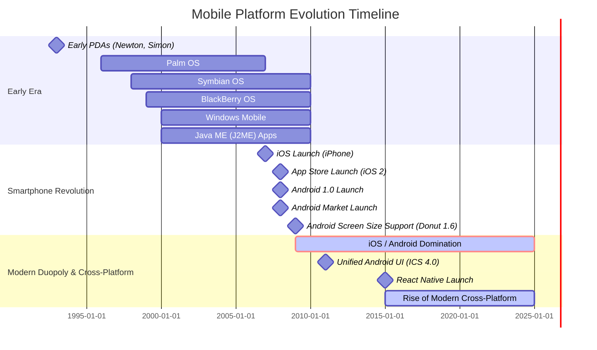

## Section 1: A Brief History of Mobile Platforms (Pre-Smartphone to Modern OS)

This section takes a look back at the evolution of mobile platforms. Understanding this history helps appreciate the context in which modern mobile operating systems like iOS and Android, and development frameworks like React Native, emerged.

The diagram above illustrates the major eras and milestones in mobile platform history. From early PDAs and fragmented operating systems like Symbian and Palm OS, the launch of iOS in 2007 and Android in 2008 marked a revolutionary shift. Key moments like the App Store launch and Android's support for varied screen sizes solidified their dominance. This set the stage for the modern era, characterized by the iOS/Android duopoly and the subsequent rise of cross-platform solutions like React Native starting around 2015. This timeline helps visualize the rapid evolution and the context for today's development landscape.

### The Early Days: Before Smartphones

Before the sleek touchscreens we use today, mobile devices were much simpler. Early mobile phones primarily focused on voice calls and basic text messaging (SMS). Mobile applications, as we know them, didn't really exist, though early PDAs like the Apple Newton pioneered concepts like touch interaction.

- **WAP (Wireless Application Protocol):** This was an early standard for accessing information over a mobile wireless network. WAP browsers allowed users to view basic, text-heavy web pages specifically designed for mobile constraints (low bandwidth, small screens, limited processing power). It was a step towards mobile data, but the experience was far from the rich internet access we have now.
- **Java ME (J2ME - Java Platform, Micro Edition):** This platform allowed developers to create small applications (often called "midlets") that could run on a variety of feature phones. This was a significant step, enabling basic games, utilities, and applications. However, distribution was fragmented, capabilities were limited by the hardware, and development could be complex.

### The First Smartphones Emerge

The late 1990s and early 2000s saw the arrival of devices that blurred the line between phones and personal digital assistants (PDAs). These early smartphones offered more advanced features like email, web browsing (though still limited), and the ability to run more complex third-party applications.

- **Symbian OS:** Popularized by Nokia and originating from Psion's EPOC, Symbian held a dominant market share for years. Development often involved a complex variant of C++, presenting significant hurdles for developers due to unique platform conventions and, initially, costly tools. Fragmentation across different UI layers (like S60 and UIQ) further complicated development.
- **BlackBerry OS:** Developed by Research In Motion (RIM), it was known for its physical keyboards and push email capabilities, becoming indispensable for business users. Development primarily used Java ME with BlackBerry-specific APIs.
- **Windows Mobile (later Windows Phone):** Microsoft's entry, evolving from Windows CE, aimed to bring a Windows-like experience to phones. Developers could use C++ or C#/.NET Compact Framework.
- **Palm OS:** Powering Palm Pilot PDAs and later smartphones, Palm OS was known for its simplicity and efficiency on resource-constrained hardware. Development typically used C/C++.

### Seeds of Disruption: Why Early Platforms Faded

These early platforms laid the groundwork but ultimately struggled against the next wave. Their decline wasn't just about technology; complex development environments (like Symbian C++), fragmentation across devices and UI variants, and the lack of centralized, accessible app stores created significant barriers for developers and limited the growth of rich application ecosystems. This environment was ripe for disruption by platforms offering a more streamlined developer experience and better app distribution.

### The Revolution: iOS and Android

The mobile landscape changed dramatically with the introduction of Apple's iPhone in 2007 and the subsequent release of Android in 2008.

- **iOS (iPhone OS):** Launched with the first iPhone, iOS revolutionized the mobile experience with its capacitive multi-touch interface and mobile Safari browser. The App Store, introduced with iPhone OS 2 in 2008, created a centralized, easy-to-use platform for discovering, purchasing, and installing applications, fueling explosive growth in mobile app development. Key early features included Visual Voicemail (OS 1), Cut/Copy/Paste (OS 3), and Multitasking (iOS 4). Apple's Human Interface Guidelines (HIG) emphasized clarity and intuitive interaction.
- **Android:** Acquired by Google in 2005 and first released commercially in 2008, Android offered an open-source alternative. Its key features included tight integration with Google services, customizable interfaces, and support for a wide variety of hardware. The Android Market (now Google Play Store) provided a similar app distribution model. Crucial early milestones included the on-screen keyboard (Cupcake 1.5), support for multiple screen sizes (Donut 1.6), turn-by-turn navigation (Éclair 2.0), JIT compilation for performance (Froyo 2.2), NFC support (Gingerbread 2.3), and the unification of phone/tablet UIs (Ice Cream Sandwich 4.0). Google's Material Design guidelines evolved to provide a cohesive visual language.

The success of iOS and Android was driven by several factors: - **Intuitive User Interfaces:** Multi-touch gestures replaced complex button combinations. - **Powerful Hardware:** Enabled richer applications. - **Centralized App Stores:** Simplified app discovery, distribution, and monetization. - **Strong Developer Ecosystems:** Comprehensive SDKs, tools (Xcode, Android Studio), and documentation empowered developers.

### Ecosystem Lock-in and Modern Mobile OS Characteristics

The combination of intuitive hardware, powerful software, curated app stores, and distinct design philosophies (HIG, Material Design) created strong ecosystems around iOS and Android. This fostered user familiarity and investment, while developers gained platform-specific skills, leading to a degree of "ecosystem lock-in." This dominance established high barriers for new OS competitors and directly fueled the demand for cross-platform solutions that could target both major platforms efficiently.

Today, iOS and Android dominate the mobile market. Modern mobile operating systems share common characteristics:

- **App-Centric:** Mobile experiences are largely defined by the applications users install.
- **Sophisticated UI/UX:** Emphasis on smooth animations, intuitive navigation, and platform-specific design guidelines. Modern native UI toolkits include Apple's SwiftUI and Android's Jetpack Compose (a declarative toolkit built in Kotlin).
- **Rich APIs:** Provide developers access to device hardware (camera, GPS, sensors), platform services (notifications, location), and operating system features (like ARKit on iOS).
- **Regular Updates:** Continuous improvement through OS updates, introducing new features and security enhancements.
- **Focus on Security and Privacy:** Increasingly robust mechanisms to protect user data and control app permissions (like runtime permissions introduced in Android Marshmallow).

Understanding this evolution—from fragmented beginnings through revolutionary changes to the current robust, ecosystem-driven duopoly—highlights the increasing complexity and capability of mobile platforms. It sets the stage for the next section where we discuss the challenges and solutions for developing across these powerful, yet distinct, operating systems.
