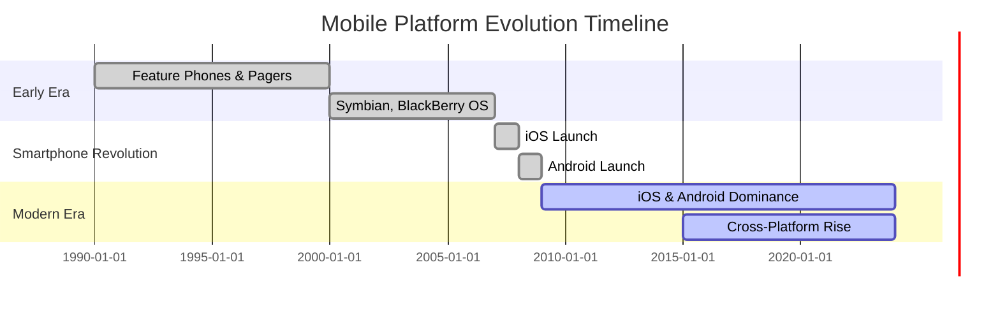

## Section 1: A Brief History of Mobile Platforms (Pre-Smartphone to Modern OS)

This section takes a look back at the evolution of mobile platforms. Understanding this history helps appreciate the context in which modern mobile operating systems like iOS and Android, and development frameworks like React Native, emerged.

The diagram above illustrates the major eras in mobile platform history. The early era was dominated by feature phones and proprietary systems, followed by the smartphone revolution with the launch of iOS and Android. Since 2009, iOS and Android have dominated, while the last decade has seen the rise of cross-platform frameworks. This timeline helps you visualize how quickly the landscape has shifted and why understanding this history is crucial for modern mobile development.

### The Early Days: Before Smartphones

Before the sleek touchscreens we use today, mobile devices were much simpler. Early mobile phones primarily focused on voice calls and basic text messaging (SMS). Mobile applications, as we know them, didn't really exist.

- **WAP (Wireless Application Protocol):** This was an early standard for accessing information over a mobile wireless network. WAP browsers allowed users to view basic, text-heavy web pages specifically designed for mobile constraints (low bandwidth, small screens, limited processing power). It was a step towards mobile data, but the experience was far from the rich internet access we have now.
- **Java ME (J2ME - Java Platform, Micro Edition):** This platform allowed developers to create small applications (often called "midlets") that could run on a variety of feature phones. This was a significant step, enabling basic games, utilities, and applications. However, distribution was fragmented, and capabilities were limited by the hardware.

### The First Smartphones Emerge

The late 1990s and early 2000s saw the arrival of devices that blurred the line between phones and personal digital assistants (PDAs). These early smartphones offered more advanced features like email, web browsing (though still limited), and the ability to run more complex third-party applications.

- **Symbian OS:** Popularized by Nokia, Symbian was a dominant mobile operating system for many years. It powered a wide range of devices and had a relatively developed application ecosystem for its time.
- **BlackBerry OS:** Known for its physical keyboards and push email capabilities, BlackBerry devices became indispensable tools for business users. BlackBerry OS had its own application platform and store.
- **Windows Mobile (later Windows Phone):** Microsoft's entry into the mobile OS space aimed to bring a Windows-like experience to phones. It allowed developers familiar with Windows tools to create mobile applications.
- **Palm OS:** Powering Palm Pilot PDAs and later smartphones, Palm OS was known for its efficiency and straightforward interface.

These early platforms laid the groundwork, introducing concepts like mobile apps and data connectivity, but they often suffered from fragmentation, limited hardware capabilities, and less intuitive user interfaces compared to modern standards.

### The Revolution: iOS and Android

The mobile landscape changed dramatically with the introduction of Apple's iPhone in 2007 and the subsequent release of Android.

- **iOS (iPhone OS):** Launched with the first iPhone, iOS revolutionized the mobile experience with its multi-touch interface, mobile Safari browser (offering a near-desktop web experience), and the concept of the App Store. The App Store, introduced in 2008, created a centralized, easy-to-use platform for discovering, purchasing, and installing applications, fueling explosive growth in mobile app development.
- **Android:** Developed by Google and first released in 2008, Android offered an open-source alternative to iOS. Its key features included tight integration with Google services, customizable interfaces, and support for a wide variety of hardware from different manufacturers. The Android Market (now Google Play Store) provided a similar app distribution model to Apple's App Store.

The success of iOS and Android was driven by several factors: - **Intuitive User Interfaces:** Multi-touch gestures replaced complex button combinations. - **Powerful Hardware:** Capacitive touchscreens, faster processors, and more memory enabled richer applications. - **Centralized App Stores:** Simplified app discovery, distribution, and monetization for developers and users. - **Strong Developer Ecosystems:** Comprehensive Software Development Kits (SDKs), tools, and documentation empowered developers to build innovative apps.

### Modern Mobile OS Characteristics

Today, iOS and Android dominate the mobile market. While they have distinct features and philosophies, modern mobile operating systems share common characteristics:

- **App-Centric:** Mobile experiences are largely defined by the applications users install.
- **Sophisticated UI/UX:** Emphasis on smooth animations, intuitive navigation, and platform-specific design guidelines (Material Design for Android, Human Interface Guidelines for iOS).
- **Rich APIs:** Provide developers access to device hardware (camera, GPS, sensors), platform services (notifications, location), and operating system features.
- **Regular Updates:** Continuous improvement through OS updates, introducing new features and security enhancements.
- **Focus on Security and Privacy:** Increasingly robust mechanisms to protect user data and control app permissions.

Understanding this evolution highlights the increasing complexity and capability of mobile platforms, setting the stage for the next section where we discuss the challenges and solutions for developing across these powerful, yet distinct, operating systems.