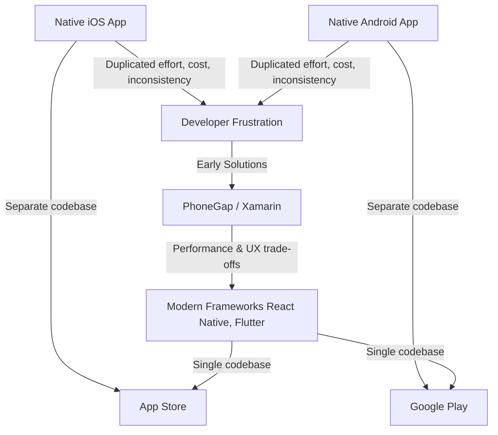

## Section 2: The Rise of Cross-Platform Development

Developing separate native applications for iOS and Android has long been the standard for achieving the best performance and platform integration. However, maintaining two distinct codebases requires significant time, resources, and specialized teams. This section explores the rise of cross-platform development as a solution to these challenges.

### What is Cross-Platform Development?

Cross-platform development is the practice of writing code once and deploying it on multiple platforms, such as iOS and Android, without needing to rewrite the application entirely for each operating system. The goal is to maximize code sharing while still delivering a high-quality user experience on each platform.

### Motivations for Going Cross-Platform

Several factors drive businesses and developers towards cross-platform solutions:

- **Cost Efficiency:** Maintaining a single codebase is generally less expensive than managing separate native teams and projects for iOS and Android.
- **Faster Development:** Reusing code significantly speeds up the development process, allowing for quicker time-to-market.
- **Wider Audience Reach:** Easily target users on both major mobile platforms simultaneously.
- **Code Consistency:** Ensures business logic and core features are consistent across platforms, reducing potential discrepancies.
- **Simplified Maintenance:** Updates and bug fixes can often be implemented once and deployed everywhere, streamlining the maintenance effort.

This diagram shows the evolution from native-only development—where separate codebases were required for iOS and Android—to early cross-platform solutions, and finally to modern frameworks like React Native and Flutter. The flow highlights the pain points that led to innovation and how today's tools enable developers to target both major platforms efficiently, with fewer trade-offs than ever before.

### Evolution of Cross-Platform Approaches

Cross-platform development isn't a single technique; various approaches have emerged over time, each with its own trade-offs:

1.  **Webviews / Hybrid Apps:**

    - **Concept:** These applications are essentially web applications (HTML, CSS, JavaScript) packaged inside a native container (a `WebView`). Originating with tools like PhoneGap (created in 2008, later becoming Apache Cordova), this approach allowed web developers to create installable mobile apps.
    - **Pros:** Leverages existing web development skills, very high code reuse, access to some native features via plugins.
    - **Cons:** Performance limitations (runs in a web browser view, not native components), difficulty accessing _all_ native device features, often doesn't feel truly "native" in terms of UI/UX, potential plugin maintenance issues.

2.  **Compiled to Native Code:**

    - **Concept:** Developers write code in one language (like JavaScript with React Native, Dart with Flutter, or C# with .NET MAUI), which is then compiled or interpreted to interact with native UI components and APIs.
    - **Pros:** Achieves near-native performance and look-and-feel, allows access to native device features (often via bridges or modules), significant code reuse.
    - **Cons:** May require learning a specific framework or language, potential abstraction layer overhead, might still need platform-specific adjustments or native modules for certain features.

3.  **Progressive Web Apps (PWAs):**
    - **Concept:** Web applications that utilize modern web capabilities to provide an app-like experience directly through the browser. They leverage specific technologies like:
      - **Web App Manifest:** A JSON file defining app metadata (name, icons, start URL, display mode) for installation and presentation.
      - **Service Workers:** Background JavaScript proxies that intercept network requests, enabling offline caching and push notifications.
      - **HTTPS:** Mandatory for security, especially for Service Workers.
    - **Pros:** No app store submission needed, highly shareable via URL, leverages web technologies, always up-to-date.
    - **Cons:** Limited access to native device features compared to compiled or native apps, platform support/feature consistency can lag (especially on iOS), discovery might be harder without an app store presence, performance tied to browser.

### The Spectrum of Nativeness

It's helpful to think of these approaches on a spectrum based on how closely they interact with the native platform:

- **PWAs:** Operate entirely within the browser sandbox, offering maximum web code reuse but minimal native integration.
- **Hybrid Apps (WebView):** Use a native wrapper, allowing app store distribution and plugin-based access to some native features, but UI rendering relies on web tech.
- **Compiled Cross-Platform (React Native, Flutter, etc.):** Employ sophisticated techniques (bridges, custom rendering engines) to achieve near-native performance and UI while maximizing code reuse.
- **Native Apps:** Written using platform-specific SDKs (iOS/Android), offering optimal performance and full feature access but requiring separate codebases.

The limitations of early approaches like PWAs and hybrid apps (especially around performance and UX) were key drivers for the development of modern compiled frameworks like React Native, which aim to deliver a more native-like result while retaining cross-platform efficiency.

> 🤖🍏 **(Native Developers):**
>
> **Comparison:** Cross-platform development contrasts sharply with writing directly in Kotlin/Java (Android) or Swift/Objective-C (iOS). While you give up some direct control and potentially the absolute peak performance achievable natively, compiled approaches like React Native aim to bridge this gap significantly. They translate your logic into native views, unlike WebViews which simply display web content. The need for "bridges" or "modules" to access specific native APIs might feel like an extra layer compared to direct SDK calls.
>
> **Key Takeaway:** Cross-platform offers potential efficiency gains by reducing code duplication but introduces an abstraction layer and might require learning new framework concepts.
>
> **Source:** [Cross-Platform vs Native App Development](https://www.netguru.com/blog/cross-platform-vs-native-app-development)

> 🌐 **(Web Developers):**
>
> **Comparison:** If you're coming from the web, cross-platform development, especially using frameworks like React Native, feels more familiar than diving straight into native SDKs. Hybrid approaches directly use your HTML/CSS/JS skills. Compiled approaches like React Native leverage JavaScript and concepts like components (especially familiar if you know React) but require learning mobile-specific UI elements and APIs instead of the browser's DOM.
>
> **Key Takeaway:** Your web skills are highly transferable to many cross-platform approaches, but you'll need to adapt to mobile UI conventions, performance considerations, and native API interactions.
>
> **Source:** [MDN Web Docs: Progressive web apps (PWAs)](https://developer.mozilla.org/en-US/docs/Web/Progressive_web_apps)

### General Pros and Cons of Cross-Platform

While specific approaches vary, some general advantages and disadvantages apply:

**Pros:**

- Reduced development time and cost.
- Faster time-to-market.
- Single codebase for easier maintenance and updates.
- Consistent business logic across platforms.
- Wider audience reach.

**Cons:**

- Performance might not match fully native apps, especially for graphically intensive tasks.
- Achieving a truly native look and feel can sometimes be challenging.
- Access to the very latest platform-specific features might be delayed.
- Reliance on framework updates and community support.
- Potential limitations in accessing certain device hardware or APIs without native code.

The decision between native and cross-platform development depends heavily on the specific project requirements, budget, timeline, and performance needs. However, the increasing sophistication of cross-platform tools has made them a viable and often preferred option for many applications. The next section focuses specifically on React Native, a popular choice in the "compiled to native" category.
