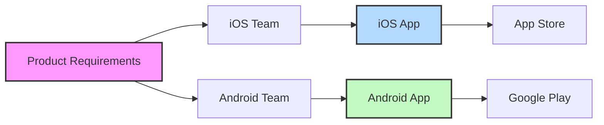
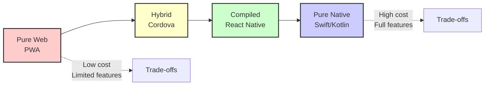

## The rise of cross-platform development

As iOS and Android solidified their dominance, developers faced a costly reality: building the same app twice. This section explores how the mobile industry responded with innovative cross-platform solutions, each attempting to solve the "write once, run everywhere" challenge.

### The problem: Double the platforms, double the work

Imagine you're the CTO at SpeedyMeds in 2012. Your pharmacy app needs to reach both iPhone and Android users, but this means:

- **Two development teams**: iOS developers (Objective-C) and Android developers (Java)
- **Two codebases**: Completely separate, even for identical features
- **Double the bugs**: Each platform has its own unique issues
- **Staggered releases**: Features ship at different times
- **Doubled costs**: Everything takes twice as long and costs twice as much



### The cross-platform promise

Cross-platform development emerged with an enticing proposition:

- ✅ **Single codebase** for multiple platforms
- ✅ **Faster development** and time-to-market
- ✅ **Cost savings** from smaller teams
- ✅ **Consistent features** across platforms
- ✅ **Easier maintenance** and updates

But as we'll see, achieving these benefits while maintaining quality proved challenging.

### Early attempts: Web-based solutions

#### Hybrid apps with Apache Cordova/PhoneGap

The first major attempt at cross-platform used web technologies wrapped in a native shell:

```typescript
// Example: A hybrid app using Cordova
// This runs in a WebView, not as native code
document.addEventListener('deviceready', onDeviceReady, false);

function onDeviceReady() {
    // Now we can access device features through plugins
    navigator.camera.getPicture(
        (imageData) => {
            // Success! But performance might be sluggish
            const image = document.getElementById('myImage');
            image.src = "data:image/jpeg;base64," + imageData;
        },
        (error) => {
            console.error('Camera error:', error);
        },
        { 
            quality: 50,
            destinationType: Camera.DestinationType.DATA_URL 
        }
    );
}
```

**How it worked:**
1. Write your app in HTML, CSS, and JavaScript
2. Cordova wraps it in a native WebView
3. Plugins provide access to device features
4. Deploy to app stores like a native app

> **⚠️ CAUTION**  
> While hybrid apps solved the code reuse problem, they often felt sluggish and "web-like" rather than truly native. Users could tell the difference.

### 🍏 iOS Developer Perspective

Coming from native iOS? You'll understand why hybrid apps frustrated users:
- WebView performance couldn't match UIKit
- Animations felt janky compared to Core Animation
- The UI never quite followed iOS conventions

### 🤖 Android Developer Perspective

Android developers saw similar issues:
- WebView overhead impacted already diverse hardware
- Material Design was hard to replicate in CSS
- Native Android features were inaccessible

### Progressive Web Apps (PWAs): Embracing the web

Another approach said "forget the app stores" and enhanced web apps instead:

```typescript
// Example: Service Worker for offline functionality
self.addEventListener('install', (event) => {
    event.waitUntil(
        caches.open('speedymeds-v1').then((cache) => {
            return cache.addAll([
                '/',
                '/medications',
                '/prescriptions',
                '/styles/app.css',
                '/scripts/app.js'
            ]);
        })
    );
});

// Now the app works offline!
self.addEventListener('fetch', (event) => {
    event.respondWith(
        caches.match(event.request).then((response) => {
            return response || fetch(event.request);
        })
    );
});
```

**PWA benefits:**
- No app store approval needed
- Instant updates (it's just a website)
- Works on any device with a browser
- Can work offline with service workers

**PWA limitations:**
- Limited device API access
- No app store visibility
- iOS support is restricted
- Still doesn't feel truly native

### The spectrum of "nativeness"

Different approaches offered different trade-offs:



> **💡 TIP**  
> Understanding this spectrum helps you choose the right tool for your project. Not every app needs full native capabilities, but users expect native performance.

### The game changers: Modern cross-platform frameworks

#### React Native (2015): JavaScript goes native

Facebook's React Native introduced a revolutionary concept: instead of rendering in a WebView, JavaScript code controls actual native components:

```typescript
// React Native code that creates REAL native components
import React from 'react';
import { View, Text, TouchableOpacity } from 'react-native';

const MedicationReminder: React.FC = () => {
    return (
        <View style={{ padding: 20 }}>
            <Text style={{ fontSize: 18 }}>
                Time for your medication!
            </Text>
            <TouchableOpacity 
                style={{ backgroundColor: '#007AFF', padding: 10 }}
                onPress={() => console.log('Taken!')}
            >
                <Text style={{ color: 'white' }}>Mark as Taken</Text>
            </TouchableOpacity>
        </View>
    );
};

// This renders as UIView/UILabel on iOS, View/TextView on Android!
```

#### Flutter (2018): Custom rendering engine

Google took a different approach: skip native components entirely and draw everything with a custom engine:

```dart
// Flutter draws its own components pixel-by-pixel
import 'package:flutter/material.dart';

class MedicationReminder extends StatelessWidget {
  @override
  Widget build(BuildContext context) {
    return Container(
      padding: EdgeInsets.all(20),
      child: Column(
        children: [
          Text(
            'Time for your medication!',
            style: TextStyle(fontSize: 18),
          ),
          ElevatedButton(
            onPressed: () => print('Taken!'),
            child: Text('Mark as Taken'),
          ),
        ],
      ),
    );
  }
}
// Renders identically on ALL platforms - pixel perfect control
```

### ⚛️ React Developer Perspective

If you know React for web, React Native feels familiar:
- Same component model and lifecycle
- JSX syntax works identically  
- Your React knowledge transfers directly
- Just learn mobile-specific components

### 🅰️ Angular Developer Perspective

Angular developers might consider:
- Ionic (uses Angular with Cordova/Capacitor)
- NativeScript (Angular for native apps)
- Or learn React Native's component approach

### Making the business case

For SpeedyMeds, cross-platform development offers compelling benefits:

| Metric | Native Development | Cross-Platform |
|--------|-------------------|----------------|
| Time to market | 6 months | 3-4 months |
| Development cost | $200,000 | $120,000 |
| Team size | 8 (4 iOS + 4 Android) | 5 developers |
| Code sharing | 0% | 70-90% |
| Maintenance | Complex (2 codebases) | Simpler (1 codebase) |

> **🎯 IMPORTANT**  
> These savings compound over time. Every new feature, bug fix, and update benefits from the shared codebase.

### When native still wins

Cross-platform isn't always the answer. Consider native for:

- **Graphics-intensive apps**: Games, AR/VR experiences
- **Platform showcases**: Apps demonstrating newest OS features
- **Maximum performance**: When every millisecond counts
- **Deep OS integration**: System utilities, keyboards, widgets

### The cross-platform evolution continues

Today's landscape offers mature solutions:

1. **React Native**: JavaScript + native components
2. **Flutter**: Dart + custom rendering  
3. **.NET MAUI**: C# evolution of Xamarin
4. **Kotlin Multiplatform**: Share business logic, native UI

Each represents a different philosophy on solving the cross-platform challenge.

> **📖 OFFICIAL DOCUMENTATION**  
> Explore the official framework comparisons:
> - [React Native Architecture](https://reactnative.dev/docs/intro-react-native-components)
> - [Flutter Technical Overview](https://docs.flutter.dev/resources/technical-overview)
> - [.NET MAUI Documentation](https://learn.microsoft.com/en-us/dotnet/maui/)

### Looking ahead

The rise of cross-platform development responded to real business needs: reaching all users efficiently without sacrificing quality. But why did React Native emerge as a leading solution? Let's explore what makes it special in the next section.

---

**Next up**: [Why React Native? →](section-03-why-react-native.md)