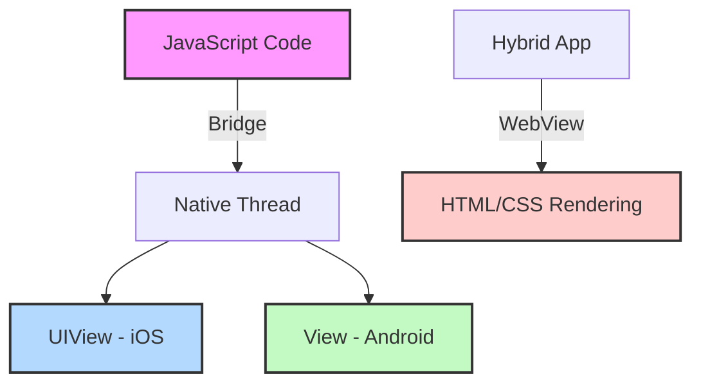

## Why React Native?

With so many cross-platform solutions available, what makes React Native special? Let's explore the unique advantages that have made it the framework of choice for companies like Facebook, Instagram, Airbnb, Discord, and yes, even our fictional SpeedyMeds pharmacy app.

### The "Learn once, write anywhere" philosophy

React Native doesn't promise "write once, run everywhere" – that's a subtle but crucial difference. Instead, it embraces platform differences while maximizing code reuse:

```typescript
// Shared business logic works everywhere
const calculateDosage = (weight: number, medicationStrength: number): number => {
    return Math.round((weight * medicationStrength) / 10);
};

// Platform-specific UI respects conventions
import { Platform, StyleSheet } from 'react-native';

const styles = StyleSheet.create({
    button: {
        padding: 10,
        borderRadius: Platform.OS === 'ios' ? 8 : 4,
        backgroundColor: Platform.OS === 'ios' ? '#007AFF' : '#2196F3',
    }
});
```

> **💡 TIP**  
> This philosophy means your iOS app can feel perfectly at home on iPhone while your Android app follows Material Design – all from the same codebase.

### True native performance

Unlike hybrid apps that run in a WebView, React Native creates actual native components:



### 🍏 iOS Developer Perspective

If you're coming from iOS:
- `<View>` becomes `UIView`
- `<Text>` becomes `UILabel`
- `<ScrollView>` becomes `UIScrollView`
- Your animations use Core Animation under the hood

### 🤖 Android Developer Perspective

For Android developers:
- `<View>` maps to `android.view.View`
- `<Text>` renders as `TextView`
- `<ScrollView>` uses native Android scrolling
- You get real Material Design components

### The JavaScript advantage

Using JavaScript isn't just about web developer familiarity – it brings unique benefits:

#### 1. Hot Reloading / Fast Refresh
See changes instantly without losing app state:

```typescript
// Change this component...
const PillReminder: React.FC<{medication: string}> = ({medication}) => {
    return (
        <View style={styles.reminder}>
            <Text>Time to take your {medication}!</Text>
            {/* Add this line and see it appear immediately */}
            <Text>Tap to mark as taken</Text>
        </View>
    );
};

// No rebuild needed! Changes appear in seconds, not minutes
```

#### 2. Over-the-air updates
Push updates directly to users without app store delays:

```typescript
// Before: Users wait days for app store approval
// After: Updates download automatically
import * as Updates from 'expo-updates';

async function checkForUpdates() {
    try {
        const update = await Updates.checkForUpdateAsync();
        if (update.isAvailable) {
            await Updates.fetchUpdateAsync();
            // Update ready - restart to apply
            await Updates.reloadAsync();
        }
    } catch (e) {
        // Handle error
    }
}
```

> **⚠️ WARNING**  
> Over-the-air updates must comply with app store guidelines. You can update JavaScript but not native code.

#### 3. Massive ecosystem
Leverage thousands of npm packages:

```bash
# Need a date picker? Camera access? Charts?
npm install react-native-date-picker
npm install react-native-camera
npm install react-native-chart-kit

# 1000s more available
```

### ⚛️ React Developer Perspective

Your React knowledge transfers almost completely:
- Same component model
- Same hooks (useState, useEffect, etc.)
- Same state management (Redux, MobX, Zustand)
- Just different components (`View` instead of `div`)

### React Native's killer features

#### 1. Shared business logic
Write once, use everywhere:

```typescript
// This prescription validation works on both platforms
export const validatePrescription = (rx: Prescription): ValidationResult => {
    const errors: string[] = [];
    
    if (!rx.medication) {
        errors.push('Medication is required');
    }
    
    if (rx.dosage <= 0) {
        errors.push('Dosage must be positive');
    }
    
    if (rx.refills < 0) {
        errors.push('Refills cannot be negative');
    }
    
    return {
        isValid: errors.length === 0,
        errors
    };
};
```

#### 2. Native modules when needed
Drop down to native code for platform-specific features:

```typescript
// JavaScript side
import { NativeModules } from 'react-native';
const { BiometricAuth } = NativeModules;

const authenticateUser = async () => {
    try {
        const result = await BiometricAuth.authenticate('Access your prescriptions');
        if (result.success) {
            // User authenticated with Face ID/Touch ID/Fingerprint
        }
    } catch (error) {
        console.error('Biometric auth failed:', error);
    }
};
```

```objective-c
// iOS native module (Objective-C)
RCT_EXPORT_METHOD(authenticate:(NSString *)reason
                  resolver:(RCTPromiseResolveBlock)resolve
                  rejecter:(RCTPromiseRejectBlock)reject)
{
    LAContext *context = [[LAContext alloc] init];
    [context evaluatePolicy:LAPolicyDeviceOwnerAuthenticationWithBiometrics
            localizedReason:reason
                      reply:^(BOOL success, NSError *error) {
        if (success) {
            resolve(@{@"success": @YES});
        } else {
            reject(@"auth_failed", @"Authentication failed", error);
        }
    }];
}
```

#### 3. Incredible developer experience
The development workflow feels magical:

- **Fast Refresh**: See changes in seconds
- **Chrome DevTools**: Debug with familiar tools
- **React DevTools**: Inspect component trees
- **Flipper**: Advanced debugging platform

> **📖 OFFICIAL DOCUMENTATION**  
> Learn more about React Native's developer experience:
> - [Fast Refresh](https://reactnative.dev/docs/fast-refresh)
> - [Debugging Guide](https://reactnative.dev/docs/debugging)
> - [Native Modules](https://reactnative.dev/docs/native-modules-intro)

### Real-world success stories

Major apps built with React Native prove its capabilities:

| Company | App | Why React Native? |
|---------|-----|------------------|
| **Facebook** | Facebook app | Created React Native, dogfooding |
| **Instagram** | Instagram | Rapid feature development |
| **Discord** | Discord mobile | 99.9% code sharing iOS/Android |
| **Walmart** | Walmart app | Faster development, one team |
| **Bloomberg** | Bloomberg | Interactive financial tools |
| **Shopify** | Shop | E-commerce at scale |

### SpeedyMeds case study

Let's see why React Native is perfect for our pharmacy app:

```typescript
// One component serves both platforms beautifully
const MedicationCard: React.FC<{medication: Medication}> = ({medication}) => {
    const { colors } = useTheme(); // Adapts to platform
    
    return (
        <Card style={styles.card}>
            <View style={styles.header}>
                <Icon 
                    name={medication.icon} 
                    color={colors.primary}
                />
                <Text style={styles.medicationName}>
                    {medication.name}
                </Text>
            </View>
            
            <Text style={styles.dosage}>
                {medication.dosage} - {medication.frequency}
            </Text>
            
            <View style={styles.actions}>
                <Button 
                    title="Refill" 
                    onPress={() => refillPrescription(medication.id)}
                />
                <Button 
                    title="Set Reminder" 
                    onPress={() => setReminder(medication)}
                />
            </View>
        </Card>
    );
};
```

Benefits for SpeedyMeds:
- ✅ One team maintains both apps
- ✅ Features ship simultaneously
- ✅ Consistent experience across platforms
- ✅ Rapid prototyping and iteration
- ✅ Cost-effective development

### When React Native shines

React Native is ideal for:

1. **Business applications**: Forms, data display, CRUD operations
2. **Social media apps**: Feeds, messaging, media sharing
3. **E-commerce**: Product catalogs, shopping carts, checkout
4. **Content apps**: News readers, blogs, educational content
5. **Productivity tools**: Task managers, note-taking, calendars

### Limitations to consider

Be realistic about React Native's limitations:

- **Complex animations**: Consider native or Flutter for graphics-intensive apps
- **Games**: Better to use Unity or native development
- **Cutting-edge OS features**: May need to wait for community support
- **Performance-critical**: Some scenarios still benefit from pure native

> **🎯 IMPORTANT**  
> React Native isn't trying to replace native development – it's providing a practical solution for the 90% of apps that don't need bleeding-edge performance.

### The bottom line

React Native succeeds because it:
1. **Respects platforms**: Native look and feel
2. **Maximizes code reuse**: 70-90% shared code typical
3. **Enables rapid development**: Hot reloading, great DX
4. **Scales with your needs**: Easy to add native code
5. **Has massive community**: Solutions for most problems exist

### Try it yourself!

Ready to see React Native in action? Here's a simple example you can run:

**[📱 Exercise 1.1: Your first React Native component](../exercises/exercise-1.1-hello-react-native.md)**

Create a simple medication reminder component and see how the same code creates native UI on both platforms.

---

**Next up**: [The React Native ecosystem →](section-04-react-native-ecosystem.md)