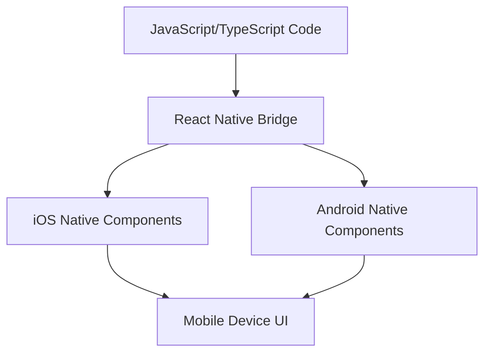

## Section 3: Why React Native? (Pros, Cons, Use Cases)

Now that we understand the context of mobile history and the rise of cross-platform development, let's focus on React Native. Developed by Meta (formerly Facebook) and open-sourced in 2015, React Native has become one of the most popular frameworks for building mobile applications.

### What is React Native?

React Native allows you to build native mobile apps using JavaScript and React. Its core philosophy is often summarized as "Learn once, write anywhere." This means you leverage your knowledge of React (a popular web library) to build applications for both iOS and Android from a single codebase.

The fundamental concept is that **developers use JavaScript and React to define and control native UI elements.**

- **Declarative UI with React:** You define your app's UI using React components, JSX syntax, props, and state—the same declarative paradigm popular in React web development. You describe _what_ the UI should look like for a given state, not _how_ to manipulate it step-by-step.
- **The "Translation" Layer:** React Native acts as an intermediary. It takes your JavaScript code and the UI description and translates these into instructions for the underlying native platform.
- **Core Components Map to Native Views:** React Native provides built-in _Core Components_ (like `<View>`, `<Text>`, `<Image>`) that are JavaScript components designed to map directly to corresponding native UI elements. For instance:
  - `<View>` maps to `UIView` on iOS and `android.view.ViewGroup` on Android – it's the basic container.
  - `<Text>` maps to `UITextView` on iOS (or `UILabel`) and `android.widget.TextView` on Android – used for displaying text.
  - `<Image>` maps to `UIImageView` on iOS and `android.widget.ImageView` on Android.

> [!NOTE]
> React Native emerged from Facebook's internal efforts to improve their mobile development after facing performance challenges with HTML5-based solutions. It was first showcased publicly in 2015 and aimed to combine the developer experience of web development (using React) with the performance and feel of native applications.

Unlike hybrid approaches that use WebViews, React Native renders UIs using actual native components. When you write a `<View>` or `<Text>` component in React Native, it translates to a native `UIView` on iOS or a `View` on Android behind the scenes (facilitated by the "Bridge" or newer "JSI" architecture, discussed in Module 2). This allows React Native apps to achieve performance and a look-and-feel that is much closer to purely native applications.

### Advantages of React Native

React Native offers several compelling benefits:

- **Code Reusability:** Share a significant portion (often 70-95%) of your codebase between iOS and Android, drastically reducing development effort. Companies like Shopify have successfully migrated their mobile apps to React Native, leveraging shared foundations to increase development speed. _(It's important to note that aiming for 100% code sharing is often unrealistic and can sometimes be detrimental; embracing native code for specific modules or performance-critical sections remains a valid strategy for high-quality apps.)_
- **Developer Experience:** Features like **Fast Refresh** allow you to see the results of your latest code changes almost instantly without losing app state or requiring a full recompile, leading to faster iteration cycles. Developers also gain access to the vast ecosystem of JavaScript libraries and tools available via npm (though compatibility needs consideration).
- **Large and Active Community:** Benefit from a vast collection of community-created libraries, tools, tutorials, and extensive support forums.
- **Leverages React:** If you or your team already know React for web development, the learning curve for React Native is significantly reduced.
- **Performance:** By rendering native UI components, React Native generally offers much better performance than WebView-based hybrid solutions. It was designed with the goal of achieving smooth animations at 60 frames per second. While early versions faced some challenges compared to pure native code, the introduction of the **New Architecture** (covered in Module 2), featuring components like JSI (JavaScript Interface), Fabric (new renderer), and TurboModules, has significantly improved performance and addressed many previous limitations. Modern React Native is highly performant for a vast range of applications.
- **Cost-Effectiveness:** Reduced development time and the ability to utilize smaller, potentially cross-functional teams can lead to significant cost savings.
- **Access to Native APIs:** Provides mechanisms (Native Modules and the newer Turbo Modules/JSI) to access platform-specific APIs and device capabilities when needed.

### Disadvantages and Limitations

Despite its strengths, React Native isn't the perfect solution for every scenario:

- **Performance Edge Cases:** While generally performant, apps with extremely complex animations, heavy computations, or demanding graphics (like high-end games) might still achieve better performance with pure native code.
- **Reliance on Native Modules:** For features not covered by React Native core or existing community modules, you might need to write custom native modules (in Swift/Objective-C or Kotlin/Java), requiring native development skills.
- **Abstraction Layer Overhead:** The communication layer (Bridge/JSI) between JavaScript and native code, while powerful, can introduce potential performance bottlenecks or complexities if not managed well, especially for frequent, high-throughput communication.
- **Debugging Complexity:** Debugging can sometimes involve three layers (JavaScript, React Native framework, Native Platform), potentially making it more complex than debugging purely native or web apps.
- **Platform Updates:** There might be a slight delay in adopting the absolute latest iOS or Android features as the React Native framework and community libraries need time to incorporate them.
- **Larger App Size (Potentially):** The inclusion of the JavaScript runtime (like Hermes) and React Native libraries can sometimes result in a slightly larger initial app download size compared to a minimal native app.
- **Dependency Management & Upgrades:** Managing dependencies and handling breaking changes across React Native versions, Expo SDK updates, and third-party libraries can sometimes be challenging, particularly in large or complex projects.

### Comparing frameworks

The table below summarizes how React Native compares to other popular mobile development approaches.

| Approach             | Language(s)              | UI Rendering         | Code Sharing | Performance | Typical Use Cases                   |
| -------------------- | ------------------------ | -------------------- | ------------ | ----------- | ----------------------------------- |
| React Native         | JavaScript, TypeScript   | Native components    | High         | Near-native | Cross-platform business apps        |
| Flutter              | Dart                     | Skia (custom engine) | High         | Near-native | Custom UI, cross-platform           |
| Xamarin              | C#                       | Native components    | Medium       | Near-native | Enterprise, .NET shops              |
| Native (iOS/Android) | Swift/Obj-C, Kotlin/Java | Native components    | None         | Best        | Platform-specific, high-performance |

The flowchart above provides a simplified visual representation of React Native's core architectural concept. It starts with the 'JavaScript/TypeScript Code,' which is where developers write their application logic and define UI using React principles. This code doesn't run directly on the mobile device's native environment in the same way Swift or Kotlin code does. Instead, it communicates through an intermediary layer, labeled here as the 'React Native Bridge' (representing both the older Bridge architecture and the newer JSI – JavaScript Interface).

This Bridge is crucial as it facilitates communication between the JavaScript realm and the native platform. It's responsible for translating the JavaScript instructions into actions that the underlying operating system can understand. The diagram shows the Bridge then interacting with both 'iOS Native Components' (like UIViews, UILabels) and 'Android Native Components' (like Android Views, TextViews). This means that when you use a React Native component like `<View>` or `<Text>`, the Bridge ensures that the corresponding actual native UI element is rendered on the screen.

Ultimately, both paths lead to the 'Mobile Device UI,' signifying that the end-user sees and interacts with a genuinely native interface, not a web-based one. This architecture is key to React Native's ability to offer a native look, feel, and performance while allowing developers to work primarily in JavaScript and share a large portion of their codebase across platforms.

> 🤖 **(Android Developers):**
>
> **Comparison:** React Native uses JavaScript (or TypeScript) instead of Kotlin/Java. UI is declared using React components (like `<View>`, `<Text>`) which map to native Android Views, rather than defining layouts in XML. Lifecycle management uses React Hooks (`useEffect`) which differs from Android's Activity/Fragment lifecycle. Performance is generally good, but you lose the fine-grained control over threading and rendering available in native development.
>
> **Key Takeaway:** You trade direct native SDK access and XML layouts for faster development cycles, code reuse with iOS, and a component-based UI paradigm driven by JavaScript/React.

> 🍏 **(iOS Developers):**
>
> **Comparison:** Instead of Swift/Objective-C and UIKit/SwiftUI, you'll use JavaScript/TypeScript and React components. React Native's Flexbox-based layout is different from Auto Layout or SwiftUI's declarative layout system. Navigation is typically handled by libraries like React Navigation or Expo Router, rather than UINavigationController. While React Native compiles to native UIViews, complex view hierarchies or custom drawing might be less straightforward than direct UIKit manipulation.
>
> **Key Takeaway:** You gain cross-platform capabilities and rapid iteration speed but adopt a different language, UI paradigm (React components), and layout system (Flexbox).

> ⚛️ **(React Web Developers):**
>
> **Comparison:** The core concepts of React (Components, Props, State, Hooks, Context) are identical. However, instead of HTML DOM elements (`
`, `
`, ``), you use React Native Core Components (`<View>`, `<Text>`, `<Image>`). CSS is replaced by the `StyleSheet` API or CSS-in-JS libraries, using Flexbox for layout (which works slightly differently than on the web). Browser APIs are replaced by native device APIs accessed through React Native modules.
>
> **Key Takeaway:** Your React knowledge is directly applicable, but you need to learn the specific React Native components, styling methods, and mobile-specific APIs.

> 🅰️ **(Angular Web Developers):**
>
> **Comparison:** Like Angular, React Native uses a component-based architecture and often relies on TypeScript. However, React's functional components and Hooks are different from Angular's class-based components (or newer signal-based components) and dependency injection system. State management solutions (like Zustand or Context API in RN) differ from Angular's services or NgRx. Templating uses JSX instead of Angular's HTML templates with directives like `*ngFor` or `*ngIf`.
>
> **Key Takeaway:** The component model will feel familiar, but you'll need to learn React's specific patterns (JSX, Hooks), styling, state management, and the React Native component set.

### Common Use Cases for React Native

React Native excels in a variety of application types:

- **Social Media & Content:** (e.g., Facebook, Instagram, Pinterest)
- **E-commerce & Retail:** (e.g., Walmart, Shopify Point of Sale)
- **Lifestyle & Utility Apps:** (e.g., Airbnb, Tesla)
- **Custom business applications or specialized utility apps:** (e.g., health and wellness trackers, internal enterprise tools, or a medication management app like the **SpeedyMeds** capstone project)
- **Data Visualization Dashboards**
- **Apps requiring rapid prototyping and iteration.**
- **Projects where web and mobile teams want to share logic (using React).**

It might be less suitable for:

- **Graphically Intensive 3D Games**
- **Apps requiring heavy background processing or complex low-level hardware interaction (without significant native module development).**
- **Apps where absolute minimum size or peak single-platform performance is the top priority.**

> 📚 **Official Documentation:**
>
> - [React Native: Introduction](https://reactnative.dev/docs/getting-started)
> - [React Native: Learn the Basics](https://reactnative.dev/docs/tutorial)
> - [Showcase: Discover apps built with React Native](https://reactnative.dev/showcase)

### Exercise

Now it's time to do a bit of your own research to compare React Native with other popular cross-platform frameworks.

- **Exercise 1.1: Framework Comparison Research**
  - **(https://forms.office.com/Pages/ResponsePage.aspx?id=EXAMPLE-FORM-ID-FRAMEWORK-COMPARISON)**

React Native offers a powerful and efficient way to build high-quality mobile applications for both iOS and Android. By understanding its strengths and limitations, you can make informed decisions about when and how to leverage it effectively. The next section explores the broader ecosystem surrounding React Native.
