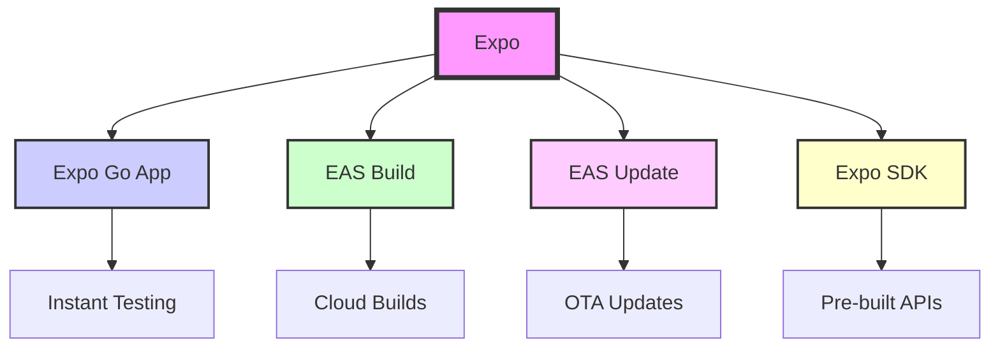
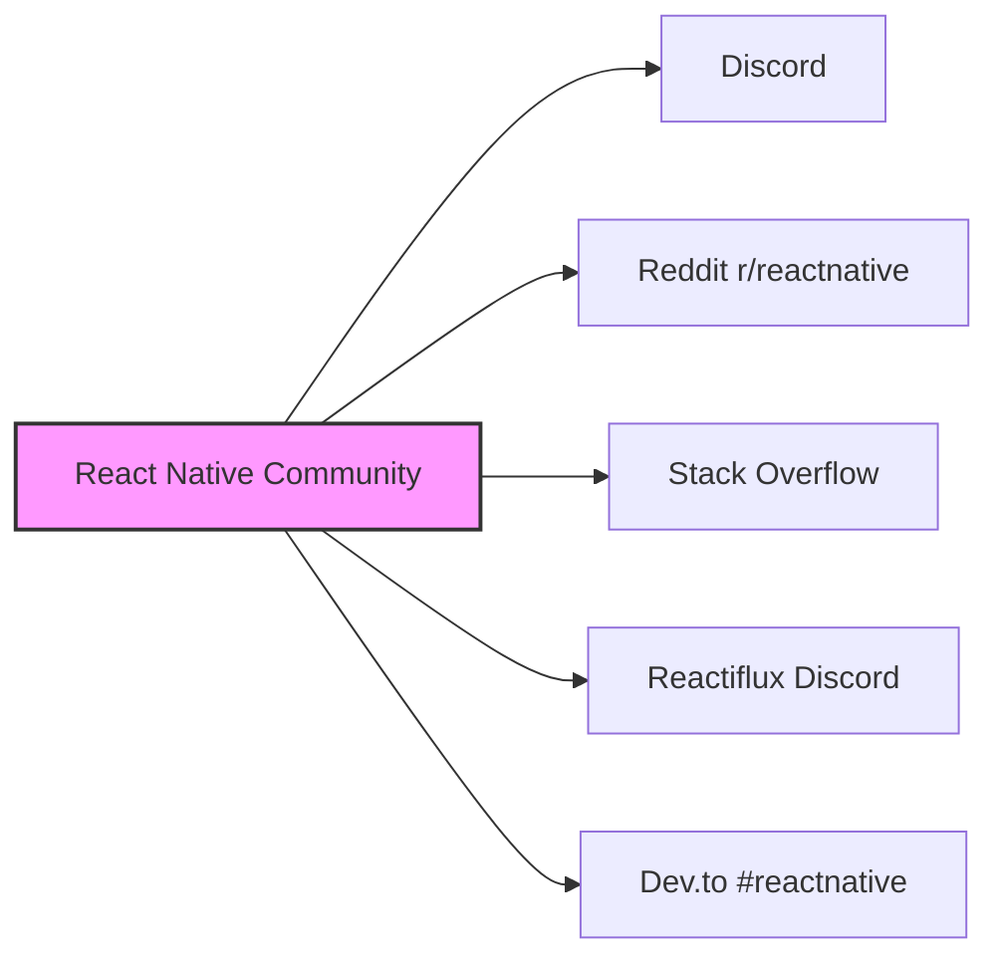

## The React Native ecosystem

React Native's strength isn't just the framework itself – it's the vibrant ecosystem of tools, libraries, and communities that have grown around it. Let's explore the resources that make React Native development productive and enjoyable.

### The foundation: Core tools and frameworks

#### Expo: Your React Native superpower

Expo has transformed React Native development from complex to delightful:



```typescript
// With Expo, accessing device features is simple
import * as Location from 'expo-location';
import * as Notifications from 'expo-notifications';
import * as Camera from 'expo-camera';

// No native configuration needed!
const getCurrentPharmacyLocation = async () => {
    const { status } = await Location.requestForegroundPermissionsAsync();
    if (status !== 'granted') {
        return null;
    }
    
    const location = await Location.getCurrentPositionAsync({});
    return location;
};
```

> **💡 TIP**  
> Start with Expo unless you have specific needs that require ejecting. You can always add custom native code later if needed.

#### React Navigation: Seamless screen transitions

Navigation is crucial for mobile apps. React Navigation provides a JavaScript-based solution:

```typescript
// Define your app's navigation structure declaratively
import { NavigationContainer } from '@react-navigation/native';
import { createBottomTabNavigator } from '@react-navigation/bottom-tabs';
import { createStackNavigator } from '@react-navigation/stack';

const Tab = createBottomTabNavigator();
const Stack = createStackNavigator();

// Nested navigation for complex apps
function HomeStack() {
    return (
        <Stack.Navigator>
            <Stack.Screen name="Medications" component={MedicationsScreen} />
            <Stack.Screen name="MedicationDetail" component={MedicationDetailScreen} />
            <Stack.Screen name="RefillRequest" component={RefillRequestScreen} />
        </Stack.Navigator>
    );
}

function App() {
    return (
        <NavigationContainer>
            <Tab.Navigator>
                <Tab.Screen name="Home" component={HomeStack} />
                <Tab.Screen name="Prescriptions" component={PrescriptionsScreen} />
                <Tab.Screen name="Profile" component={ProfileScreen} />
            </Tab.Navigator>
        </NavigationContainer>
    );
}
```

### Essential libraries and tools

#### State management solutions

React Native works with all popular React state management libraries:

```typescript
// Redux Toolkit - Most popular
import { createSlice } from '@reduxjs/toolkit';

const medicationsSlice = createSlice({
    name: 'medications',
    initialState: [],
    reducers: {
        addMedication: (state, action) => {
            state.push(action.payload);
        },
        removeMedication: (state, action) => {
            return state.filter(med => med.id !== action.payload);
        }
    }
});

// Zustand - Lightweight alternative
import { create } from 'zustand';

const useMedicationStore = create((set) => ({
    medications: [],
    addMedication: (medication) => set((state) => ({ 
        medications: [...state.medications, medication] 
    })),
    removeMedication: (id) => set((state) => ({
        medications: state.medications.filter(med => med.id !== id)
    }))
}));

// MobX - Reactive programming
import { makeAutoObservable } from 'mobx';

class MedicationStore {
    medications = [];
    
    constructor() {
        makeAutoObservable(this);
    }
    
    addMedication(medication) {
        this.medications.push(medication);
    }
}
```

#### UI component libraries

Pre-built components accelerate development:

| Library | Style | Best For |
|---------|-------|----------|
| **React Native Elements** | Cross-platform | General purpose apps |
| **NativeBase** | Customizable | Themed applications |
| **React Native Paper** | Material Design | Android-first apps |
| **React Native UI Kitten** | Eva Design System | Modern, clean UIs |
| **Shoutem UI** | Professional themes | E-commerce, content |

```typescript
// React Native Paper example
import { Button, Card, TextInput } from 'react-native-paper';

const AddMedicationForm = () => {
    const [medication, setMedication] = useState('');
    
    return (
        <Card>
            <Card.Content>
                <TextInput
                    label="Medication Name"
                    value={medication}
                    onChangeText={setMedication}
                    mode="outlined"
                />
                <Button 
                    mode="contained"
                    onPress={handleSubmit}
                    icon="plus"
                >
                    Add Medication
                </Button>
            </Card.Content>
        </Card>
    );
};
```

### 🍏 iOS Developer Perspective

Coming from iOS? These tools will feel familiar:
- **Flipper**: Like Xcode's debugging tools
- **React Native Debugger**: Similar to Safari Web Inspector
- **Reactotron**: Think of it as an enhanced console

### 🤖 Android Developer Perspective

Android developers will appreciate:
- **Android Studio integration**: Use familiar tools
- **Gradle compatibility**: Your build knowledge transfers
- **ADB debugging**: Works seamlessly with React Native

### Development tools and debugging

#### Flipper: The Swiss Army knife

Flipper provides powerful debugging capabilities:

```typescript
// Log network requests automatically
fetch('https://api.speedymeds.com/medications')
    .then(response => response.json())
    .then(data => {
        // Visible in Flipper's Network plugin
        console.log('Medications loaded:', data);
    });

// Track performance issues
import { Performance } from 'react-native-flipper';

Performance.mark('medication-list-start');
// ... render your list
Performance.mark('medication-list-end');
Performance.measure('medication-list-render', 
    'medication-list-start', 
    'medication-list-end'
);
```

#### React DevTools

Inspect your component tree and state:

```bash
# Install standalone React DevTools
npm install -g react-devtools

# Run while your app is running
react-devtools
```

> **📖 OFFICIAL DOCUMENTATION**  
> Master debugging with these official guides:
> - [Debugging Basics](https://reactnative.dev/docs/debugging)
> - [React DevTools](https://reactnative.dev/docs/react-devtools)
> - [Flipper Integration](https://fbflipper.com/docs/features/react-native/)

### Package management and discovery

#### NPM/Yarn: Your package managers

```bash
# Install any React Native compatible package
npm install react-native-vector-icons
# or
yarn add react-native-vector-icons

# Many packages need linking (pre RN 0.60)
# Modern React Native auto-links most packages!
```

#### Finding the right packages

Key resources for package discovery:

1. **[React Native Directory](https://reactnative.directory/)**: Curated, searchable database
2. **[npm](https://www.npmjs.com/)**: Search for "react-native" prefix
3. **[Awesome React Native](https://github.com/jondot/awesome-react-native)**: Curated list
4. **[React Native Community](https://github.com/react-native-community)**: Official community packages

### ⚛️ React Developer Perspective

Your favorite React libraries probably work:
- React Hook Form ✅
- React Query/TanStack Query ✅
- Styled Components ✅ (with react-native support)
- React Spring ✅ (via react-native-reanimated)

### Community and learning resources

#### Official channels

- **[React Native Blog](https://reactnative.dev/blog)**: Latest updates and features
- **[React Native Twitter](https://twitter.com/reactnative)**: News and community highlights
- **[GitHub Discussions](https://github.com/facebook/react-native/discussions)**: Technical discussions

#### Community platforms



#### Learning resources

**Free Resources:**
- [Official Tutorial](https://reactnative.dev/docs/tutorial)
- [React Native School](https://www.reactnativeschool.com/)
- [William Candillon's YouTube](https://www.youtube.com/c/wcandillon) (animations)
- [The React Native Show Podcast](https://reactnativeshow.com/)

**Paid Courses:**
- [React Native Course by Wes Bos](https://reactnative.courses/)
- [Fullstack React Native](https://www.fullstackreact.com/react-native/)
- [Egghead.io React Native Path](https://egghead.io/q/react-native)

### Enterprise and production tools

#### EAS (Expo Application Services)

Professional tools for production apps:

```typescript
// eas.json configuration
{
  "build": {
    "preview": {
      "distribution": "internal",
      "ios": {
        "simulator": true
      }
    },
    "production": {
      "autoIncrement": true
    }
  },
  "submit": {
    "production": {
      "ios": {
        "appleId": "your@email.com",
        "ascAppId": "1234567890"
      },
      "android": {
        "serviceAccountKeyPath": "./google-play-key.json"
      }
    }
  }
}
```

#### Analytics and monitoring

Popular solutions for production apps:

```typescript
// Sentry for crash reporting
import * as Sentry from '@sentry/react-native';

Sentry.init({
  dsn: 'YOUR_SENTRY_DSN',
});

// Segment for analytics
import analytics from '@segment/analytics-react-native';

analytics.track('Medication Added', {
  medicationName: 'Aspirin',
  dosage: '100mg',
  frequency: 'Daily'
});

// Firebase for comprehensive analytics
import analytics from '@react-native-firebase/analytics';

await analytics().logEvent('refill_requested', {
  medication_id: '12345',
  pharmacy_id: '67890'
});
```

### Popular React Native apps showcase

See what's possible with React Native:

| App | Company | Scale |
|-----|---------|-------|
| **Facebook** | Meta | 2.9B users |
| **Instagram** | Meta | 2B users |
| **Discord** | Discord Inc. | 150M users |
| **Shopify** | Shopify | 1.7M merchants |
| **Coinbase** | Coinbase | 89M users |
| **Bloomberg** | Bloomberg L.P. | 325K terminals |
| **Walmart** | Walmart | Millions of users |

### The SpeedyMeds stack

Here's a production-ready stack for our pharmacy app:

```typescript
// Core framework
- React Native 0.73+
- TypeScript for type safety
- Expo SDK 49+ for easy development

// Navigation
- React Navigation 6

// State Management
- Redux Toolkit + RTK Query

// UI Components
- React Native Paper (Material Design)
- React Native Vector Icons

// Forms
- React Hook Form

// Development
- Flipper for debugging
- ESLint + Prettier
- Jest + React Native Testing Library

// Services
- EAS Build for CI/CD
- EAS Update for OTA updates
- Sentry for error tracking
- Firebase Analytics
```

> **🎯 IMPORTANT**  
> The ecosystem is vast – don't feel overwhelmed! Start with the basics (React Native + Expo) and add tools as you need them.

### Looking ahead

The React Native ecosystem continues to evolve with:

- **New Architecture**: Fabric renderer and TurboModules
- **Better performance**: Hermes JavaScript engine
- **Improved developer experience**: Better error messages, faster builds
- **Growing community**: More packages, better documentation

---

**Next up**: [Developer background perspectives →](section-05-developer-background-perspectives.md)

**[🚀 Module Challenge](../challenges/challenge-01-mobile-landscape-quiz.md)**: Test your knowledge of the mobile development landscape!