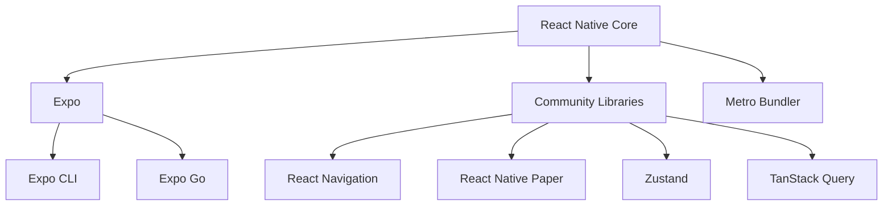

## Section 4: Understanding the React Native Ecosystem (Core, Expo, Community)

React Native itself is a powerful framework, but its true strength lies in the rich ecosystem surrounding it. This ecosystem comprises the core framework, platforms like Expo that simplify development, and a vast global community contributing libraries and support. This section breaks down these key components.

### React Native Core

At the center is the React Native framework itself, maintained by Meta and the community. It provides the fundamental building blocks:

- **Core Components:** A set of essential UI components (like `<View>`, `<Text>`, `<Image>`, `<ScrollView>`, `<TextInput>`) that map to native platform widgets. These are the basic elements you use to construct your user interfaces.
- **Core APIs:** Modules providing access to native capabilities, such as fetching data (`fetch`), handling timers (`setTimeout`), getting device dimensions (`Dimensions`), showing alerts (`Alert`), and detecting the platform (`Platform`).
- **JavaScript Runtime Environment:** React Native runs your JavaScript code, typically using an engine like **Hermes** (optimized for mobile start-up time and performance) or potentially JavaScriptCore.
- **Bridging Mechanism:** The system (Legacy Bridge or the New Architecture's JSI, covered in Module 2) that allows communication between your JavaScript code and the native platform (iOS/Android).

You can use React Native core directly (often referred to as "React Native CLI" development), which gives you maximum flexibility and control but requires managing native project builds yourself using Xcode and Android Studio.

### Expo: The Platform for React Native

Expo is a set of tools, libraries, and services built around React Native that aims to simplify the development, building, and deployment process. It offers several key features and workflows:

- **Managed Workflow:** This is often the starting point for Expo projects. Expo manages the native code for you. You write JavaScript/TypeScript, and Expo handles the underlying native projects and build configurations, using config plugins for customization when needed. This allows you to build apps without needing Xcode or Android Studio installed locally.
- **Bare Workflow:** If you need more control over the native code (e.g., to integrate a specific native module not supported by the managed workflow), you can "eject" from the managed workflow or start directly with the bare workflow. You still benefit from Expo tools and libraries, but you gain full access to the native project files (`ios` and `android` directories) and manage native builds yourself, similar to React Native CLI projects.
- **Expo Go:** A client app for iOS and Android that lets you open and test your Expo projects during development without needing to build the native app yourself. You simply scan a QR code generated by the development server. This significantly speeds up iteration.
- **Expo SDK:** A curated collection of libraries (modules) that provide easy access to a wide range of device and system features, including camera, location, sensors, notifications, file system, authentication, and much more. These APIs are designed to work seamlessly across iOS, Android, and often the web.
- **Expo Application Services (EAS):** A suite of cloud services for building, submitting, and updating your React Native apps:
  - **EAS Build:** Builds your app package (`.ipa` for iOS, `.apk`/`.aab` for Android) in the cloud, eliminating the need for local native build environments.
  - **EAS Submit:** Helps automate the process of submitting your app builds to the Apple App Store and Google Play Store.
  - **EAS Update:** Allows you to push updates (JavaScript and assets) directly to your users' installed apps without needing a full app store resubmission (often called **Over-The-Air** or **OTA** updates).
- **Expo CLI:** A command-line interface for creating, running, and managing Expo projects.

Using Expo, especially the managed workflow, dramatically lowers the barrier to entry for React Native development and streamlines many common tasks.

> 📲 **(Native Developers):**
>
> **Comparison:** Expo, particularly the managed workflow, abstracts away much of the native build configuration (Gradle scripts, Xcode project settings, provisioning profiles) that you typically handle manually. Expo Go is similar in concept to running debug builds on a device/simulator, but it bundles many common native modules already. EAS Build is like using a cloud CI/CD service specifically tailored for React Native/Expo builds.
>
> **Key Takeaway:** Expo simplifies or automates many native build and configuration complexities, allowing you to focus more on the JavaScript/React Native code, but potentially reducing direct control in the managed workflow.

> 🌐 **(Web Developers):**
>
> **Comparison:** Think of Expo as analogous to platforms like Vercel or Netlify for the web, but focused on mobile app development. It provides a development server (`expo start`), a curated set of libraries (Expo SDK, like a set of well-maintained npm packages), cloud build services (EAS Build), and update mechanisms (EAS Update, somewhat like deploying new web assets). Expo Go allows for quick previews similar to opening a web dev server URL on different devices.
>
> **Key Takeaway:** Expo provides a familiar platform-like experience with tools and services that simplify the mobile development lifecycle, mirroring many conveniences found in modern web development workflows.

### The Community

The React Native community is vast, active, and crucial to the framework's success. React Native was open-sourced by Meta (Facebook) in 2015 and continues to be actively maintained by them, along with significant contributions from companies like Microsoft, Shopify, Callstack, Software Mansion, and Expo, as well as a large global community of individual developers. This strong backing ensures ongoing development, a rich ecosystem of libraries, and ample resources for learning and support. You can see impressive apps built with React Native in the [React Native Showcase](https://reactnative.dev/showcase).

The community contributes in numerous ways:

- **Third-Party Libraries:** Thousands of libraries are available via npm, offering pre-built components, navigation solutions (like React Navigation), state management tools (like Zustand, Redux), UI kits (like React Native Paper), testing utilities, and integrations with various services.
- **Support and Knowledge Sharing:** Countless blog posts, tutorials, conference talks, Stack Overflow answers, and Discord/Slack communities provide help and share best practices.
- **Contributions to Core:** Many developers contribute directly to the React Native framework and Expo SDK, helping to fix bugs and add new features.

Navigating this ecosystem effectively—finding reliable libraries, understanding best practices, and leveraging community support—is a key skill for any React Native developer.

### Mastering the Documentation

Becoming proficient in React Native requires becoming proficient in navigating and utilizing the official documentation. It is the ultimate source of truth for APIs, components, and concepts.

#### Critical Importance

The official documentation is constantly updated by the core teams and community contributors. Relying solely on tutorials or blog posts (which can become outdated) is insufficient for production development. Make the official docs your first stop when you have a question about a component's props, an API's behavior, or a core concept.

#### Key Documentation Sites

Bookmark these essential resources:

- **React Native Official Documentation:** [https://reactnative.dev](https://reactnative.dev)
  - The primary resource for React Native core concepts, components, APIs, architecture, and guides.
- **Expo Documentation:** [https://docs.expo.dev](https://docs.expo.dev)
  - Essential for anyone using the Expo ecosystem. Covers Expo SDK APIs, Expo CLI, EAS (Expo Application Services), configuration (app.json), development workflows, and guides specific to Expo.
- **React Navigation Documentation:** [https://reactnavigation.org](https://reactnavigation.org)
  - The official documentation for React Navigation, the most popular library for handling navigation (screens, tabs, drawers) in React Native apps. (Navigation will be covered in detail later in the course).

#### Navigation Strategy: Finding What You Need

Learn to navigate these sites effectively:

- **Getting Started / Tutorials:** Look here for initial setup guides, basic concepts, and introductory walkthroughs.
- **Components & APIs (Core Reference):** This is where you'll spend a lot of time. Find detailed information on each Core Component (View, Text, Image, etc.) and built-in APIs (StyleSheet, Alert, Animated, etc.). Pay attention to:
  - Props: The definitive list of available props for each component, their types, and descriptions.
  - Examples: Practical code snippets demonstrating usage.
  - Platform Specificity: Notes indicating if a component or prop is only available on iOS or Android.
- **Guides:** Explore these for in-depth explanations of broader topics like Layout with Flexbox, Handling Touches, Networking, Performance Optimization, Platform-Specific Code, Accessibility, and Security.
- **Architecture:** For those interested in the internals, this section of the React Native docs covers JSI, Fabric, TurboModules, and the rendering process.
- **Expo Docs Structure:** Familiarize yourself with Expo's sections: Guides (workflows like debugging, prebuilding), Reference (details on specific Expo SDK modules/versions), EAS (build/submit services), Expo CLI commands.
- **Version Selector:** Always ensure the documentation version you are viewing matches the React Native or Expo SDK version you are using in your project. Documentation sites usually have a version selector dropdown.

### Finding Help & Community Resources

While the official documentation is paramount, the vibrant React Native and Expo communities offer invaluable support and resources.

#### Official Channels

- **React Native GitHub:** [https://github.com/facebook/react-native](https://github.com/facebook/react-native)
  - **Issues:** Report reproducible bugs in the core framework. Search existing issues first!
  - **Discussions & Proposals:** For broader discussions about the future of React Native, feature proposals, and deeper technical topics ([React Native Community GitHub](https://github.com/react-native-community)).
- **Expo GitHub:** [https://github.com/expo/expo](https://github.com/expo/expo)
  - For reporting issues specifically related to the Expo SDK, Expo CLI, or other Expo tools.

#### Community Forums & Chat

- **Stack Overflow:** A primary resource for asking and answering specific coding questions. Use the tags `react-native` and `expo`. Search thoroughly before asking. ([https://stackoverflow.com/questions](https://stackoverflow.com/questions))
- **Reactiflux Discord:** A large, very active Discord server for React and React Native developers. The `#react-native` channel is great for quick questions and real-time discussion. ([https://discord.gg/reactiflux](https://discord.gg/reactiflux))
- **Expo Discord:** Official Discord server for Expo-specific help and community interaction. ([https://chat.expo.dev](https://chat.expo.dev))
- **Reddit:**
  - `r/reactnative`: Discussions, news, project showcases, questions.
  - `r/expo`: Expo-focused discussions.

#### Helpful Tools & Sites

- **React Native Community GitHub Org:** [https://github.com/react-native-community](https://github.com/react-native-community)
  - Hosts many essential third-party libraries (e.g., AsyncStorage, NetInfo, Slider) that were previously part of the core but are now maintained by the community.
- **React Native Directory:** [https://reactnative.directory](https://reactnative.directory)
  - A searchable database of React Native libraries. Crucially, it often includes information about New Architecture compatibility, helping you choose libraries that work with modern RN/Expo setups.
- **Expo Snack:** [https://snack.expo.dev](https://snack.expo.dev)
  - An online editor for quickly trying out React Native code (using Expo) and sharing runnable examples without needing a local setup. Excellent for bug reproductions and simple experiments.
- **React Native Upgrade Helper:** [https://react-native-community.github.io/upgrade-helper](https://react-native-community.github.io/upgrade-helper)
  - A web tool that shows the code differences between React Native versions, aiding in the upgrade process.

### Ecosystem components and their roles

To further clarify the roles of various parts of the React Native world, the following table summarizes key ecosystem components.

| Component          | Role                                                    |
| ------------------ | ------------------------------------------------------- |
| React Native core  | Provides essential UI components and APIs               |
| Expo               | Simplifies setup, builds, and access to device features |
| React Navigation   | Handles navigation and routing                          |
| React Native Paper | UI component library for consistent design              |
| TanStack Query     | Server state management (data fetching, caching)        |
| Zustand            | Client state management                                 |
| Metro              | JavaScript bundler for React Native                     |
| Expo CLI           | Command-line tool for managing Expo projects            |

The flowchart diagram provided illustrates the interconnected nature of the React Native ecosystem. At its heart is 'React Native Core,' the foundational framework. Branching from this, 'Expo' is shown as a significant platform that builds upon and extends the core, offering tools like the 'Expo CLI' and services like 'Expo Go' for development and testing.

Another major output from the core is its support for 'Community Libraries.' These user-generated and third-party modules are vital, encompassing a wide range of functionalities such as 'React Navigation' for screen management, 'React Native Paper' for UI components, and state management solutions like 'Zustand' and 'TanStack Query.'

Underpinning the development process is the 'Metro Bundler,' which is integral to React Native Core for packaging JavaScript code. This visualization effectively demonstrates that developing a React Native application involves leveraging not just the core framework but also a rich suite of tools, platforms like Expo, and a diverse array of community-driven libraries to build full-featured applications. Understanding these relationships helps in navigating the ecosystem and selecting the right tools for specific project needs.

> [!NOTE]
> The **SpeedyMeds** capstone project, which you will build throughout this course, leverages many of these ecosystem components. Specifically, it uses Expo for the development workflow and builds, React Navigation for screen management, React Native Paper for UI components, TanStack Query for handling data from a server, and Zustand for managing global application state. This practical application will give you hands-on experience with these key technologies.

> 📚 **Official Documentation:**
>
> - [React Native Documentation](https://reactnative.dev/docs/getting-started)
> - [Expo Documentation](https://docs.expo.dev)
> - [Expo SDK API Reference](https://docs.expo.dev/versions/latest)
> - [Expo Application Services (EAS)](https://docs.expo.dev/eas)
> - [Community Resources (React Native Docs)](https://reactnative.dev/community/overview)

Together, React Native core, the Expo platform, and the vibrant community form a powerful ecosystem for building cross-platform mobile applications efficiently. It's important to remember that the strength of the surrounding ecosystem—the quality of tooling like Expo, the availability of libraries, the responsiveness of the community, and the clarity of documentation—is often just as critical to a project's success as the technical features of the core framework itself. With this foundational understanding of the mobile development landscape and React Native's place within it, you are ready to move on to exploring the architecture that powers these applications.
