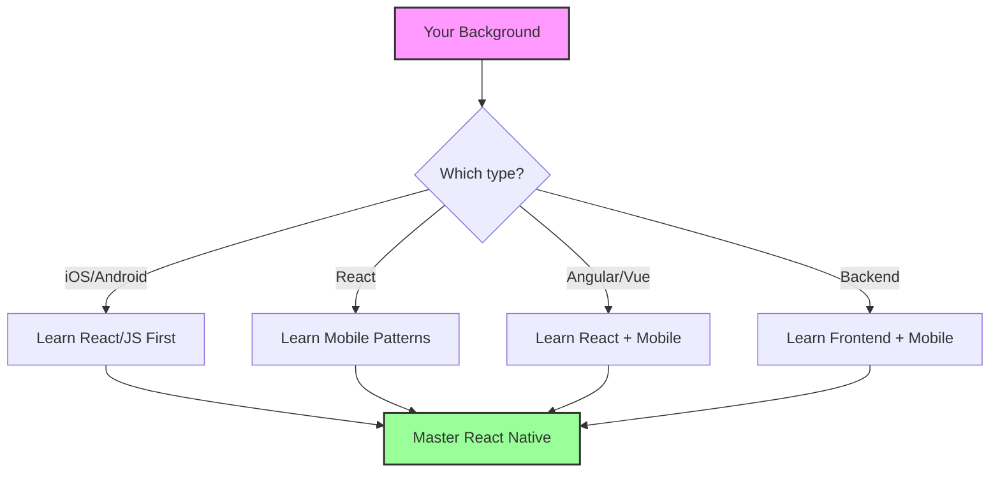

## Developer background perspectives

Your journey to React Native will be unique based on your existing skills. Let's explore how different developer backgrounds can leverage their experience and what new concepts they'll need to master.

### Coming from iOS development 🍏

If you're an iOS developer, you bring valuable mobile development expertise. Here's how your skills translate and what's new:

#### What transfers directly

Your iOS knowledge gives you a huge advantage:

```typescript
// iOS concepts that map beautifully to React Native

// UIViewController lifecycle → React component lifecycle
class MedicationListViewController: UIViewController {
    override func viewDidLoad() {
        super.viewDidLoad()
        loadMedications()
    }
}

// Becomes this in React Native:
const MedicationListScreen: React.FC = () => {
    useEffect(() => {
        loadMedications();
    }, []); // ComponentDidMount equivalent
    
    return (
        <SafeAreaView>
            <FlatList data={medications} />
        </SafeAreaView>
    );
};
```

**Your advantages:**
- **Mobile UX patterns**: You understand navigation, gestures, and mobile-first design
- **App Store knowledge**: Submission, review guidelines, certificates
- **Performance awareness**: You know what makes apps feel native
- **Platform guidelines**: Human Interface Guidelines knowledge transfers

#### What's different

```typescript
// iOS: Imperative UI updates
self.titleLabel.text = "Medications"
self.titleLabel.textColor = .systemBlue

// React Native: Declarative UI
<Text style={{ color: '#007AFF' }}>Medications</Text>

// iOS: Delegate patterns
tableView.delegate = self
tableView.dataSource = self

// React Native: Props and callbacks
<FlatList 
    data={medications}
    renderItem={renderMedication}
    onRefresh={handleRefresh}
/>
```

> **💡 TIP**  
> Think of React Native components as lightweight UIViews that re-render when state changes. The mental model is different but the end result is familiar.

#### Key concepts to learn

1. **JavaScript/TypeScript**: Syntax, async patterns, ES6+ features
2. **React paradigm**: Components, props, state, hooks
3. **Flexbox layout**: Different from Auto Layout but equally powerful
4. **Cross-platform thinking**: Designing for iOS AND Android

### Coming from Android development 🤖

Android developers have unique advantages in the React Native world:

#### What transfers directly

```typescript
// Android concepts with React Native equivalents

// Activity lifecycle → Component lifecycle
class MedicationActivity : AppCompatActivity() {
    override fun onCreate(savedInstanceState: Bundle?) {
        super.onCreate(savedInstanceState)
        setContentView(R.layout.activity_medication)
    }
}

// In React Native:
const MedicationScreen: React.FC = ({ navigation }) => {
    // No manual view inflation needed!
    return (
        <View style={styles.container}>
            <MedicationList />
        </View>
    );
};

// Gradle dependencies → npm packages
// implementation 'com.squareup.retrofit2:retrofit:2.9.0'
// Becomes:
// npm install axios
```

**Your advantages:**
- **Multiple screen sizes**: You're already thinking responsively
- **Material Design**: Translates well to React Native Paper
- **Build variants**: Debug/release concepts are similar
- **Google Play**: Store submission knowledge applies

#### What's different

```typescript
// Android: XML layouts
/*
<LinearLayout
    android:orientation="vertical"
    android:padding="16dp">
    <TextView android:text="@string/medication_name" />
</LinearLayout>
*/

// React Native: JSX components
<View style={{ flexDirection: 'column', padding: 16 }}>
    <Text>{medication.name}</Text>
</View>

// Android: findViewById and view binding
val medicationText = findViewById<TextView>(R.id.medication_text)
medicationText.text = "Aspirin"

// React Native: Direct JSX reference
const [medicationName, setMedicationName] = useState("Aspirin");
return <Text>{medicationName}</Text>;
```

#### Key concepts to learn

1. **JavaScript ecosystem**: npm, bundlers, transpilers
2. **React component model**: Very different from Activities/Fragments
3. **iOS design patterns**: You'll need to respect both platforms
4. **JavaScript debugging**: Different tools than Android Studio

### Coming from React development ⚛️

React developers have the smoothest transition to React Native:

#### What transfers directly

```typescript
// Your React code is 90% ready for React Native!

// Web React component
const MedicationCard: React.FC<{ medication: Medication }> = ({ medication }) => {
    const [expanded, setExpanded] = useState(false);
    
    return (
        <div className="medication-card" onClick={() => setExpanded(!expanded)}>
            <h3>{medication.name}</h3>
            {expanded && <p>{medication.description}</p>}
        </div>
    );
};

// React Native version - minimal changes!
const MedicationCard: React.FC<{ medication: Medication }> = ({ medication }) => {
    const [expanded, setExpanded] = useState(false);
    
    return (
        <TouchableOpacity onPress={() => setExpanded(!expanded)}>
            <View style={styles.card}>
                <Text style={styles.title}>{medication.name}</Text>
                {expanded && <Text>{medication.description}</Text>}
            </View>
        </TouchableOpacity>
    );
};
```

**Your advantages:**
- **Component thinking**: You already understand props, state, and composition
- **Hooks mastery**: useState, useEffect, custom hooks all work
- **State management**: Redux, Context API, Zustand work identically
- **TypeScript**: If you use it on web, it works the same

#### What's different

```typescript
// Web: DOM elements and CSS
<div style={{ display: 'flex', flexDirection: 'row' }}>
    <span className="medication-name">Aspirin</span>
</div>

// React Native: Native components and StyleSheet
<View style={{ flexDirection: 'row' }}>
    <Text style={styles.medicationName}>Aspirin</Text>
</View>

// Web: CSS classes and media queries
.medication-card {
    padding: 1rem;
    @media (max-width: 768px) {
        padding: 0.5rem;
    }
}

// React Native: StyleSheet and Dimensions
import { Dimensions } from 'react-native';

const { width } = Dimensions.get('window');
const styles = StyleSheet.create({
    card: {
        padding: width < 768 ? 8 : 16,
    }
});
```

> **📖 OFFICIAL DOCUMENTATION**  
> React developers should review:
> - [React Native Components](https://reactnative.dev/docs/components-and-apis)
> - [React Native vs React differences](https://reactnative.dev/docs/intro-react)

#### Key concepts to learn

1. **Mobile UX patterns**: Navigation, gestures, platform conventions
2. **Native components**: View, Text, ScrollView instead of divs
3. **Mobile limitations**: No hover states, different input methods
4. **App deployment**: App stores vs web hosting

### Coming from Angular development 🅰️

Angular developers can leverage their TypeScript and component expertise:

#### What transfers directly

```typescript
// Angular service patterns work great in React Native

// Angular service
@Injectable()
export class MedicationService {
    constructor(private http: HttpClient) {}
    
    getMedications(): Observable<Medication[]> {
        return this.http.get<Medication[]>('/api/medications');
    }
}

// React Native equivalent (using hooks)
const useMedications = () => {
    const [medications, setMedications] = useState<Medication[]>([]);
    const [loading, setLoading] = useState(true);
    
    useEffect(() => {
        fetch('https://api.speedymeds.com/medications')
            .then(res => res.json())
            .then(data => {
                setMedications(data);
                setLoading(false);
            });
    }, []);
    
    return { medications, loading };
};
```

**Your advantages:**
- **TypeScript expertise**: Directly applicable
- **Component architecture**: Similar mental model
- **RxJS knowledge**: Can use with React Native
- **Enterprise patterns**: Dependency injection concepts transfer

#### What's different

```typescript
// Angular: Templates with directives
/*
<div *ngFor="let med of medications">
    <h3>{{ med.name }}</h3>
    <button (click)="refill(med)">Refill</button>
</div>
*/

// React Native: JSX with map
<View>
    {medications.map(med => (
        <View key={med.id}>
            <Text style={styles.heading}>{med.name}</Text>
            <Button title="Refill" onPress={() => refill(med)} />
        </View>
    ))}
</View>

// Angular: Two-way binding
// <input [(ngModel)]="dosage" />

// React Native: Controlled components
const [dosage, setDosage] = useState('');
<TextInput 
    value={dosage}
    onChangeText={setDosage}
/>
```

#### Key concepts to learn

1. **React philosophy**: One-way data flow vs two-way binding
2. **Hooks instead of decorators**: Different way to compose logic
3. **JSX syntax**: Similar to Angular templates but in JavaScript
4. **React ecosystem**: Different libraries for routing, forms, etc.

### Coming from backend development

Backend developers bring valuable skills to mobile development:

#### What transfers directly

```typescript
// Your API design knowledge is crucial

// Backend endpoint you might have built
app.get('/api/medications/:id', async (req, res) => {
    const medication = await db.medications.findById(req.params.id);
    res.json(medication);
});

// Consuming it in React Native
const fetchMedication = async (id: string) => {
    try {
        const response = await fetch(`${API_URL}/medications/${id}`);
        const medication = await response.json();
        return medication;
    } catch (error) {
        console.error('Failed to fetch medication:', error);
    }
};
```

**Your advantages:**
- **API design**: You know what makes a good mobile API
- **Data modeling**: Database schema knowledge helps
- **Security awareness**: Authentication, validation patterns
- **System thinking**: Understanding full-stack architecture

#### Key concepts to learn

1. **UI development**: Visual design and user interaction
2. **Event-driven programming**: User taps, swipes, gestures
3. **Mobile constraints**: Battery, network, storage limitations
4. **Client-side state**: Managing data on the device

### Universal skills for React Native success

Regardless of your background, these skills are essential:

#### 1. Mobile-first thinking

```typescript
// Desktop-first (avoid this)
const styles = StyleSheet.create({
    container: {
        width: 1200,
        margin: '0 auto', // Doesn't work in RN!
    }
});

// Mobile-first (do this)
const styles = StyleSheet.create({
    container: {
        flex: 1,
        paddingHorizontal: 16,
        width: '100%',
    }
});
```

#### 2. Platform awareness

```typescript
import { Platform } from 'react-native';

const styles = StyleSheet.create({
    header: {
        paddingTop: Platform.OS === 'ios' ? 20 : 0,
        ...Platform.select({
            ios: {
                shadowColor: '#000',
                shadowOffset: { width: 0, height: 2 },
                shadowOpacity: 0.1,
            },
            android: {
                elevation: 4,
            }
        })
    }
});
```

#### 3. Performance consciousness

```typescript
// Avoid unnecessary re-renders
const MedicationItem = React.memo(({ medication, onPress }) => {
    return (
        <TouchableOpacity onPress={() => onPress(medication.id)}>
            <Text>{medication.name}</Text>
        </TouchableOpacity>
    );
});

// Optimize list rendering
<FlatList
    data={medications}
    keyExtractor={item => item.id}
    renderItem={({ item }) => <MedicationItem medication={item} />}
    maxToRenderPerBatch={10}
    windowSize={10}
/>
```

> **🎯 IMPORTANT**  
> Your background is an asset, not a limitation. Every perspective brings unique insights that make you a better React Native developer.

### Your learning path

Based on your background, here's your recommended path:



### SpeedyMeds team composition

A successful React Native team often includes diverse backgrounds:

- **iOS developer**: Ensures iOS polish and App Store expertise
- **Android developer**: Handles Material Design and Play Store
- **React developer**: Rapid feature development and web knowledge
- **Backend developer**: API design and system integration

Together, they create apps that excel on all platforms!

---

**Next up**: [Core building blocks preview →](section-06-core-building-blocks-preview.md)