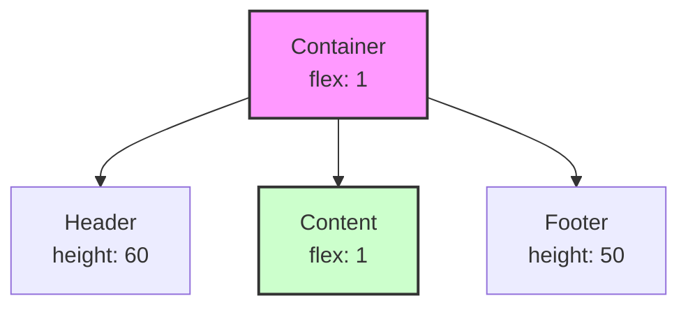
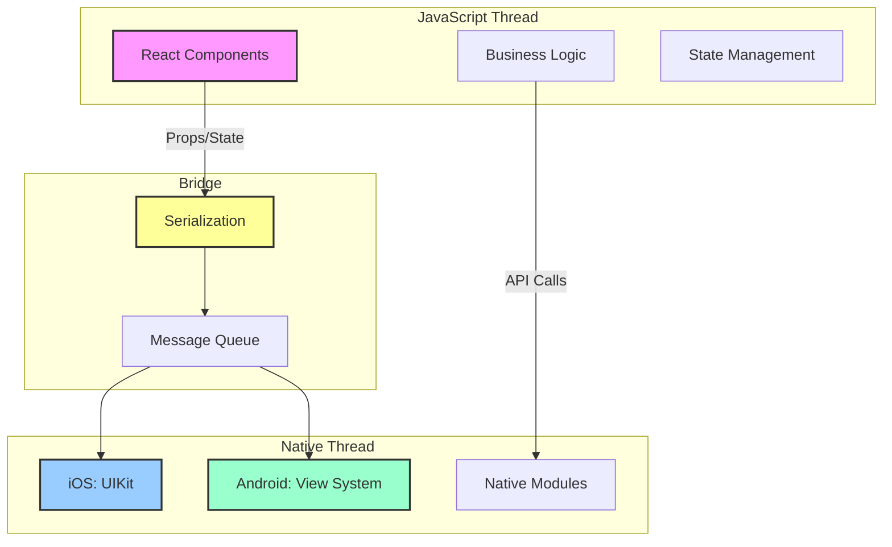

## Core building blocks preview

Let's peek under the hood of React Native and preview the essential building blocks you'll master in upcoming modules. Think of this as your roadmap to React Native proficiency!

### The component model: Everything is a component

In React Native, your entire app is built from components - reusable pieces of UI that manage their own state and appearance:

```typescript
// A simple component for displaying a medication
const MedicationPill: React.FC<{ name: string; dosage: string }> = ({ name, dosage }) => {
    return (
        <View style={styles.pill}>
            <Text style={styles.pillName}>{name}</Text>
            <Text style={styles.pillDosage}>{dosage}</Text>
        </View>
    );
};

// Components compose into larger components
const MedicationList: React.FC = () => {
    return (
        <ScrollView>
            <MedicationPill name="Aspirin" dosage="100mg" />
            <MedicationPill name="Ibuprofen" dosage="200mg" />
            <MedicationPill name="Acetaminophen" dosage="500mg" />
        </ScrollView>
    );
};
```

> **💡 TIP**  
> Think of components like LEGO blocks - small, focused pieces that combine to build complex applications.

### Core components: Your UI toolkit

React Native provides a set of core components that map to native platform widgets:

```typescript
import {
    View,        // Like UIView (iOS) or android.view.View
    Text,        // Like UILabel (iOS) or TextView (Android)
    Image,       // Like UIImageView (iOS) or ImageView (Android)
    ScrollView,  // Like UIScrollView (iOS) or ScrollView (Android)
    TextInput,   // Like UITextField (iOS) or EditText (Android)
    Button,      // Native button implementation
    TouchableOpacity, // Touchable wrapper with opacity feedback
} from 'react-native';

// Building a simple form
const PrescriptionForm: React.FC = () => {
    const [medication, setMedication] = useState('');
    
    return (
        <View style={styles.form}>
            <Text style={styles.label}>Medication Name</Text>
            <TextInput
                style={styles.input}
                value={medication}
                onChangeText={setMedication}
                placeholder="Enter medication name"
            />
            <TouchableOpacity style={styles.button}>
                <Text style={styles.buttonText}>Add Prescription</Text>
            </TouchableOpacity>
        </View>
    );
};
```

### Styling: Flexbox everywhere

React Native uses Flexbox for layout, making responsive design intuitive:

```typescript
const styles = StyleSheet.create({
    container: {
        flex: 1,                    // Take up all available space
        flexDirection: 'column',    // Stack children vertically
        justifyContent: 'center',   // Center vertically
        alignItems: 'center',       // Center horizontally
        padding: 20,
    },
    row: {
        flexDirection: 'row',       // Arrange children horizontally
        justifyContent: 'space-between', // Space items evenly
        width: '100%',
    },
    box: {
        flex: 1,                    // Equal width boxes
        height: 100,
        margin: 5,
        backgroundColor: '#007AFF',
    }
});
```



### State management: Making apps interactive

State is what makes your app dynamic. React Native uses hooks for state management:

```typescript
const MedicationTracker: React.FC = () => {
    // Local component state
    const [medications, setMedications] = useState<Medication[]>([]);
    const [loading, setLoading] = useState(true);
    
    // Side effects with useEffect
    useEffect(() => {
        loadMedications();
    }, []);
    
    const loadMedications = async () => {
        try {
            const meds = await fetchMedications();
            setMedications(meds);
        } finally {
            setLoading(false);
        }
    };
    
    const addMedication = (med: Medication) => {
        setMedications([...medications, med]);
    };
    
    if (loading) {
        return <ActivityIndicator size="large" />;
    }
    
    return (
        <View>
            {medications.map(med => (
                <MedicationCard key={med.id} medication={med} />
            ))}
        </View>
    );
};
```

### Navigation: Moving between screens

Apps need multiple screens. React Navigation makes this elegant:

```typescript
import { NavigationContainer } from '@react-navigation/native';
import { createStackNavigator } from '@react-navigation/stack';

const Stack = createStackNavigator();

const App: React.FC = () => {
    return (
        <NavigationContainer>
            <Stack.Navigator initialRouteName="Home">
                <Stack.Screen name="Home" component={HomeScreen} />
                <Stack.Screen name="Medications" component={MedicationsScreen} />
                <Stack.Screen name="MedicationDetail" component={MedicationDetailScreen} />
                <Stack.Screen name="AddPrescription" component={AddPrescriptionScreen} />
            </Stack.Navigator>
        </NavigationContainer>
    );
};

// Navigate between screens
const HomeScreen: React.FC<{ navigation: any }> = ({ navigation }) => {
    return (
        <View>
            <Button
                title="View Medications"
                onPress={() => navigation.navigate('Medications')}
            />
        </View>
    );
};
```

### 🍏 iOS Developer Perspective

These building blocks map to familiar iOS concepts:
- Components → UIViewController + UIView
- Props → Initializer parameters
- State → @State in SwiftUI
- Navigation → UINavigationController

### 🤖 Android Developer Perspective

Android developers will recognize:
- Components → Activity/Fragment + Views
- Props → Constructor/Bundle arguments
- State → ViewModel + LiveData
- Navigation → Navigation Component

### Platform-specific code

React Native lets you handle platform differences elegantly:

```typescript
import { Platform } from 'react-native';

// Platform-specific styling
const styles = StyleSheet.create({
    shadow: {
        ...Platform.select({
            ios: {
                shadowColor: '#000',
                shadowOffset: { width: 0, height: 2 },
                shadowOpacity: 0.1,
                shadowRadius: 3,
            },
            android: {
                elevation: 5,
            },
        }),
    },
});

// Platform-specific components
const DatePicker = Platform.select({
    ios: () => require('./DatePicker.ios').default,
    android: () => require('./DatePicker.android').default,
})();

// Platform-specific logic
const requestPermissions = async () => {
    if (Platform.OS === 'ios') {
        // iOS-specific permission flow
    } else {
        // Android-specific permission flow
    }
};
```

### APIs and device features

Access native device capabilities through React Native APIs:

```typescript
// Camera access
import * as ImagePicker from 'expo-image-picker';

const takePrescriptionPhoto = async () => {
    const result = await ImagePicker.launchCameraAsync({
        mediaTypes: ImagePicker.MediaTypeOptions.Images,
        quality: 0.8,
    });
    
    if (!result.canceled) {
        // Process the photo
        uploadPrescription(result.assets[0].uri);
    }
};

// Push notifications
import * as Notifications from 'expo-notifications';

const scheduleMedicationReminder = async (medication: Medication) => {
    await Notifications.scheduleNotificationAsync({
        content: {
            title: "Medication Reminder",
            body: `Time to take your ${medication.name}`,
            data: { medicationId: medication.id },
        },
        trigger: {
            hour: medication.reminderHour,
            minute: medication.reminderMinute,
            repeats: true,
        },
    });
};

// Location services
import * as Location from 'expo-location';

const findNearbyPharmacies = async () => {
    const { status } = await Location.requestForegroundPermissionsAsync();
    if (status !== 'granted') return;
    
    const location = await Location.getCurrentPositionAsync({});
    return searchPharmacies(location.coords);
};
```

### ⚛️ React Developer Perspective

If you know React, these additions are what make it "Native":
- Platform-specific components and APIs
- Different styling system (no CSS)
- Mobile gestures and interactions
- App lifecycle events

### The architecture that makes it work

Understanding how React Native works helps you build better apps:



### Performance optimization preview

Building smooth apps requires understanding performance:

```typescript
// Optimize list rendering
const MedicationItem = React.memo(({ medication, onPress }) => {
    return (
        <TouchableOpacity onPress={() => onPress(medication.id)}>
            <Text>{medication.name}</Text>
        </TouchableOpacity>
    );
});

// Use FlatList for large lists
<FlatList
    data={medications}
    renderItem={({ item }) => <MedicationItem medication={item} />}
    keyExtractor={item => item.id}
    getItemLayout={(data, index) => ({
        length: ITEM_HEIGHT,
        offset: ITEM_HEIGHT * index,
        index,
    })}
/>

// Optimize images
<Image
    source={{ uri: medication.imageUrl }}
    style={styles.medicationImage}
    resizeMode="cover"
    // Cache control
    defaultSource={require('./placeholder.png')}
/>
```

> **🎯 IMPORTANT**  
> These building blocks are the foundation of every React Native app. Master these, and you can build anything!

### What's coming in future modules

This preview just scratches the surface. Here's what you'll learn in depth:

| Module | What You'll Master |
|--------|-------------------|
| **Module 7** | React essentials and component patterns |
| **Module 8** | All core components in detail |
| **Module 9** | Hooks and React Native APIs |
| **Module 10** | Advanced styling and theming |
| **Module 11** | Navigation patterns |
| **Module 12** | Forms and user input |
| **Module 13** | State management at scale |

### Your SpeedyMeds pharmacy app journey

Throughout this course, you'll build a complete pharmacy app using these building blocks:

1. **Authentication screens** - Secure login with biometrics
2. **Medication management** - Track prescriptions and dosages
3. **Reminder system** - Push notifications for medications
4. **Pharmacy locator** - Maps integration
5. **Prescription camera** - Photo capture and upload
6. **Refill ordering** - Complete e-commerce flow
7. **Health tracking** - Charts and data visualization

### Ready to dive deeper?

You now have a bird's-eye view of React Native's core concepts. In the upcoming modules, we'll explore each building block in detail, with hands-on exercises and real-world examples.

> **📖 OFFICIAL DOCUMENTATION**  
> Bookmark these essential references:
> - [React Native Components and APIs](https://reactnative.dev/docs/components-and-apis)
> - [React Navigation](https://reactnavigation.org/docs/getting-started)
> - [Expo SDK Reference](https://docs.expo.dev/versions/latest/)

### Looking ahead

With this foundation, you're ready to start your React Native journey. Remember:

- **Start simple**: Master the basics before tackling complex features
- **Build often**: Practice with small projects
- **Read the docs**: Official documentation is your friend
- **Join the community**: Learn from other developers
- **Stay curious**: Mobile development is always evolving

---

**Congratulations!** You've completed Module 1 and understand the mobile development landscape. Ready to set up your development environment?

**Next Module**: [Module 3: React Native environment with Expo →](../module-03-react-native-environment-with-expo/section-00-introduction.md)

**[🚀 Module Challenge](../challenges/challenge-01-mobile-landscape-quiz.md)**: Test your knowledge of the mobile development landscape!