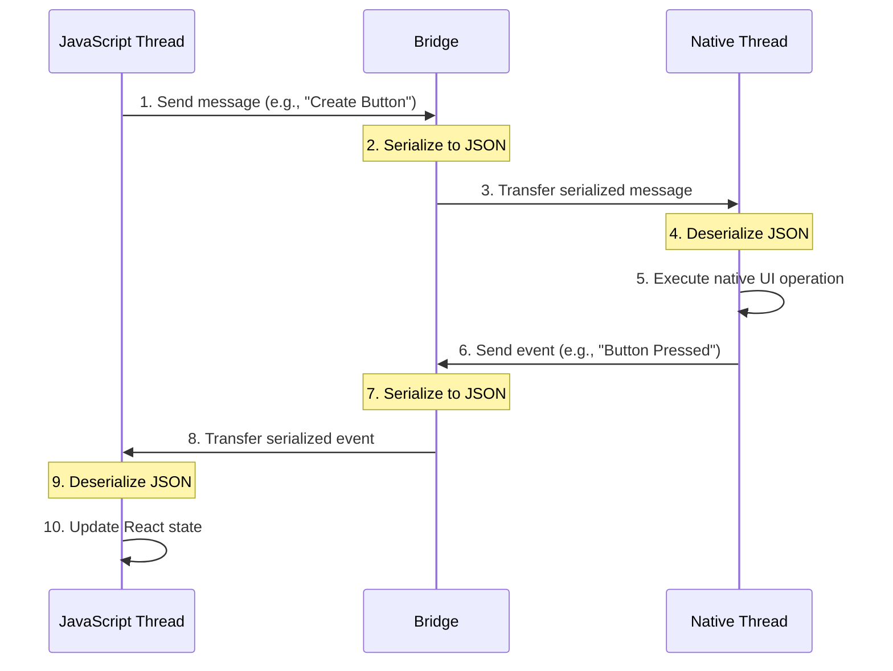

## Section 1: Legacy Architecture: The Bridge (Concepts, Limitations)

Welcome to the first step in understanding how React Native works under the hood. For many years, the "Legacy Architecture" was the standard way React Native enabled communication between your JavaScript code and the native platforms (iOS and Android). Understanding this architecture is essential for appreciating the improvements in the newer architecture and for troubleshooting existing applications that may still use it, including early versions of pharmacy apps like the SpeedyMeds project we'll be building.

> 🛣️ **(All Learners):** This section establishes foundational concepts that will be referenced throughout the module. Even if you're using the New Architecture in your projects, understanding the legacy approach provides valuable context for React Native's evolution.

### The Three Threads Model

The Legacy Architecture operated across three primary threads:

1.  **JavaScript (JS) Thread:** This is where your application's JavaScript code executed. All business logic, React component rendering logic, and API calls initiated from JavaScript ran here. Often, this execution was handled by the JavaScriptCore (JSC) engine, the same engine powering Safari.
2.  **Native/UI Thread (Main Thread):** This is the main application thread provided by the host operating system (Android or iOS). It was solely responsible for handling the native UI toolkit – creating, updating, and displaying native views, and processing user gestures (touches, scrolls) directly from the OS. Any direct manipulation of the native UI could only happen on this thread.
3.  **Shadow Thread:** To avoid blocking the UI thread with potentially complex layout calculations, the legacy architecture introduced this background thread. Its primary role was to take the layout information defined in JavaScript (using React Native's layout props) and calculate the exact positions and sizes of the native views. It constructed a "Shadow Tree," mirroring the UI hierarchy but containing computed layout attributes. The **Yoga Layout Engine**, a cross-platform layout engine implementing Flexbox, operated on this thread to translate your styles into a layout system the native platform could render.

At the heart of this multi-threaded architecture lies the **Bridge**.

### What is the Bridge?

Think of the Bridge as a communication channel connecting the JavaScript Thread with the Native/UI and Shadow Threads. Since JavaScript and native code run in separate environments (different threads, different memory spaces), they couldn't directly interact. The Bridge acted as an intermediary, translating messages between them.

**Bridge Communication Process Diagram**

This diagram illustrates the key steps in Bridge communication. When a React component creates a button, the request travels from JavaScript through serialization, across the Bridge, and to the native side for rendering. Similarly, when a user taps that button, the event travels back through serialization and the Bridge before it can be handled by your JavaScript code. This roundtrip process introduces the inherent latency of the legacy architecture.

### How Communication Works:

Communication across the Bridge was fundamentally **asynchronous**, **serialized**, and **batched**:

1.  **Asynchronous:** When your JavaScript code needed to interact with the native side (e.g., update a UI element, call a native module), it sent a message across the Bridge. It didn't wait for a response before continuing its execution. Similarly, native events (like a button press or device rotation) were sent asynchronously to the JavaScript realm.
2.  **Serialized:** Data sent across the Bridge needed to be converted into a format both sides could understand. This typically involved serializing the data into a JSON string. When the other side received the message, it would deserialize the JSON back into its native data structures (JavaScript objects or native dictionaries/maps).
3.  **Batched:** To avoid flooding the Bridge with too many small messages (which would be inefficient), React Native often batched multiple operations together into a single message sent across the Bridge, typically at the end of each iteration of the JavaScript event loop.

> 📚 **Official Documentation:**
>
> - [React Native Glossary: Bridge](https://reactnative.dev/architecture/glossary#bridge)
> - [React Native Glossary: Threading Model](https://reactnative.dev/architecture/glossary#threading-model)
> - [Yoga Layout Engine](https://yogalayout.com/)
> - [Understanding the React Native Bridge Concept](https://reactnative.dev/docs/communication-android)
>
> 🗂️ **Additional Resources:**
>
> - [JavaScript Thread Performance](https://reactnative.dev/docs/performance#javascript-frame-rate)
> - [Deep Dive into React Native Internals](https://medium.com/react-native-training/react-native-internals-a-tour-of-the-codebase-811c3c3b6b1e)

> 🤖 **(Android Developers):**
>
> **Comparison:** This asynchronous, message-passing approach is different from directly calling Java/Kotlin methods from C++ via JNI, which can be synchronous. The serialization step adds overhead not typically present in direct JNI calls.
>
> **Key Takeaway:** The Bridge introduces inherent latency due to its asynchronous nature and the need for serialization/deserialization, unlike potentially faster, synchronous JNI interactions.
>
> **Source:** [JNI Tips | Android Developers](https://developer.android.com/training/articles/perf-jni#jni-tips)

> 🍏 **(iOS Developers):**
>
> **Comparison:** While Objective-C/Swift bridging allows communication between languages, the React Native Bridge imposes a specific asynchronous, JSON-based protocol. Directly calling native APIs from JavaScript isn't possible in the way you might call Swift code from Objective-C.
>
> **Key Takeaway:** The Bridge acts as a necessary but potentially bottlenecking intermediary, unlike the more direct (though still rule-bound) interoperability between Objective-C and Swift.
>
> **Source:** [Swift and Objective-C Interoperability | Apple Developer Documentation](https://developer.apple.com/documentation/swift/imported_c_and_objective-c_apis/importing_objective-c_into_swift)

> ⚛️ **(React Developers):**
>
> **Comparison:** Unlike React for web where your JavaScript directly manipulates the DOM, React Native's Bridge creates a significant barrier between your JavaScript code and the native UI elements it controls. This asynchronous communication model means that UI updates in React Native follow a fundamentally different path than in web React.
>
> **Key Takeaway:** Actions that are instant in React web can face small delays in React Native due to Bridge crossing, which can affect animations and gestures in particular.
>
> **Source:** [React DOM Rendering | React Documentation](https://react.dev/reference/react-dom/client/createRoot)

### Limitations of the Bridge:

While functional, the Bridge architecture presented several challenges for pharmacy apps like SpeedyMeds:

1.  **Performance Bottlenecks:** The asynchronous nature meant delays. Heavy traffic across the Bridge (e.g., rapid UI updates during animations, large data transfers) could lead to performance issues, dropped frames, and a less responsive feel. The serialization/deserialization process also added computational overhead. For SpeedyMeds, this could impact the smoothness of scrolling through long medication lists or animating between patient record screens.
2.  **The "Bridge Tax":** Every interaction between JS and native incurred the cost of serialization, crossing the asynchronous boundary, and deserialization. When retrieving large datasets like medication records or patient histories, this overhead could accumulate quickly.
3.  **Asynchronicity Constraints:** The inherently asynchronous nature made certain UI patterns difficult to implement correctly. For example, measuring a view's layout using `onLayout` was asynchronous. This meant the layout information might arrive _after_ the component had already rendered, sometimes causing a visual "jump" as the layout corrected itself. This could affect precision layouts needed for medication dosage information or prescription details.
4.  **Threading Issues & Single-Threaded JS:** JavaScript itself is single-threaded. Heavy computations running on the JS thread could block the processing of incoming messages from the native side or delay sending UI updates across the Bridge. Coordinating between these threads via the asynchronous Bridge could be complex and prone to synchronization problems. For healthcare apps with complex calculations (like drug interaction checking), this could lead to UI freezes.
5.  **Type Safety:** Passing data as JSON strings meant losing type information at the boundary, potentially leading to runtime errors if the data wasn't handled carefully on both sides. For pharmacy data with specific formats (dosages, medication identifiers), this introduced potential points of failure.
6.  **Limited Synchronous Access:** It was difficult or impossible for JavaScript to synchronously call native methods and get an immediate result, which is sometimes necessary for certain calculations or initial setup. For authentication or secure data access needed in healthcare apps, this could complicate implementation.
7.  **Eager Loading of Native Modules:** Typically, all Native Modules required by the app had to be initialized when the app started, regardless of whether they were needed immediately. This increased the application's startup time and initial memory footprint, as SpeedyMeds would load features like barcode scanning or GPS location even if the user didn't access them in a session.
8.  **Concurrency Limitations:** The single-threaded nature of JS execution and the asynchronous bridge made it difficult to fully leverage modern multi-core processors or implement advanced concurrent features available in later versions of React (like concurrent rendering), which could otherwise help in managing complex UIs and background tasks more smoothly.
9.  **Debugging Challenges:** Tracing data flow and pinpointing errors across the asynchronous boundary of the Bridge could be difficult, making it unclear whether a bug originated in JavaScript, native code, or the communication itself. This could extend development time for complex pharmacy app features.

### SpeedyMeds Context

For our SpeedyMeds application, these limitations would significantly impact several key features:

- The medication list view could experience jank when rapidly scrolling through many entries due to Bridge overhead
- Precise layout of prescription information could suffer from asynchronous layout calculations
- Barcode scanning for prescriptions might face delays in processing and updating the UI
- Complex medication interaction checks could freeze the interface temporarily

These limitations were key motivators for the development of React Native's New Architecture, which we'll explore in the next section. Understanding the Bridge provides crucial context for appreciating the advancements brought by the modern approach.

### Next Steps

In the next section, we'll explore the New Architecture, which addresses many of these limitations through a fundamentally different approach to JavaScript-native communication.
