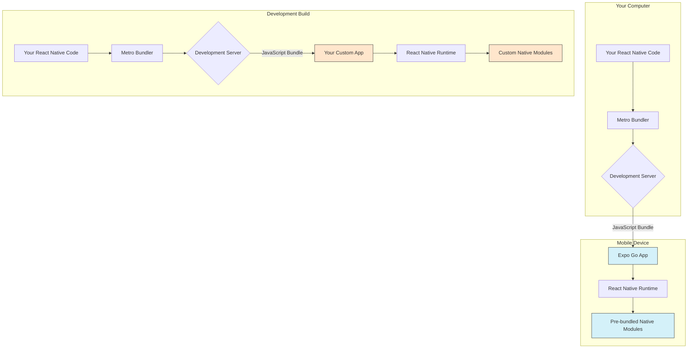

## Section 1: Introduction to Expo and Expo Go

This section introduces Expo, a key platform in the React Native ecosystem that we'll use throughout this course, and its companion development tool, Expo Go. Understanding Expo and its different development approaches is fundamental before setting up the environment.

### What is Expo?

Expo is an open-source platform for making universal native apps for Android, iOS, and the web with JavaScript and React. Think of it as a set of tools, libraries, and services built _around_ React Native that significantly simplifies the development experience, especially for those new to mobile development or those coming from a web background. ([Source](https://docs.expo.dev/get-started/introduction/))

Key benefits of using Expo include:

- **Simplified Setup:** Expo handles much of the complex configuration required for native mobile development. You often don't need to directly use Xcode or Android Studio during development.
- **Expo SDK:** A curated collection of native modules (accessing device features like camera, location, sensors) that are pre-built and readily available in your JavaScript code. This avoids the need to manually link native libraries early on.
- **Expo Go App:** A development client app that lets you instantly run and test your project on physical devices or simulators without compiling native code yourself.
- **Expo Router:** A file-based routing system inspired by web frameworks, simplifying navigation logic within your app. ([Source](https://docs.expo.dev/router/installation/))
- **Over-the-Air (OTA) Updates:** Easily push updates to your app's JavaScript bundle without needing a full App Store resubmission (using EAS Update).
- **Build Service (EAS Build):** A cloud service (part of Expo Application Services - EAS) that compiles your native app binaries (`.ipa` for iOS, `.apk`/`.aab` for Android) when you're ready to distribute them.
- **Development Workflow:** Tools (like Expo CLI) and services (like EAS) that streamline common tasks like managing secrets, running development servers, and creating development builds.
- **Community:** An active community forum ([chat.expo.dev](https://chat.expo.dev)) and GitHub presence.

> [!IMPORTANT]
> While Expo simplifies many aspects, it's still built on top of React Native. Understanding core React Native concepts (covered in later modules) remains essential. Expo provides powerful abstractions, but knowing what's happening underneath is crucial for advanced development and troubleshooting.

### What is Expo Go?

Expo Go is a free mobile client app available on the App Store (iOS) and Google Play Store (Android). ([Source](https://expo.dev/go)) It allows you to open and run Expo projects instantly during development without needing to build the native code yourself via Xcode or Android Studio.

Here's how it works:

1.  You run your Expo project on your computer using the Expo CLI (`npx expo start`).
2.  The CLI starts a development server (Metro) and shows a QR code.
3.  You open the Expo Go app on your physical device (or use it within the iOS Simulator).
4.  You scan the QR code (or enter the URL) using Expo Go.
5.  Expo Go downloads your app's JavaScript bundle from the development server and runs it within its pre-built native environment.

This provides a very fast feedback loop: make a change in your code, save it, and see the update almost instantly in Expo Go.

#### Under the Hood: How Expo Go Functions

Understanding Expo Go requires recognizing two distinct parts: ([Source](https://docs.expo.dev/develop/development-builds/introduction/))

1.  **The Native App (Expo Go):** This is the application installed from the app store. It contains the React Native runtime and a specific, fixed set of native modules and APIs bundled by the Expo team for a particular Expo SDK version. Think of it as a pre-compiled native shell. Once installed, this native part doesn't change unless you update Expo Go itself.
2.  **The JavaScript Bundle:** This is the code you write (React components, logic, styles). The development server (`npx expo start`) bundles your code. Expo Go connects to this server and downloads the bundle.

React Native acts as the bridge, allowing your JavaScript code running inside the Expo Go shell to communicate with the native modules already compiled into that specific version of the Expo Go app.

This diagram visually contrasts two primary development workflows facilitated by Expo.

1.  **Expo Go Workflow** (represented in the top part of the diagram): In this model, your React Native JavaScript code (A) is processed by the Metro bundler (B) and served via a development server (C) to the Expo Go application (D) running on a mobile device or simulator. Expo Go (D) contains its own React Native runtime (E) and a pre-defined, fixed set of native modules (F). This workflow is excellent for rapid iteration when custom native code is not needed.
2.  **Development Build Workflow** (represented in the bottom part of the diagram): Here, your JavaScript code (G) is similarly bundled (H) and served (I). However, it's loaded into your custom-built application (J) – a Development Build. This custom app (J) also has a React Native runtime (K) but, critically, it includes any custom native modules (L) you've added to your project, plus the `expo-dev-client` for developer tooling.

The fundamental difference lies in the native capabilities and customization. Expo Go offers a convenient, sandboxed environment with a limited set of pre-included native modules. In contrast, a Development Build gives you full control to incorporate any native module, making it essential for apps with specific native dependencies or custom native code. We will delve deeper into creating and using Development Builds in Module 16.

> [!CAUTION]
> If your JavaScript code attempts to call a native module that is _not_ included in the installed Expo Go build (e.g., a third-party library with native code, or your own custom native code), the app will crash because the corresponding native code doesn't exist within the Expo Go sandbox. ([Source](https://docs.expo.dev/develop/development-builds/introduction/))

### Expo Go vs. Development Builds

While Expo Go offers the quickest start, its pre-packaged nature imposes limitations. For most real-world applications requiring custom native features or dependencies, **Development Builds** become essential. ([Source](https://docs.expo.dev/develop/development-builds/introduction/))

A Development Build is a special "debug" version of _your_ app, built using your local tools (Xcode/Android Studio) or EAS Build. It includes the `expo-dev-client` library, providing a similar developer menu for connecting to the Metro server, but crucially, it packages _your_ app's specific native code and dependencies.

**Key Differences:**

- **Native Modules:** Expo Go is limited to modules bundled by Expo. Development Builds can include _any_ native module (Expo SDK, community libraries, custom ones).
- **Custom Native Code:** Not possible in Expo Go. Fully supported in Development Builds.
- **Setup:** Expo Go requires only the app install. Development Builds require setting up the native toolchain (Xcode/Android Studio).
- **Build Process:** Expo Go uses the pre-built app. Development Builds require a local build (`npx expo run:ios`/`run:android`) or an EAS Build.

**Scenarios Requiring a Development Build:** ([Source](https://docs.expo.dev/develop/development-builds/introduction/))

- Using third-party React Native libraries with native code not included in Expo Go (e.g., `react-native-firebase`, many Bluetooth libraries).
- Writing custom native modules (Swift/Objective-C or Kotlin/Java).
- Testing native UI customizations (custom app icons, splash screens, deep linking).
- Testing features tightly coupled with native configurations (push notification certificates).
- Using older Expo SDK versions on physical iOS devices (due to App Store limitations).

> 🤖 **(Native Developers):**
>
> **Comparison:** Think of Expo Go as a pre-compiled shell where your contribution is primarily JavaScript injected at runtime; you don't control the shell's native dependencies. Development Builds are analogous to your standard native workflow – you compile the _entire_ application from source, managing all native libraries and configurations directly. `expo-dev-client` just adds tooling for the JS server connection.
>
> **Key Takeaway:** Expo Go abstracts native builds away; Development Builds embrace them, giving you full control.

> 🌐 **(Web Developers):**
>
> **Comparison:** Imagine Expo Go as a specialized browser with a fixed set of built-in "Web APIs" (the bundled native modules). You can only use those APIs. A Development Build is like compiling your own custom version of this browser, where you can include _any_ specific "APIs" (native modules) you require.
>
> **Key Takeaway:** Expo Go provides a limited, fixed native runtime; Development Builds let you define and compile your own native runtime.

**Table 1: Expo Go vs. Development Builds Comparison**

| Feature               | Expo Go                                 | Development Build                                           |
| :-------------------- | :-------------------------------------- | :---------------------------------------------------------- |
| Native Module Support | Limited to pre-bundled Expo SDK modules | Any React Native module (Expo SDK, community, custom)       |
| Custom Native Code    | Not supported                           | Supported                                                   |
| Initial Setup         | Minimal (Install Expo Go app)           | Requires Native Toolchain (Xcode/Android Studio) Setup      |
| Build Process         | None (Uses pre-built app)               | Requires local build (`run:ios`/`run:android`) or EAS Build |
| Typical Use Case      | Learning, Prototyping, Simple Apps      | Active Development, Apps with Custom Native Needs           |
| Flexibility           | Low                                     | High                                                        |
| Production Readiness  | Not recommended for store submission    | Foundation for Production Builds                            |

> [!NOTE]
> Expo Go is an excellent starting point and useful for quickly testing platform-agnostic JavaScript logic. However, most production apps eventually transition to using Development Builds to incorporate specific native dependencies or customizations. We will cover creating Development Builds and using EAS Build in Module 16.

> 📚 **Official Documentation:**
>
> - [Expo Docs: Introduction](https://docs.expo.dev/get-started/introduction/)
> - [Expo Docs: Expo Go](https://docs.expo.dev/get-started/expo-go/)
> - [Expo Docs: Development Builds Introduction](https://docs.expo.dev/develop/development-builds/introduction/)
> - [Expo Docs: Expo Router](https://docs.expo.dev/router/introduction/)
> - [React Native Docs: Platforms to try - Expo](https://reactnative.dev/docs/0.75/more-resources#platforms-to-try)
