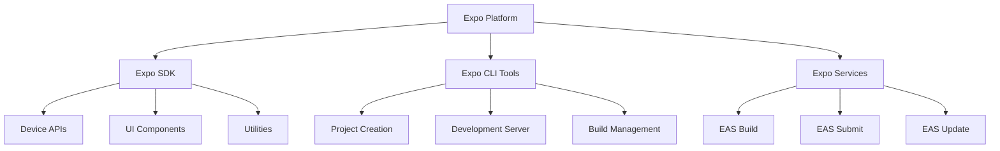
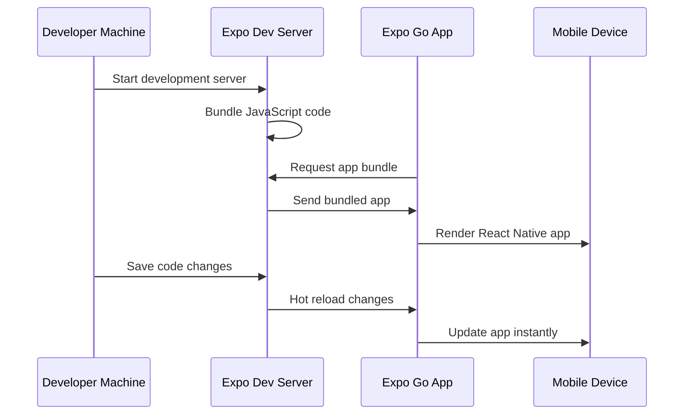

## Section 1: Introduction to Expo and Expo Go

Understanding Expo and its ecosystem is essential before setting up your development environment. This section introduces the core concepts, benefits, and role of Expo in modern React Native development.

### What is Expo?

Expo is a comprehensive platform and set of tools that dramatically simplifies React Native development. Rather than requiring complex native development setup, Expo provides a managed workflow that handles the intricate details of building, deploying, and updating React Native applications.

At its core, Expo consists of three main components:

- **Expo SDK**: A collection of libraries and APIs that provide access to device features like camera, location, notifications, and file system
- **Expo CLI Tools**: Command-line interface for creating, building, and managing projects
- **Expo Services**: Cloud-based services for building, publishing, and updating applications

This diagram illustrates the comprehensive architecture of the Expo platform and how its three main components work together to provide a complete React Native development solution. The Expo Platform serves as the foundation that encompasses all tools and services needed for mobile app development. The Expo SDK acts as the bridge between your JavaScript code and native device capabilities, offering pre-built modules for common device features like camera access, location services, and push notifications, eliminating the need to write complex native code for these functionalities. The Expo CLI Tools provide the command-line interface that developers interact with daily, handling everything from project creation to running development servers and managing builds. Finally, Expo Services represents the cloud-based infrastructure that powers advanced features like EAS Build for creating app store-ready binaries, EAS Submit for automating app store submissions, and EAS Update for delivering over-the-air updates to deployed applications. This modular architecture allows developers to start simple with just the SDK and CLI tools, then gradually adopt cloud services as their projects mature and require more sophisticated deployment and update mechanisms.

The Expo platform addresses many pain points in traditional React Native development. It eliminates the need to configure complex build tools, manage native dependencies manually, or maintain separate iOS and Android development environments during the development phase.

### Understanding Expo Go

Expo Go is a mobile application available on the iOS App Store and Google Play Store that serves as a development client for Expo projects. Think of it as a specialized browser for React Native applications built with Expo.

#### How Expo Go works

When you're developing an Expo application, Expo Go connects to your development server and loads your application code in real-time. This creates an incredibly fast development cycle where you can see changes almost immediately after saving your code.

This sequence diagram demonstrates the real-time development workflow that makes Expo Go so powerful for React Native development. The process begins when a developer starts the Expo development server on their machine, which immediately begins bundling and watching JavaScript code for changes. The Expo Go app, running on a physical mobile device, establishes a connection to this development server and requests the bundled application code. The server then sends the compiled JavaScript bundle to Expo Go, which renders the React Native application on the mobile device. The magic happens when the developer makes code changes and saves them - the development server detects these changes automatically and pushes the updates to Expo Go through hot reloading, causing the app on the device to update instantly without losing state or requiring a full reload. This creates an incredibly efficient development loop where changes are visible within seconds, making it possible to iterate rapidly on user interface elements, logic, and styling. The entire process happens over the local network when the development machine and mobile device are on the same Wi-Fi network, or through Expo's tunnel service when network configurations prevent direct connections.

This workflow means you can develop React Native applications without needing to install Xcode on macOS or Android Studio, compile native code, or manage device provisioning during the initial development phase.

#### Benefits of using Expo Go

Expo Go provides several advantages for React Native development:

- **Rapid iteration**: See changes instantly without rebuilding or reinstalling
- **Easy sharing**: Share your work-in-progress with others via QR codes
- **Multi-device testing**: Test on multiple devices simultaneously
- **No native build requirements**: Develop without Xcode or Android Studio initially
- **Consistent environment**: All devices run the same Expo runtime version

### Expo's role in the React Native ecosystem

> 🌐 **Web Developers:**
>
> **Comparison:** Expo serves a similar role to platforms like Netlify or Vercel in web development. Just as these platforms abstract deployment complexity while providing powerful features, Expo abstracts React Native build complexity while offering extensive device APIs and services.
>
> **Key Takeaway:** Expo handles the "devops" aspects of mobile development, letting you focus on building features.
>
> **Source:** [Netlify Documentation](https://docs.netlify.com/)

Expo sits between React Native core and your application code, providing a managed layer that simplifies development while maintaining full access to React Native's capabilities. This positioning allows developers to:

1. **Start quickly**: Create and run apps within minutes rather than hours of setup
2. **Focus on features**: Spend time building app functionality rather than configuring build systems
3. **Access native features**: Use device capabilities through well-designed, consistent APIs
4. **Scale when needed**: "Eject" to bare React Native when custom native code becomes necessary

#### Managed vs. bare workflow

Expo offers two primary development approaches:

**Managed Workflow**: Expo handles all native code and build processes. You write JavaScript/TypeScript and use Expo APIs. This is the recommended starting point and what this course focuses on.

**Bare Workflow**: You have full control over native code while still using Expo tools and services. This is similar to a standard React Native CLI project but with Expo tooling available.

> [!NOTE]
> This course uses the managed workflow exclusively. The bare workflow is more advanced and typically used when you need custom native modules or specific native configurations that Expo's managed workflow doesn't support.

### When to choose Expo

Expo is an excellent choice for:

- **Learning React Native**: Removes setup complexity, allowing focus on React Native concepts
- **Rapid prototyping**: Quick experimentation with ideas and features
- **MVP development**: Building minimum viable products efficiently
- **Teams without native expertise**: Developing mobile apps without iOS/Android specialists
- **Cross-platform projects**: Building for both iOS and Android simultaneously

#### Considerations and limitations

While Expo provides numerous benefits, be aware of these considerations:

- **Bundle size**: Expo apps include the entire Expo runtime, resulting in larger initial app sizes
- **App store limitations**: Some app store optimization features aren't available in managed workflow
- **Custom native modules**: Adding arbitrary native code requires ejecting to bare workflow
- **Platform-specific features**: Some highly platform-specific features may not be available

> [!IMPORTANT]
> These limitations have significantly decreased over time. Expo's "Development builds" feature now allows custom native code while maintaining most managed workflow benefits. This course focuses on the managed workflow as it covers the vast majority of use cases and provides the best learning experience.

### Official documentation

> 📚 **Official Documentation:**
>
> - [Expo Documentation - Introduction](https://docs.expo.dev/)
> - [Expo Go on iOS App Store](https://apps.apple.com/app/expo-go/id982107779)
> - [Expo Go on Google Play](https://play.google.com/store/apps/details?id=host.exp.exponent)
> - [React Native Documentation](https://reactnative.dev/docs/getting-started)
>
> 🗂️ **Additional Resources:**
>
> - [Expo Blog - Why Expo](https://blog.expo.dev/why-expo-f57aac0d7e75)
> - [React Native vs Expo Comparison](https://expo.dev/blog/should-i-use-expo)

### Next steps

Now that you understand what Expo and Expo Go are and how they fit into React Native development, you're ready to install the necessary prerequisites for your development environment. The next section will guide you through installing Node.js, package managers, and other essential tools.
