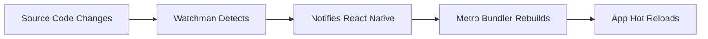

# Section 2: Installing prerequisites

Before creating your first Expo application, you need to install several essential tools that form the foundation of React Native development. This section provides step-by-step instructions for installing Node.js, package managers, Watchman, and Xcode Command Line Tools on macOS.

## Prerequisites for this section

- macOS computer (macOS 10.15 Catalina or later recommended)
- Administrative access to install software
- Stable internet connection for downloading packages
- Basic familiarity with Terminal application

> [!IMPORTANT]
> This course focuses on macOS setup for iOS development. While Expo supports Windows and Linux for general development, iOS Simulator requires macOS. Ensure you're using a Mac computer before proceeding.

## Installing Node.js

Node.js is the JavaScript runtime that powers React Native development tools and enables you to run JavaScript code outside the browser. Expo CLI requires Node.js to function.

### Recommended installation method: Node Version Manager (nvm)

Node Version Manager allows you to install and switch between multiple Node.js versions easily. This flexibility is valuable when working on different projects with varying Node.js requirements.

1. **Install nvm using the official install script:**

```bash
curl -o- https://raw.githubusercontent.com/nvm-sh/nvm/v0.39.0/install.sh | bash
```

2. **Restart your terminal or reload your shell configuration:**

```bash
source ~/.zshrc
```

> [!NOTE]
> If you're using bash instead of zsh, use `source ~/.bashrc` instead. macOS Catalina and later use zsh as the default shell.

3. **Verify nvm installation:**

```bash
nvm --version
```

You should see a version number like `0.39.0` if nvm installed correctly.

4. **Install the latest LTS (Long Term Support) version of Node.js:**

```bash
nvm install --lts
nvm use --lts
```

5. **Set the LTS version as your default:**

```bash
nvm alias default node
```

6. **Verify Node.js installation:**

```bash
node --version
npm --version
```

You should see version numbers for both Node.js (18.x or higher) and npm (9.x or higher).

### Alternative installation method: Direct download

If you prefer not to use nvm, you can download Node.js directly:

1. Visit the [official Node.js website](https://nodejs.org/)
2. Download the LTS version for macOS
3. Run the installer and follow the prompts
4. Verify installation using the commands above

> 🌐 **Web Developers:**
>
> **Comparison:** Installing Node.js for React Native development is identical to setting it up for web development. The same Node.js installation serves both purposes, and you can use the same package managers (npm, yarn) you're already familiar with.
>
> **Key Takeaway:** Your existing Node.js knowledge directly transfers to React Native development.
>
> **Source:** [Node.js Documentation](https://nodejs.org/en/docs/)

## Installing package managers

While npm comes bundled with Node.js, you have options for package management. This course supports both npm and Yarn, with slight preference for npm due to its universal availability.

### Using npm (included with Node.js)

npm is automatically installed with Node.js, so no additional installation is required. Update npm to the latest version:

```bash
npm install -g npm@latest
```

Verify the update:

```bash
npm --version
```

### Installing Yarn (optional)

Yarn is an alternative package manager that some developers prefer for its speed and deterministic installations:

1. **Install Yarn globally using npm:**

```bash
npm install -g yarn
```

2. **Verify Yarn installation:**

```bash
yarn --version
```

> [!TIP]
> Both npm and Yarn work excellently with Expo. Choose based on your preference or team standards. This course provides commands for both, typically showing npm first.

## Installing Watchman

Watchman is a tool developed by Facebook that watches files and triggers actions when they change. React Native uses Watchman to monitor your source code and automatically reload your application during development.

### Installing Watchman via Homebrew

Homebrew is the most reliable way to install Watchman on macOS:

1. **Install Homebrew if you don't have it:**

```bash
/bin/bash -c "$(curl -fsSL https://raw.githubusercontent.com/Homebrew/install/HEAD/install.sh)"
```

2. **Install Watchman:**

```bash
brew install watchman
```

3. **Verify Watchman installation:**

```bash
watchman --version
```

You should see a version number like `2023.11.06.00` or similar.

### Understanding Watchman's role



Watchman continuously monitors your project files for changes. When you save a file, Watchman immediately notifies the React Native Metro bundler, which rebuilds your application and triggers a hot reload. This creates the near-instantaneous feedback loop that makes React Native development so efficient.

> [!NOTE]
> While Watchman isn't strictly required for Expo development, it significantly improves performance and reliability of the hot reload system, especially in larger projects.

## Installing Xcode Command Line Tools

Xcode Command Line Tools provide essential development utilities required for iOS development, including compilers, debuggers, and other tools used by React Native's build system.

### Installation process

1. **Install Xcode Command Line Tools:**

```bash
xcode-select --install
```

This command opens a dialog box asking if you want to install the tools. Click "Install" and agree to the license terms.

2. **Verify installation:**

```bash
xcode-select -p
```

You should see a path like `/Applications/Xcode.app/Contents/Developer` or `/Library/Developer/CommandLineTools`.

3. **Check for successful installation:**

```bash
gcc --version
```

You should see information about the installed compiler, confirming the Command Line Tools are working.

### Why Xcode Command Line Tools are necessary

Even though Expo abstracts much of the native build process, certain operations still require these tools:

- **iOS Simulator**: Launching and managing iOS Simulator instances
- **Code signing**: Handling certificates and provisioning profiles
- **Native dependencies**: Compiling any native code when needed
- **Development certificates**: Managing development and distribution certificates

> 🍏 **iOS Developers:**
>
> **Comparison:** If you have Xcode installed, you already have these Command Line Tools. However, for React Native development, you don't need the full Xcode IDE for daily development—the Command Line Tools are sufficient for most Expo workflows.
>
> **Key Takeaway:** You can develop React Native apps without opening Xcode, unlike traditional iOS development.
>
> **Source:** [Xcode Command Line Tools Guide](https://developer.apple.com/xcode/)

## Verifying your complete setup

After installing all prerequisites, verify everything is working correctly:

1. **Check Node.js and npm/yarn:**

```bash
node --version
npm --version
# If using Yarn:
yarn --version
```

2. **Check Watchman:**

```bash
watchman --version
```

3. **Check Xcode Command Line Tools:**

```bash
xcode-select -p
gcc --version
```

4. **Install Expo CLI globally:**

```bash
npm install -g @expo/cli@latest
```

5. **Verify Expo CLI installation:**

```bash
expo --version
```

You should see a version number like `0.17.0` or higher.

### Expected output summary

Your terminal should show similar versions:

```bash
# Node.js (18.x or higher)
v18.18.0

# npm (9.x or higher)
9.8.1

# Watchman (latest)
2023.11.06.00

# Xcode Command Line Tools path
/Applications/Xcode.app/Contents/Developer

# Expo CLI (latest)
0.17.0
```

> [!IMPORTANT]
> Version numbers will vary based on when you install these tools. The important thing is that all commands execute successfully without errors.

## Troubleshooting common installation issues

### Node.js installation problems

**Issue**: `nvm: command not found` after installation

**Solution**: Restart your terminal or manually add nvm to your shell profile:

```bash
echo 'export NVM_DIR="$HOME/.nvm"' >> ~/.zshrc
echo '[ -s "$NVM_DIR/nvm.sh" ] && \. "$NVM_DIR/nvm.sh"' >> ~/.zshrc
echo '[ -s "$NVM_DIR/bash_completion" ] && \. "$NVM_DIR/bash_completion"' >> ~/.zshrc
source ~/.zshrc
```

**Issue**: Permission errors when installing global packages

**Solution**: Configure npm to use a different directory for global packages:

```bash
mkdir ~/.npm-global
npm config set prefix '~/.npm-global'
echo 'export PATH=~/.npm-global/bin:$PATH' >> ~/.zshrc
source ~/.zshrc
```

### Homebrew installation problems

**Issue**: Homebrew command not found

**Solution**: Ensure Homebrew is in your PATH:

```bash
echo 'eval "$(/opt/homebrew/bin/brew shellenv)"' >> ~/.zshrc
source ~/.zshrc
```

### Xcode Command Line Tools issues

**Issue**: `xcode-select: error: command line tools are already installed`

**Solution**: The tools are already installed. Verify with `xcode-select -p`.

**Issue**: License agreement errors

**Solution**: Accept the Xcode license:

```bash
sudo xcodebuild -license accept
```

## Official documentation

> 📚 **Official Documentation:**
>
> - [Node.js Installation Guide](https://nodejs.org/en/download/)
> - [nvm Repository and Documentation](https://github.com/nvm-sh/nvm)
> - [Yarn Installation Guide](https://yarnpkg.com/getting-started/install)
> - [Watchman Installation](https://facebook.github.io/watchman/docs/install.html)
> - [Xcode Command Line Tools](https://developer.apple.com/xcode/)
> - [Expo CLI Documentation](https://docs.expo.dev/workflow/expo-cli/)

## Next steps

With all prerequisites installed and verified, you're ready to create your first Expo application. The next section will walk you through using the latest `create-expo-app` command to scaffold a new project and run it for the first time.
