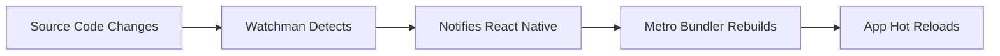

## Section 2: Installing Prerequisites

Before creating your first Expo application, you need to install several essential tools that form the foundation of React Native development. This section provides step-by-step instructions for installing Node.js, package managers, Watchman, and platform-specific development tools on Windows, macOS, and Linux.

### Prerequisites for this section

- Computer running Windows 10+, macOS 10.15+, or recent Linux distribution
- Administrative access to install software
- Stable internet connection for downloading packages
- Basic familiarity with command-line interfaces

> [!IMPORTANT]
> This course supports multiple development approaches. Choose the setup that matches your platform and preferred development method: iOS Simulator (macOS only), Android Emulator (Windows, macOS, Linux), or Expo Go on physical devices (all platforms).

### Installing Node.js

Node.js is the JavaScript runtime that powers React Native development tools and enables you to run JavaScript code outside the browser. Expo CLI requires Node.js to function.

#### Recommended installation method: Node Version Manager

Node Version Manager allows you to install and switch between multiple Node.js versions easily. This flexibility is valuable when working on different projects with varying Node.js requirements.

##### Windows Installation (nvm-windows)

1. **Download nvm-windows:**

   - Visit [nvm-windows releases](https://github.com/coreybutler/nvm-windows/releases)
   - Download the latest `nvm-setup.exe`

2. **Run the installer:**

   - Execute the downloaded file as Administrator
   - Follow the installation prompts

3. **Verify nvm-windows installation:**

```cmd
nvm version
```

4. **Install the latest LTS version of Node.js:**

```cmd
nvm install lts
nvm use lts
```

5. **Set the LTS version as default:**

```cmd
nvm alias default lts
```

6. **Verify Node.js installation:**

```cmd
node --version
npm --version
```

##### macOS and Linux Installation (nvm)

1. **Install nvm using the official install script:**

```bash
curl -o- https://raw.githubusercontent.com/nvm-sh/nvm/v0.39.0/install.sh | bash
```

2. **Restart your terminal or reload your shell configuration:**

```bash
# For zsh (macOS default)
source ~/.zshrc

# For bash
source ~/.bashrc
```

3. **Verify nvm installation:**

```bash
nvm --version
```

4. **Install the latest LTS version of Node.js:**

```bash
nvm install --lts
nvm use --lts
```

5. **Set the LTS version as your default:**

```bash
nvm alias default node
```

6. **Verify Node.js installation:**

```bash
node --version
npm --version
```

#### Alternative installation method: Direct download

If you prefer not to use a version manager, you can download Node.js directly:

1. Visit the [official Node.js website](https://nodejs.org/)
2. Download the LTS version for your operating system
3. Run the installer and follow the prompts
4. Verify installation using the commands above

> 🌐 **Web Developers:**
>
> **Comparison:** Installing Node.js for React Native development is identical to setting it up for web development. The same Node.js installation serves both purposes, and you can use the same package managers (npm, yarn) you're already familiar with.
>
> **Key Takeaway:** Your existing Node.js knowledge directly transfers to React Native development.
>
> **Source:** [Node.js Documentation](https://nodejs.org/en/docs/)

### Installing package managers

While npm comes bundled with Node.js, you have options for package management. This course supports both npm and Yarn, with slight preference for npm due to its universal availability.

#### Using npm (included with Node.js)

npm is automatically installed with Node.js, so no additional installation is required. Update npm to the latest version:

```bash
npm install -g npm@latest
```

Verify the update:

```bash
npm --version
```

#### Installing Yarn (optional)

Yarn is an alternative package manager that some developers prefer for its speed and deterministic installations:

1. **Install Yarn globally using npm:**

```bash
npm install -g yarn
```

2. **Verify Yarn installation:**

```bash
yarn --version
```

> [!TIP]
> Both npm and Yarn work excellently with Expo. Choose based on your preference or team standards. This course provides commands for both, typically showing npm first.

### Installing Watchman

Watchman is a tool developed by Facebook that watches files and triggers actions when they change. React Native uses Watchman to monitor your source code and automatically reload your application during development.

#### Windows Installation

Watchman is optional on Windows as Metro bundler (React Native's JavaScript bundler) has built-in file watching that works well on Windows.

If you want to install Watchman on Windows:

1. **Download Watchman from the official releases:**

   - Visit [Watchman releases](https://github.com/facebook/watchman/releases)
   - Download the Windows binary
   - Add it to your system PATH

2. **Or use Chocolatey (if installed):**

```cmd
choco install watchman
```

#### macOS Installation

**Using Homebrew (recommended):**

1. **Install Homebrew if you don't have it:**

```bash
/bin/bash -c "$(curl -fsSL https://raw.githubusercontent.com/Homebrew/install/HEAD/install.sh)"
```

2. **Install Watchman:**

```bash
brew install watchman
```

3. **Verify Watchman installation:**

```bash
watchman --version
```

#### Linux Installation

**Using package managers:**

**Ubuntu/Debian:**

```bash
sudo apt update
sudo apt install watchman
```

**Fedora/CentOS:**

```bash
sudo dnf install watchman
```

**Or build from source (all Linux distributions):**

1. **Install dependencies:**

```bash
# Ubuntu/Debian
sudo apt install build-essential python3-setuptools libssl-dev

# Fedora/CentOS
sudo dnf install gcc-c++ python3-setuptools openssl-devel
```

2. **Clone and build Watchman:**

```bash
git clone https://github.com/facebook/watchman.git
cd watchman
git checkout v2023.11.06.00  # Latest stable version
./autogen.sh
./configure
make
sudo make install
```

#### Understanding Watchman's role



This workflow diagram illustrates the critical role Watchman plays in creating an efficient React Native development experience through automated file monitoring and hot reloading. The process begins when you make changes to your source code files, whether modifying JavaScript components, updating styles, or adding new functionality. Watchman, running continuously in the background, immediately detects these file system changes using efficient native file watching APIs that are optimized for each operating system. Once Watchman identifies the changes, it notifies the React Native development system, specifically the Metro bundler, which is Facebook's JavaScript bundler designed for React Native applications. The Metro bundler then quickly rebuilds only the affected parts of your application bundle, leveraging incremental compilation to minimize rebuild time. Finally, the updated code is automatically pushed to your running application through hot reloading, updating the app's interface and functionality without requiring a full restart or losing the current application state. This entire process typically completes within seconds, creating a seamless development experience where you can see your changes reflected immediately as you code, dramatically improving productivity compared to traditional mobile development workflows that require manual compilation and app restarts.

Watchman continuously monitors your project files for changes. When you save a file, Watchman immediately notifies the React Native Metro bundler, which rebuilds your application and triggers a hot reload. This creates the near-instantaneous feedback loop that makes React Native development so efficient.

> [!NOTE]
> While Watchman isn't strictly required for Expo development (especially on Windows), it significantly improves performance and reliability of the hot reload system, especially in larger projects.

### Platform-specific development tools

Depending on your chosen development approach, you may need additional platform-specific tools.

#### For iOS Simulator (macOS only)

If you plan to use iOS Simulator for development, you need Xcode Command Line Tools:

1. **Install Xcode Command Line Tools:**

```bash
xcode-select --install
```

This command opens a dialog box asking if you want to install the tools. Click "Install" and agree to the license terms.

2. **Verify installation:**

```bash
xcode-select -p
```

You should see a path like `/Applications/Xcode.app/Contents/Developer` or `/Library/Developer/CommandLineTools`.

3. **Check for successful installation:**

```bash
gcc --version
```

> 🍏 **iOS Developers:**
>
> **Comparison:** If you have Xcode installed, you already have these Command Line Tools. However, for React Native development, you don't need the full Xcode IDE for daily development—the Command Line Tools are sufficient for most Expo workflows.
>
> **Key Takeaway:** You can develop React Native apps without opening Xcode, unlike traditional iOS development.
>
> **Source:** [Xcode Command Line Tools Guide](https://developer.apple.com/xcode/)

#### For Android Emulator (all platforms)

If you plan to use Android Emulator for development, you have two options:

##### Option 1: Android Studio (recommended)

1. **Download Android Studio:**

   - Visit [Android Studio website](https://developer.android.com/studio)
   - Download the version for your operating system

2. **Install Android Studio:**

   - **Windows:** Run the .exe installer
   - **macOS:** Open the .dmg file and drag to Applications
   - **Linux:** Extract the .tar.gz and run studio.sh

3. **Set up Android SDK:**

   - Open Android Studio
   - Go through the setup wizard
   - Install the recommended SDK components

4. **Configure environment variables:**

**Windows (Add to system environment variables):**

```
ANDROID_HOME = C:\Users\{username}\AppData\Local\Android\Sdk
Path += %ANDROID_HOME%\emulator
Path += %ANDROID_HOME%\platform-tools
```

**macOS/Linux (Add to ~/.zshrc or ~/.bashrc):**

```bash
export ANDROID_HOME=$HOME/Library/Android/sdk  # macOS
export ANDROID_HOME=$HOME/Android/Sdk          # Linux
export PATH=$PATH:$ANDROID_HOME/emulator
export PATH=$PATH:$ANDROID_HOME/platform-tools
```

##### Option 2: Command Line Tools Only

For a lighter installation, you can install only the Android SDK without Android Studio:

1. **Download command line tools:**

   - Visit [Android SDK command line tools](https://developer.android.com/studio#command-tools)

2. **Install via command line:**
   - Follow the platform-specific instructions for SDK setup

> 🤖 **Android Developers:**
>
> **Comparison:** The Android setup for React Native is similar to traditional Android development. You'll use the same Android SDK, emulators, and tools you're familiar with. The main difference is that you'll be developing in JavaScript/TypeScript instead of Java/Kotlin.
>
> **Key Takeaway:** Your existing Android development knowledge directly applies to React Native development.
>
> **Source:** [Android Developer Documentation](https://developer.android.com/)

#### For Expo Go (all platforms)

If you plan to use Expo Go on physical devices, no additional development tools are required on your computer. You'll only need:

1. **The Expo Go app on your mobile device:**

   - [iOS App Store](https://apps.apple.com/app/expo-go/id982107779)
   - [Google Play Store](https://play.google.com/store/apps/details?id=host.exp.exponent)

2. **Network connectivity** between your development computer and mobile device

### Verifying your complete setup

After installing all prerequisites, verify everything is working correctly:

1. **Check Node.js and npm/yarn:**

```bash
node --version
npm --version
# If using Yarn:
yarn --version
```

2. **Check Watchman (if installed):**

```bash
watchman --version
```

3. **Check platform-specific tools:**

**For iOS development (macOS only):**

```bash
xcode-select -p
gcc --version
```

**For Android development:**

```bash
# Check Android SDK
echo $ANDROID_HOME  # macOS/Linux
echo %ANDROID_HOME% # Windows

# Check if emulator is available
emulator -list-avds
```

4. **Install Expo CLI:**

```bash
npm install -g @expo/cli@latest
```

5. **Verify Expo CLI installation:**

```bash
expo --version
```

#### Expected output summary

Your terminal should show similar versions:

```bash
# Node.js (18.x or higher)
v18.18.0

# npm (9.x or higher)
9.8.1

# Watchman (if installed)
2023.11.06.00

# Expo CLI (latest)
0.17.0
```

> [!IMPORTANT]
> Version numbers will vary based on when you install these tools. The important thing is that all commands execute successfully without errors.

### Troubleshooting common installation issues

#### Cross-platform Node.js issues

**Issue**: `nvm: command not found` after installation

**Solution varies by platform:**

**Windows:** Ensure nvm-windows was installed as Administrator and restart Command Prompt

**macOS/Linux:** Restart terminal or manually add to shell profile:

```bash
echo 'export NVM_DIR="$HOME/.nvm"' >> ~/.zshrc
echo '[ -s "$NVM_DIR/nvm.sh" ] && \. "$NVM_DIR/nvm.sh"' >> ~/.zshrc
source ~/.zshrc
```

**Issue**: Permission errors when installing global packages

**Solution:**

**Windows:** Run Command Prompt as Administrator

**macOS/Linux:** Configure npm to use a different directory:

```bash
mkdir ~/.npm-global
npm config set prefix '~/.npm-global'
echo 'export PATH=~/.npm-global/bin:$PATH' >> ~/.zshrc
source ~/.zshrc
```

#### Android setup issues

**Issue**: Android environment variables not recognized

**Solution:**

**Windows:** Use System Properties > Environment Variables to set permanently

**macOS/Linux:** Ensure variables are in the correct shell profile file (.zshrc, .bashrc, .bash_profile)

**Issue**: Emulator not starting

**Solution:**

1. Ensure hardware acceleration is enabled (Intel HAXM, AMD-V, or Hyper-V)
2. Check BIOS virtualization settings
3. Verify sufficient RAM allocation for emulator

#### Platform-specific issues

**Windows firewall blocking connections:**

- Add Node.js and Metro bundler to Windows Firewall exceptions
- Consider temporarily disabling Windows Defender firewall for development

**Linux permission issues:**

- Add user to required groups: `sudo usermod -a -G plugdev $USER`
- Logout and login again

**macOS permission issues:**

- Grant Full Disk Access to Terminal in System Preferences > Security & Privacy

## Official documentation

> 📚 **Official Documentation:**
>
> - [Node.js Installation Guide](https://nodejs.org/en/download/)
> - [nvm Repository and Documentation](https://github.com/nvm-sh/nvm)
> - [nvm-windows Repository](https://github.com/coreybutler/nvm-windows)
> - [Yarn Installation Guide](https://yarnpkg.com/getting-started/install)
> - [Watchman Installation](https://facebook.github.io/watchman/docs/install.html)
> - [Android Studio Setup](https://developer.android.com/studio/install)
> - [Xcode Command Line Tools](https://developer.apple.com/xcode/)
> - [Expo CLI Documentation](https://docs.expo.dev/workflow/expo-cli/)

## Next steps

With all prerequisites installed and verified, you're ready to create your first Expo application. The next section will walk you through using the latest `create-expo-app` command to scaffold a new project and run it for the first time using your preferred development approach.
