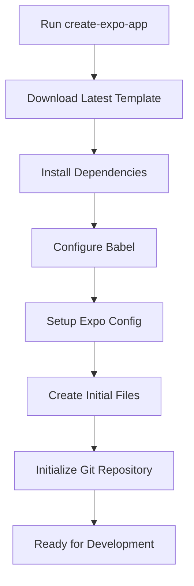
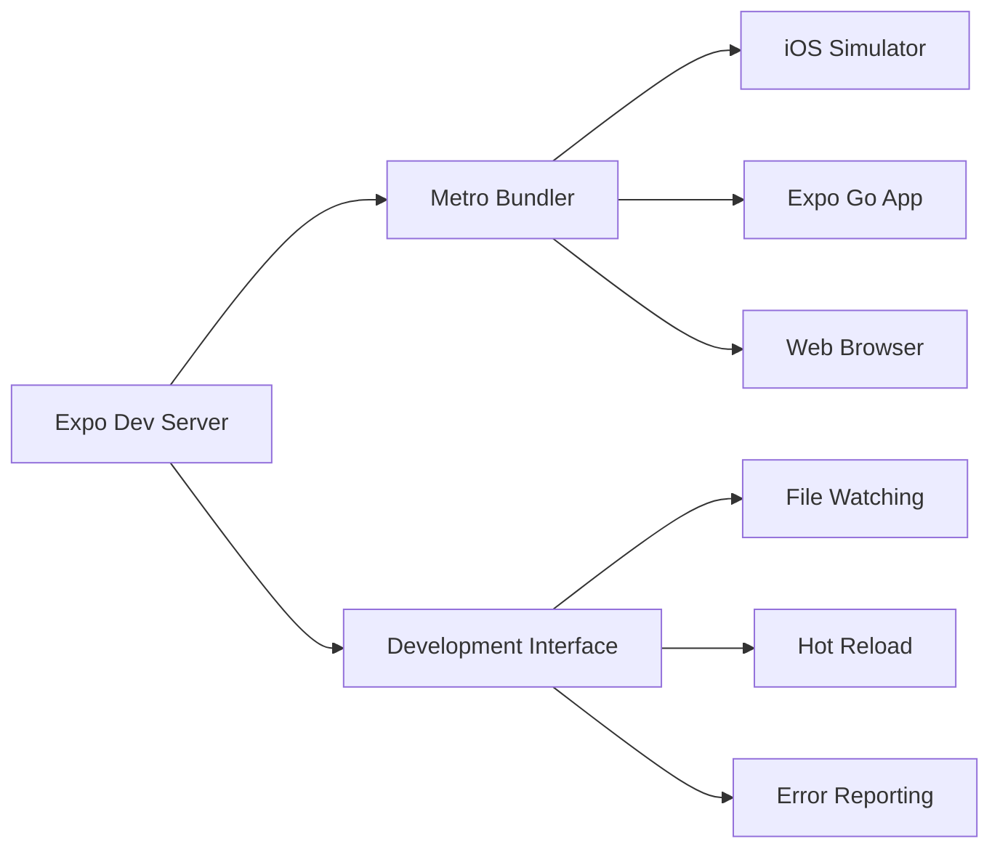

# Section 3: Creating your first Expo app

Now that you have all prerequisites installed, it's time to create your first React Native application using Expo. This section walks you through the modern `create-expo-app` command and gets your first application running.

## Prerequisites for this section

- Completion of Section 2: Installing prerequisites
- Node.js, npm, Watchman, and Xcode Command Line Tools installed and verified
- Expo CLI installed globally (`@expo/cli@latest`)
- Terminal application open and ready

## Understanding create-expo-app

The `create-expo-app` command is the modern way to scaffold new Expo projects. It replaces the older `expo init` command and provides a streamlined experience with up-to-date templates and dependencies.

### Key benefits of create-expo-app

- **Latest dependencies**: Always uses the most recent stable versions of Expo SDK and React Native
- **Modern templates**: Includes current best practices and file structures
- **TypeScript support**: Built-in TypeScript configuration when desired
- **Zero configuration**: Works immediately without manual setup
- **Template variety**: Offers different starting points based on your needs

## Creating your first project

Let's create a new project for a pharmacy management application called "SpeedyMeds" - the theme we'll use throughout this course.

### Step-by-step project creation

1. **Navigate to your development directory:**

```bash
cd ~/Developer
# Or wherever you prefer to keep your projects
```

2. **Create a new Expo project:**

```bash
npx create-expo-app@latest SpeedyMeds
```

> [!NOTE]
> The `@latest` tag ensures you're using the most recent version of the create-expo-app tool. This is important because Expo tools are updated frequently with improvements and bug fixes.

3. **Navigate into your new project directory:**

```bash
cd SpeedyMeds
```

4. **Examine the created files:**

```bash
ls -la
```

You'll see a structure similar to this:

```
SpeedyMeds/
├── App.js                 # Main app component
├── app.json              # Expo configuration
├── babel.config.js       # Babel configuration
├── package.json          # Project dependencies and scripts
├── package-lock.json     # Locked dependency versions
├── .gitignore           # Git ignore rules
├── .expo/               # Expo-specific cache and config
├── assets/              # Images, fonts, and other static assets
│   ├── icon.png
│   ├── splash.png
│   └── favicon.png
└── node_modules/        # Installed dependencies
```

### Understanding the creation process

When you run `create-expo-app`, several things happen behind the scenes:



1. **Template Download**: Downloads the most current project template from Expo's servers
2. **Dependency Installation**: Automatically runs `npm install` to set up all required packages
3. **Configuration Setup**: Creates necessary configuration files for Babel, Expo, and development tools
4. **Asset Generation**: Includes placeholder app icons and splash screens
5. **Git Initialization**: Sets up a Git repository with appropriate .gitignore rules

## Examining your first app

Let's look at the main application file to understand what was created:

```javascript
// App.js - The entry point of your application
import { StatusBar } from "expo-status-bar";
import { StyleSheet, Text, View } from "react-native";

export default function App() {
  return (
    <View style={styles.container}>
      <Text>Open up App.js to start working on your app!</Text>
      <StatusBar style="auto" />
    </View>
  );
}

const styles = StyleSheet.create({
  container: {
    flex: 1,
    backgroundColor: "#fff",
    alignItems: "center",
    justifyContent: "center",
  },
});
```

This simple app demonstrates several fundamental React Native concepts:

- **Component Structure**: Uses a functional component as the main App
- **React Native Components**: Imports `View`, `Text`, and `StyleSheet` from React Native
- **Expo Components**: Uses `StatusBar` from Expo's status bar library
- **Styling**: Applies styles using `StyleSheet.create()` for better performance
- **Layout**: Uses Flexbox properties (`flex`, `alignItems`, `justifyContent`) for positioning

> 🌐 **Web Developers:**
>
> **Comparison:** The App.js structure is nearly identical to a React web component. The main differences are importing components from `react-native` instead of using HTML elements, and using `StyleSheet` instead of CSS files.
>
> **Key Takeaway:** Your React knowledge directly applies—you're just using different components and styling approaches.
>
> **Source:** [React Components and Props](https://react.dev/learn/your-first-component)

## Running your application

With your project created, let's start the development server and see your app in action.

### Starting the development server

1. **Ensure you're in your project directory:**

```bash
pwd
# Should show something like /Users/yourname/Developer/SpeedyMeds
```

2. **Start the Expo development server:**

```bash
npx expo start
```

This command starts the Metro bundler and opens a development interface in your terminal.

### Understanding the development server output

After running `expo start`, you'll see output similar to:

```
Starting Metro Bundler
› Metro waiting on exp://192.168.1.100:8081
› Scan the QR code above with Expo Go (Android) or the Camera app (iOS)

› Press a │ open Android
› Press i │ open iOS simulator
› Press w │ open web

› Press r │ reload app
› Press m │ toggle menu
› Press d │ show developer menu
› Press shift+d │ toggle development mode

› Press ? │ show all commands
```

This interface provides several ways to run your application:

- **QR Code**: Scan with Expo Go app on your phone (covered in Section 6)
- **iOS Simulator**: Press `i` to launch in iOS Simulator (covered in Section 5)
- **Web Browser**: Press `w` to run in your web browser
- **Reload Commands**: Various shortcuts for development workflow

### Development server architecture



The development server consists of several components working together:

- **Metro Bundler**: Compiles and bundles your JavaScript code
- **File Watcher**: Monitors changes to your source files
- **Hot Reload System**: Pushes updates to connected devices automatically
- **Development Interface**: Provides commands and feedback in your terminal

## Exercise 3.1: Create and run initial app

**[Create and Run Your First Expo App](https://snack.expo.dev/@reactnative-course/exercise-3-1-create-first-app)**

This exercise will guide you through creating your own version of the SpeedyMeds application and making your first modifications to see the development workflow in action.

## Verifying successful setup

After creating and starting your application, verify everything is working correctly:

1. **Development server is running**: You should see the Metro bundler output with no errors
2. **Project structure exists**: All expected files and folders are present
3. **Dependencies installed**: `node_modules` folder contains packages
4. **Hot reload works**: Changes to App.js trigger automatic updates

### Common success indicators

- **Clean terminal output**: No red error messages in the development server logs
- **Port availability**: Metro bundler successfully binds to port 8081
- **File watching active**: The server responds when you save file changes
- **QR code displayed**: A scannable QR code appears in your terminal

### Initial troubleshooting

If you encounter issues, try these common solutions:

**Issue**: Metro bundler fails to start

**Solution**: Check if another Metro instance is running:

```bash
npx expo start --clear
```

**Issue**: Permission errors during creation

**Solution**: Ensure you have write permissions in your chosen directory and npm is configured correctly (refer to Section 2 troubleshooting).

**Issue**: Dependencies fail to install

**Solution**: Clear npm cache and retry:

```bash
npm cache clean --force
rm -rf node_modules package-lock.json
npm install
```

## Understanding project initialization

The project creation process sets up several important aspects of your development environment:

### Dependency management

Your `package.json` file now contains all necessary dependencies for React Native development:

```json
{
  "name": "speedymeds",
  "version": "1.0.0",
  "main": "node_modules/expo/AppEntry.js",
  "scripts": {
    "start": "expo start",
    "android": "expo start --android",
    "ios": "expo start --ios",
    "web": "expo start --web"
  },
  "dependencies": {
    "expo": "~52.0.0",
    "expo-status-bar": "~2.0.0",
    "react": "18.2.0",
    "react-native": "0.76.0"
  }
}
```

### Expo configuration

The `app.json` file contains Expo-specific settings:

```json
{
  "expo": {
    "name": "SpeedyMeds",
    "slug": "speedymeds",
    "version": "1.0.0",
    "orientation": "portrait",
    "icon": "./assets/icon.png",
    "userInterfaceStyle": "light",
    "splash": {
      "image": "./assets/splash.png",
      "resizeMode": "contain",
      "backgroundColor": "#ffffff"
    },
    "platforms": ["ios", "android", "web"]
  }
}
```

This configuration controls how your app appears and behaves when published or built.

## Official documentation

> 📚 **Official Documentation:**
>
> - [Expo Docs - Create a Project](https://docs.expo.dev/get-started/create-a-project/)
> - [Expo CLI Reference](https://docs.expo.dev/workflow/expo-cli/)
> - [Metro Bundler Documentation](https://facebook.github.io/metro/)
> - [React Native Getting Started](https://reactnative.dev/docs/getting-started)
>
> 🗂️ **Additional Resources:**
>
> - [Expo App Configuration](https://docs.expo.dev/workflow/configuration/)
> - [Understanding Metro](https://docs.expo.dev/guides/customizing-metro/)

## Next steps

Your first Expo application is now created and running! In the next section, you'll learn about the differences between Expo CLI commands and traditional npm/yarn package management commands, giving you a deeper understanding of how these tools work together in your development workflow.
