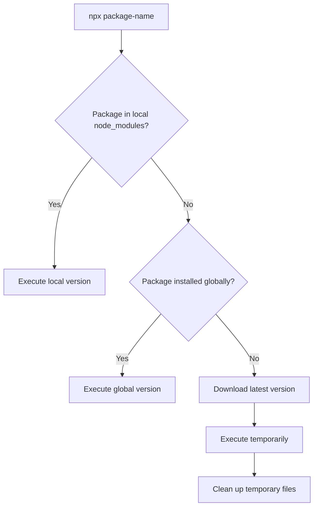
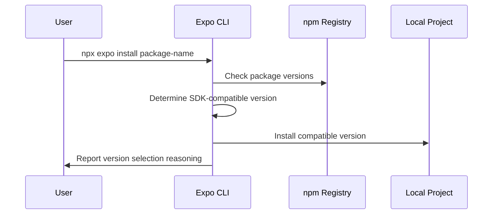

## Section 4: Understanding npx expo vs npm/yarn

Understanding the relationship between Expo CLI commands and traditional Node.js package managers is crucial for effective React Native development. This section clarifies when and why to use different command-line tools in your workflow.

### What is npx?

`npx` is a package runner tool that comes bundled with npm (version 5.2.0 and higher). It allows you to execute Node.js packages without installing them globally on your system.

#### How npx works

When you run `npx package-name`, several things happen:

1. **Check local installation**: npx first looks for the package in your local `node_modules/.bin`
2. **Check global installation**: If not found locally, it checks your global npm packages
3. **Download and execute**: If not installed anywhere, it downloads the latest version temporarily and executes it
4. **Clean up**: After execution, temporary packages are removed



This decision tree diagram illustrates the intelligent package resolution strategy that makes npx such a powerful tool for modern JavaScript development. When you execute an npx command, the system follows a carefully designed hierarchy to determine which version of a package to run, ensuring optimal compatibility and performance. The process begins by checking if the requested package exists in your project's local node_modules directory, which takes highest priority since it represents the version specifically chosen for your current project. If no local version is found, npx then searches your global npm packages, which might include tools you've installed system-wide for general use. Only when neither local nor global versions are available does npx resort to downloading the latest version from the npm registry, executing it temporarily, and then cleaning up the downloaded files to prevent system clutter. This sophisticated resolution mechanism ensures you always use the most appropriate version of a tool while maintaining a clean global environment, preventing version conflicts, and enabling teams to work with consistent tooling across different projects and development environments.

This mechanism ensures you always use the most appropriate version of a tool while keeping your global environment clean.

#### Benefits of using npx

- **Always current**: Automatically uses the latest version when not locally installed
- **No global pollution**: Avoids cluttering your global npm packages
- **Version consistency**: Teams can use consistent tool versions across projects
- **Dependency isolation**: Each project can use its preferred tool versions

> 🌐 **Web Developers:**
>
> **Comparison:** Using npx is similar to using tools like `npx create-react-app` in web development. You get the latest version without permanent global installation, keeping your system clean while ensuring current tools.
>
> **Key Takeaway:** npx provides the same benefits for React Native tools that you've experienced with web development tools.
>
> **Source:** [npx Documentation](https://docs.npmjs.com/cli/v8/commands/npx)

### Expo CLI commands vs package manager commands

Expo provides its CLI tools through the `@expo/cli` package, which you access using `npx expo`. Traditional package management uses `npm` or `yarn` directly. Understanding when to use each is important for efficient development.

#### Expo CLI command categories

Expo CLI commands fall into several categories, each serving specific development purposes:

**Project Management:**

- `npx expo start` - Start the development server
- `npx expo install` - Install packages with Expo SDK compatibility
- `npx expo prebuild` - Generate native code for development builds

**Development Tools:**

- `npx expo run:ios` - Build and run on iOS Simulator
- `npx expo run:android` - Build and run on Android emulator
- `npx expo export` - Export for production deployment

**Configuration and Setup:**

- `npx expo config` - View project configuration
- `npx expo customize` - Customize Metro configuration
- `npx expo doctor` - Diagnose common issues

#### Package manager command categories

Traditional package managers handle dependency management and script execution:

**Dependency Management:**

- `npm install` / `yarn add` - Install packages
- `npm uninstall` / `yarn remove` - Remove packages
- `npm update` / `yarn upgrade` - Update packages

**Script Execution:**

- `npm start` / `yarn start` - Run start script from package.json
- `npm run build` / `yarn build` - Run build script
- `npm test` / `yarn test` - Run test script

**Environment Management:**

- `npm ci` / `yarn install --frozen-lockfile` - Install exact dependencies
- `npm cache clean` / `yarn cache clean` - Clear package cache

### Command comparison and usage patterns

The following table illustrates when to use Expo CLI versus package managers for common tasks:

| **Task**                   | **Expo CLI Command**                  | **Package Manager Alternative**             | **Recommendation**                                            |
| -------------------------- | ------------------------------------- | ------------------------------------------- | ------------------------------------------------------------- |
| Start development server   | `npx expo start`                      | `npm start`                                 | Use Expo CLI for enhanced features                            |
| Install new package        | `npx expo install react-native-paper` | `npm install react-native-paper`            | Use Expo CLI for compatibility checks                         |
| Run on iOS Simulator       | `npx expo run:ios`                    | `npm run ios` (if script exists)            | Use Expo CLI for direct platform targeting                    |
| Install exact dependencies | None                                  | `npm ci` / `yarn install --frozen-lockfile` | Use package manager for CI/production                         |
| Clear cache                | `npx expo start --clear`              | `npm cache clean --force`                   | Use Expo CLI for bundler cache, package manager for npm cache |
| Update dependencies        | `npx expo install --fix`              | `npm update` / `yarn upgrade`               | Use Expo CLI for SDK compatibility                            |

#### When to use npx expo commands

Use Expo CLI commands when:

- **Starting development**: `npx expo start` provides enhanced development features
- **Installing packages**: `npx expo install` ensures SDK compatibility
- **Running on devices**: `npx expo run:ios` handles platform-specific setup
- **Expo-specific tasks**: Configuration, debugging, and deployment tasks

#### When to use npm/yarn commands

Use package manager commands when:

- **Standard dependency management**: Installing, removing, or updating packages
- **CI/CD environments**: Using `npm ci` for exact, reproducible installs
- **Custom scripts**: Running custom scripts defined in package.json
- **Non-Expo projects**: Working with standard React Native CLI projects

### The expo install command

One of the most important differences between Expo CLI and package managers is the `expo install` command. This command provides SDK compatibility checking that standard package managers cannot offer.

#### How expo install works



This sequence diagram demonstrates the sophisticated compatibility checking process that makes `expo install` superior to standard package managers for React Native development. The workflow begins when a user requests package installation through the Expo CLI, which immediately initiates a multi-step verification process. The Expo CLI first queries the npm registry to retrieve all available versions of the requested package, then cross-references this information with Expo's internal compatibility database that tracks which package versions have been tested and verified to work with specific Expo SDK versions. Based on your project's current Expo SDK version (determined from app.json or package.json), the CLI intelligently selects the most appropriate package version that ensures compatibility and stability. The selected version is then installed into your local project, and importantly, the CLI provides clear feedback explaining why a particular version was chosen, helping developers understand the compatibility decisions being made. This automated compatibility checking prevents the common React Native development pitfall of installing package versions that appear to work initially but cause subtle bugs or crashes in production due to version mismatches between the Expo SDK and native dependencies.

When you run `npx expo install package-name`, Expo CLI:

1. **Checks your Expo SDK version** from app.json or package.json
2. **Queries compatibility database** to find the best package version for your SDK
3. **Installs the compatible version** rather than the latest version
4. **Reports the decision** explaining why a specific version was chosen

#### Example: SDK compatibility in action

Consider installing React Navigation in a project using Expo SDK 52:

```bash
# Using npm install (potential compatibility issues)
npm install @react-navigation/native
# Installs latest version (might not be compatible with SDK 52)

# Using expo install (ensures compatibility)
npx expo install @react-navigation/native
# Installs version specifically tested with SDK 52
```

Expo CLI might install an older version of React Navigation because it's verified to work correctly with your Expo SDK version, preventing runtime errors and compatibility issues.

#### Benefits of expo install

- **Guaranteed compatibility**: Packages work with your Expo SDK version
- **Reduced debugging**: Fewer version-related bugs and conflicts
- **Automatic resolution**: No need to manually research compatible versions
- **Team consistency**: All team members get the same compatible versions

> [!IMPORTANT]
> Always use `npx expo install` for packages that interact with React Native's native layer or Expo SDK features. Use regular `npm install` only for pure JavaScript libraries that don't depend on native functionality.

### Understanding command execution context

Different commands execute in different contexts, which affects their behavior and available features:

#### Expo CLI context

When running `npx expo` commands, you're operating within Expo's managed environment:

- **Enhanced tooling**: Access to Expo-specific development features
- **SDK awareness**: Commands understand your Expo SDK version and configuration
- **Platform integration**: Direct integration with iOS Simulator, Android emulator, and Expo Go
- **Configuration access**: Can read and modify Expo-specific configuration files

#### Package manager context

When running `npm` or `yarn` commands, you're operating in standard Node.js context:

- **Universal compatibility**: Works with any Node.js project
- **Registry access**: Direct access to npm registry without intermediation
- **Script execution**: Can run arbitrary scripts defined in package.json
- **Dependency resolution**: Standard npm/yarn dependency resolution algorithms

### Practical workflow integration

In real development, you'll use both types of commands together effectively:

#### Typical development session

```bash
# 1. Install a new package with compatibility checking
npx expo install react-native-elements

# 2. Install a pure JavaScript utility (no compatibility concerns)
npm install lodash

# 3. Start development server with Expo features
npx expo start

# 4. In another terminal, run tests using package.json script
npm test

# 5. Clear bundler cache if needed
npx expo start --clear

# 6. Update dependencies maintaining SDK compatibility
npx expo install --fix
```

#### CI/CD environment

```bash
# Use npm ci for exact, reproducible installs
npm ci

# Run tests
npm test

# Build production bundle using Expo CLI
npx expo export
```

### Common command misconceptions

#### Misconception: "npm start" vs "npx expo start" are equivalent

While both commands can start your development server, they provide different experiences:

- **`npm start`**: Executes the "start" script from package.json (usually `expo start`)
- **`npx expo start`**: Directly invokes Expo CLI with all command-line options available

Use `npx expo start` to access additional flags like `--clear`, `--dev-client`, or `--tunnel`.

#### Misconception: "Always use expo install for everything"

`expo install` is specifically designed for packages that interact with native code or Expo SDK features. Pure JavaScript libraries can be installed with regular package managers:

```bash
# Use expo install for native-dependent packages
npx expo install expo-camera
npx expo install react-native-gesture-handler

# Use npm/yarn for pure JavaScript packages
npm install lodash
npm install axios
npm install date-fns
```

### Official documentation

> 📚 **Official Documentation:**
>
> - [Expo CLI Reference](https://docs.expo.dev/workflow/expo-cli/)
> - [npx Documentation](https://docs.npmjs.com/cli/v8/commands/npx)
> - [npm Documentation](https://docs.npmjs.com/)
> - [Yarn Documentation](https://yarnpkg.com/getting-started)
>
> 🗂️ **Additional Resources:**
>
> - [Expo Install vs npm Install](https://docs.expo.dev/workflow/expo-cli/#expo-install)
> - [Package Manager Comparison](https://blog.logrocket.com/npm-vs-yarn-choosing-the-right-package-manager/)

### Next steps

Now that you understand the relationship between Expo CLI and package managers, you're ready to run your application on the iOS Simulator. The next section will guide you through launching your app in a simulated iOS environment for development and testing.
