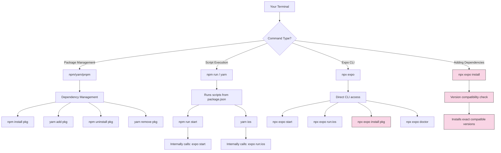

## Section 4: Understanding `npx expo` vs. `npm`/`yarn`

Now that you've created your project and seen commands like `npx create-expo-app` and `npx expo start`, let's clarify the difference between running commands directly with `npx expo` versus using your package manager (`npm` or `yarn`). Understanding this helps you know which command to use in different situations.

> 🧑‍🏫 **(Instructor-Led):** This section covers important command-line concepts that are fundamental to Expo development workflows. Take time to ensure all students understand the distinction between package management commands and Expo CLI commands to prevent common setup issues later.

### Recap: Package Managers (`npm` and `yarn`)

As covered in Section 2, `npm` (Node Package Manager) and `yarn` are tools for managing your project's JavaScript dependencies (the libraries and tools your project needs, listed in `package.json`). Their core function is interacting with the package registry (npmjs.com) to download, install, or update code packages in your `node_modules` directory.

Commands like `npm install <package>`, `yarn add <package>`, `npm update`, `yarn upgrade` directly manipulate these dependencies based on version constraints in `package.json` and the registry.

They also run **scripts** defined in your `package.json` file. Open your `package.json`, and you'll see a `"scripts"` section, often including:

```json
{
  // ...
  "scripts": {
    "start": "expo start",
    "android": "expo run:android", // Note: Often uses run:android now
    "ios": "expo run:ios", // Note: Often uses run:ios now
    "web": "expo start --web"
  }
  // ...
}
```

Running `npm run start` or `yarn start` executes the command defined for the `start` script (which is `expo start`). Similarly, `npm run ios` or `yarn ios` would execute `expo run:ios`.

> 🌐 **(Web Developers):**
>
> **Comparison:** This `scripts` section and the concept of running tasks via `npm run` or `yarn` is identical to standard web development workflows with tools like webpack or Vite.
>
> **Key Takeaway:** Your existing knowledge of npm scripts transfers directly to Expo projects.
>
> **Source:** [npm Docs: npm run](https://docs.npmjs.com/cli/v10/commands/npm-run-script)

### The Expo CLI: `npx expo <command>`

The `expo` package, installed as a dependency in your project, provides the **Expo Command Line Interface (CLI)**. This CLI is a dedicated toolset for interacting with Expo projects and services.

**Why `npx expo ...`?**

We use `npx expo <command>` (e.g., `npx expo start`) to run the Expo CLI commands.

- `npx` ensures you run the version of the `expo` CLI installed _locally_ within your project's `node_modules` directory. ([Source](https://docs.expo.dev/more/expo-cli/))
- This avoids needing a global installation (`npm install --global expo-cli`), which was the older practice and could lead to version conflicts between different projects.
- It guarantees you're using the CLI version intended for your project's Expo SDK version.

**Key `npx expo` Commands:**

The Expo CLI offers many commands, acting as a high-level interface and orchestrator for underlying tools like Metro, Xcode build tools, and Gradle. Some essential ones include:

- `npx expo start`: Starts the Metro development server (more details in Section 8).
- `npx expo run:ios` / `npx expo run:android`: Builds the native project and runs it on a simulator/emulator or device (more details in Sections 5, 6, and 8).
- `npx expo prebuild`: Generates the native `ios` and `android` project directories based on your `app.json`/`app.config.js` and installed config plugins.
- `npx expo install [package...]`: Installs dependencies with compatibility checks (see below).
- `npx expo config`: Inspects the resolved project configuration.
- `npx expo doctor`: Diagnoses potential issues in your project setup.
- EAS Commands: `npx eas build`, `npx eas submit`, etc. (covered later).

### Command Relationship Visualization



This diagram illustrates the four main ways you interact with your Expo project through the command line:

1. **Package Management**: Using npm/yarn directly for general dependency management
2. **Script Execution**: Running predefined scripts in your package.json with npm run/yarn
3. **Direct Expo CLI**: Accessing Expo CLI commands directly with npx expo
4. **Adding Dependencies**: The specialized npx expo install command for safely adding new packages

The highlighted pink flow shows the recommended path for installing dependencies, which includes crucial version compatibility checking specific to Expo projects.

### The Crucial Role of `npx expo install`

One of the most important distinctions lies with installing dependencies.

**Why is `npx expo install` needed?**

The React Native ecosystem involves tight coupling between JavaScript and native code. A specific version of `react-native` often requires specific versions of other libraries (like `expo-modules-core`, `react-native-screens`, `react-native-gesture-handler`). Using `npm install <package>` or `yarn add <package>` might install the `@latest` version from the registry, which could be incompatible with your project's specific `react-native` and Expo SDK versions, leading to subtle runtime errors or build failures. ([Source](https://github.com/antfu-collective/ni/issues/212))

**How `npx expo install` Works ("Under the Hood")**

The Expo team maintains a compatibility map defining known working versions of many popular libraries for each Expo SDK release. When you run `npx expo install <package-name>`:

1.  The command checks this compatibility map for your project's SDK version.
2.  If a specific compatible version of `<package-name>` is recommended, `expo install` instructs your package manager (npm/yarn/pnpm) to install that _exact_ version.
3.  If the package isn't in the map or no specific version is needed, it typically defaults to standard package manager behavior (installing the latest compatible version based on semantic versioning rules in `package.json`). ([Source](https://github.com/antfu-collective/ni/issues/212))

**Usage:**

- **Strongly Recommended:** Always use `npx expo install <package>` when adding new dependencies to your Expo project.
- Example (Single): `npx expo install react-native-maps`
- Example (Multiple): `npx expo install expo-camera expo-av`

> [!IMPORTANT]
> Do **not** use `npm install` or `yarn add` for adding dependencies with native code in Expo projects unless you are certain about version compatibility. Stick to `npx expo install` to leverage the built-in compatibility checks.

### When to Use Which?

1.  **Installing/Managing Dependencies:** **Always use `npx expo install <package>`** to add new dependencies. Use `npm uninstall <package>` or `yarn remove <package>` to remove them.
2.  **Running Common Tasks:** Use the predefined scripts via `npm run <script>` or `yarn <script>` (e.g., `yarn start`, `yarn ios`) for convenience.
3.  **Running Other Expo CLI Commands:** Use `npx expo <command>` directly for tasks not covered by basic scripts (e.g., `npx expo doctor`, `npx expo prebuild`, `npx expo config`, EAS commands).

> 📲 **(Native Developers):**
>
> **Comparison:** Think of `npx expo install` as a smarter dependency manager like a Gradle plugin or CocoaPods hook enforcing strict version compatibility within the React Native/Expo ecosystem, beyond simple semantic versioning. `npm install` lacks this check. `npx expo start`/`run:*` are scripts automating interactions with tools you might otherwise use directly (Metro, `xcodebuild`, `gradlew`). `npm run start` is just a shortcut to `npx expo start`.
>
> **Key Takeaway:** Prioritize `npx expo install` for adding libraries. Use `npx expo` directly or `npm/yarn run` for executing tasks.
>
> **Source:** [Expo CLI documentation](https://docs.expo.dev/more/expo-cli/)

> 🌐 **(Web Developers):**
>
> **Comparison:** While `npm install`/`yarn add` and the `scripts` in `package.json` are familiar, `npx expo install` adds a crucial compatibility layer specific to native development challenges. Because JS code interacts with native APIs bundled with React Native, version alignment is critical. `npx expo` commands act as higher-level wrappers around the bundler (Metro) and native build tools needed to run your code on devices/simulators.
>
> **Key Takeaway:** Use `npx expo install` instead of `npm install`/`yarn add` for new dependencies. Use `npx expo` or `npm/yarn run` for development tasks.
>
> **Source:** [npm vs npx: What's the Difference?](https://www.freecodecamp.org/news/npm-vs-npx-whats-the-difference/)

> 🧗‍♀️ **(Self-Led):** Create a reference card for yourself with the key commands covered in this section. Having these commands readily available will save you time and prevent errors as you work through subsequent modules and exercises.

In summary, while `npm`/`yarn` manage packages and run basic scripts, `npx expo install` is vital for safe dependency management in Expo, and `npx expo <command>` provides direct access to the rich features of the Expo CLI.

### Common Troubleshooting for Package Management

If you encounter issues with package installation or command execution, try these common remedies:

- **Dependency conflict errors**: Use `npx expo doctor` to diagnose issues
- **"Module not found" errors**: Run `npm install` or `yarn` to ensure all dependencies are properly installed
- **Version mismatch warnings**: Always use `npx expo install` for new packages with native code
- **Command not found errors**: Ensure you're in your project directory before running commands

```typescript
// Example: Installing a package for medication barcode scanning in SpeedyMeds
// CORRECT:
// npx expo install expo-barcode-scanner

// INCORRECT:
// npm install expo-barcode-scanner
// yarn add expo-barcode-scanner

// Using the scanner in a component
import { BarCodeScanner } from "expo-barcode-scanner";
import { useState, useEffect } from "react";

function MedicationScannerScreen() {
  const [hasPermission, setHasPermission] = useState<boolean | null>(null);
  const [scanned, setScanned] = useState(false);

  useEffect(() => {
    (async () => {
      const { status } = await BarCodeScanner.requestPermissionsAsync();
      setHasPermission(status === "granted");
    })();
  }, []);

  // Rest of implementation...
}
```

> 📚 **Official Documentation:**
>
> - [Expo Docs: Expo CLI](https://docs.expo.dev/more/expo-cli/)
> - [Expo Docs: `expo install`](https://docs.expo.dev/more/expo-cli/#install)
> - [npm Docs: npx](https://docs.npmjs.com/cli/v10/commands/npx)
> - [Node.js Guides: Working with package.json](https://nodejs.dev/en/learn/working-with-package-json/)
> - [Expo Troubleshooting: Resolving "Module not found" errors](https://docs.expo.dev/troubleshooting/clear-cache-macos-linux/)
