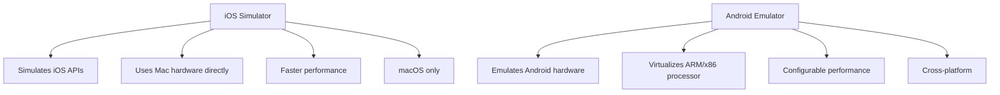
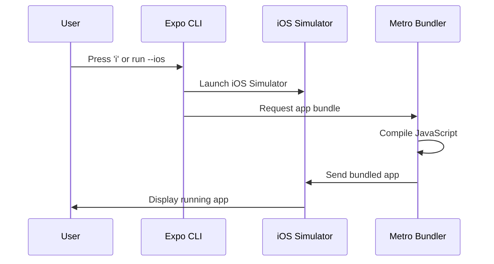
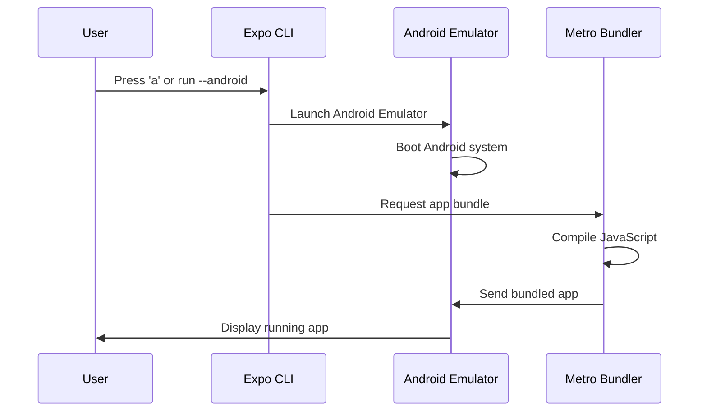
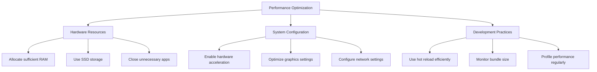
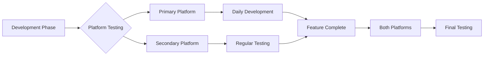

# Section 5: Running on simulators and emulators

Simulators and emulators provide powerful environments for testing and developing React Native applications without requiring physical devices. This section guides you through running your Expo application on iOS Simulator (macOS only) and Android Emulator (all platforms), helping you choose the best option for your development setup.

## Prerequisites for this section

- Completion of Section 2: Installing prerequisites
- A created Expo project (from Section 3)
- Platform-specific development tools installed:
  - iOS Simulator: Xcode Command Line Tools (macOS only)
  - Android Emulator: Android Studio or Android SDK (Windows, macOS, Linux)
- Expo development server understanding (from Section 3)

> [!IMPORTANT]
> Choose the simulator/emulator that matches your platform and development goals. iOS Simulator is only available on macOS, while Android Emulator works on all platforms. Both provide excellent development experiences.

## Understanding simulators vs emulators

Before diving into setup, it's important to understand the difference between iOS Simulator and Android Emulator:



**iOS Simulator:**

- **Simulation**: Simulates iOS APIs on Mac hardware rather than emulating ARM processors
- **Performance**: Generally faster than Android emulators because it uses native Mac hardware
- **Accuracy**: Very close to real device behavior for most development scenarios
- **Platform**: macOS only

**Android Emulator:**

- **Emulation**: Emulates complete Android hardware and system
- **Performance**: Performance varies based on host hardware and configuration
- **Flexibility**: Highly configurable with different device types and API levels
- **Platform**: Windows, macOS, and Linux

> 🤖 **Android Developers:**
>
> **Comparison:** If you've used Android Emulator before, the experience with React Native is nearly identical. The same emulator instances, device types, and debugging features are available. The main difference is that you're running JavaScript-based React Native apps instead of Java/Kotlin apps.
>
> **Key Takeaway:** Your existing Android Emulator knowledge directly applies to React Native development.
>
> **Source:** [Android Emulator Documentation](https://developer.android.com/studio/run/emulator)

## Running on iOS Simulator (macOS only)

iOS Simulator provides an authentic iOS development experience on Mac computers.

### Launching iOS Simulator

There are several ways to launch iOS Simulator for React Native development:

#### Method 1: Using Expo CLI (recommended)

1. **Ensure your Expo development server is running:**

```bash
cd SpeedyMeds
npx expo start
```

2. **Press `i` in the terminal where the development server is running:**

The terminal will show:

```
› Press i │ open iOS simulator
```

3. **iOS Simulator will launch automatically** with your app loading.

#### Method 2: Direct Expo CLI command

You can bypass the interactive menu and launch directly:

```bash
npx expo start --ios
```

This command starts the development server and immediately launches iOS Simulator.

#### Method 3: Manual Simulator launch

If you need more control over simulator selection:

1. **Open Simulator manually:**

```bash
open -a Simulator
```

2. **Select your preferred device** from the Hardware > Device menu
3. **Return to your terminal and press `i`** with Expo development server running

### Understanding the iOS launch process



### iOS Simulator interface and features

**Device simulation area**: The main window shows the simulated iOS device with your app running. This area behaves exactly like a real iOS device.

**Essential keyboard shortcuts for iOS Simulator:**

| **Shortcut**          | **Action**     | **Purpose**                         |
| --------------------- | -------------- | ----------------------------------- |
| `Cmd + R`             | Reload app     | Refresh your React Native app       |
| `Cmd + D`             | Developer menu | Open React Native debugging options |
| `Cmd + Shift + H`     | Home button    | Return to home screen               |
| `Cmd + Shift + H + H` | App switcher   | View recent apps                    |
| `Cmd + →` / `Cmd + ←` | Rotate device  | Change orientation                  |
| `Cmd + 1/2/3`         | Scale options  | Adjust simulator size               |

### iOS device types for testing

Test your app across different iOS device types:

**iPhone Models:**

- **iPhone 15 Pro**: Latest flagship device (6.1" display)
- **iPhone 15**: Current standard device (6.1" display)
- **iPhone SE (3rd generation)**: Compact device (4.7" display)
- **iPhone 15 Pro Max**: Largest current device (6.7" display)

**iPad Models:**

- **iPad (10th generation)**: Standard tablet size
- **iPad Air (5th generation)**: Mid-range tablet
- **iPad Pro (12.9-inch)**: Largest tablet size

## Running on Android Emulator (all platforms)

Android Emulator provides a flexible development environment available on all platforms.

### Setting up Android Emulator

Before launching the emulator, ensure you have properly configured Android development environment from Section 2.

#### Creating an Android Virtual Device (AVD)

1. **Open Android Studio**
2. **Navigate to Tools > Device Manager** (or AVD Manager in older versions)
3. **Click "Create Device"**
4. **Select a device definition** (recommended: Pixel 7 or Pixel 7 Pro)
5. **Choose a system image** (recommended: latest API level with Google APIs)
6. **Configure advanced settings** if needed:
   - **RAM**: 4GB or more recommended
   - **Internal Storage**: 8GB or more
   - **Graphics**: Hardware - GLES 2.0 (if supported)

#### Command-line AVD creation (alternative)

```bash
# List available system images
avdmanager list targets

# Create AVD
avdmanager create avd -n "Pixel_7_API_34" -k "system-images;android-34;google_apis;x86_64"

# List created AVDs
emulator -list-avds
```

### Launching Android Emulator

#### Method 1: Using Expo CLI (recommended)

1. **Start your Expo development server:**

```bash
cd SpeedyMeds
npx expo start
```

2. **Press `a` in the terminal:**

The terminal will show:

```
› Press a │ open Android
```

3. **Select your emulator** from the list of available devices

4. **Your app will load** in the Android Emulator

#### Method 2: Direct Expo CLI command

```bash
npx expo start --android
```

#### Method 3: Manual emulator launch

1. **Start emulator manually:**

```bash
# Replace with your AVD name
emulator @Pixel_7_API_34
```

2. **Wait for emulator to boot completely**
3. **Press `a` in Expo CLI terminal**

### Understanding the Android launch process



### Android Emulator interface and features

**Device controls**: Android Emulator provides various controls for simulating device interactions:

**Essential controls for Android Emulator:**

| **Control**         | **Action**         | **Purpose**                     |
| ------------------- | ------------------ | ------------------------------- |
| **Back button**     | Navigate back      | Android back navigation         |
| **Home button**     | Go to home screen  | Return to Android home          |
| **Recent apps**     | View app switcher  | Switch between applications     |
| **Volume controls** | Adjust volume      | Test audio-related features     |
| **Power button**    | Lock/unlock device | Test app lifecycle events       |
| **Rotate buttons**  | Change orientation | Test landscape/portrait layouts |

### React Native Developer Menu access

**On iOS Simulator:**

- Press `Cmd + D` or use Hardware > Shake Gesture

**On Android Emulator:**

- Press `Cmd + M` (macOS) or `Ctrl + M` (Windows/Linux)
- Or shake the emulator using the controls

## Performance optimization

Both simulators and emulators can be resource-intensive. Here are optimization strategies:

### iOS Simulator optimization

1. **Reduce simulator scale**: Window > Scale > 50% or 75%
2. **Close unused simulators**: Only run one instance at a time
3. **Disable unnecessary animations**: Developer > Slow Animations (off)
4. **Free up system resources**: Close other memory-intensive applications

### Android Emulator optimization

1. **Allocate sufficient RAM**: 4GB minimum, 8GB recommended
2. **Enable hardware acceleration**:
   - **Windows**: Intel HAXM or Hyper-V
   - **macOS**: Hypervisor Framework
   - **Linux**: KVM
3. **Use x86/x86_64 system images** when possible (faster than ARM)
4. **Adjust graphics settings**: Hardware - GLES 2.0 (if supported)
5. **Close unused emulator instances**

### Cross-platform performance tips



## Development workflow integration

### Choosing between iOS Simulator and Android Emulator

**Choose iOS Simulator when:**

- You're developing on macOS
- Testing iOS-specific features and behaviors
- You need the fastest performance and most accurate iOS representation
- Your target audience primarily uses iOS devices

**Choose Android Emulator when:**

- You're developing on Windows, Linux, or prefer Android testing
- Testing Android-specific features and behaviors
- You need to test across multiple Android API levels
- Your target audience primarily uses Android devices

**Use both when:**

- Developing for both platforms (recommended)
- Testing cross-platform compatibility
- Ensuring consistent behavior across iOS and Android

### Multi-platform testing strategy



**Recommended workflow:**

1. **Choose a primary platform** for daily development
2. **Test regularly** on the secondary platform
3. **Conduct final testing** on both platforms before releases

## Troubleshooting common issues

### iOS Simulator issues

**Issue**: Simulator fails to launch

**Solutions:**

1. **Check Xcode Command Line Tools:**

```bash
xcode-select -p
```

2. **Reset simulator if corrupted:**

```bash
xcrun simctl shutdown all
xcrun simctl erase all
```

3. **Restart Expo development server:**

```bash
npx expo start --clear
```

**Issue**: App doesn't load or shows white screen

**Solutions:**

1. **Force reload** using `Cmd + R` in simulator
2. **Check Metro bundler output** for JavaScript errors
3. **Clear app data**: Long press app icon > Delete App, then relaunch

### Android Emulator issues

**Issue**: Emulator won't start

**Solutions:**

1. **Check hardware acceleration**:

   - Ensure virtualization is enabled in BIOS
   - Install appropriate acceleration (HAXM, Hyper-V, KVM)

2. **Increase emulator resources**:

```bash
# Launch with more RAM
emulator @Pixel_7_API_34 -memory 4096
```

3. **Use a different system image** (try x86_64 instead of ARM)

**Issue**: Emulator is very slow

**Solutions:**

1. **Enable hardware acceleration** in AVD settings
2. **Allocate more RAM** to the emulator
3. **Use GPU acceleration**: Graphics > Hardware - GLES 2.0
4. **Close unnecessary applications** on host machine

### Cross-platform networking issues

**Issue**: App can't connect to development server

**Solutions:**

1. **Check firewall settings** on host machine
2. **Ensure devices are on same network** (for physical devices)
3. **Use tunnel mode if needed:**

```bash
npx expo start --tunnel
```

4. **Verify Metro bundler is running** and accessible

## Official documentation

> 📚 **Official Documentation:**
>
> - [iOS Simulator User Guide](https://developer.apple.com/documentation/xcode/running-your-app-in-the-simulator)
> - [Android Emulator Documentation](https://developer.android.com/studio/run/emulator)
> - [Expo CLI iOS Simulator](https://docs.expo.dev/workflow/ios-simulator/)
> - [Expo CLI Android Development](https://docs.expo.dev/workflow/android-studio-emulator/)
> - [React Native Debugging](https://reactnative.dev/docs/debugging)
>
> 🗂️ **Additional Resources:**
>
> - [iOS Simulator Keyboard Shortcuts](https://support.apple.com/guide/simulator/keyboard-shortcuts-sim89d1c8e5/mac)
> - [Android Emulator Extended Controls](https://developer.android.com/studio/run/emulator#extended)
> - [React Native Performance](https://reactnative.dev/docs/performance)

## Next steps

You now have comprehensive knowledge of running React Native applications on both iOS Simulator and Android Emulator. While simulators and emulators provide excellent development environments, the next section introduces Expo Go, which allows you to test your app on physical devices for an even more authentic development experience with enhanced tunnel support for various network conditions.
