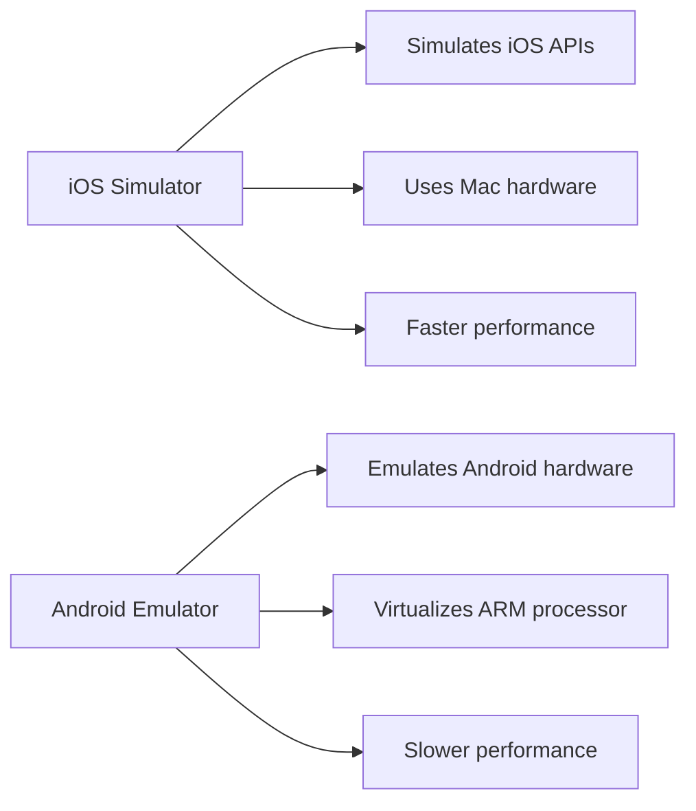
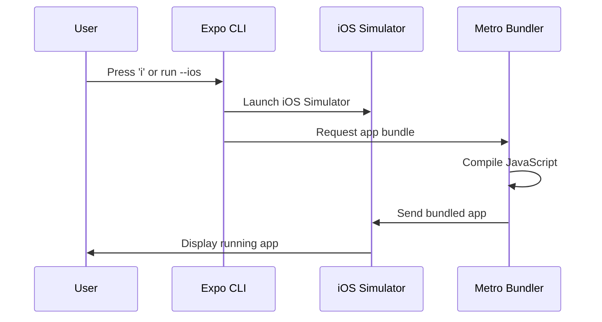
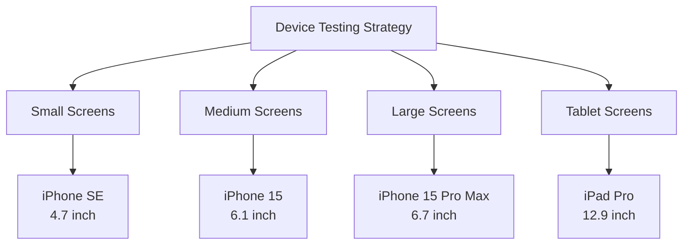

# Section 5: Running on the iOS Simulator

The iOS Simulator provides a powerful environment for testing and developing React Native applications without requiring a physical iOS device. This section guides you through running your Expo application on the iOS Simulator and leveraging its features for effective development.

## Prerequisites for this section

- Completion of Section 2: Installing prerequisites (specifically Xcode Command Line Tools)
- macOS computer (iOS Simulator is only available on macOS)
- A created Expo project (from Section 3)
- Expo development server understanding (from Section 3)

> [!IMPORTANT]
> iOS Simulator is exclusively available on macOS and requires Xcode Command Line Tools. If you haven't installed these tools, return to Section 2 before proceeding.

## Understanding iOS Simulator

iOS Simulator is a development tool that creates a simulated iOS device environment on your Mac. It provides an accurate representation of how your app will behave on real iOS devices, including touch interactions, device orientations, and system features.

### Simulator vs. emulator



iOS Simulator differs from Android emulators in important ways:

- **Simulation vs. Emulation**: iOS Simulator simulates iOS APIs on Mac hardware rather than emulating ARM processors
- **Performance**: Generally faster than Android emulators because it uses native Mac hardware
- **Accuracy**: Very close to real device behavior for most development scenarios
- **Limitations**: Cannot simulate certain hardware-specific features like cellular connectivity or GPS accuracy

> 🍏 **iOS Developers:**
>
> **Comparison:** If you've used Xcode's iOS Simulator before, the experience with React Native is nearly identical. The same simulator instances, device types, and debugging features are available. The main difference is that you're running JavaScript-based React Native apps instead of native Swift/Objective-C apps.
>
> **Key Takeaway:** Your existing iOS Simulator knowledge directly applies to React Native development.
>
> **Source:** [iOS Simulator User Guide](https://developer.apple.com/documentation/xcode/running-your-app-in-the-simulator)

## Launching iOS Simulator

There are several ways to launch iOS Simulator for React Native development. We'll cover the most common and effective methods.

### Method 1: Using Expo CLI (recommended)

This is the simplest and most integrated approach:

1. **Ensure your Expo development server is running:**

```bash
cd SpeedyMeds
npx expo start
```

2. **Press `i` in the terminal where the development server is running:**

The terminal will show:

```
› Press i │ open iOS simulator
```

3. **iOS Simulator will launch automatically** with your app loading.

### Method 2: Direct Expo CLI command

You can bypass the interactive menu and launch directly:

```bash
npx expo start --ios
```

This command starts the development server and immediately launches iOS Simulator.

### Method 3: Using Xcode

If you need more control over simulator selection:

1. **Open Xcode (if installed) or use command line:**

```bash
open -a Simulator
```

2. **Select your preferred device** from the Hardware > Device menu
3. **Return to your terminal and press `i`** with Expo development server running

### Understanding the launch process



When you launch your app on iOS Simulator, several things happen:

1. **Simulator Launch**: Expo CLI opens iOS Simulator with a default device
2. **Bundle Request**: The simulator requests your app bundle from Metro bundler
3. **Compilation**: Metro compiles your JavaScript and assets
4. **Installation**: The app is installed and launched on the simulated device

## Navigating the iOS Simulator interface

Understanding the iOS Simulator interface helps you use it effectively for development and testing.

### Device simulation area

The main window shows the simulated iOS device with your app running. This area behaves exactly like a real iOS device:

- **Touch interactions**: Click to simulate taps
- **Scrolling**: Click and drag to simulate scrolling gestures
- **Text input**: Use your Mac keyboard when text fields are focused
- **Home indicator**: Swipe up from the bottom (on newer devices) to go home

### Menu bar options

The iOS Simulator menu bar provides access to important development features:

**Device Menu:**

- **Rotate Left/Right**: Simulate device rotation
- **Shake Gesture**: Trigger shake gestures (opens React Native developer menu)
- **Home Button**: Return to the home screen
- **Lock**: Simulate device lock/unlock

**Hardware Menu:**

- **Keyboard**: Toggle virtual keyboard display
- **Apple TV Remote**: Control Apple TV simulator (if using tvOS)
- **TouchBar**: Simulate MacBook Pro TouchBar (on supported Macs)

**Window Menu:**

- **Scale**: Adjust simulator display size (50%, 75%, 100%)
- **Physical Size**: Display at actual device dimensions
- **Point Accurate**: Scale to exact point measurements

### Essential keyboard shortcuts

These shortcuts significantly speed up development workflow:

| **Shortcut**          | **Action**     | **Purpose**                         |
| --------------------- | -------------- | ----------------------------------- |
| `Cmd + R`             | Reload app     | Refresh your React Native app       |
| `Cmd + D`             | Developer menu | Open React Native debugging options |
| `Cmd + Shift + H`     | Home button    | Return to home screen               |
| `Cmd + Shift + H + H` | App switcher   | View recent apps                    |
| `Cmd + →` / `Cmd + ←` | Rotate device  | Change orientation                  |
| `Cmd + 1/2/3`         | Scale options  | Adjust simulator size               |

## Using the React Native developer menu

React Native provides a built-in developer menu accessible within iOS Simulator for debugging and development features.

### Accessing the developer menu

**Method 1: Keyboard shortcut**

- Press `Cmd + D` while your app is active in the simulator

**Method 2: Shake gesture**

- Use Hardware > Shake Gesture from the simulator menu

**Method 3: Programmatically**

- Shake your Mac (if it has motion sensors) while the simulator is active

### Developer menu options

The developer menu provides several useful development features:

**Reload**: Restarts your app with the latest changes
**Debug**: Opens Chrome Developer Tools for JavaScript debugging
**Enable Live Reload**: Automatically reloads when you save files
**Enable Hot Reloading**: Updates components in-place without full reload
**Toggle Inspector**: Shows element inspector overlay
**Show Perf Monitor**: Displays performance metrics overlay

> [!TIP]
> Hot Reloading is particularly useful during development as it preserves your app's state while updating components. This means you can make UI changes without losing your current navigation position or form data.

## Device types and testing

iOS Simulator supports multiple device types, allowing you to test your app across different screen sizes and capabilities.

### Commonly used device types for React Native

**iPhone Models:**

- **iPhone 15 Pro**: Latest flagship device (6.1" display)
- **iPhone 15**: Current standard device (6.1" display)
- **iPhone SE (3rd generation)**: Compact device (4.7" display)
- **iPhone 15 Pro Max**: Largest current device (6.7" display)

**iPad Models:**

- **iPad (10th generation)**: Standard tablet size
- **iPad Air (5th generation)**: Mid-range tablet
- **iPad Pro (12.9-inch)**: Largest tablet size

### Switching device types

1. **Close your current app** (press Home button or `Cmd + Shift + H`)
2. **Open Hardware > Device menu** in iOS Simulator
3. **Select desired device type**
4. **Relaunch your app** by pressing `i` in Expo CLI terminal

### Testing strategy

For comprehensive testing, consider these device categories:



**Small Screens**: Test layout constraints and text readability
**Medium Screens**: Verify standard user experience
**Large Screens**: Ensure content scales appropriately
**Tablet Screens**: Test landscape orientation and expanded layouts

## Performance considerations

iOS Simulator performance directly impacts your development experience. Understanding performance factors helps optimize your workflow.

### Factors affecting simulator performance

**Mac Hardware:**

- **CPU**: More cores handle Metro bundling faster
- **RAM**: More memory allows multiple simulator instances
- **Storage**: SSD improves app launch and reload times

**Simulator Configuration:**

- **Device Type**: More complex devices (iPad Pro) require more resources
- **Scale Setting**: Lower scale (50%) improves performance on slower Macs
- **Background Apps**: Close unnecessary simulator instances

### Optimizing simulator performance

1. **Use appropriate scale settings:**

```bash
# Launch with specific scale
xcrun simctl list devices
# Note device ID, then:
xcrun simctl boot [DEVICE_ID]
```

2. **Close unused simulator instances:**

   - Quit simulator completely when not in use
   - Don't run multiple device types simultaneously unless necessary

3. **Clear simulator data periodically:**
   - Device > Erase All Content and Settings in simulator menu

## Development workflow optimization

Integrate iOS Simulator effectively into your development workflow for maximum productivity.

### Recommended window arrangement

For optimal development experience:

1. **Code editor**: Primary screen or left half of screen
2. **iOS Simulator**: Right side or secondary screen at 75% scale
3. **Terminal**: Bottom panel or separate tab for Expo CLI output
4. **Browser**: Available for documentation and debugging tools

### Hot reload best practices

To maximize hot reload effectiveness:

- **Save frequently**: Hot reload triggers on file save
- **Use functional components**: Generally reload more reliably than class components
- **Minimize state loss**: Structure components to preserve important state during reloads
- **Test complex changes**: Full reload (`Cmd + R`) for major structural changes

### Debugging workflow

Effective debugging combines simulator features with React Native tools:

1. **Use developer menu** for quick feature access
2. **Enable performance monitor** during optimization work
3. **Test gestures and interactions** using simulator touch simulation
4. **Verify different orientations** using rotation shortcuts

## Troubleshooting common issues

Understanding common iOS Simulator issues helps resolve problems quickly and maintain development momentum.

### Simulator fails to launch

**Issue**: iOS Simulator doesn't start when pressing `i`

**Solutions:**

1. **Check Xcode Command Line Tools:**

```bash
xcode-select -p
# Should show a valid path
```

2. **Reset simulator:**

```bash
xcrun simctl shutdown all
xcrun simctl erase all
```

3. **Restart Expo development server:**

```bash
# Stop current server (Ctrl+C), then:
npx expo start --clear
```

### App doesn't load or shows white screen

**Issue**: Simulator launches but app doesn't appear or shows blank screen

**Solutions:**

1. **Check Metro bundler output** for JavaScript errors
2. **Force reload** using `Cmd + R` in simulator
3. **Clear bundler cache:**

```bash
npx expo start --clear
```

4. **Reset app state** by uninstalling and reinstalling:
   - Long press app icon in simulator
   - Select "Delete App"
   - Relaunch from Expo CLI

### Performance issues or slow response

**Issue**: Simulator is slow or unresponsive

**Solutions:**

1. **Reduce simulator scale** to 50% or 75%
2. **Close other applications** to free system resources
3. **Restart simulator:**
   - Hardware > Restart from simulator menu
4. **Check Mac system resources** using Activity Monitor

### Hot reload not working

**Issue**: Changes to code don't appear in simulator

**Solutions:**

1. **Enable hot reload** via developer menu (`Cmd + D`)
2. **Check file saving** - ensure files are actually saved
3. **Restart Metro bundler:**

```bash
npx expo start --clear
```

4. **Manual reload** using `Cmd + R` as fallback

### Network connectivity issues

**Issue**: App can't connect to APIs or external services

**Solutions:**

1. **Check simulator network settings** - ensure WiFi is connected
2. **Verify localhost connections** - use computer's IP address instead of localhost
3. **Check firewall settings** - ensure development server ports are accessible
4. **Reset network settings** - Hardware > Reset Content and Settings

## Official documentation

> 📚 **Official Documentation:**
>
> - [iOS Simulator User Guide](https://developer.apple.com/documentation/xcode/running-your-app-in-the-simulator)
> - [Expo CLI iOS Simulator](https://docs.expo.dev/workflow/ios-simulator/)
> - [React Native Debugging](https://reactnative.dev/docs/debugging)
> - [Xcode Command Line Tools](https://developer.apple.com/xcode/)
>
> 🗂️ **Additional Resources:**
>
> - [iOS Simulator Keyboard Shortcuts](https://support.apple.com/guide/simulator/keyboard-shortcuts-sim89d1c8e5/mac)
> - [React Native Performance](https://reactnative.dev/docs/performance)

## Next steps

You now have a solid understanding of running React Native applications on iOS Simulator. While the simulator provides an excellent development environment, the next section introduces Expo Go, which allows you to test your app on physical devices for an even more authentic development experience.
