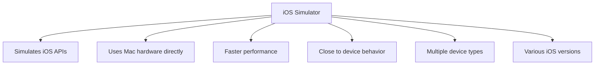
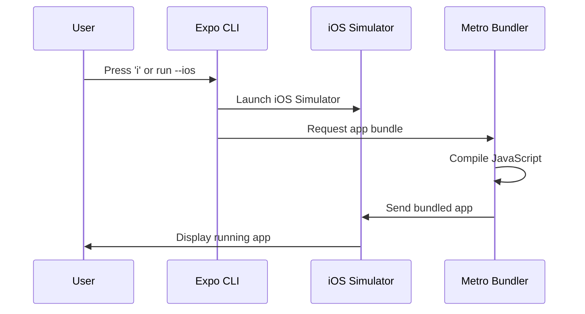

## Section 5: Running on the iOS Simulator

iOS Simulator provides an authentic iOS development experience on Mac computers, offering a powerful environment for testing and developing React Native applications without requiring physical iOS devices. This section guides you through running your Expo application specifically on iOS Simulator.

### Prerequisites for this section

- Completion of Section 2: Installing prerequisites
- A created Expo project (from Section 3)
- macOS operating system (iOS Simulator is macOS-only)
- Xcode Command Line Tools installed
- Expo development server understanding (from Section 3)

> [!IMPORTANT]
> iOS Simulator is only available on macOS. If you're developing on Windows or Linux, you can use Android Emulator (covered in other sections) or Expo Go on physical devices for testing your React Native applications.

### Understanding iOS Simulator

iOS Simulator is Apple's tool for simulating iOS devices and their operating systems on Mac hardware. Unlike emulation, which recreates the entire hardware environment, iOS Simulator uses the Mac's native hardware to run iOS applications efficiently.



This diagram illustrates the key characteristics that make iOS Simulator an excellent development tool for React Native applications. Unlike traditional emulation that recreates hardware architecture, iOS Simulator simulates iOS APIs directly on Mac hardware, resulting in significantly faster performance compared to hardware emulation approaches. The simulator provides access to nearly all iOS device capabilities and behaviors, making it an accurate representation of how your React Native app will function on real devices. It supports multiple device types including various iPhone models, iPad configurations, and Apple Watch, allowing you to test across different screen sizes and capabilities. Additionally, you can test against various iOS versions, helping ensure your app works correctly across the iOS ecosystem. The simulator integrates seamlessly with Xcode development tools and React Native debugging features, providing a comprehensive development environment. This native integration means features like device rotation, hardware simulation, and system notifications work exactly as they would on physical devices, giving you confidence that your React Native app will behave correctly when deployed to the App Store.

#### Key benefits of iOS Simulator

- **Performance**: Generally faster than hardware emulation because it uses native Mac hardware
- **Accuracy**: Very close to real device behavior for most development scenarios
- **Integration**: Seamless integration with Xcode and React Native development tools
- **Device variety**: Test multiple iPhone and iPad models without owning physical devices
- **Development features**: Built-in debugging, performance monitoring, and development shortcuts

### Running on iOS Simulator

There are several ways to launch iOS Simulator for React Native development with Expo.

#### Method 1: Using Expo CLI (recommended)

1. **Ensure your Expo development server is running:**

```bash
cd SpeedyMeds
npx expo start
```

2. **Press `i` in the terminal where the development server is running:**

The terminal will show:

```
› Press i │ open iOS simulator
```

3. **iOS Simulator will launch automatically** with your app loading.

#### Method 2: Direct Expo CLI command

You can bypass the interactive menu and launch directly:

```bash
npx expo start --ios
```

This command starts the development server and immediately launches iOS Simulator.

#### Method 3: Manual Simulator launch

If you need more control over simulator selection:

1. **Open Simulator manually:**

```bash
open -a Simulator
```

2. **Select your preferred device** from the Hardware > Device menu
3. **Return to your terminal and press `i`** with Expo development server running

### Understanding the iOS launch process



This sequence diagram demonstrates the streamlined process that occurs when launching your React Native app on iOS Simulator through Expo CLI. The workflow begins when you either press 'i' in the Expo development interface or run the direct `--ios` command. The Expo CLI immediately communicates with the iOS Simulator to launch the appropriate device simulation. Simultaneously, it requests the app bundle from Metro Bundler, which compiles your JavaScript code and any dependencies into a format suitable for the iOS environment. Once Metro completes the compilation process, it sends the bundled application directly to the iOS Simulator. The simulator then loads and displays your running React Native application, typically completing this entire process within seconds. This seamless integration between Expo CLI, Metro Bundler, and iOS Simulator creates an efficient development loop where you can quickly see changes and test functionality without the complexity of traditional iOS development workflows involving Xcode project compilation and device provisioning.

### iOS Simulator interface and features

#### Device simulation area

The main window shows the simulated iOS device with your app running. This area behaves exactly like a real iOS device, supporting all standard gestures including:

- **Tap**: Single finger touch
- **Long press**: Hold gesture
- **Swipe**: Directional finger movement
- **Pinch**: Two-finger zoom gestures
- **Rotation**: Automatic when you rotate the simulator

#### Essential keyboard shortcuts for iOS Simulator

| **Shortcut**          | **Action**     | **Purpose**                         |
| --------------------- | -------------- | ----------------------------------- |
| `Cmd + R`             | Reload app     | Refresh your React Native app       |
| `Cmd + D`             | Developer menu | Open React Native debugging options |
| `Cmd + Shift + H`     | Home button    | Return to home screen               |
| `Cmd + Shift + H + H` | App switcher   | View recent apps                    |
| `Cmd + →` / `Cmd + ←` | Rotate device  | Change orientation                  |
| `Cmd + 1/2/3`         | Scale options  | Adjust simulator size               |

#### Hardware menu features

The Hardware menu provides access to simulated device features:

- **Shake Gesture**: Simulates device shaking for React Native developer menu
- **Lock**: Simulates device lock/unlock
- **Home**: Simulates home button press
- **Volume**: Controls simulated device volume
- **Rotation**: Device orientation controls

### iOS device types for testing

Test your React Native app across different iOS device types to ensure compatibility:

#### iPhone Models

**Current Generation:**

- **iPhone 15 Pro**: Latest flagship device (6.1" display, ProMotion)
- **iPhone 15**: Current standard device (6.1" display)
- **iPhone 15 Pro Max**: Largest current device (6.7" display, ProMotion)
- **iPhone SE (3rd generation)**: Compact device (4.7" display, Home button)

**Previous Generation (for compatibility testing):**

- **iPhone 14 series**: Previous flagship models
- **iPhone 13 series**: Wide adoption base
- **iPhone 12 series**: Still commonly used

#### iPad Models

**Current Generation:**

- **iPad Pro (12.9-inch)**: Largest tablet size, desktop-class performance
- **iPad Pro (11-inch)**: Professional tablet with Apple Pencil support
- **iPad Air (5th generation)**: Mid-range tablet with modern features
- **iPad (10th generation)**: Standard tablet size, broad compatibility

### React Native Developer Menu access

Access the React Native Developer Menu on iOS Simulator:

#### Opening the Developer Menu

**Method 1: Keyboard shortcut**

- Press `Cmd + D` in iOS Simulator

**Method 2: Hardware menu**

- Select Hardware > Shake Gesture from the simulator menu

**Method 3: Expo CLI**

- Press `d` in the terminal where your Expo development server is running

#### Developer Menu features

The React Native Developer Menu provides access to:

- **Reload**: Restart your React Native app
- **Debug**: Open debugging tools
- **Enable Hot Reloading**: Automatic refresh on code changes
- **Enable Remote JS Debugging**: Debug with Chrome DevTools
- **Start Sampling Profiler**: Performance profiling tools
- **Inspector**: Element inspector for debugging UI

### Performance optimization for iOS Simulator

#### System-level optimizations

1. **Reduce simulator scale**: Window > Scale > 50% or 75%
2. **Close unused simulators**: Only run one instance at a time
3. **Disable unnecessary animations**: Developer > Slow Animations (off)
4. **Free up system resources**: Close other memory-intensive applications

#### React Native specific optimizations

1. **Use development builds efficiently**: Leverage hot reloading instead of full reloads
2. **Monitor JavaScript performance**: Use React Native's built-in performance monitoring
3. **Optimize bundle size**: Remove unnecessary dependencies for faster loading
4. **Test on appropriate device types**: Match your target audience's devices

### Development workflow integration

#### Daily development workflow

**Recommended workflow:**

1. **Start development server**: `npx expo start`
2. **Launch iOS Simulator**: Press `i` or use `--ios` flag
3. **Develop with hot reload**: Make changes and see them instantly
4. **Test on multiple devices**: Switch between iPhone and iPad simulators
5. **Use developer tools**: Access debugging features as needed

#### Testing strategy

**Device testing approach:**

1. **Primary development**: Choose one device type for daily work
2. **Regular compatibility testing**: Test on different screen sizes weekly
3. **Pre-release testing**: Comprehensive testing across all target devices

### Troubleshooting common iOS Simulator issues

#### Simulator fails to launch

**Symptoms:**

- Terminal shows error when pressing `i`
- Simulator app doesn't open
- No response to launch commands

**Solutions:**

1. **Check Xcode Command Line Tools:**

```bash
xcode-select -p
# Should return a valid Xcode path
```

2. **Reset simulator if corrupted:**

```bash
xcrun simctl shutdown all
xcrun simctl erase all
```

3. **Restart Expo development server:**

```bash
npx expo start --clear
```

#### App doesn't load or shows white screen

**Symptoms:**

- Simulator opens but app doesn't appear
- White screen or loading spinner persists
- JavaScript errors in terminal

**Solutions:**

1. **Force reload** using `Cmd + R` in simulator
2. **Check Metro bundler output** for JavaScript errors in terminal
3. **Clear app data**: Long press app icon > Delete App, then relaunch

#### Hot reload not working

**Symptoms:**

- Code changes don't appear in simulator
- Manual reload required for every change
- Development feels slow

**Solutions:**

1. **Verify hot reload is enabled**: Check Developer Menu settings
2. **Restart Metro bundler**: Stop and restart `npx expo start`
3. **Check file watching**: Ensure your editor is saving files properly

#### Performance issues

**Symptoms:**

- Simulator runs slowly
- Animations are choppy
- High CPU usage on Mac

**Solutions:**

1. **Reduce simulator scale**: Use 50% or 75% scale in Window menu
2. **Close other applications**: Free up system resources
3. **Restart simulator**: Close and reopen iOS Simulator
4. **Check available disk space**: Ensure adequate free storage

### Official documentation

> 📚 **Official Documentation:**
>
> - [iOS Simulator User Guide](https://developer.apple.com/documentation/xcode/running-your-app-in-the-simulator)
> - [Expo CLI iOS Simulator](https://docs.expo.dev/workflow/ios-simulator/)
> - [React Native Debugging on iOS](https://reactnative.dev/docs/debugging#debugging-on-ios)
> - [Xcode Simulator Documentation](https://developer.apple.com/documentation/xcode/simulator)
>
> 🗂️ **Additional Resources:**
>
> - [iOS Simulator Keyboard Shortcuts](https://support.apple.com/guide/simulator/keyboard-shortcuts-sim89d1c8e5/mac)
> - [React Native Performance on iOS](https://reactnative.dev/docs/performance#ios-specific-profiling)
> - [iOS Development Best Practices](https://developer.apple.com/ios/human-interface-guidelines/)

### Next steps

You now have comprehensive knowledge of running React Native applications on iOS Simulator. The next section introduces running your app on Expo Go, which allows you to test your application on physical devices for an even more authentic development experience with real device sensors and performance characteristics.
