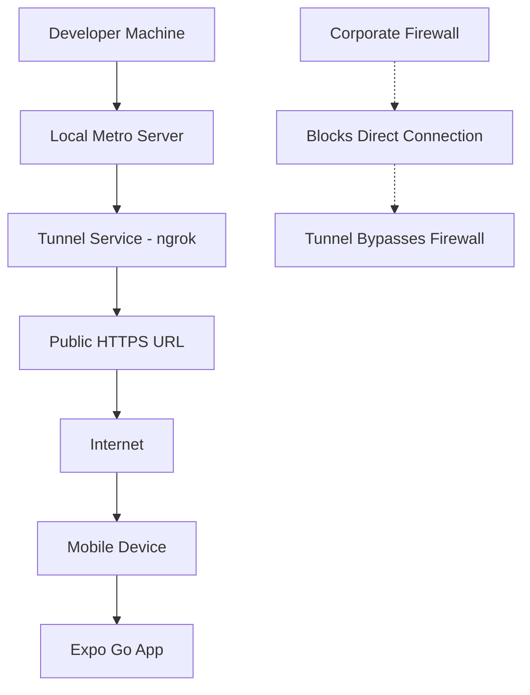
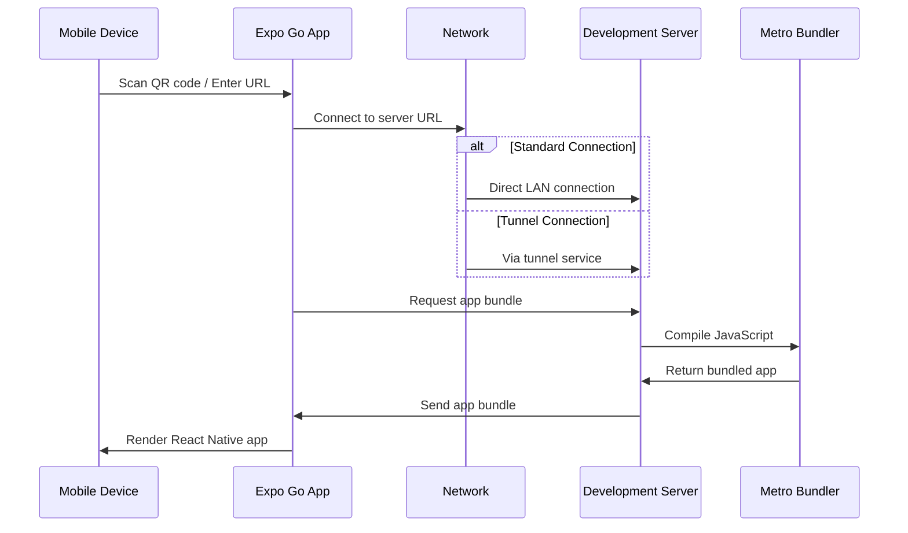

# Section 6: Running on Expo Go

While simulators and emulators provide excellent development environments, testing on physical devices offers the most authentic user experience. Expo Go enables you to run your development builds on real iOS and Android devices without the complex provisioning and deployment processes typically required for native development. This section provides comprehensive coverage of Expo Go setup, including advanced networking options like tunneling for various development scenarios.

## Introduction to Expo Go

Expo Go is a mobile application that serves as a universal client for running Expo projects during development. Think of it as a specialized browser for React Native applications built with Expo's managed workflow.

### Key benefits of testing on physical devices

Testing on real devices provides advantages that simulators cannot replicate:

- **Authentic performance**: Real device performance characteristics and limitations
- **Hardware features**: Access to actual camera, GPS, accelerometer, and other sensors
- **Touch interactions**: Natural multi-touch gestures and haptic feedback
- **Network conditions**: Real cellular and WiFi connectivity scenarios
- **Battery impact**: Understanding actual power consumption patterns
- **User context**: Testing in real-world lighting, movement, and distraction conditions
- **Form factor validation**: True device size, weight, and ergonomics

> 🍏 **iOS Developers:**
>
> **Comparison:** Unlike traditional iOS development where you need provisioning profiles, certificates, and device registration through Apple Developer Portal, Expo Go eliminates these requirements during development. You can instantly test on any iOS device without the complex setup process.
>
> **Key Takeaway:** Expo Go provides the device testing benefits of native development without the setup complexity.
>
> **Source:** [iOS App Distribution Guide](https://developer.apple.com/documentation/xcode/distributing-your-app-for-beta-testing-and-releases)

## Installing Expo Go

Expo Go is available for free on both iOS and Android app stores. This setup works on all platforms.

### iOS installation

1. **Open the App Store** on your iOS device
2. **Search for "Expo Go"**
3. **Install the app** from Expo, Inc.
4. **Open Expo Go** and allow any requested permissions

### Android installation

1. **Open Google Play Store** on your Android device
2. **Search for "Expo Go"**
3. **Install the app** from Expo, Inc.
4. **Open Expo Go** and allow any requested permissions

The app will ask for several permissions that enable development features:

- **Camera**: For QR code scanning to connect to your development server
- **Local Network**: To discover and connect to development servers on your local network
- **Notifications**: For development-related notifications and updates

> [!IMPORTANT]
> Grant camera and local network permissions to Expo Go. These are essential for the development workflow and don't affect your production app's permissions.

## Connecting to your development server

Expo Go connects to your development server using the same Metro bundler that serves simulators and emulators. There are multiple connection methods depending on your network situation.

### Method 1: QR code scanning (standard connection)

This is the most convenient method for connecting when your development machine and mobile device are on the same network:

1. **Start your Expo development server:**

```bash
cd SpeedyMeds
npx expo start
```

2. **Locate the QR code** in your terminal output

3. **Open Expo Go** on your mobile device

4. **Scan the QR code**:

   - **iOS**: Use the built-in camera app or tap "Scan QR Code" in Expo Go
   - **Android**: Tap "Scan QR Code" in Expo Go

5. **Your app will load** on your physical device

### Method 2: Tunnel connection (--tunnel command)

Tunneling is essential when standard local network connections don't work due to firewalls, restrictive networks, or when you need to test from remote locations.

#### Understanding tunneling



Tunneling creates a secure public URL that routes traffic to your local development server, bypassing network restrictions and enabling connections from anywhere with internet access.

#### Setting up tunnel connection

1. **Install the ngrok tunnel dependency:**

```bash
npm install -g @expo/ngrok
```

2. **Start your development server with tunnel flag:**

```bash
npx expo start --tunnel
```

3. **Wait for tunnel setup** (may take 10-30 seconds):

```
› Starting Metro Bundler
› Tunnel ready.
› Tunnel URL: https://abc123.tunnel.expo.dev:443
› LAN URL: http://192.168.1.100:8081
› To use the tunnel, scan the QR code with the Expo Go app.
```

4. **Scan the QR code** as usual - Expo Go will automatically use the tunnel URL

#### When to use tunnel connection

**Use `--tunnel` when:**

- **Corporate networks**: Firewalls block local network connections
- **Public WiFi**: Restrictive hotspot configurations
- **Remote testing**: Device not on same network as development machine
- **Complex network setups**: VPNs, subnets, or network isolation
- **Team collaboration**: Sharing with remote team members
- **Conference/demo scenarios**: Unreliable or restricted WiFi

**Example scenarios:**

```bash
# Working from a coffee shop with restrictive WiFi
npx expo start --tunnel

# Sharing with a remote team member
npx expo start --tunnel

# Testing on cellular while development machine is on office WiFi
npx expo start --tunnel

# Corporate environment with strict firewall rules
npx expo start --tunnel
```

### Method 3: Manual URL entry

If QR code scanning isn't working, you can connect manually:

1. **Note your development server URL** from the terminal output
2. **Open Expo Go** and tap "Enter URL manually"
3. **Type the complete URL**:
   - **Local**: `exp://192.168.1.100:8081`
   - **Tunnel**: `exp://abc123.tunnel.expo.dev:443`
4. **Tap "Connect"** to load your application

### Understanding the connection process



## Network requirements and configuration

Understanding network requirements helps ensure reliable connections between your development machine and mobile devices.

### Network requirements for standard connection

**Same Network Requirement:**

- Your development computer and mobile device must be connected to the same WiFi network
- Corporate or public networks may block the required ports
- Mobile hotspots generally work well for development

**Required Ports:**

- **Metro Bundler**: Port 8081 (default, configurable)
- **Expo DevTools**: Ports 19000-19006 (configurable)
- **Network Discovery**: Various UDP ports for service discovery

### Network requirements for tunnel connection

**Internet Connection:**

- Both development machine and mobile device need internet access
- No same-network requirement
- Works through firewalls and NAT

**Tunnel Service Dependencies:**

- Requires ngrok service availability
- May have higher latency than local connections
- Uses HTTPS encryption for security

### Verifying network connectivity

#### For standard connections:

1. **Check your computer's IP address:**

```bash
# macOS/Linux
ifconfig | grep "inet " | grep -v 127.0.0.1

# Windows
ipconfig | findstr "IPv4"
```

2. **Test Metro bundler accessibility:**
   - Open browser on mobile device
   - Navigate to `http://YOUR_IP_ADDRESS:8081`
   - You should see Metro bundler information

#### For tunnel connections:

1. **Verify tunnel URL accessibility:**

   - Copy tunnel URL from terminal
   - Open in mobile browser
   - Should show Metro bundler interface

2. **Test tunnel stability:**
   - Leave tunnel running for several minutes
   - Check for "Tunnel connection closed" messages
   - Restart with `--tunnel` if connection drops

### Troubleshooting network issues

#### Standard connection issues:

**Issue**: Cannot connect to development server

**Solutions:**

1. **Verify same network connection:**

```bash
# Check computer IP
ifconfig | grep "inet " | grep -v 127.0.0.1  # macOS/Linux
ipconfig                                     # Windows

# Check device network in WiFi settings
```

2. **Check firewall settings:**

```bash
# macOS - temporarily disable firewall
sudo /usr/libexec/ApplicationFirewall/socketfilterfw --setglobalstate off
# Remember to re-enable: --setglobalstate on

# Windows - add firewall exception for Node.js
# Go to Windows Defender Firewall > Allow an app
```

3. **Test direct connection:**
   - Open mobile browser
   - Navigate to `http://YOUR_IP:8081`
   - Should show Metro bundler page

#### Tunnel connection issues:

**Issue**: Tunnel fails to establish

**Solutions:**

1. **Install/reinstall ngrok:**

```bash
npm uninstall -g @expo/ngrok
npm install -g @expo/ngrok
```

2. **Check ngrok service status:**

   - Visit [ngrok status page](https://status.ngrok.com/)
   - Check for service outages

3. **Try alternative tunnel subdomain:**

```bash
# Set custom subdomain (experimental)
export EXPO_TUNNEL_SUBDOMAIN=myproject
npx expo start --tunnel
```

4. **Clear tunnel cache:**

```bash
rm -rf .expo
npx expo start --tunnel
```

**Issue**: Tunnel connection is slow

**Expected behavior**: Tunnels are inherently slower than local connections due to routing through external servers. This is normal and acceptable for development.

**Optimization tips:**

- Use tunnel only when necessary
- Switch back to local connection when possible
- Consider development builds for better performance

## Development workflow with Expo Go

Using Expo Go effectively requires understanding its integration with your development workflow and its capabilities compared to simulators.

### Hot reload and live reload

Expo Go supports the same hot reload capabilities as simulators and emulators:

- **Hot Reload**: Updates components in-place while preserving state
- **Live Reload**: Completely reloads the app when files change
- **Manual Reload**: Shake device or use developer menu to reload

### Developer menu access

Access the React Native developer menu on physical devices:

**Method 1: Shake gesture**

- Physically shake your device to open the developer menu

**Method 2: Three-finger touch (iOS)**

- Touch the screen with three fingers simultaneously

**Method 3: Two-finger tap (Android)**

- Double-tap with two fingers simultaneously

**Method 4: Expo Go menu**

- Use the Expo Go app's built-in menu options

### Debugging capabilities with Expo Go

**Available debugging:**

- Console logging (appears in Metro bundler terminal)
- Network request inspection
- Performance monitoring
- Component inspector
- React DevTools integration (limited)

**Debugging limitations:**

- Chrome DevTools integration is more limited than simulators
- Some debugging features work better in simulators
- Advanced debugging may require development builds

**Recommended debugging strategy:**

- Use Expo Go for initial testing and basic debugging
- Use simulators/emulators for intensive debugging sessions
- Use development builds for advanced debugging needs

## Sharing your app with others

One powerful feature of Expo Go is the ability to easily share your work-in-progress app with team members, stakeholders, or testers.

### Sharing via QR code

**Real-time sharing (development server running):**

1. **Share your QR code** via screenshot or screen sharing
2. **Recipients scan with Expo Go** on their devices
3. **App loads directly** from your development server
4. **Live updates** as you make changes

**Benefits:**

- Real-time collaboration
- Immediate feedback
- Live updates during development sessions

**Requirements:**

- Your development server must remain running
- Recipients need Expo Go installed
- Network connectivity for all participants

### Sharing via tunnel (recommended for teams)

For reliable team sharing, especially with remote members:

1. **Start development server with tunnel:**

```bash
npx expo start --tunnel
```

2. **Share the tunnel URL** or QR code with team members
3. **Team members can connect** from any location with internet
4. **No network configuration** required for recipients

**Example team workflow:**

```bash
# Team lead starts tunnel
npx expo start --tunnel

# Shares tunnel QR code in team chat
# Team members scan and test immediately
# Works regardless of location or network setup
```

### Publishing for sharing (alternative method)

For more permanent sharing that doesn't require your development server:

1. **Publish your app to Expo's service:**

```bash
npx expo publish
```

2. **Share the generated URL** or QR code with others
3. **Recipients scan QR code** in Expo Go
4. **App loads** from Expo's servers

**Publishing considerations:**

- **Expo account required**: You need to sign up for Expo
- **Public by default**: Published apps are publicly accessible unless configured otherwise
- **Version management**: Each publish creates a new version
- **Not for production**: This is for development sharing, not App Store distribution

> [!NOTE]
> Publishing to Expo's service is different from publishing to app stores. This feature is for development and testing purposes only.

## Limitations and considerations

While Expo Go provides tremendous value for development, understanding its limitations helps set appropriate expectations and plan your development workflow.

### Technical limitations

**Bundle Size:**

- Expo Go includes the entire Expo SDK, making initial apps larger than production builds
- This affects initial load time but not ongoing performance
- Production builds are significantly smaller and faster

**Native Modules:**

- Cannot test custom native modules that aren't included in Expo SDK
- Some third-party libraries with native dependencies may not work
- Limited to Expo SDK's included native modules

**Platform APIs:**

- Some platform-specific APIs may not be available
- Certain iOS/Android features may behave differently
- Production builds may have access to additional capabilities

### Development vs. production behavior

**Performance:**

- Development builds include debugging overhead
- Production builds are significantly optimized
- Don't use Expo Go for performance benchmarking

**Security:**

- Development builds expose debugging interfaces
- Production builds remove development-only code and features
- Different security context than published apps

**Functionality:**

- Some features only work in production builds
- App store features (like push notifications) may behave differently
- Development vs. production environment differences

### When to transition from Expo Go

**Consider development builds when:**

- You need custom native modules
- Testing production-specific features
- Performance testing and optimization
- Preparing for app store submission
- Working with complex native integrations

**Expo Go remains useful for:**

- Initial development and prototyping
- Quick feature testing
- Team collaboration and sharing
- Learning React Native concepts
- Rapid iteration on JavaScript-only features

## Advanced tunnel configuration

For specialized development scenarios, Expo CLI provides additional tunnel configuration options.

### Environment variables for tunnel customization

```bash
# Set custom tunnel subdomain (experimental)
export EXPO_TUNNEL_SUBDOMAIN=myproject
npx expo start --tunnel

# Force tunnel URL override
export EXPO_PACKAGER_PROXY_URL=https://my-custom-tunnel.com
npx expo start

# Disable tunnel subdomain randomization
export EXPO_TUNNEL_SUBDOMAIN=false
npx expo start --tunnel
```

### Tunnel URL customization

**Custom subdomain usage:**

```bash
# Set a memorable subdomain for your project
export EXPO_TUNNEL_SUBDOMAIN=speedymeds-dev
npx expo start --tunnel

# Results in URL like: https://speedymeds-dev.tunnel.expo.dev
```

**Benefits of custom subdomains:**

- Easier to remember and share
- Consistent URLs across development sessions
- Better for team workflows
- Simplified testing procedures

**Limitations:**

- Experimental feature, may change
- Could conflict with other projects
- Not guaranteed to be available

### Tunnel troubleshooting and optimization

**Common tunnel issues and solutions:**

| **Issue**                       | **Symptom**                         | **Solution**                                          |
| ------------------------------- | ----------------------------------- | ----------------------------------------------------- |
| **Tunnel startup fails**        | "ngrok tunnel took too long"        | Check internet connection, retry with `--clear`       |
| **Tunnel disconnects randomly** | "Tunnel connection has been closed" | Normal intermittent issue, restart tunnel             |
| **Slow tunnel performance**     | High latency, slow loading          | Expected behavior, use local connection when possible |
| **Tunnel URL not accessible**   | QR code doesn't work                | Check ngrok service status, try manual URL entry      |

**Tunnel optimization strategies:**

```bash
# Clear all caches before starting tunnel
npx expo start --tunnel --clear

# Use offline mode to reduce tunnel load
npx expo start --tunnel --offline

# Combine with specific platform targeting
npx expo start --tunnel --ios
npx expo start --tunnel --android
```

## Official documentation

> 📚 **Official Documentation:**
>
> - [Expo Go on iOS App Store](https://apps.apple.com/app/expo-go/id982107779)
> - [Expo Go on Google Play](https://play.google.com/store/apps/details?id=host.exp.exponent)
> - [Expo CLI Tunneling Documentation](https://docs.expo.dev/more/expo-cli/#tunneling)
> - [Expo Development Build](https://docs.expo.dev/development/build/)
> - [Expo Publishing](https://docs.expo.dev/workflow/publishing/)
> - [React Native Debugging on Device](https://reactnative.dev/docs/debugging#debugging-on-a-device)
>
> 🗂️ **Additional Resources:**
>
> - [ngrok Documentation](https://ngrok.com/docs)
> - [Expo Go vs Development Builds](https://blog.expo.dev/expo-managed-workflow-in-2021-5b887bbf7dbb)
> - [Mobile Development Best Practices](https://docs.expo.dev/guides/testing-on-devices/)
> - [Network Troubleshooting Guide](https://docs.expo.dev/workflow/debugging/#network-debugging)

## Next steps

You now have comprehensive knowledge of using Expo Go for testing React Native applications on physical devices, including advanced networking configurations with tunneling. This approach complements simulator and emulator development by providing authentic device testing with flexible connectivity options. The next section will explore the structure of Expo projects, helping you understand how files and folders are organized to support effective development across all the approaches you've learned.
